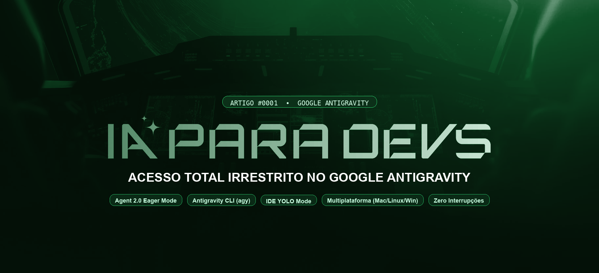

# pathbit-ai-for-devs

## 0001_antigravity_acesso_total_irrestrito



**Ano:** 2026
**ID do Artigo:** 0001
**Autor:** Eliel Sousa
**Categoria:** Engenharia de IA / Antigravity / Permissões e Agentes Autônomos

---

### Resumo

Guia completo e utilitários multiplataforma para configurar o **Google Antigravity** em modo de **Acesso Total Irrestrito** no macOS, Linux e Windows.

Elimina todas as confirmações manuais, aprovações de terminal e diálogos de confiança no **Antigravity IDE**, na **CLI (`agy`)** e no motor compartilhado **Agent 2.0**, permitindo que agentes operem com velocidade e autonomia contínua.

- Suporte completo e unificado aos 3 principais sistemas operacionais.
- Script de setup automatizado e idempotente em Python puro (`src/setup_permissions.py`).
- Diagnóstico de saúde e validação de configurações (`src/verify_permissions.py`).
- Sistema de backup automático prévio e ferramenta de reversão instantânea (`src/restore_permissions.py`).
- Precedência rigorosa de segurança (`DENY > ASK > ALLOW`) com concessão de 6 wildcards universais.

---

### Tecnologias e Componentes Cobertos

- **Motor Compartilhado:** `Antigravity Agent 2.0` (`~/.gemini/config/config.json`)
- **Interface Visual:** `Antigravity IDE` (base VSCode Core, variantes `Antigravity` e `Antigravity IDE`)
- **Linha de Comando:** `Antigravity CLI` (`agy`)
- **Controle de Pastas:** `trustedFolders.json` (`TRUST_PARENT`)
- **Ambiente:** Python 3.10+, macOS (Darwin), Linux (todas as distros), Windows 10/11

---

### Estrutura de Arquivos do Módulo

```text
0001_antigravity_acesso_total_irrestrito/
├── README.md                              # Este arquivo com instruções e guia rápido
├── requirements.txt                       # Dependências mínimas (Python standard library)
├── .env.example                           # Modelo de variáveis de ambiente
├── article/
│   └── ARTICLE.md                         # Artigo técnico completo, ilustrado e aprofundado
├── assets/                                # Diagramas visuais e capas (sequenciados 00 a 02)
│   ├── diagrams/                          # Fontes vetoriais semânticas em HTML e SVG (diagram-design)
│   ├── 00_cover_antigravity_permissoes.png # Capa oficial do artigo
│   ├── cover_linkedin.png                 # Capa oficial para compartilhamento no LinkedIn
│   ├── 01_diagrama_arquitetura_permissoes.png # Diagrama de fluxo do motor Agent 2.0
│   └── 02_diagrama_mapa_caminhos_sistemas.png # Mapa de caminhos por sistema operacional
├── examples/                              # Espaço isolado de testes e tarefas práticas
│   ├── README.md                          # Instruções de uso do ambiente isolado
│   ├── sample_task.py                     # Script de exemplo para testes agênticos
│   └── .claude/
│       ├── settings.json.example          # Modelo de configuração bypass
│       └── settings.local.json.example    # Modelo de configuração local
└── src/                                   # Ferramentas de engenharia 100% em Python
    ├── setup_permissions.py               # Aplicador multiplataforma de permissões com backup
    ├── verify_permissions.py              # Diagnóstico automatizado de integridade
    └── restore_permissions.py             # Restaurador seguro de backups
```

---

### 📋 Pré-requisitos do Ambiente

Antes de executar os scripts de configuração e validação, assegure que as seguintes ferramentas e contas estejam disponíveis e instaladas na sua máquina:

1. **Python 3.10 ou Superior:**
   - Verifique a versão instalada no terminal com `python3 --version`.
   - Se ainda não tiver o Python instalado:
     - **macOS:** Instale via Homebrew com `brew install python` ou pyenv com `pyenv install 3.12`.
     - **Linux (Ubuntu/Debian):** `sudo apt update && sudo apt install -y python3 python3-venv python3-pip`.
     - **Windows:** Instale via terminal com `winget install Python.Python.3.12` ou baixe o instalador oficial em [python.org](https://www.python.org/downloads/).

2. **Ambiente Virtual Isolado (venv):**
   - Recomendamos criar um ambiente virtual dedicado para isolar a execução dos scripts e utilitários:
   ```bash
   # Criar o ambiente virtual na pasta do artigo
   python3 -m venv .venv

   # Ativar no macOS e Linux
   source .venv/bin/activate

   # Ativar no Windows (PowerShell)
   .venv\Scripts\Activate.ps1

   # Ativar no Windows (Prompt de Comando)
   .venv\Scripts\activate.bat
   ```

3. **Dependências Python:**
   - Os utilitários utilizam exclusivamente a biblioteca padrão do Python 3 (`json`, `os`, `sys`, `platform`, `subprocess`), sem necessidade de pacotes externos pesados:
   ```bash
   pip install --upgrade pip
   pip install -r requirements.txt
   ```

4. **Instalação e Login no Google Antigravity:**
   - Obtenha o **Google Antigravity IDE** ou a ferramenta de linha de comando **Antigravity CLI (`agy`)** disponível para assinantes Google AI Pro.
   - Faça login prévio com sua conta Google no Antigravity (`agy` ou IDE) para que o diretório `~/.gemini/` e os arquivos de configuração base (`config.json`, `jetski-standalone-oauth-token`) sejam inicializados pelo motor.
   - Valide se o comando CLI responde com:
   ```bash
   agy --version
   ```

5. **Git Instalado e Configurado:**
   - O configurador registra automaticamente o hook global de higienização de commits (`core.hooksPath`), exigindo que o comando `git` esteja disponível no `PATH`.
   - Instale caso necessário:
     - **macOS:** `xcode-select --install` ou `brew install git`.
     - **Linux:** `sudo apt install -y git`.
     - **Windows:** `winget install Git.Git`.

---

### Como Executar

#### 1. Diagnóstico Inicial

Para verificar o estado atual das permissões na sua máquina antes de aplicar qualquer alteração:

```bash
python3 src/verify_permissions.py
```

#### 2. Simulação sem Gravação (Dry-Run)

Visualize tudo o que será modificado sem realizar nenhuma gravação em disco:

```bash
python3 src/setup_permissions.py --dry-run
```

#### 3. Aplicação Automática com Backup Prévio

Execute o configurador. Um backup com timestamp de todos os seus arquivos originais será criado automaticamente em `~/.gemini/backup-permissoes-<timestamp>/`:

```bash
python3 src/setup_permissions.py
```

#### 4. Validar o Estado Aplicado

Execute novamente a ferramenta de diagnóstico para confirmar 100% de conformidade:

```bash
python3 src/verify_permissions.py
```

#### 5. Reversão a Qualquer Momento

Caso precise retornar ao estado anterior:

```bash
python3 src/restore_permissions.py --latest
```

---

### Integração com os Próximos Artigos

Este módulo estabelece a fundação de permissões do ecossistema de engenharia:

* **[Artigo 0002 - ClaudeGravity e o Roteamento de Modelos Gemini no Claude Code via 9Router](../0002_claude_gravity_utilizando_9router/):** Conecte a sessão do Antigravity ao Claude Code CLI sem pagar faturas de tokens de API.
* **[Artigo 0003 - Claude Code sem Limites com Arsenal de Modelos Gratuitos e Fallback no 9Router](../0003_fallback_modelos_gratuitos_9router/):** Construa uma malha resiliente de 9 provedores com auto-cura e combos de alta disponibilidade.
