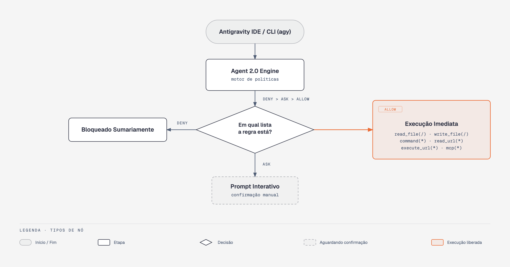
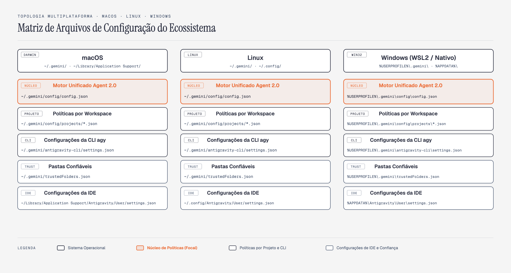

# Google Antigravity com Acesso Total Irrestrito e sem Interrupções


Programar com agentes inteligentes traz uma mudança clara de paradigma. Em vez de autocompletar pequenas linhas de código, delegamos tarefas completas: refatorar microsserviços, rodar suites de testes, atualizar dependências e diagnosticar falhas de integração.

No entanto, há uma barreira comum que quebra esse fluxo de trabalho: **a fricção constante de caixas de diálogo e confirmações manuais**. A cada arquivo que o agente tenta ler, a cada comando de terminal que tenta rodar e a cada commit que prepara, surge um pedido de aprovação interativa. Uma tarefa que deveria levar dois minutos de processamento autônomo acaba exigindo que o desenvolvedor fique na frente da tela pressionando botões ou digitando `y` dezenas de vezes.

Neste artigo, apresentamos o guia prático de engenharia para configurar o **Google Antigravity** em modo de **Acesso Total Irrestrito** em **macOS, Linux e Windows**.

Mostramos como destravar completamente o motor compartilhado **Agent 2.0**, a interface visual **Antigravity IDE** e a ferramenta de linha de comando **Antigravity CLI (`agy`)**, permitindo que seus agentes operem com máxima velocidade e autonomia responsável.

---

## O Ecossistema do Google Antigravity

O Google Antigravity opera em três camadas integradas:

1. **Antigravity IDE:** Ambiente de desenvolvimento visual construído sobre a base do VSCode Core, com extensões nativas de raciocínio, terminal integrado e controle de versão.
2. **Antigravity CLI (`agy`):** Interface de linha de comando de alta velocidade para acionar o agente diretamente do terminal do seu sistema operacional.
3. **Antigravity Agent (Agent 2.0):** O motor de inteligência e políticas de execução compartilhado por trás da IDE e da CLI.

A chave para destravar a autonomia não é desativar a segurança de forma aleatória, mas sim parametrizar os arquivos de política unificados que o motor consome.

---

## A Arquitetura do Motor de Permissões (Agent 2.0)

Abaixo visualizamos como as solicitações de ferramentas e comandos passam pelo funil de regras do Agent 2.0:



> **Figura 1:** Fluxo unificado de autorização do Antigravity, conectando as interfaces IDE e CLI ao motor compartilhado com precedência determinística e concessão ampla de ferramentas.

### 1. Precedência Rigorosa de Regras

Toda solicitação executada pelo agente no sistema segue uma regra de prioridade imutável:

```text
DENY  >  ASK  >  ALLOW
```

* Se uma regra estiver na lista `deny`, ela será bloqueada sumariamente, mesmo que exista um wildcard em `allow`.
* Se uma regra exigir confirmação (`ask`), o agente pausa a execução e exibe o prompt interativo para o desenvolvedor.
* Se a regra constar em `allow` e não colidir com um bloqueio, ela é executada imediatamente sem nenhuma confirmação.

Para atingir autonomia total, limpamos a lista `deny` e preenchemos `allow` com os wildcards das ferramentas nativas.

### 2. Os Seis Wildcards Universais

O motor Agent 2.0 mapeia todas as ações em seis escopos de ferramentas:

| Ação | Escopo Técnico | Efeito com Wildcard |
| :--- | :--- | :--- |
| `read_file(/)` | Leitura no sistema de arquivos | Permite leitura de arquivos em qualquer diretório do disco. |
| `write_file(/)` | Escrita no sistema de arquivos | Permite criar, editar e salvar código sem prompt de confirmação. |
| `command(*)` | Comandos de terminal | Executa testes, scripts bash, compilações e comandos git diretamente. |
| `read_url(*)` | Acesso web via HTTP | Permite que o agente consulte documentações online e APIs públicas. |
| `execute_url(*)` | Ações no navegador integrado | Habilita navegação e execução de JavaScript no browser do agente. |
| `mcp(*)` | Ferramentas Model Context Protocol | Libera chamadas a bancos de dados, integrações e servidores MCP. |

---

## Matriz de Caminhos nos Três Sistemas Operacionais

Uma das grandes vantagens da arquitetura do Antigravity é a consistência do formato JSON entre plataformas. Apenas a localização base dos arquivos varia conforme o sistema operacional.



> **Figura 2:** Mapa completo dos diretórios e arquivos de configuração nos sistemas macOS, Linux e Windows.

A tabela abaixo resume as localizações exatas para cada arquivo de controle:

| Recurso de Configuração | macOS | Linux | Windows |
| :--- | :--- | :--- | :--- |
| **Motor Agent 2.0** | `~/.gemini/config/config.json` | `~/.gemini/config/config.json` | `%USERPROFILE%\.gemini\config\config.json` |
| **Projetos Locais** | `~/.gemini/config/projects/<id>.json` | `~/.gemini/config/projects/<id>.json` | `%USERPROFILE%\.gemini\config\projects\<id>.json` |
| **Antigravity CLI (`agy`)** | `~/.gemini/antigravity-cli/settings.json` | `~/.gemini/antigravity-cli/settings.json` | `%USERPROFILE%\.gemini\antigravity-cli\settings.json` |
| **Trust de Pastas** | `~/.gemini/trustedFolders.json` | `~/.gemini/trustedFolders.json` | `%USERPROFILE%\.gemini\trustedFolders.json` |
| **IDE Settings (V1)** | `~/Library/Application Support/Antigravity/User/settings.json` | `~/.config/Antigravity/User/settings.json` | `%APPDATA%\Antigravity\User\settings.json` |
| **IDE Settings (V2)** | `~/Library/Application Support/Antigravity IDE/User/settings.json` | `~/.config/Antigravity IDE/User/settings.json` | `%APPDATA%\Antigravity IDE\User\settings.json` |

> **Atenção:** Diretórios de estado de execução interno como `~/.gemini/antigravity/`, `~/.gemini/history/` e `~/.gemini/oauth_creds.json` não devem ser **editados** manualmente. Lê-los é seguro (é exatamente o que o artigo 0002 faz para reaproveitar a sessão OAuth já autenticada, sem nunca reescrever o arquivo).

---

## Configuração Passo a Passo dos Arquivos Centrais

### 1. Configurando o Motor Global (`config/config.json`)

Este é o arquivo central consumido por todos os processos do Antigravity. Ele dita as políticas de execução, sandbox e permissões gerais para toda a máquina do desenvolvedor:

```json
{
  "userSettings": {
    "artifactReviewMode": "ARTIFACT_REVIEW_MODE_TURBO",
    "autoExecutionPolicy": "CASCADE_COMMANDS_AUTO_EXECUTION_EAGER",
    "browserJsExecutionPolicy": "BROWSER_JS_EXECUTION_POLICY_TURBO",
    "enableTerminalSandbox": false,
    "nonWorkspaceFileAccessPolicy": "AGENT_SETTING_POLICY_ALLOW",
    "includeCoAuthoredBy": false,
    "globalPermissionGrants": {
      "allow": [
        "read_file(/)",
        "write_file(/)",
        "command(*)",
        "read_url(*)",
        "execute_url(*)",
        "mcp(*)"
      ],
      "deny": []
    }
  }
}
```

#### Anatomia dos Parâmetros do Motor Global

| Parâmetro | Valor Configurado | Impacto Técnico no Comportamento do Agente |
| :--- | :--- | :--- |
| `artifactReviewMode` | `ARTIFACT_REVIEW_MODE_TURBO` | Aprova artefatos e planos automaticamente sem reter o ciclo de trabalho. |
| `autoExecutionPolicy` | `CASCADE_COMMANDS_AUTO_EXECUTION_EAGER` | Dispara comandos encadeados em cascata sem pausas intermediárias de confirmação. |
| `browserJsExecutionPolicy` | `BROWSER_JS_EXECUTION_POLICY_TURBO` | Executa scripts e automações web no navegador integrado sem bloquear a sessão. |
| `enableTerminalSandbox` | `false` | Remove restrições de sandbox em containers temporários que impedem comandos nativos do sistema. |
| `nonWorkspaceFileAccessPolicy` | `AGENT_SETTING_POLICY_ALLOW` | Permite ao agente inspecionar dependências, logs e arquivos localizados fora do workspace. |
| `claudeCode.includeCoAuthoredBy` | `false` | Bloqueia a coautoria também no caminho do Claude Code |
| `includeCoAuthoredBy` | `false` | Impede que o motor anexe trailers de coautoria sintética em commits git. |
| `globalPermissionGrants.allow` | `6 wildcards universais` | Concede acesso global irrestrito para leitura, escrita, terminal, web e servidores MCP. |
| `globalPermissionGrants.deny` | `[]` | Lista de bloqueios vazia para evitar sobreposição involuntária de regras. |

> **Sobre a lista `allow`:** o script preserva entradas que você já tenha criado e remove apenas as que ficaram redundantes (uma regra antiga como `command(git status)` não tem mais efeito depois que `command(*)` entra na lista). Essa poda também elimina comandos antigos salvos com segredos embutidos.

---

### 2. Liberando os Projetos Locais (`config/projects/*.json`)

Este é o passo que mais destrava autonomia no dia a dia e costuma passar despercebido. O Antigravity mantém um arquivo JSON para cada projeto aberto, e as políticas globais **não sobrescrevem** o que está gravado nesse escopo local:

```json
{
  "isWorkspaceOnly": false,
  "settings": {
    "fileAccessPolicy": "AGENT_SETTING_POLICY_ALLOW",
    "sandboxMode": false,
    "autoExecutionPolicy": "CASCADE_COMMANDS_AUTO_EXECUTION_EAGER",
    "artifactReviewMode": "ARTIFACT_REVIEW_MODE_TURBO"
  },
  "permissionGrants": {
    "permissionGrants": {
      "allow": [
        "read_file(/)",
        "write_file(/)",
        "command(*)",
        "read_url(*)",
        "execute_url(*)",
        "mcp(*)"
      ],
      "deny": []
    }
  }
}
```

#### Anatomia dos Parâmetros do Projeto Local

| Parâmetro | Valor Configurado | Por que é Crucial |
| :--- | :--- | :--- |
| `isWorkspaceOnly` | `false` | **Chave na raiz do JSON.** Autoriza o agente a navegar além da pasta do repositório para ler bibliotecas globais e caches. |
| `settings.fileAccessPolicy` | `AGENT_SETTING_POLICY_ALLOW` | Concede autorização contínua para acesso a arquivos do projeto sem perguntas. |
| `settings.sandboxMode` | `false` | Desliga o isolamento rígido para o projeto específico. |
| `settings.autoExecutionPolicy` | `CASCADE_COMMANDS_AUTO_EXECUTION_EAGER` | Mantém execução ágil e sem paradas para scripts desse repositório. |
| `permissionGrants.permissionGrants` | `Objeto com allow e deny` | A duplicação da chave reflete a estrutura exata do parser interno do Antigravity. Declarar apenas um nível faz o motor ignorar a concessão silenciosamente. |

O `setup_permissions.py` percorre todos os arquivos de projetos já existentes na pasta `~/.gemini/config/projects/` e injeta esses blocos de forma idempotente.

---

### 3. Configurando a Interface Visual (`User/settings.json` da IDE)

Na IDE do Antigravity (e em editores irmãos como VS Code, Cursor e Windsurf), integramos as chaves de automação e higienização preservando temas, fontes e configurações pessoais prévias:

```json
{
  "antigravity.agent.terminal.autoExecutionPolicy": "always",
  "antigravity.agent.terminal.confirmCommands": false,
  "antigravity.agent.terminal.allowedCommands": [
    "*"
  ],
  "antigravity.terminal.autoRun": true,
  "cortex.agent.autoRun": true,
  "geminicodeassist.agentYoloMode": true,
  "security.workspace.trust.enabled": false,
  "claudeCode.includeCoAuthoredBy": false,
  "git.includeCoAuthoredBy": false,
  "github.copilot.git.includeCoAuthoredBy": false,
  "cursor.composer.includeCoAuthoredBy": false,
  "cursor.git.includeCoAuthoredBy": false,
  "git.authorCommit": true
}
```

#### Anatomia das Configurações da IDE

| Parâmetro da IDE | Tipo | Finalidade Prática |
| :--- | :--- | :--- |
| `antigravity.agent.terminal.autoExecutionPolicy` | `"always"` | Executa comandos no terminal integrado sem solicitar permissão. |
| `antigravity.agent.terminal.confirmCommands` | `false` | Suprime janelas modais de confirmação ao rodar ferramentas de terminal. |
| `antigravity.agent.terminal.allowedCommands` | `["*"]` | Lista branca irrestrita cobrindo todos os utilitários de linha de comando. |
| `antigravity.terminal.autoRun` | `true` | Habilita inicialização e execução autônoma de scripts disparados pelo agente. |
| `cortex.agent.autoRun` | `true` | Aplica refatorações e patches diretamente no editor de código. |
| `geminicodeassist.agentYoloMode` | `true` | Liga o modo YOLO do Gemini Code Assist para aprovação contínua. |
| `security.workspace.trust.enabled` | `false` | Elimina o diálogo de pasta confiável ao clonar ou abrir novos repositórios. |
| `claudeCode.includeCoAuthoredBy` | `false` | Bloqueia coautoria sintética nas ferramentas de commit integradas. |
| `git.includeCoAuthoredBy` | `false` | Desliga metadados de coautoria no módulo nativo de Git do editor. |
| `git.authorCommit` | `true` | Força que todo commit seja assinado exclusivamente pelo autor humano configurado. |

---

### 4. Configurando a Linha de Comando (`antigravity-cli/settings.json`)

Para a CLI oficial do Antigravity (`agy`), gravamos o arquivo de preferências que parametriza a interação no terminal:

```json
{
  "agentMode": "accept-edits",
  "toolPermission": "always-proceed",
  "allowNonWorkspaceAccess": true,
  "disableWorkspaceTrustCheck": true,
  "includeCoAuthoredBy": false,
  "claudeCode.includeCoAuthoredBy": false
}
```

#### Anatomia dos Parâmetros da CLI `agy`

| Parâmetro CLI | Valor | Função Técnica |
| :--- | :--- | :--- |
| `agentMode` | `"accept-edits"` | Aplica edições geradas pelo agente sem travar esperando digitação manual. |
| `toolPermission` | `"always-proceed"` | Autoriza execução imediata de todas as ferramentas invocadas pela CLI. |
| `allowNonWorkspaceAccess` | `true` | Permite leitura e escrita fora do diretório de chamada da CLI. |
| `disableWorkspaceTrustCheck` | `true` | Desativa verificação de pasta confiável no terminal. |
| `includeCoAuthoredBy` | `false` | Bloqueia assinatura automática nos commits criados pela CLI. |

Para garantir execução permanente sem necessidade de digitar flags manuais a cada comando, configuramos um alias no arquivo de perfil do shell:

**macOS e Linux (`~/.zshrc` ou `~/.bashrc`):**

```bash
alias agy='agy --dangerously-skip-permissions'
alias agy-safe='command agy'
```

**Windows (PowerShell `$PROFILE`):**

```powershell
function agy { & (Get-Command agy.cmd).Source --dangerously-skip-permissions @args }
function agy-safe { & (Get-Command agy.cmd).Source @args }
```

---

### 5. Habilitando Confiança Global de Pastas (`trustedFolders.json`)

Para eliminar qualquer bloqueio de segurança em árvores de diretórios, declaramos `TRUST_PARENT` na raiz do sistema e na pasta pessoal do usuário:

**macOS e Linux (`~/.gemini/trustedFolders.json`):**

```json
{
  "/": "TRUST_PARENT",
  "/Users/SEU_USUARIO": "TRUST_PARENT"
}
```

**Windows (`%USERPROFILE%\.gemini\trustedFolders.json`):**

```json
{
  "C:\\": "TRUST_PARENT",
  "C:\\Users\\SEU_USUARIO": "TRUST_PARENT"
}
```

---

### 6. Configuração de Sandbox para Projetos de Pareamento (`settings.json.example`)

Quando você utiliza o Antigravity em conjunto com o Claude Code para pareamento agêntico, o projeto deve conter na pasta isolada `examples/.claude/` o arquivo `settings.json.example`. Esse arquivo define as permissões completas de execução para o harness da Anthropic sem exigir aprovações manuais:

```json
{
  "permissions": {
    "defaultMode": "bypassPermissions",
    "allow": [
      "Bash(*)",
      "Read(*)",
      "Edit(*)",
      "Write(*)",
      "Glob(*)",
      "Grep(*)",
      "WebFetch(*)",
      "WebSearch(*)",
      "NotebookEdit(*)",
      "TodoWrite(*)",
      "Agent(*)",
      "Skill(*)"
    ]
  },
  "skipDangerousModePermissionPrompt": true,
  "includeCoAuthoredBy": false
}
```

> **Sem bloco `env` aqui, e é de propósito.** Este artigo trata de permissões e autonomia, não de
> roteamento de modelos: nada aponta para um gateway. As variáveis de ambiente, os papéis de modelo e
> o `modelPicker` entram no [Artigo 0002](../../0002_claude_gravity_utilizando_9router/article/ARTICLE.md),
> junto com o 9Router.

#### Anatomia da Configuração Compartilhada de Pareamento

| Chave | Valor | Função Técnica |
| :--- | :--- | :--- |
| `permissions.defaultMode` | `"bypassPermissions"` | Concede execução direta para ferramentas de arquivo, terminal e rede. |
| `permissions.allow` | Lista de wildcards | Abrange comandos de terminal (`Bash(*)`), leitura (`Read(*)`), edição (`Edit(*)`), escrita (`Write(*)`), listagem (`Glob(*)`), busca (`Grep(*)`), requisições (`WebFetch(*)`) e busca (`WebSearch(*)`), além de `NotebookEdit(*)`, `TodoWrite(*)`, `Agent(*)` e `Skill(*)`. |
| `skipDangerousModePermissionPrompt` | `true` | Suprime o diálogo de confirmação inicial sobre operar em modo irrestrito. |
| `includeCoAuthoredBy` | `false` | Garante commits com autoria exclusivamente humana. |

---

### 7. Configuração Local de Máquina (`settings.local.json.example`)

O arquivo local repete as concessões de permissões para a máquina do desenvolvedor e tem precedência sobre o arquivo compartilhado:

```json
{
  "permissions": {
    "defaultMode": "bypassPermissions",
    "allow": [
      "Bash(*)",
      "Read(*)",
      "Edit(*)",
      "Write(*)",
      "Glob(*)",
      "Grep(*)",
      "WebFetch(*)",
      "WebSearch(*)",
      "NotebookEdit(*)",
      "TodoWrite(*)",
      "Agent(*)",
      "Skill(*)"
    ]
  },
  "skipDangerousModePermissionPrompt": true,
  "includeCoAuthoredBy": false
}
```

---

### 8. Estrutura do Relatório de Diagnóstico e Saúde (`health_report.json`)

Para demonstrar a autonomia de leitura e escrita dentro do ambiente isolado, o script de exemplo `examples/sample_task.py` grava um relatório estruturado em JSON no formato de diagnóstico esperado:

```json
{
  "timestamp": "2026-09-09T21:24:18.871046",
  "status": "OPERATIONAL",
  "agent": "Google Antigravity Agent 2.0",
  "features": {
    "autoExecution": "CASCADE_COMMANDS_AUTO_EXECUTION_EAGER",
    "artifactReview": "TURBO",
    "terminalSandbox": false,
    "permissions": "ALL_GRANTED"
  }
}
```

Esse arquivo reproduz o estado esperado após a configuração:
- O motor reconhece a política `CASCADE_COMMANDS_AUTO_EXECUTION_EAGER`.
- A revisão de artefatos opera em modo `TURBO`.
- O sandbox artificial de terminal está desativado (`false`).
- O estado de permissões está plenamente concedido (`ALL_GRANTED`).

---

## Gestão de Risco e Práticas de Segurança

O modo de acesso irrestrito oferece alta velocidade, mas exige responsabilidade por parte do desenvolvedor. Quando todas as confirmações manuais são removidas, o agente passa a ter autorização de terminal idêntica à do seu usuário.

Recomendamos as seguintes práticas de blindagem:

1. **Proteção Específica de Segredos via Deny:**
   Caso queira manter autonomia máxima, mas proteger arquivos `.env` ou comandos destrutivos, lembre-se de que a precedência de `deny` prevalece sobre qualquer wildcard:
   ```json
   "deny": [
     "read_file(**/.env*)",
     "command(sudo *)",
     "command(rm -rf /)"
   ]
   ```
2. **Ambiente Isolado de Desenvolvimento:**
   Utilize credenciais e perfis de engenheiro dedicados em vez de contas pessoais históricas.
3. **Versionamento e Git Limpo:**
   Mantenha seus repositórios com controle de versão ativo antes de disparar tarefas agênticas pesadas. Caso o agente cometa algum equívoco em uma refatoração, comandos padrão como `git checkout` ou `git restore` revertem alterações instantaneamente.

---

## Show-Me-The-Code

O artigo disponibiliza uma suíte completa de ferramentas em Python puro, com suporte multiplataforma e backup automático integrado:

- script de configuração idempotente (`setup_permissions.py`) que aplica os merges em todos os arquivos de configuração;
- diagnóstico automatizado (`verify_permissions.py`) que valida a presença de cada política e wildcard no sistema;
- ferramenta de restauração segura (`restore_permissions.py`) para reverter os arquivos de configuração do Antigravity  -  motor, projetos, CLI, trust de pastas e IDE  -  com um comando;
- ambiente prático e isolado (`examples/`) com configurações de modelo e script de teste (`sample_task.py`).

**Opção 1** Execute a configuração e o diagnóstico localmente pelo terminal.

[**Abrir README.md com instruções locais**](https://github.com/pathbit/pathbit-ai-for-devs/blob/master/0001_antigravity_acesso_total_irrestrito/README.md)

**Opção 2** Execute o código de testes práticos diretamente no ambiente isolado (`examples/`).

[**Abrir pasta de exemplos e testes práticos**](https://github.com/pathbit/pathbit-ai-for-devs/blob/master/0001_antigravity_acesso_total_irrestrito/examples/README.md)

### Pré-requisitos e Preparação do Ambiente

Antes de executar as ferramentas de configuração e validação, assegure que seu ambiente local atenda aos seguintes requisitos e tenha as ferramentas instaladas:

1. **Python 3.14.7 (Recomendado) ou Superior (mínimo 3.10):**
   - Recomendamos a versão oficial: [Python 3.14.7](https://www.python.org/ftp/python/3.14.7/python-3.14.7-macos11.pkg) (pacote instalador macOS).
   - Verifique com `python3 --version`. Se necessário, instale:
     - **macOS:** Baixe o pacote oficial [Python 3.14.7](https://www.python.org/ftp/python/3.14.7/python-3.14.7-macos11.pkg) ou instale via Homebrew com `brew install python`
     - **Linux (Ubuntu/Debian):** `sudo apt update && sudo apt install -y python3 python3-venv python3-pip`
     - **Linux (Fedora/RHEL):** `sudo dnf install -y python3 python3-pip`
     - **Windows:** `winget install Python.Python.3.14`
2. **Ambiente Virtual Isolado:** Crie e ative um ambiente virtual dedicado antes de disparar os scripts:
   ```bash
   # Criar o ambiente virtual na raiz do modulo
   python3 -m venv .venv

   # Ativar no macOS e Linux (bash/zsh)
   source .venv/bin/activate

   # Ativar no Windows (PowerShell)
   .venv\Scripts\Activate.ps1
   ```
   Com o ambiente ativo, atualize as ferramentas de pacote:
   ```bash
   pip install --upgrade pip
   pip install -r requirements.txt
   ```
3. **Google Antigravity Conectado:** O Google Antigravity IDE ou a CLI `agy` deve estar instalado com login prévio realizado em sua conta Google (assinatura Google AI Pro ativa), garantindo que o diretório `~/.gemini/` e os arquivos base (`config.json`, token OAuth) já tenham sido gerados pelo motor.
4. **Git Disponível:** O configurador aplica automaticamente o hook global de higienização de mensagens de commit para bloquear coautorias sintéticas (instale com `brew install git`, `sudo apt install git` ou `winget install Git.Git`).
5. **Claude Code CLI (Opcional para Pareamento):** Caso utilize o Antigravity integrado ao harness da Anthropic na pasta `examples/`:
   ```bash
   npm install -g @anthropic-ai/claude-code
   ```

### Executando os Scripts de Configuração e Diagnóstico

```bash
# 1. Simular as alterações sem gravar nada no disco (Dry-Run)
python3 src/setup_permissions.py --dry-run

# 2. Aplicar a configuração completa (com backup automático gerado)
python3 src/setup_permissions.py

# 3. Executar o diagnóstico de integridade do ambiente
python3 src/verify_permissions.py

# 4. Caso deseje reverter para o estado anterior a qualquer momento
python3 src/restore_permissions.py --list      # lista os backups disponíveis
python3 src/restore_permissions.py --latest    # restaura o mais recente

# 5. Validar os utilitários sem tocar no seu ambiente real
python3 src/test_permissions.py
```

> A flag `--skip-backup` existe para reaplicar a configuração sem gerar um novo diretório de backup (útil em execuções repetidas, mas evite-a na primeira aplicação). A restauração também cria um backup do estado atual antes de sobrescrever, então nenhum caminho é sem volta.

> **Sobre a suíte de testes:** ela roda em um diretório temporário, sem ler ou escrever nada na sua configuração real, e simula os três sistemas operacionais  -  então a resolução de caminhos de macOS, Linux e Windows (incluindo `XDG_CONFIG_HOME` e a derivação da letra do drive no Windows) é verificada mesmo que você execute em apenas um deles.

---

## Próximos Passos e Integração com Claude Code

Com o motor do Google Antigravity configurado para autonomia desimpedida, o ecossistema está pronto para avançar para as próximas etapas da engenharia agêntica:

1. **Conectar o Antigravity ao Claude Code via Gateway 9Router:** No [Artigo 0002 - ClaudeGravity e o Roteamento de Modelos Gemini no Claude Code via 9Router](../../0002_claude_gravity_utilizando_9router/article/ARTICLE.md), mostramos como utilizar essa mesma infraestrutura de permissões e modelos Gemini com a CLI da Anthropic sem pagar tokens de API.
2. **Construir Malhas de Alta Disponibilidade com Múltiplos Provedores:** No [Artigo 0003 - Claude Code sem Limites com Arsenal de Modelos Gratuitos e Fallback no 9Router](../../0003_fallback_modelos_gratuitos_9router/article/ARTICLE.md), mapeamos 9 fontes gratuitas de modelos e integramos 5 delas em combos com fallback automático, eliminando as paradas por limite de cota.

---

## Referências

- [Google Antigravity Official Portal](https://antigravity.google)
- [Antigravity Customization and Engine Guide](https://github.com/pathbit/pathbit-ai-for-devs)
- [Claude Code Settings & Permissions Reference](https://code.claude.com/docs/en/settings)
- [Model Context Protocol Specification](https://modelcontextprotocol.io)
