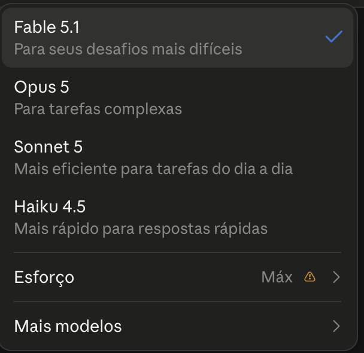
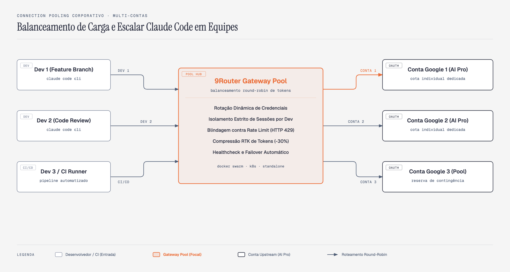

# ClaudeGravity e o Roteamento de Modelos Gemini no Claude Code via 9Router


Todo desenvolvedor que já usou o **Claude Code** em projetos de verdade sabe que ele é, atualmente, um dos melhores *harnesses* de desenvolvimento autônomo do mercado. A capacidade de navegar na árvore de arquivos, inspecionar código com LSP, disparar comandos bash, acionar subagentes em paralelo e iterar sobre correções de testes coloca a CLI da Anthropic em uma classe própria.

O problema começa na ponta da inferência: **a conta de tokens e o limite de taxa (rate limit)**. Dependendo da densidade do repositório e do número de arquivos processados, uma tarde de refatorações complexas consome cotas pesadas ou trava o fluxo de trabalho no meio de uma depuração crítica.

Do outro lado da mesa, temos o **Google Antigravity (Google AI Pro)**: uma das infraestruturas de inteligência artificial mais potentes da atualidade, equipada com os modelos **Gemini 3.8 Flash**, **Gemini 3.7 Flash**, **Gemini 3.6 Flash**, **Gemini 3.1 Pro**, além de variantes abertas como o **GPT-OSS 120B** e instâncias do próprio **Claude 4.6 (Sonnet e Opus)** embutidas no ecossistema do Google. Tudo isso com uma janela massiva de contexto de 1 milhão de tokens e tempo de resposta rápido.

A comunidade de engenharia já provou o valor de desacoplar o harness do provedor quando criou o movimento *DeepClaude* (Claude Code operando com modelos DeepSeek). Agora, levamos essa ideia ao nível de engenharia profissional: apresentamos o **ClaudeGravity**, arquitetura que une o harness do Claude Code com o poder dos modelos Gemini da sua conta Google AI Pro, orquestrado através do gateway inteligente **9Router**.

E o melhor: **sem pagar tokens adicionais na API do Google AI Studio**. Você utiliza legitimamente a capacidade computacional da assinatura que você já possui.

> Caso você ainda não tenha configurado o seu ambiente Google Antigravity para autonomia total e sem confirmações manuais, recomendamos iniciar pelo [Artigo 0001 - Google Antigravity com Acesso Total Irrestrito e sem Interrupções](../../0001_antigravity_acesso_total_irrestrito/article/ARTICLE.md), no qual cobrimos o destravamento do motor Agent 2.0 e da CLI `agy`.

---

## A Arquitetura do ClaudeGravity

Abaixo está o fluxo operacional de ponta a ponta que implementaremos neste artigo:


> **Figura 1:** Arquitetura operacional do ClaudeGravity, conectando o Claude Code CLI aos modelos Gemini do Google Antigravity através do gateway 9Router em container Docker.

A arquitetura resolve três problemas fundamentais de uma só vez:

1. **Tradução de Protocolo:** O Claude Code espera falar a especificação Anthropic Messages API. O Google Cloud Code opera no protocolo proprietário do Gemini/Google Code Assist. O 9Router traduz requisições, respostas em streaming (SSE) e assinaturas de *tool calling* de forma bidirecional e transparente.
2. **Compressão RTK (Token Saver):** Em fluxos de desenvolvimento com agentes, saídas de comandos como `git diff`, `grep` e relatórios de linter despejam milhares de tokens inúteis. O 9Router inclui um compressor de payloads de ferramentas baseado no algoritmo RTK, ativo por padrão, com filtros dedicados para `git diff`, `git status`, `git log`, `grep`, `tree`, `ls`, `find` e saídas de build. A economia real depende do tipo de saída que o agente produz.
3. **Gestão de Sessão e Renovação Contínua de Tokens:** Em vez de chaves de API estáticas com limites rígidos de faturamento, a conexão utiliza OAuth 2.0 com renovação automática de tokens em segundo plano (*auto token refresh*).

---

## Por que 9Router e Não Google AI Studio?

Uma dúvida comum de quem começa a explorar essa integração é: *"Por que não simplesmente criar uma API Key no Google AI Studio e apontar o Claude Code para ela?"*

A resposta é econômica e operacional. A API Key do AI Studio é faturada por token no cartão de crédito, o que transforma qualquer loop de agente em risco de fatura surpresa. Já o Antigravity opera dentro da assinatura AI Pro que você já paga, com renovação automática de credenciais, compressão de payload e fallback entre contas  -  recursos que, pela via da API Key, você teria de implementar sozinho. O comparativo completo com as demais abordagens está na seção [Comparativo entre Claude Nativo, DeepClaude e ClaudeGravity](#comparativo-entre-claude-nativo-deepclaude-e-claudegravity).

Usar a conta do Antigravity não é ilegal nem viola termos de serviço quando feito para uso pessoal e de desenvolvimento: você está exercendo a computação do seu plano profissional do Google diretamente em seu terminal de trabalho, utilizando o gateway como um adaptador de protocolo local.

---

## Subindo o Gateway 9Router via Docker (Método Recomendado)

O melhor modelo operacional para executar o 9Router é através de um container Docker isolado. Isso garante que dependências do Node.js, bibliotecas nativas de SQLite e portas de rede não colidam com suas ferramentas do dia a dia.

### 1. O arquivo `docker-compose.yml`

No repositório do projeto, estruturamos o serviço da seguinte forma:

```yaml
name: claudegravity

services:
  # Servico, container e hostname com o MESMO nome. Nao e estetica: o nome do
  # servico e o que outra stack usa para alcancar este container pela rede, e
  # quando os tres divergem voce le `9router` no compose, `claudegravity-router`
  # no `docker ps` e um terceiro nome no erro de DNS. E o padrao dos projetos
  # 9RTKSync / OminiRTkSync / LiteLlmRTKSync.
  claudegravity-router:
    # 9Router: Gateway oficial de conexões e modelos (https://github.com/decolua/9router)
    image: decolua/9router:latest
    container_name: claudegravity-router
    hostname: claudegravity-router
    restart: unless-stopped
    ports:
      # Apenas localhost: o gateway carrega credenciais reais e nao deve ficar acessivel na rede local.
      - "127.0.0.1:20128:20128"
    volumes:
      - 9router_data:/app/data
    extra_hosts:
      - "host.docker.internal:host-gateway"
    environment:
      - DATA_DIR=/app/data
      - PORT=20128
      - HOSTNAME=0.0.0.0
      - NEXT_PUBLIC_BASE_URL=http://localhost:20128
      - NODE_ENV=production
      # Credenciais lidas do arquivo .env local
      - INITIAL_PASSWORD=${INITIAL_PASSWORD:?defina INITIAL_PASSWORD no arquivo .env}
      - JWT_SECRET=${JWT_SECRET:?defina JWT_SECRET no arquivo .env}
      - REQUIRE_API_KEY=false
      - REQUIRE_LOGIN=false
    command: ["/bin/sh", "-c", "cp /app/open-sse/providers/shared.js /app/data/shared.js 2>/dev/null || true; exec node server.js"]
    healthcheck:
      test: ["CMD", "wget", "--no-verbose", "--tries=1", "--spider", "http://127.0.0.1:20128/dashboard"]
      interval: 15s
      timeout: 5s
      retries: 3
      start_period: 20s

  router-sync:
    # 9RTKSync: 9Router Universal Token & Connection Synchronizer (https://github.com/pathbit/9RTKSync)
    image: ghcr.io/pathbit/9rtksync:latest
    container_name: router-sync
    hostname: router-sync
    restart: unless-stopped
    # NAO acrescente `user: "1000:1000"` aqui copiando do compose de exemplo do
    # 9RTKSync. `${HOME}` entra em /root/host, e /root e 0700 root: com uid 1000
    # o `ls /root/host` devolve "Permission denied" e a descoberta de credencial
    # do host morre em silencio -- o /healthz continua 200, porque so testa o
    # servidor web. A corrida de permissao no volume que motivou aquele `user:`
    # nao existe aqui: o `condition: service_healthy` abaixo faz o gateway criar
    # db/ e logs/ com o dono certo antes de este servico tocar no volume.
    ports:
      - "127.0.0.1:9190:9190"
    volumes:
      - 9router_data:/app/data
      - ${HOME}:/root/host:ro
    environment:
      - PYTHONUNBUFFERED=1
      - HOST_HOME=/root/host
      - DB_PATH=/app/data/db/data.sqlite
      # Resolve pelo nome do servico, que aqui e igual ao do container.
      - ROUTER_URL=http://claudegravity-router:20128
      - SYNC_INTERVAL=300
      - REFRESH_MARGIN=900
      - MODULE=0002
      - ENABLE_WEB_DASHBOARD=1
      - WEB_PORT=9190
      # O painel exige autenticacao. Sem estas duas variaveis a stack sobe, mas
      # o navegador responde 401 e nao ha senha documentada para informar --
      # era exatamente o que acontecia com quem seguia o artigo ate o fim.
      # Sem valor de fallback de proposito: uma senha publicada em arquivo de
      # exemplo vira a senha real de toda implantacao que so copiou e colou.
      - DASHBOARD_USER=${DASHBOARD_USER:-admin}
      - DASHBOARD_PASSWORD=${DASHBOARD_PASSWORD:?defina DASHBOARD_PASSWORD no .env}
    depends_on:
      claudegravity-router:
        condition: service_healthy
    healthcheck:
      test: ["CMD", "/opt/venv/bin/python3", "-c", "import urllib.request; urllib.request.urlopen('http://127.0.0.1:9190/healthz', timeout=3)"]
      interval: 15s
      timeout: 5s
      retries: 3
      start_period: 10s

volumes:
  9router_data:
```

Sete decisões de engenharia neste manifesto:

* **Serviço, `container_name` e `hostname` com o mesmo nome.** Esta é nova, e vale explicar por que importa. O nome do **serviço** é o que o DNS interno do Compose resolve; o `container_name` é o que aparece no `docker ps` e no `docker exec`. Quando os dois divergem, você lê `9router` no manifesto, `claudegravity-router` no terminal e um terceiro nome no erro de DNS - e perde tempo até perceber que são a mesma coisa. Os projetos [9RTKSync](https://github.com/pathbit/9RTKSync), [OminiRTkSync](https://github.com/pathbit/OminiRTkSync) e [LiteLlmRTKSync](https://github.com/pathbit/LiteLlmRTKSync) já adotaram esse padrão, e este artigo passou a segui-lo. É por isso que o `ROUTER_URL` do sidecar aponta para `http://claudegravity-router:20128`, e não mais para um alias de serviço diferente do container.
* **`extra_hosts: ["host.docker.internal:host-gateway"]`** garante compatibilidade entre plataformas (macOS, Linux e Windows WSL2), permitindo que o container resolva o endereço do host local de forma idêntica em qualquer distribuição.
* **Senha e segredo JWT vêm do `.env`**, nunca literais no arquivo versionado. A sintaxe `${VAR:?mensagem}` interrompe a subida com um erro claro caso a variável não exista, em vez de silenciosamente aplicar um padrão fraco.
* **`healthcheck` nos dois serviços:** sem ele, a diretiva `restart: unless-stopped` só reage quando o processo morre  -  um container travado, mas vivo, permaneceria roteando para o vazio. A sonda a cada 15 segundos marca o container como `unhealthy` e torna o problema visível. O sidecar tem a sua, contra `/healthz`, que é o único endpoint do painel que não exige autenticação.
* **Porta publicada apenas em `127.0.0.1`:** o gateway guarda o token OAuth da sua conta Google e as chaves dos provedores. Publicar como `"20128:20128"` o exporia em todas as interfaces de rede, permitindo que qualquer máquina da mesma rede consumisse sua cota. O prefixo de loopback restringe o acesso à própria máquina.
* **O sidecar roda como root, e isso é deliberado.** O `${HOME}` da sua máquina entra no container em `/root/host`, e `/root` é `0700 root` na imagem: com `user: "1000:1000"` o `ls /root/host` devolve `Permission denied` e a descoberta de credencial do host morre **em silêncio**, porque o `/healthz` continua respondendo `200` (ele só testa o servidor web). O compose de exemplo do próprio 9RTKSync traz esse `user:` para resolver uma corrida de permissão no volume compartilhado - corrida que **aqui não existe**, porque o `condition: service_healthy` faz o gateway criar `db/` e `logs/` com o dono certo antes de o sidecar tocar no volume. Não copie aquela linha para cá sem antes mover o mount para fora de `/root`.
* **Guardião de sincronização contínua (`9RTKSync`):** baseado na imagem oficial `ghcr.io/pathbit/9rtksync:latest` do projeto [9RTKSync](https://github.com/pathbit/9RTKSync) (*9Router Universal Token & Connection Synchronizer*), roda em ambiente virtual isolado (`/opt/venv`) e valida a saúde das conexões do [9Router](https://github.com/decolua/9router) continuamente com auto-cura e dashboard web embutido na porta 9190. O consumo medido nesta máquina, com a stack de pé:

  ```text
  $ docker stats --no-stream --format 'table {{.Name}}\t{{.CPUPerc}}\t{{.MemUsage}}' \
      router-sync claudegravity-router claudegravity-ollama
  NAME                   CPU %     MEM USAGE / LIMIT
  router-sync            4.69%     27.53MiB / 11.67GiB
  claudegravity-router   5.62%     90.39MiB / 11.67GiB
  claudegravity-ollama   0.01%     1.324GiB / 11.67GiB
  ```

  `[FONTE: docker stats, executado em 2026-09-13]`. O sidecar custa **27,53 MiB** - é barato, mas não é "quase nada": o Ollama ao lado ocupa 1,3 GiB. E o `CPU %` é uma amostra instantânea, colhida durante um ciclo de sincronização; entre ciclos ele fica ocioso. Meça no seu ambiente antes de citar qualquer número: a linha de comando acima é a medição inteira.

> **Sobre a tag `:latest`:** o manifesto acompanha a última versão publicada do gateway. A contrapartida é conhecida: os scripts deste artigo dependem de um endpoint interno (`/api/auth/status`) e do schema SQLite do gateway (tabelas `providerConnections` e `combos`), e uma atualização pode mexer em qualquer um dos dois. Por isso o `verify_setup.py` existe  -  ele confere justamente esses pontos. Depois de um `docker compose pull`, rode `python3 src/verify_setup.py`: ele confere o endpoint e a tabela `combos`, e se qualquer um mudar, você descobre ali, e não no meio de uma refatoração. Se precisar congelar o ambiente para uma demonstração, troque `:latest` pela versão exata que estiver rodando, que o `docker inspect claudegravity-router` mostra.

### 2. Inicializando o serviço

Primeiro crie o arquivo `.env` a partir do modelo, definindo a senha do dashboard e o segredo JWT:

```bash
cp .env.example .env
```

Em seguida suba o serviço:

```bash
docker compose up -d
```

> **Se você já tinha uma stack anterior de pé, derrube antes.** Os serviços deste manifesto foram
> renomeados para bater com o nome do container (`9router` → `claudegravity-router`, `9rtksync` →
> `router-sync`). Para o Compose, um serviço renomeado é um serviço **novo**: ele não atualiza o
> container existente, tenta criar outro com o mesmo nome. O `--dry-run` mostra o que aconteceria:
>
> ```text
> $ docker compose up -d --dry-run
> level=warning msg="Found orphan containers (router-sync, claudegravity-router, claudegravity-ollama)
> for this project. If you removed or renamed this service in your compose file, you can run this
> command with the --remove-orphans flag to clean it up."
>  Container claudegravity-router Creating
> ```
>
> Repare em `Creating`, e não `Recreating`: os containers antigos viram órfãos e o nome colide. A
> saída é um `docker compose down` antes do `up`. **Nada se perde:** `9router_data` é um volume
> nomeado, então o SQLite com suas conexões e combos sobrevive ao ciclo.

Verifique a saúde dos containers:

```bash
# Conferir status de TODOS os containers da stack
docker compose ps

# Inspecionar os logs do sidecar de renovacao de tokens
docker logs -f router-sync
```

> **Use `docker compose ps`, não `docker ps --filter "name=claudegravity"`.** O filtro por nome
> parece prático e esconde exatamente o container que você quer vigiar: o sidecar chama-se
> `router-sync`, sem o prefixo, e some da listagem. Medido nesta máquina, com a stack de pé:
>
> ```text
> $ docker ps --filter "name=claudegravity" --format 'table {{.Names}}\t{{.Status}}'
> NAMES                  STATUS
> claudegravity-router   Up 32 hours (healthy)
> claudegravity-ollama   Up 32 hours (healthy)
>
> $ docker compose ps --format 'table {{.Name}}\t{{.Status}}'
> NAME                   STATUS
> claudegravity-ollama   Up 32 hours (healthy)
> claudegravity-router   Up 32 hours (healthy)
> router-sync            Up 27 hours (healthy)
> ```
>
> Dois containers contra três. O `docker compose ps` lista pelo projeto, então não depende de
> convenção de nome.


> **Figura 2:** Evidência dos containers `claudegravity-router` e `router-sync` em execução saudável na porta local `20128`.

---

## Alternativa de Instalação Nativa na Máquina (CLI / NPM)

Caso você não utilize Docker ou queira testar diretamente no ambiente local da máquina:

```bash
# Instalação global do pacote oficial do 9Router
npm install -g 9router

# Inicialização do serviço
PORT=20128 9router
```

O serviço iniciará imediatamente e abrirá a porta `http://localhost:20128`. Ambos os métodos (Docker e Nativo) operam exatamente com os mesmos endpoints e capacidades.

---

## Conectando a Conta Antigravity (Google AI Pro)

Com o gateway em execução, abra seu navegador em:

👉 **[http://localhost:20128/dashboard](http://localhost:20128/dashboard)**

Se a tela de login for exibida, insira a senha que você definiu em `INITIAL_PASSWORD` no arquivo `.env`:


> **Figura 3:** Tela de autenticação inicial do 9Router.

Após entrar, navegue até a aba **Endpoint & Key**. O gateway já exibe a URL local `http://localhost:20128/v1` e permite gerar ou visualizar chaves de API para os clientes CLI:


> **Figura 4:** Painel de configuração de API Endpoint e gerenciamento de chaves de acesso.

> **Sobre a chave que aparece nos exemplos deste artigo.** Todos os blocos usam o placeholder `sk-sua-chave-do-9router`. A chave real é **gerada localmente na primeira execução** de `src/sync_antigravity_token.py`: o script sorteia um valor aleatório exclusivo da sua máquina, registra no gateway e grava no arquivo `.env` do módulo, que não é versionado. O script imprime a chave no terminal para você copiá-la. Nenhuma chave fixa é distribuída no repositório  -  se fosse, seria uma senha única compartilhada por todos os leitores, válida em qualquer instalação do tutorial.

### O Papel Mandatório do Dashboard Aberto com a Conta Licenciada

Um dos pontos mais críticos para o sucesso da integração entre Claude Code, 9Router e Google Antigravity reside na forma como a sessão de autenticação é estabelecida e mantida.

Para que a ponte de inferência funcione de ponta a ponta sem erros de permissão, **o dashboard do 9Router (`http://localhost:20128/dashboard`) deve ser aberto no navegador exatamente sob a conta Google titular da licença Antigravity (Google AI Pro, Google One AI Premium ou Workspace com Gemini)**.

Manter a aba do dashboard aberta no navegador durante suas sessões de desenvolvimento atende a três propósitos operacionais vitais:

1. **Contexto de Sessão e Fluxo OAuth no Navegador:** O 9Router utiliza o mecanismo de autenticação web do Google para negociar e validar os tokens de autorização da API Code Assist. O navegador precisa estar com a sessão da conta licenciada ativa para que o handshake OAuth conceda os escopos corretos de inferência sem atrito.
2. **Observabilidade Operacional em Tempo Real:** O dashboard exibe instantaneamente o status do provedor (`active • OAuth #1`), o volume de requisições por minuto, o tempo de resposta em milissegundos e o percentual de tokens economizados pelo compressor RTK. Se uma rajada de requisições exceder a cota momentânea de taxa (RPM), o painel reflete o estado imediatamente, permitindo ação preventiva.
3. **Detecção e Renovação Visual de Sessão:** Caso ocorra alternância de rede, troca de IP ou revogação temporária de credenciais pelo Google, o card do provedor no dashboard altera seu status visual, indicando a necessidade de revalidação antes que o Claude Code enfrente erros no meio de uma refatoração crítica.

### A Armadilha das Múltiplas Contas Google no Navegador

Na rotina diária de desenvolvimento de software, é quase unânime que engenheiros mantenham múltiplos perfis Google logados no mesmo navegador: um e-mail pessoal gratuito (`dev.silva@gmail.com`), um e-mail corporativo (`nome@empresa.com`), e-mails acadêmicos ou contas de clientes.

Essa convivência de perfis é a **principal causa de falhas misteriosas** ao conectar o 9Router pela primeira vez:

* **O Mecanismo da Falha:** Quando você clica em **+ Add Connection** no 9Router, o Google abre a tela padrão de autorização OAuth. Se o seu navegador estiver com o perfil pessoal padrão selecionado e esse perfil **não possuir a assinatura Google AI Pro / Antigravity**, o fluxo de autenticação completa sem erros aparentes. O Google emite o token e o 9Router exibe a conexão como `active`.
* **O Sintoma Silencioso no Terminal:** Embora a conexão aparente estar saudável, no instante em que o Claude Code ou o script de teste solicita inferência para `ag/gemini-3.8-flash-high`, os servidores do Google Code Assist recusam a chamada e devolvem erros como:
  - `HTTP 403 Forbidden` (`PERMISSION_DENIED` ou `ResourceExhausted`);
  - `HTTP 404 Model Not Found` (o modelo Gemini Flash High e as instâncias Antigravity simplesmente não são liberadas para contas sem o plano Pro);
  - Bloqueio imediato por ausência de cota de inferência de engenharia.
* **A Causa Raiz:** O Google valida a cota de computação contra a assinatura atrelada ao e-mail proprietário da credencial OAuth. Uma conta gratuita gera um token OAuth sintaticamente perfeito, mas sem qualquer permissão de inferência para os modelos do Antigravity.

> **Regra Prática de Blindagem:** Antes de iniciar a vinculação, abra uma aba em `https://myaccount.google.com` no mesmo navegador e confirme visualmente que o avatar e o endereço exibidos pertencem à conta titular da assinatura Google AI Pro / Antigravity. Caso seu navegador utilize perfis separados (Chrome Profiles, Arc Spaces ou Edge Profiles), abra o dashboard do 9Router exclusivamente na janela do perfil que detém a licença.

### Vinculando a Conta Google no Menu Providers

Com a conta Google correta ativa no navegador, execute o pareamento formal no gateway:

1. No menu lateral do dashboard, clique em **Providers** (`http://localhost:20128/dashboard/providers`).
2. Na seção **OAuth Providers**, localize o card **Antigravity**:


> **Figura 5:** Visão geral de provedores com suporte nativo a Antigravity, Claude Code, OpenAI Codex e Kiro.

3. Clique no card **Antigravity**. O 9Router exibirá o painel de gerenciamento do provedor aguardando a configuração da primeira credencial (com 0 conexões ativas):


> **Figura 6:** Painel de conexões e modelos do provedor Antigravity no 9Router antes da autenticação (0 conexões ativas e botão para adicionar conexão).

4. Clique no botão **+ Add Connection**. Uma janela segura de autenticação Google será aberta. Certifique-se de selecionar a conta Google titular da sua assinatura AI Pro e aprove o consentimento de acesso.
5. O 9Router completará o handshake OAuth, registrará o `projectId` e atualizará o status da conexão para **`active • OAuth #1`**:


> **Figura 7:** Provedor Antigravity com a conta Google AI Pro ativa (`active • OAuth #1`) e catálogo completo de modelos Gemini disponíveis para roteamento.

### Protocolo de Validação Visual no Dashboard e Recuperação de Conexão

Após completar a vinculação, execute a verificação visual no painel:

1. **Status da Conexão:** No card Antigravity, o rótulo deve exibir expressamente `active • OAuth #1` em verde.
2. **Catálogo de Modelos Habilitados:** A lista deve exibir os 20 modelos disponíveis (Gemini 3.8, Gemini 3.7, Gemini 3.6, Gemini 3.1 Pro e variantes auxiliares).
3. **Como Corrigir se a Conta Errada Foi Vinculada:**
   Caso você perceba que vinculou uma conta pessoal sem assinatura ou se os testes apontarem erro 403:
   - No card Antigravity em `http://localhost:20128/dashboard/providers`, localize a conexão ativa e clique no ícone de lixeira (**Delete Connection**).
   - Abra uma aba em `myaccount.google.com` no mesmo navegador e alterne o usuário ativo para a conta detentora da licença Antigravity.
   - Retorne ao painel do 9Router, clique novamente em **+ Add Connection** e selecione a conta licenciada.

### Validação Automatizada de Inferência via Terminal

Não basta a interface indicar que está conectado: na engenharia de software de ponta, tudo deve ser testado, provado e validado via código executável.

Disponibilizamos no repositório o script `src/test_gateway.py` para atestar a comunicação real com a API do Google:

```bash
python3 src/test_gateway.py
```

O utilitário executa quatro baterias de verificação automática:

1. **Disponibilidade do Endpoint Local:** Confirma que o 9Router está saudável na porta `20128` (retornando `HTTP 200`).
2. **Listagem do Catálogo:** Valida a presença dos identificadores com prefixo `ag/`.
3. **Inferência Direta no Gemini 3.8 Flash High:** Envia a mensagem `"Responda apenas: PONG - ClaudeGravity Operacional"` diretamente para o endpoint `/v1/messages` simulando uma chamada real do Claude Code.
4. **Resiliência do Combo de Fallback:** Envia a mesma inferência para o combo virtual `claudegravity-fallback`.

A saída no terminal comprova o sucesso em tempo real:

```text
======================================================================
🧪 TESTE DE INTEGRACAO CLAUDEGRAVITY & GATEWAY 9ROUTER
======================================================================
🔍 [1/4] Verificando disponibilidade do gateway 9Router em http://localhost:20128...
✅ Gateway 9Router está online e respondendo (HTTP 200)!

🔍 [2/4] Listando modelos Antigravity registrados...
✅ Total de modelos Antigravity identificados: 20
Modelos em destaque:
   • ag/gemini-3.8-flash-high
   • ag/gemini-3.8-flash-medium
   • ag/gemini-3.8-flash-low
   • ag/gemini-3.8-flash
   • ag/gemini-3.7-flash-high
   • ag/gemini-3.7-flash-medium

🔍 [3/4] Testando ClaudeGravity Principal (ag/gemini-3.8-flash-high direto via Antigravity Pro) (ag/gemini-3.8-flash-high)...
✅ Status HTTP 200 recebido em 1.41s!
💬 Resposta do modelo: PONG - ClaudeGravity Operacional

🔍 [4/4] Testando ClaudeGravity Resiliente com Fallback Free (claudegravity-fallback) (claudegravity-fallback)...
✅ Status HTTP 200 recebido em 1.25s!
💬 Resposta do modelo: PONG - ClaudeGravity Operacional

======================================================================
🎉 TODOS OS TESTES PASSARAM COM SUCESSO!
O ClaudeGravity está 100% operacional no modelo Principal e no Fallback.
```

`[FONTE: src/test_gateway.py, executado em 2026-09-13 contra a stack deste artigo]`

Se o teste retornar `HTTP 200` e a resposta `PONG - ClaudeGravity Operacional` for impressa, sua conta Google licenciada está rigorosamente comprovada e pronta para assumir cargas pesadas de trabalho com o Claude Code.

---

## O Catálogo Completo de Modelos Disponíveis

Com a conta Antigravity conectada, o Claude Code passa a ter acesso aos seguintes identificadores de modelo:

### 1. Família Gemini 3.8 (Recomendado como Primário)
- **`ag/gemini-3.8-flash-high`**: Variante topo de linha com nível máximo de raciocínio encadeado (*high thinking*). Ideal para refatorações profundas de código, depuração de bugs complexos e planejamento de arquitetura.
- **`ag/gemini-3.8-flash-medium`**: Equilíbrio entre profundidade de análise e tempo de resposta.
- **`ag/gemini-3.8-flash-low`**: Execução veloz com raciocínio leve.
- **`ag/gemini-3.8-flash`**: Alias padrão para a geração 3.8.

### 2. Família Gemini 3.7
- **`ag/gemini-3.7-flash-high`**: Modelo com raciocínio híbrido ágil, excelente para geração de testes unitários e revisões de PR.
- **`ag/gemini-3.7-flash-medium`** e **`ag/gemini-3.7-flash-low`**.

### 3. Família Gemini 3.6
- **`ag/gemini-3.6-flash-high`**: Excelente para tarefas de alta frequência com baixa latência.
- **`ag/gemini-3.6-flash-medium`** e **`ag/gemini-3.6-flash-low`**.

### 4. Família Gemini 3 (Econômica)
- **`ag/gemini-3-flash`** e **`ag/gemini-3-flash-agent`**: variantes base e agêntica da geração 3, úteis como camada barata de fallback em tarefas de baixa complexidade.

> **A família 3.5 saiu do ar.** Os identificadores `ag/gemini-3.5-*` ainda aparecem no catálogo do gateway, mas o `-high` responde `404` e as variantes `-low` devolvem a mensagem do próprio Google: *"Gemini 3.5 Flash is no longer available. Please switch to Gemini 3.7 Flash"*. É um bom lembrete de que o catálogo listado pelo provedor nem sempre reflete o que está realmente servindo  -  valide antes de colocar um identificador na sua cascata.

### 5. Modelos Gemini Pro (Não Flash) & Agentes
- **`ag/gemini-pro-agent`**: Gemini 3.1 Pro configurado para planejamento autônomo e raciocínio formal.
- **`ag/gemini-3.1-pro-low`**: Versão otimizada para respostas diretas sem overhead de inferência prolongada.

### 6. Modelos Adicionais via Antigravity
- **`ag/claude-sonnet-4-6`**: Instância do Claude Sonnet 4.6 servida na infraestrutura do Google Cloud.
- **`ag/claude-opus-4-6-thinking`**: Instância do Claude Opus 4.6 Thinking.
- **`ag/gpt-oss-120b-medium`**: Modelo open-weights de 120 bilhões de parâmetros.

> Os 17 identificadores acima são os que respondem. O gateway expõe 20 com prefixo `ag/`: os 3 restantes são a família `ag/gemini-3.5-*` do aviso anterior, que continua catalogada mesmo depois de sair do ar. A lista viva sempre pode trazer mais entradas do que as utilizáveis, então confira a do seu ambiente e valide antes de adotar: `curl -s -H "x-api-key: $ANTHROPIC_API_KEY" http://localhost:20128/v1/models`.

---

## Configuração do Claude Code com Zero Interrupções

Um dos maiores pesadelos ao utilizar agentes no terminal é a interrupção constante:

```text
Allow bash command: git status? [y/N]
Allow read file: src/index.ts? [y/N]
Allow edit file: src/index.ts? [y/N]
```

Em loops autônomos, esse comportamento torna a experiência impraticável. Por isso o ClaudeGravity adota **`--dangerously-skip-permissions`** como requisito  -  o mesmo princípio vale para a CLI oficial do Antigravity (`agy --dangerously-skip-permissions`). O efeito exato de cada flag está detalhado na tabela da seção [Anatomia das Variáveis de Ambiente](#anatomia-das-variáveis-de-ambiente-e-flags-avançadas).

### Guia Integrado de Ferramentas CLI no 9Router

O painel do 9Router disponibiliza a aba dedicada **CLI Tools** com instruções de integração direta para ferramentas como Claude Code e OpenAI Codex:


> **Figura 8:** Painel CLI Tools do 9Router com templates prontos de configuração para harnesses agênticos.

Ao selecionar **Claude Code**, o gateway apresenta as instruções com as variáveis de ambiente necessárias para a conexão:


> **Figura 9:** Instruções integradas do 9Router demonstrando a parametrização do Claude Code.

### Configurando o Claude Code a partir dos Modelos Example

Para que toda sessão do Claude Code inicie com as permissões completas e os modelos Gemini já mapeados, disponibilizamos o modelo `.example` da configuração do Claude Code em `examples/.claude/`, além do `.env.example` na raiz do módulo. Para inicializar sua configuração local:

```bash
cp examples/.claude/settings.json.example examples/.claude/settings.json
cp .env.example .env
```

#### O que preencher no `.env`

A maior parte das variáveis já vem com valor funcional. Apenas estas exigem sua atenção:

| Variável | Obrigatória? | O que colocar |
| :--- | :--- | :--- |
| `INITIAL_PASSWORD` | **Sim** | Senha do painel do 9Router. O `docker compose` recusa subir sem ela. |
| `JWT_SECRET` | **Sim** | Valor longo e aleatório para assinar as sessões do painel. Gere com `openssl rand -hex 32`. |
| `ANTHROPIC_API_KEY` | **Sim** | Não invente: é impressa pelo `src/sync_antigravity_token.py` na primeira execução e gravada aqui automaticamente. No `.env` ela alimenta os scripts Python; no `settings.json` o mesmo valor entra como `ANTHROPIC_AUTH_TOKEN`. |
| `ANTHROPIC_BASE_URL` | Já preenchida | `http://localhost:20128`, sem o sufixo `/v1` (a CLI o acrescenta sozinha). |

Não há chave de provedor externo neste artigo: a autenticação com o Google acontece via OAuth, reaproveitando a sessão do Antigravity que já está na sua máquina.

#### O arquivo de configuração do Claude Code

Ele fica em `examples/.claude/settings.json`, isolado do restante do repositório  -  por isso não interfere no projeto em que você estiver trabalhando. É versionado apenas na forma `.example`; a cópia ativa fica fora do controle de versão.

É a configuração do projeto, compartilhável com o time: modelo padrão, os quatro papéis, `modelPicker`, `modelOverrides`, permissões e `env`.

**Por que não há um `settings.local.json` aqui.** O Claude Code lê também `.claude/settings.local.json`, com precedência sobre o `settings.json`, mas a função dele é guardar o que é específico da sua máquina e não pode ir para o git (uma chave pessoal, um caminho local). Neste artigo não existe nada nessa categoria: tudo o que a configuração precisa está no arquivo único acima, e a cópia ativa já fica fora do controle de versão. Uma cópia idêntica no arquivo local só criaria dois lugares para manter a mesma coisa. E o bloco `modelPicker` não seria motivo para tê-lo: a CLI só honra esse bloco em `~/.claude/settings.json`, em settings gerenciadas ou via `--settings`; em um checkout de projeto ele é ignorado tanto no `settings.json` quanto no `settings.local.json`. Para ter o menu `/model` customizado, copie o bloco `modelPicker` para o arquivo de usuário.

#### O que fica no estado global do Claude Code (e como não depender dele)

Tudo o que este artigo configura mora em `examples/.claude/settings.json`. Mas o Claude Code guarda **fora do projeto**, em `~/.claude.json`, um estado que nenhuma chave de `settings.json` altera, por desenho:

| O que | Onde fica | O que zera |
| :--- | :--- | :--- |
| Assistente de primeiro uso concluído (tema, notas de segurança) | `~/.claude.json` | `/logout`, ou uma instalação nova |
| Login na conta Anthropic | `~/.claude.json` + chaveiro do sistema | `/logout` |
| Aprovação de uma `ANTHROPIC_API_KEY` vinda do `env` (pergunta *"Do you want to use this API key?"*) | `~/.claude.json` | `/logout` |
| Confiança na pasta (*"Do you trust the files in this folder?"*) | `~/.claude.json`, por caminho absoluto | Renomear ou mover a pasta |

Verificamos no binário da versão 2.1.268 (17 de setembro de 2026): o `/logout` marca o assistente como não concluído e apaga a lista de chaves aprovadas. Foi exatamente isso que produziu o sintoma "entro na pasta e ele fica pedindo login": o assistente reaparece, e **enquanto ele roda, o `settings.json` do projeto ainda não foi carregado**. Medimos com uma configuração global zerada: mesmo com a pasta já confiável e o arquivo completo, o assistente mostrou a tela *"Select login method"*. O arquivo do projeto só entra depois do assistente e da confirmação de confiança.

Duas decisões deixam este projeto imune a esse estado:

1. **`ANTHROPIC_AUTH_TOKEN` no lugar de `ANTHROPIC_API_KEY`.** As duas autenticam no 9Router (o middleware lê `Authorization: Bearer` antes de `x-api-key`); a diferença é o que a CLI faz com cada uma. `ANTHROPIC_API_KEY` exige uma aprovação interativa única, guardada em `~/.claude.json` e apagada pelo `/logout` (medimos: com a chave não aprovada, pasta confiável e assistente concluído, a pergunta reaparece). `ANTHROPIC_AUTH_TOKEN` vai direto para o cabeçalho `Authorization: Bearer`, sem aprovação nem estado global. É [documentada](https://code.claude.com/docs/en/env-vars) para exatamente isso. Confirmamos que o 9Router lê esse cabeçalho.
2. **Na primeira execução, ou depois de um `/logout`, inicie com `--settings`:**

   ```bash
   claude --settings .claude/settings.json
   ```

   A flag é [documentada](https://code.claude.com/docs/en/settings#change-a-setting-for-one-session) e aplica o arquivo **antes** do assistente. Medimos com configuração global zerada: a sequência foi tema, notas de segurança, confiança na pasta e o prompt, sem nenhuma tela de login. Depois disso a pasta fica confiável, e o `claude` puro passa a carregar o `settings.json` do projeto em toda sessão. Um efeito colateral bem-vindo: com `--settings`, a CLI também honra o bloco `modelPicker`, que ela ignora quando vem do checkout do projeto.

O que **não** dá para evitar por configuração de projeto: a escolha de tema e as notas de segurança na primeira execução, e a pergunta de confiança em cada pasta nova. São telas de um `Enter` cada, nunca pedem login, e é assim que a CLI protege quem abre um repositório desconhecido.

> **Se o Claude Code pedir login nesta pasta**, a ordem de verificação é: (1) o JSON do `settings.json` é válido? Uma vírgula sobrando faz a CLI descartar o arquivo em silêncio; (2) o assistente de primeiro uso está aparecendo? Saia dele com `claude --settings .claude/settings.json`; (3) a pasta foi renomeada? Aceite a confiança de novo.

#### Estrutura do `settings.json.example`

```json
{
  "model": "ag/gemini-3.8-flash-high",
  "env": {
    "ANTHROPIC_BASE_URL": "http://localhost:20128",
    "ANTHROPIC_AUTH_TOKEN": "sk-sua-chave-do-9router",
    "CLAUDE_CODE_DISABLE_UNKNOWN_MODEL_WINDOW_ENFORCEMENT": "1",
    "ANTHROPIC_DEFAULT_OPUS_MODEL": "ag/gemini-3.8-flash-high",
    "ANTHROPIC_DEFAULT_OPUS_MODEL_NAME": "Gemini 3.8 Flash High (Opus)",
    "ANTHROPIC_DEFAULT_OPUS_MODEL_DESCRIPTION": "Primario: raciocinio alto, 1M de contexto",
    "ANTHROPIC_DEFAULT_FABLE_MODEL": "ag/gemini-pro-agent",
    "ANTHROPIC_DEFAULT_FABLE_MODEL_NAME": "Gemini 3.1 Pro High (Fable)",
    "ANTHROPIC_DEFAULT_FABLE_MODEL_DESCRIPTION": "O mais denso da conta: use com parcimonia",
    "ANTHROPIC_DEFAULT_SONNET_MODEL": "ag/gemini-3.7-flash-high",
    "ANTHROPIC_DEFAULT_SONNET_MODEL_NAME": "Gemini 3.7 Flash High (Sonnet)",
    "ANTHROPIC_DEFAULT_SONNET_MODEL_DESCRIPTION": "Trabalho corrente",
    "ANTHROPIC_DEFAULT_HAIKU_MODEL": "ag/gemini-3.6-flash-high",
    "ANTHROPIC_DEFAULT_HAIKU_MODEL_NAME": "Gemini 3.6 Flash High (Haiku)",
    "ANTHROPIC_DEFAULT_HAIKU_MODEL_DESCRIPTION": "Latencia minima, alta frequencia",
    "ANTHROPIC_MODEL": "ag/gemini-3.8-flash-high",
    "CLAUDE_CODE_SUBAGENT_MODEL": "ag/gemini-3.7-flash-high",
    "CLAUDE_CODE_EFFORT_LEVEL": "max",
    "CLAUDE_CODE_AUTO_COMPACT_WINDOW": "786432",
    "CLAUDE_CODE_DISABLE_ADVISOR_TOOL": "1"
  },
  "permissions": {
    "defaultMode": "bypassPermissions",
    "allow": [
      "Bash(*)",
      "Read(*)",
      "Edit(*)",
      "Write(*)",
      "Glob(*)",
      "Grep(*)",
      "WebFetch(*)",
      "WebSearch(*)",
      "NotebookEdit(*)",
      "TodoWrite(*)",
      "Agent(*)",
      "Skill(*)"
    ]
  },
  "skipDangerousModePermissionPrompt": true,
  "includeCoAuthoredBy": false,
  "modelPicker": {
    "replaceBuiltInOptions": true,
    "options": [
      {
        "model": "ag/gemini-3.8-flash-high",
        "label": "Gemini 3.8 Flash High",
        "description": "Primario: raciocinio alto, 1M de contexto",
        "behavesAs": "claude-sonnet-4-6"
      },
      {
        "model": "ag/gemini-pro-agent",
        "label": "Gemini 3.1 Pro High",
        "description": "O mais denso da conta. Use com parcimonia",
        "behavesAs": "claude-sonnet-4-6"
      },
      {
        "model": "ag/gemini-3.7-flash-high",
        "label": "Gemini 3.7 Flash High",
        "description": "Trabalho corrente",
        "behavesAs": "claude-sonnet-4-6"
      },
      {
        "model": "ag/gemini-3.6-flash-high",
        "label": "Gemini 3.6 Flash High",
        "description": "Latencia minima, alta frequencia",
        "behavesAs": "claude-haiku-4-5-20251001"
      },
      {
        "model": "ag/claude-sonnet-4-6",
        "label": "Claude Sonnet 4.6",
        "description": "Sonnet servido pelo Antigravity",
        "behavesAs": "claude-sonnet-4-6"
      },
      {
        "model": "ag/claude-opus-4-6-thinking",
        "label": "Claude Opus 4.6 Thinking",
        "description": "Opus Thinking servido pelo Antigravity",
        "behavesAs": "claude-sonnet-4-6"
      },
      {
        "model": "ag/gpt-oss-120b-medium",
        "label": "GPT-OSS 120B",
        "description": "Pesos abertos via Antigravity",
        "behavesAs": "claude-sonnet-4-6"
      },
      {
        "model": "claudegravity-fallback",
        "label": "ClaudeGravity Resiliente (combo)",
        "description": "5 niveis. Use quando a cota de uma familia estourar",
        "behavesAs": "claude-sonnet-4-6"
      },
      {
        "model": "claudegravity-thinking",
        "label": "ClaudeGravity Thinking (combo)",
        "description": "4 niveis, comeca no Opus 4.6. Nao depende da cota do Gemini",
        "behavesAs": "claude-sonnet-4-6"
      }
    ]
  },
  "modelOverrides": {
    "claude-fable-5-1": "ag/gemini-pro-agent",
    "claude-opus-5": "ag/gemini-3.8-flash-high",
    "claude-sonnet-5": "ag/gemini-3.7-flash-high"
  }
}
```

> [!IMPORTANT]
> ### Por que o Advisor fica desligado (`"CLAUDE_CODE_DISABLE_ADVISOR_TOOL": "1"`)
>
> Não é economia nem esquecimento: **o advisor não funciona com nenhum modelo servido fora da API da Anthropic, e ligá-lo derruba a sessão.** Ele é uma *server tool* executada pelo servidor da Anthropic; um gateway ou provedor alternativo recebe um tipo de ferramenta que não conhece e rejeita a requisição inteira. Nenhuma outra chave (`advisorModel`, `modelOverrides`, papéis `ANTHROPIC_DEFAULT_*_MODEL`) contorna isso: elas só escolhem **qual** modelo entra na ferramenta, não **quem** a executa. Por isso `"CLAUDE_CODE_DISABLE_ADVISOR_TOOL": "1"` está em **todos** os arquivos deste artigo. O mecanismo, o erro exato devolvido pelo DeepSeek e o motivo do menu `/advisor` duplicar linhas estão na seção [O Advisor e Ferramentas Experimentais](#o-advisor-e-ferramentas-experimentais).

### Anatomia das Variáveis de Ambiente e Flags Avançadas

Para obter o máximo desempenho e estabilidade ao operar o Claude Code conectado a modelos externos, configuramos uma série de flags de tempo de execução fundamentais:

| Variável / Flag | Função Técnica no Claude Code | Por que é Essencial no ClaudeGravity |
| :--- | :--- | :--- |
| `ANTHROPIC_BASE_URL` | Redireciona as chamadas de API do endpoint oficial da Anthropic para o gateway local (`http://localhost:20128`). | O Claude Code anexa internamente `/v1/messages`. Declarar a URL **sem** o sufixo `/v1` produz a rota limpa `/v1/messages`. O 9Router tolera a forma duplicada `/v1/v1/messages` graças a um interceptador de compatibilidade, mas proxies estritos não - por isso a recomendação vale como boa prática portável. |
| `ANTHROPIC_AUTH_TOKEN` | Credencial enviada como `Authorization: Bearer`. | Utiliza a chave gerada no 9Router (`sk-...`) sem a aprovação interativa que `ANTHROPIC_API_KEY` exige; ver [estado global](#o-que-fica-no-estado-global-do-claude-code-e-como-não-depender-dele). |
| `--dangerously-skip-permissions` | Desabilita completamente as confirmações interativas de terminal (`[y/N]`) para ferramentas de arquivo e bash. | Torna o agente 100% autônomo. Sem essa flag, o desenvolvedor precisa apertar `y` a cada linha de teste executada ou arquivo modificado. |
| `bypassPermissions` | Modo padrão declarado dentro de `.claude/settings.json` na seção `permissions`. | Garante que subagentes, ferramentas e comandos herdados iniciem sem restrições. |
| `skipDangerousModePermissionPrompt` | Suprime o diálogo de aviso inicial do Claude Code sobre estar rodando em modo desprotegido. | Elimina o prompt de confirmação inicial toda vez que uma nova sessão é disparada. |
| `includeCoAuthoredBy: false` | Impede que o Claude Code anexe trailers de coautoria (`Co-Authored-By`) nos commits. | Assegura autoria estritamente humana nos commits e preserva a integridade do histórico do repositório. |
| `CLAUDE_CODE_DISABLE_UNKNOWN_MODEL_WINDOW_ENFORCEMENT=1` | Desativa a restrição rígida de contagem de janela de contexto baseada exclusivamente nos modelos proprietários da Anthropic. | Permite que o Claude Code utilize os identificadores `ag/gemini-*` sem reclamar de tamanho de janela desconhecido. |
| `CLAUDE_CODE_DISABLE_ADVISOR_TOOL=1` | Desliga a ferramenta experimental de advisor e remove o comando `/advisor`. | Evita que a CLI anexe a *server tool* `advisor_20260301`, que só a API da Anthropic executa; com gateway, a requisição inteira seria rejeitada. |

---

### Um `modelOverrides` Curto, e Só Onde Faz Falta

A chave `modelOverrides` traduz o identificador pedido pela CLI para um modelo do gateway. A tentação
é mapear tudo  -  chegamos a escrever 33 entradas cobrindo cada família com e sem sufixo de janela.
Foi trabalho desperdiçado, e a medição mostrou por quê.

Com o `modelPicker` substituindo a lista nativa e os quatro papéis declarados, testamos **removendo o
bloco por completo**. Nada quebrou na operação normal, e nenhum consumidor pediu um `claude-*`: o
`sdk` foi para o combo padrão e o `generate_session_title` para o modelo do papel Haiku. O bloco só faz falta
num caso, e é bem específico:

| Cenário | Precisa de override? |
| :--- | :--- |
| Operação normal, sem `--model` | Não |
| Alias curto (`--model opus`, `sonnet`, `fable`) | Não, a CLI resolve pelo papel |
| Combo próprio (`--model claudegravity-fallback`) | Não |
| **Identificador da geração corrente pinado antes** (`claude-opus-5[1m]`) | **Sim** |

O caso que sobra é o de um `~/.claude/settings.json` (é lá que o menu `/model` grava a escolha) que ficou apontando para um modelo escolhido
antes de você trocar a configuração. Para isso bastam **três entradas**, uma por família:

```json
"modelOverrides": {
  "claude-fable-5-1": "ag/gemini-pro-agent",
  "claude-opus-5":    "ag/gemini-3.8-flash-high",
  "claude-sonnet-5":  "ag/gemini-3.7-flash-high"
}
```

**Não é preciso duplicar com o sufixo de janela.** A CLI normaliza o identificador antes de consultar
o mapa, e o próprio binário trata o sufixo como opcional no padrão que usa para reconhecer modelos:

```text
(?:[-@]\d{8})?(?:-v\d+(?::\d+)?)?(?:\[[12]m\])?$
```

Verificamos na prática: com apenas `claude-opus-5` declarado, `--model claude-opus-5[1m]` resolve
normalmente. Uma entrada por família dá conta das duas formas.

Repare que o destino de cada linha é o **mesmo modelo do papel correspondente**: o pin antigo passa a
resolver exatamente para onde o papel já apontava, sem introduzir um terceiro comportamento. Se você
preferir que um pin esquecido caia na cascata em vez de num modelo único, troque o destino por
`claudegravity-fallback`  -  é a mesma escolha entre previsibilidade e resiliência que a seção
[Modelo Individual ou Combo](#modelo-individual-ou-combo-e-a-escolha-do-padrão) detalha. E, quando a CLI
ganhar uma geração nova, é uma linha por família  -  ou simplesmente apague o pin e deixe os papéis
trabalharem.

## Quando Parece Desconexão, mas é Outra Coisa

Duas falhas diferentes chegam ao terminal com a mesma cara  -  `API Error: 503`  -  e a confusão custa
tempo. Vale separar, porque a correção de uma não serve para a outra.

### Falha 1 - a cota da família estourou

A cota do Antigravity é contabilizada **por família de modelo**, não pela conta inteira. Quando o teto
do Gemini é atingido, o gateway registra:

```text
[AG_QUOTA] CACHE_BLOCK gemini-3.8-flash-high - skip upstream until 23:47:37
[AUTH] antigravity | all 1 accounts locked for gemini-3.8-flash-high (reset after 2h)
```

Uma verificação modelo a modelo durante um desses bloqueios mostra o alcance real:

| Modelo | Estado durante o bloqueio |
| :--- | :--- |
| `ag/gemini-3.8-flash-high` · `3.7` · `3.6` · `pro-agent` | **503** |
| `ag/claude-opus-4-6-thinking` | OK, 3,8s |
| `ag/claude-sonnet-4-6` | OK, 1,4s |
| `ag/gpt-oss-120b-medium` | OK, 0,8s |

A conta continua saudável: apenas uma família ficou indisponível. Quem estivesse num `ag/gemini-*`
via a sessão morrer a cada mensagem; quem estivesse num combo seguiu trabalhando, porque a cascata
desce até achar quem responda:

```text
[COMBO] Trying model 1/5: ag/gemini-3.8-flash-high  -> failed {"status":503}
[COMBO] Trying model 2/5: ag/gemini-3.7-flash-high  -> failed {"status":503}
[COMBO] Trying model 3/5: ag/gemini-3.6-flash-high  -> failed {"status":503}
[COMBO] Trying model 4/5: ag/claude-sonnet-4-6      -> succeeded
```

Os três saltos custaram menos de um segundo no total, porque o gateway guarda o bloqueio em cache e
nem tenta o upstream  -  a resposta chegou em 1,97s. Este é o trade-off que a seção
[Modelo Individual ou Combo](#modelo-individual-ou-combo-e-a-escolha-do-padrão) resolve.

> **Round-Robin não resolve este caso com uma conta só.** Ele distribui chamadas entre conexões
> distintas, e a cota é contabilizada pelo Google por conta. Cadastrar a mesma conta duas vezes cria
> duas entradas no gateway, mas o teto continua sendo um. Só aliviam de verdade: uma segunda conta
> Google com assinatura própria, ou provedores fora do Antigravity, que é o caminho do
> [Artigo 0003](../../0003_fallback_modelos_gratuitos_9router/article/ARTICLE.md). Quantas contas, com
> que fórmula, e como saber depois se o número acertou, está em
> [Quantas Contas para Quantos Desenvolvedores](#5-quantas-contas-para-quantos-desenvolvedores).

### Falha 2 - a credencial foi gravada em formato que quebra a validação

Esta é sutil e se manifesta como desconexão espontânea depois de cerca de uma hora de uso.

O token OAuth dura aproximadamente uma hora. Quando se aproxima do fim, o próprio 9Router renova  -  e,
ao gravar o resultado, escreve o campo `expiresAt` como **string ISO** em vez de epoch em
milissegundos:

```text
expiresAt valor : "2026-09-11T02:05:25.091Z"
expiresAt tipo  : string
comparacao > now: false
```

`Number("2026-09-11T02:05:25.091Z")` é `NaN`, e `NaN > Date.now()` é sempre falso. A partir dali a
credencial é tratada como vencida mesmo estando ativa, com `isActive: 1`, `testStatus: active` e
`backoffLevel: 0` no banco. Nada no painel indica problema.

A correção é preventiva: renovar **antes** do gateway precisar renovar, gravando o campo como número.
É o que o `src/keep_connected.py` faz.

```bash
# Confere e corrige, se necessario
python3 src/keep_connected.py

# Mantem valida enquanto voce trabalha, conferindo a cada 5 minutos
python3 src/keep_connected.py --daemon
```

Ele só age quando precisa. Com o token novo, sai sem gastar chamada:

```text
[=] Credencial válida por mais 58 min. Nada a fazer.
```

E, diante do campo corrompido, reconhece a causa pelo nome:

```text
[*] Renovando: expiresAt gravado como texto pelo gateway.
[+] Credencial renovada. Válida por mais 59 min.
```

Deixe o modo `--daemon` rodando num terminal à parte durante sessões longas, ou utilize a solução definitiva: o container dedicado `9RTKSync`.

### Auto-Renovação Definitiva com o Container router-sync

Para que a sincronização e renovação de credenciais não dependa de terminais abertos ou de intervenções manuais, o `docker-compose.yml` deste projeto provisiona o serviço oficial `9rtksync` com o container `router-sync` (baseado no repositório [9RTKSync](https://github.com/pathbit/9RTKSync) · *9Router Universal Token & Connection Synchronizer*):

1. **Imagem OCI e Isolamento em Virtual Environment:** Baseado na imagem oficial `ghcr.io/pathbit/9rtksync:latest`, executa em Python 3.14 Alpine com ambiente virtual dedicado (`/opt/venv`). O consumo medido nesta máquina foi de **27,53 MiB de RAM** (`docker stats --no-stream router-sync`, em 2026-09-13); a CPU fica ociosa entre ciclos e sobe durante a sincronização, então não há um número único honesto a publicar  -  rode o comando no seu ambiente.
2. **Isolamento de Credenciais e Auto-Cura Universal:** O container monta o banco SQLite compartilhado (`9router_data:/app/data`) e o diretório home do usuário host (`${HOME}:/root/host:ro`) em modo estritamente somente-leitura (`:ro`), descobrindo e sincronizando credenciais de múltiplos provedores locais (Google Antigravity, Claude, GitHub Copilot, Codex, Kiro, Codeium), curando divergências de datas e renovando tokens preventivamente 15 minutos antes da expiração.
3. **Dashboard Web em Tempo Real:** Servidor HTTP embutido expondo a interface web e endpoints de monitoramento em `http://localhost:9190` e `http://localhost:9190/healthz`. A interface exige autenticação: informe as variáveis `DASHBOARD_USER` e `DASHBOARD_PASSWORD` no `.env` — o `docker compose` recusa subir sem a senha, justamente para que nenhuma credencial de fábrica circule em arquivo de exemplo. O endpoint `/healthz` continua aberto, para o healthcheck do container.

Para acompanhar a operação contínua do guardião no terminal:

```bash
docker logs -f router-sync
```

Com essa arquitetura, você pode desenvolver ininterruptamente no [9Router](https://github.com/decolua/9router) sem se preocupar com sessões derrubadas ou tokens expirados.

Conferindo que o painel realmente exige credencial, e que a sonda continua aberta:

```text
$ curl -s -o /dev/null -w '%{http_code}\n' http://localhost:9190/
401
$ curl -s -o /dev/null -w '%{http_code}\n' http://localhost:9190/healthz
200
```

`[FONTE: curl contra a stack deste artigo, em 2026-09-13]`

#### Entrada federada no painel, para quem já tem provedor de identidade

O login por `DASHBOARD_USER` / `DASHBOARD_PASSWORD` continua sendo o caminho padrão e não vai a lugar
nenhum. O que mudou no 9RTKSync é que ele ganhou uma **terceira porta de criação de sessão**: entrada
federada por OIDC, desligada por padrão. Sem configuração, as rotas `/sso/` respondem `404` como
qualquer rota inexistente, e a tela de login é exatamente a mesma de hoje.

Duas variáveis de ambiente governam isso, e o `docker-compose.yml` deste artigo **não as declara de
propósito** - quem não usa provedor de identidade não deve nem saber que elas existem:

| Variável | Efeito |
| :--- | :--- |
| `OIDC_CLIENT_SECRET` | Vazia: o segredo do cliente é administrado pela própria tela e gravado com modo `0600`. Preenchida: o ambiente vence e o campo trava na interface |
| `SSO_DISABLED` | `1` desliga o SSO sem tocar no banco |

Vale saber de duas limitações declaradas pelo projeto antes de contar com isso: o **OIDC está
implementado** (discovery, PKCE, troca de código, userinfo e allowlist, sem dependência externa), mas
a aba **SAML2 aparece desabilitada**, com o motivo escrito na tela, e o **logout federado está fora de
escopo**. O detalhamento está em
[Single Sign-On](https://github.com/pathbit/9RTKSync/wiki/Single-Sign-On).

#### A rede de inferência, quando outro proxy precisa alcançar o gateway

Este manifesto sobe numa rede só, a `claudegravity_default` que o Compose cria sozinho, e isso basta
enquanto o único cliente do gateway é o Claude Code rodando no host, por `127.0.0.1:20128`.

Assim que você empilha um segundo proxy em contêiner na frente deste - o caso do LiteLLM, descrito em
[Próximos Passos](#próximos-passos-e-otimizações) - aparece um problema novo: **duas stacks isoladas
não se enxergam**, e o segundo proxy não resolve nem o nome do gateway. A resposta dos projetos
RTKSync foi uma rede compartilhada e explícita, criada fora do ciclo de vida de qualquer stack:

```bash
# Uma vez, na maquina
docker network create rtk-inference-net

# Conecta a stack deste artigo a ela, sem recriar nada
docker network connect rtk-inference-net claudegravity-router
```

A partir daí o outro proxy alcança este gateway por `http://claudegravity-router:20128/v1` - e é aqui
que o nome único de serviço/container/hostname da primeira decisão de engenharia paga o próprio custo:
o endereço que você escreve no outro proxy é o mesmo que aparece no `docker ps`.

Duas escolhas de projeto valem ser copiadas junto:

- **Só gateways entram na rede de inferência.** Os sincronizadores ficam de fora - eles não têm o que
  fazer no caminho de inferência, e mantê-los na rede de gestão preserva o isolamento que impede um
  painel de conversar com o gateway do vizinho.
- **A rede não entra no `docker-compose.yml` deste artigo.** Declará-la como `external: true` faria
  `docker compose up -d` falhar para todo leitor que não tivesse rodado o `docker network create`
  antes - um pré-requisito novo em troca de um recurso que a maioria não vai usar. O `docker network
  connect` acima resolve sob demanda, sem recriar a stack.

---

### Modelo Individual ou Combo e a Escolha do Padrão

A falha de cota da seção anterior deixa uma decisão em aberto, e ela vale para o `"model"` e para os
quatro papéis: apontar cada um para um **modelo individual** ou para um **combo**?

Este artigo provisiona dois combos, que ficam no seletor ao lado dos modelos individuais:

| Combo | Cascata | Serve para |
| :--- | :--- | :--- |
| `claudegravity-fallback` | Gemini 3.8 → 3.7 → 3.6 → Sonnet 4.6 → GPT-OSS 120B | Prefere Gemini e cai para os demais |
| `claudegravity-thinking` | Opus 4.6 Thinking → Sonnet 4.6 → Gemini 3.8 → GPT-OSS 120B | Raciocínio denso, e **não depende da cota do Gemini** |

E o arquivo `.example` aponta o padrão e os quatro papéis para **modelos individuais**. É uma
escolha deliberada, com uma contrapartida conhecida:

| | Modelo individual (`ag/gemini-3.8-flash-high`) | Combo (`claudegravity-fallback`) |
| :--- | :--- | :--- |
| **Consumo** | Previsível: você sabe qual modelo atendeu cada chamada | Varia com o nível que respondeu |
| **Cota estourada** | Para de responder até o teto liberar | Desce a cascata em menos de 1s |
| **Depuração** | Direta: um identificador, um provedor | Exige ler o log do gateway para saber quem atendeu |
| **Papel Haiku** | Acionado em toda sessão; é o primeiro a denunciar bloqueio | Absorve o bloqueio silenciosamente |

O papel Haiku merece atenção redobrada nos dois arranjos, porque é o mais exercitado: a CLI o aciona
em **toda sessão** para gerar o título da conversa. Se a família dele estourar, você percebe antes de
qualquer outra coisa.

> **Regra prática:** modelo individual dá previsibilidade de consumo e é o padrão deste artigo. Combo
> dá resiliência e é o que você aciona  -  por `/model claudegravity-fallback`, por `--model`, ou apontando os papéis para
> ele  -  no dia em que a cota de uma família estourar. Os dois arranjos estão provisionados e
> testados; a escolha é sua, e pode mudar no meio do caminho.

---

## Tirando os Modelos da Anthropic do Menu

Mapear identificadores um a um resolve o sintoma, mas envelhece: a cada geração nova de modelos a CLI
passa a emitir identificadores que o seu mapa não tem, e o erro `There's an issue with the selected
model` volta. Há uma saída melhor, e ela deixa o menu `/model` mostrando **apenas os seus modelos**.

São duas chaves do `modelPicker`:

- **`replaceBuiltInOptions: true`** substitui a lista nativa em vez de somar a ela. O menu passa a
  exibir só o que você declarou.
- **`behavesAs`** resolve o outro lado. A CLI precisa saber o que esperar de um identificador que ela
  não conhece, e a própria mensagem de erro diz como informar: *"isn't described by this version's
  model catalog; update Claude Code, or map it with `behavesAs` on a modelPicker row"*. O valor é o
  **ID de um modelo que a CLI conhece**, e serve de referência de capacidade.

Um recorte das nove linhas declaradas nos arquivos deste artigo  -  o bloco completo está na seção
[Estrutura do `settings.json.example`](#estrutura-do-settingsjsonexample):

```json
{
  "modelPicker": {
    "replaceBuiltInOptions": true,
    "options": [
      {
        "model": "ag/gemini-3.8-flash-high",
        "label": "Gemini 3.8 Flash High",
        "description": "Primario: raciocinio alto, 1M de contexto",
        "behavesAs": "claude-sonnet-4-6"
      },
      {
        "model": "ag/gemini-3.6-flash-high",
        "label": "Gemini 3.6 Flash High",
        "description": "Latencia minima, alta frequencia",
        "behavesAs": "claude-haiku-4-5-20251001"
      },
      {
        "model": "claudegravity-fallback",
        "label": "ClaudeGravity Resiliente (combo)",
        "description": "5 niveis. Use quando a cota de uma familia estourar",
        "behavesAs": "claude-sonnet-4-6"
      }
    ]
  }
}
```

Depois disso o leitor nunca mais vê "Opus 5" ou "Fable 5.1" no menu: vê "Gemini 3.8 Flash High",
"ClaudeGravity Resiliente (combo)" e as demais linhas que você declarou. O `behavesAs` fica nos
bastidores, apenas dizendo à CLI de qual modelo conhecido cada entrada tem porte  -  repare que ele
acompanha a capacidade real, e não o papel: a linha do 3.6 se descreve como Haiku porque é isso que
ela é.

> **Por que isso substitui o `modelOverrides`:** o override reage a um identificador que a CLI já
> escolheu; o picker define quais identificadores sequer existem. Com a lista nativa substituída e os
> quatro papéis declarados, nada mais no harness pede um nome da Anthropic  -  verificamos removendo
> o bloco por completo e reexecutando as tarefas, inclusive com subagente: **nenhuma falhou, e nenhum
> consumidor pediu um `claude-*`**. Por isso os arquivos deste artigo mantêm apenas as três entradas
> de pin da seção anterior, e nada além disso.

Valide com `claude doctor`  -  ele aceita ou recusa cada linha do picker sem abrir sessão.

> **Onde o picker vale.** Tudo acima pressupõe que a CLI leu o bloco, e ela só o lê de `~/.claude/settings.json`, de settings gerenciadas ou de `claude --settings <arquivo>`. No checkout do projeto o `modelPicker` é ignorado; os quatro papéis continuam roteando, mas o menu mostra a lista nativa. A seção [O que fica no estado global do Claude Code](#o-que-fica-no-estado-global-do-claude-code-e-como-não-depender-dele) explica como iniciar com `--settings`.

---

## Referência Completa e Onde Cada Configuração Mora

Esta seção existe porque a pergunta mais frequente não é *o que* configurar, e sim **em qual arquivo**.
O Claude Code lê várias camadas, e o aplicativo de janela lê outra. Quem não conhece o mapa passa horas
editando o arquivo errado.

### As camadas de settings, da mais fraca para a mais forte

| Camada | Arquivo | Alcance | Observação |
| :--- | :--- | :--- | :--- |
| **Usuário** | `~/.claude/settings.json` | Toda sessão da sua máquina | O ponto de entrada mais amplo. É onde o aplicativo de janela encontra a configuração |
| **Projeto** | `<repo>/.claude/settings.json` | Só dentro daquele repositório | Versionável, compartilhável com o time |
| **Local** | `<repo>/.claude/settings.local.json` | Só na sua máquina, naquele repositório | **Tem precedência**, e fica fora do git |

A camada mais forte vence. Colocar o gateway em `~/.claude/settings.json` faz ele valer em tudo;
colocar em `.claude/settings.local.json` limita ao repositório e à sua máquina.

O que determina quais camadas entram na conta é o **diretório em que a sessão roda**. Uma sessão de
terminal aberta dentro de um repositório soma as três; uma janela de conversa do aplicativo, que não
tem repositório, enxerga só a de usuário. É a mesma regra, aplicada a contextos diferentes  -  e é o
que a seção [Configurando o Aplicativo de Janela e o Cowork](#configurando-o-aplicativo-de-janela-e-o-cowork)
detalha.

> **Um arquivo que não é camada de settings.** O `claude_desktop_config.json` do aplicativo (caminho
> na seção citada acima) guarda **servidores MCP e preferências da interface**. Ele não participa
> desta precedência, não aceita `model`, `env` nem `permissions`, e editá-lo esperando trocar de
> modelo não produz efeito nenhum.

### Todas as variáveis de ambiente que importam

Vão dentro do bloco `"env"` de qualquer camada de settings, ou exportadas no shell.

| Variável | Para que serve |
| :--- | :--- |
| `ANTHROPIC_BASE_URL` | Endereço do gateway. É a chave de tudo: aponta o harness para fora da API da Anthropic |
| `ANTHROPIC_AUTH_TOKEN` | Credencial que o gateway exige, enviada como `Authorization: Bearer`. Gerada localmente, nunca a da Anthropic. É a que usamos: não depende de aprovação guardada fora do projeto |
| `ANTHROPIC_API_KEY` | Alternativa, enviada como `x-api-key`. Exige aprovação interativa única, guardada em `~/.claude.json` e apagada pelo `/logout` |
| `ANTHROPIC_MODEL` | Modelo do laço principal da sessão |
| `ANTHROPIC_DEFAULT_MODEL` | Modelo aplicado quando nada mais foi escolhido. Equivale ao `"model"` do `settings.json` |
| `ANTHROPIC_DEFAULT_FABLE_MODEL` | Papel Fable: o mais capaz, para o que a CLI considerar mais difícil |
| `ANTHROPIC_DEFAULT_OPUS_MODEL` | Papel Opus: trabalho complexo e **todo subagente despachado** |
| `ANTHROPIC_DEFAULT_SONNET_MODEL` | Papel Sonnet: a maior parte das tarefas |
| `ANTHROPIC_DEFAULT_HAIKU_MODEL` | Papel Haiku: alta frequência. Acionado em **toda sessão** |
| `ANTHROPIC_SMALL_FAST_MODEL` | Operações rápidas internas, quando declarado |
| `ANTHROPIC_CUSTOM_MODEL_OPTION` | Entrada extra no menu, com `_NAME` e `_DESCRIPTION` |
| `CLAUDE_CODE_DISABLE_UNKNOWN_MODEL_WINDOW_ENFORCEMENT` | Desliga a checagem de janela por modelo. **Necessária** com modelos não-Anthropic |
| `CLAUDE_CODE_DISABLE_ADVISOR_TOOL` | Desliga o advisor e remove o `/advisor`. **Necessária** com gateways: o advisor é uma *server tool* executada pela API da Anthropic |
| `CLAUDE_CODE_SUBAGENT_MODEL` | Modelo dos subagentes. Sem ela, subagentes herdam o papel Opus, o mais caro |
| `CLAUDE_CODE_EFFORT_LEVEL` | Nível de esforço de raciocínio da sessão (`max` nos exemplos) |
| `CLAUDE_CODE_AUTO_COMPACT_WINDOW` | Tamanho de contexto, em tokens, a partir do qual a CLI compacta a conversa automaticamente |

Os quatro papéis aceitam ainda três sufixos, úteis justamente porque o modelo apontado é de gateway e
a CLI não tem como descrevê-lo sozinha:

| Sufixo | Efeito |
| :--- | :--- |
| `_NAME` | Rótulo exibido no lugar do nome do papel  -  por exemplo, `ANTHROPIC_DEFAULT_HAIKU_MODEL_NAME="Gemini 3.6 Flash High"` |
| `_DESCRIPTION` | Texto de apoio ao lado do rótulo |
| `_SUPPORTED_CAPABILITIES` | Declara o que aquele modelo aceita, no mesmo papel que o `behavesAs` cumpre no `modelPicker` |

São o caminho equivalente ao `modelPicker` para quem prefere configurar por ambiente  -  em um
contêiner de CI, por exemplo  -  em vez de por arquivo.

> **Confira antes de adotar qualquer variável**, e confira com correspondência exata:
>
> ```bash
> strings -a "$(which claude)" | grep -oE '\bCLAUDE_CODE_[A-Z0-9_]+\b' | sort -u
> ```
>
> O `-oE` com `\b` é o que importa. Um `grep -c CLAUDE_CODE_EXPERIMENTAL` devolve 8 ocorrências e
> parece confirmar a variável, mas todas são de `CLAUDE_CODE_EXPERIMENTAL_AGENT_TEAMS`  -  um nome
> maior que a contém. Caímos exatamente nessa armadilha: publicamos `CLAUDE_CODE_EXPERIMENTAL`,
> `CLAUDE_CODE_ENABLE_LOOPS`, `_ADVISOR` e `_GOAL` como se existissem. Nenhuma existe. Eram
> configuração decorativa, e o leitor não teria como perceber.

### Todas as chaves de `settings.json`

| Chave | Efeito |
| :--- | :--- |
| `model` | Modelo padrão da sessão |
| `advisorModel` | Modelo do revisor do `/advisor`. **Deixe de fora** em gateways de terceiros: o advisor é uma *server tool* executada pela API da Anthropic; desligue o recurso com `CLAUDE_CODE_DISABLE_ADVISOR_TOOL=1` no `env` |
| `modelOverrides` | Traduz um identificador que a CLI pediu para um que o gateway serve |
| `modelPicker.options` | As linhas do menu `/model`: `{ model, label, description, behavesAs }` |
| `modelPicker.replaceBuiltInOptions` | `true` substitui a lista nativa; `false` soma a ela |
| `permissions.defaultMode` | `bypassPermissions` para autonomia total |
| `permissions.allow` | Ferramentas liberadas. Curinga solto (`*`, `mcp__*`) é **recusado** |
| `permissions.deny` | Bloqueios. Aceita curinga em qualquer posição, e vence sobre tudo |
| `skipDangerousModePermissionPrompt` | Remove a confirmação do modo irrestrito |
| `includeCoAuthoredBy` | `false` impede a assinatura de coautoria nos commits |
| `env` | O bloco de variáveis da tabela anterior |

Valide qualquer combinação com `claude doctor`, que aponta chave inválida sem abrir sessão.

> [!IMPORTANT]
> **Precedência do `modelPicker` na CLI:** O Claude Code só honra a chave `modelPicker` quando ela está definida nas configurações de usuário (`~/.claude/settings.json`), via flag `--settings`, ou em políticas corporativas (*managed settings*). Em um checkout de projeto (`.claude/settings.json`), a CLI **ignora** o `modelPicker` e monta o `/model` usando os quatro papéis (`ANTHROPIC_DEFAULT_*_MODEL`). Para que os nomes fiquem amigáveis no terminal local sem depender do arquivo global, declare sempre `ANTHROPIC_DEFAULT_*_MODEL_NAME` e `ANTHROPIC_DEFAULT_*_MODEL_DESCRIPTION` no bloco `env`. Caso queira a lista completa com todos os 9 modelos no `/model`, inclua o bloco `modelPicker` no seu `~/.claude/settings.json`.

---

## Configurando o Aplicativo de Janela e o Cowork

Tudo até aqui vale para o terminal. O aplicativo  -  e o **Cowork**, que roda dentro dele  -  tem uma
disposição própria, e a boa notícia é que o ponto de entrada é o mesmo.

### O aplicativo embute o mesmo Claude Code

Vale começar desfazendo uma suposição fácil de fazer  -  nós fizemos. O aplicativo não reimplementa o
harness: ele **empacota a mesma CLI**, numa pasta própria.

```bash
~/Library/Application Support/Claude/claude-code-vm/<versão>/claude
```

Na máquina em que este artigo foi escrito, a versão ali dentro e a do terminal eram idênticas
(`2.1.266`, medição de 11 de setembro de 2026), e o binário embutido reconhece exatamente as mesmas chaves  -  `modelPicker`,
`replaceBuiltInOptions`, `behavesAs`, `advisorModel`, `modelOverrides`  -  além dos dois caminhos de
projeto, `.claude/settings.json` e `.claude/settings.local.json`.

A consequência é que **não existe um conjunto de regras diferente para o app**. O que muda é o
diretório em que cada sessão roda:

| Contexto | Camadas que valem |
| :--- | :--- |
| Terminal dentro de um repositório | Usuário + projeto + local |
| Janela de conversa do aplicativo | Só a de usuário  -  não há repositório |
| Tarefa do Cowork sobre uma pasta | Usuário + as camadas de projeto **daquela pasta** |

A terceira linha é a que costuma surpreender: ao apontar o Cowork para um repositório, o
`.claude/settings.local.json` dele volta a valer, com a precedência de sempre. As pastas liberadas
para esse modo ficam registradas em `preferences.localAgentModeTrustedFolders`.

### O que vai em cada lugar

```bash
~/.claude/settings.json                                    # modelo, papéis, env, permissões
~/Library/Application Support/Claude/claude_desktop_config.json   # servidores MCP e preferências
~/Library/Application Support/Claude/cowork-enabled-cli-ops.json  # conta dona das operações do Cowork
```

> **Fora do macOS.** Os caminhos acima são os do macOS. No Windows o diretório equivalente é
> `%APPDATA%\Claude\`, e no Linux, `~/.config/Claude/`. O `~/.claude/settings.json` é o mesmo nos três
> sistemas  -  e, por ser o arquivo que carrega modelo, papéis e `env`, é também o único que você
> precisa editar para apontar o app ao gateway.

Como a janela de conversa não tem repositório, a configuração vai no **arquivo de usuário**:

```json
{
  "model": "ag/gemini-3.8-flash-high",
  "env": {
    "ANTHROPIC_BASE_URL": "http://localhost:20128",
    "ANTHROPIC_AUTH_TOKEN": "sk-sua-chave-do-9router",
    "CLAUDE_CODE_DISABLE_UNKNOWN_MODEL_WINDOW_ENFORCEMENT": "1",
    "CLAUDE_CODE_DISABLE_ADVISOR_TOOL": "1",
    "ANTHROPIC_DEFAULT_OPUS_MODEL": "ag/gemini-3.8-flash-high",
    "ANTHROPIC_DEFAULT_OPUS_MODEL_NAME": "Gemini 3.8 Flash High (Opus)",
    "ANTHROPIC_DEFAULT_OPUS_MODEL_DESCRIPTION": "Primario: raciocinio alto, 1M de contexto",
    "ANTHROPIC_DEFAULT_FABLE_MODEL": "ag/gemini-pro-agent",
    "ANTHROPIC_DEFAULT_FABLE_MODEL_NAME": "Gemini 3.1 Pro High (Fable)",
    "ANTHROPIC_DEFAULT_FABLE_MODEL_DESCRIPTION": "O mais denso da conta: use com parcimonia",
    "ANTHROPIC_DEFAULT_SONNET_MODEL": "ag/gemini-3.7-flash-high",
    "ANTHROPIC_DEFAULT_SONNET_MODEL_NAME": "Gemini 3.7 Flash High (Sonnet)",
    "ANTHROPIC_DEFAULT_SONNET_MODEL_DESCRIPTION": "Trabalho corrente",
    "ANTHROPIC_DEFAULT_HAIKU_MODEL": "ag/gemini-3.6-flash-high",
    "ANTHROPIC_DEFAULT_HAIKU_MODEL_NAME": "Gemini 3.6 Flash High (Haiku)",
    "ANTHROPIC_DEFAULT_HAIKU_MODEL_DESCRIPTION": "Latencia minima, alta frequencia",
    "ANTHROPIC_MODEL": "ag/gemini-3.8-flash-high",
    "CLAUDE_CODE_SUBAGENT_MODEL": "ag/gemini-3.7-flash-high",
    "CLAUDE_CODE_EFFORT_LEVEL": "max",
    "CLAUDE_CODE_AUTO_COMPACT_WINDOW": "786432"
  },
  "permissions": {
    "defaultMode": "bypassPermissions",
    "allow": [
      "Bash(*)",
      "Read(*)",
      "Edit(*)",
      "Write(*)",
      "Glob(*)",
      "Grep(*)",
      "WebFetch(*)",
      "WebSearch(*)",
      "NotebookEdit(*)",
      "TodoWrite(*)",
      "Agent(*)",
      "Skill(*)"
    ]
  },
  "skipDangerousModePermissionPrompt": true,
  "includeCoAuthoredBy": false,
  "modelPicker": {
    "replaceBuiltInOptions": true,
    "options": [
      {
        "model": "ag/gemini-3.8-flash-high",
        "label": "Gemini 3.8 Flash High",
        "description": "Primario: raciocinio alto, 1M de contexto",
        "behavesAs": "claude-sonnet-4-6"
      },
      {
        "model": "ag/gemini-pro-agent",
        "label": "Gemini 3.1 Pro High",
        "description": "O mais denso da conta. Use com parcimonia",
        "behavesAs": "claude-sonnet-4-6"
      },
      {
        "model": "ag/gemini-3.7-flash-high",
        "label": "Gemini 3.7 Flash High",
        "description": "Trabalho corrente",
        "behavesAs": "claude-sonnet-4-6"
      },
      {
        "model": "ag/gemini-3.6-flash-high",
        "label": "Gemini 3.6 Flash High",
        "description": "Latencia minima, alta frequencia",
        "behavesAs": "claude-haiku-4-5-20251001"
      },
      {
        "model": "ag/claude-sonnet-4-6",
        "label": "Claude Sonnet 4.6",
        "description": "Sonnet servido pelo Antigravity",
        "behavesAs": "claude-sonnet-4-6"
      },
      {
        "model": "ag/claude-opus-4-6-thinking",
        "label": "Claude Opus 4.6 Thinking",
        "description": "Opus Thinking servido pelo Antigravity",
        "behavesAs": "claude-sonnet-4-6"
      },
      {
        "model": "ag/gpt-oss-120b-medium",
        "label": "GPT-OSS 120B",
        "description": "Pesos abertos via Antigravity",
        "behavesAs": "claude-sonnet-4-6"
      },
      {
        "model": "claudegravity-fallback",
        "label": "ClaudeGravity Resiliente (combo)",
        "description": "5 niveis. Use quando a cota de uma familia estourar",
        "behavesAs": "claude-sonnet-4-6"
      },
      {
        "model": "claudegravity-thinking",
        "label": "ClaudeGravity Thinking (combo)",
        "description": "4 niveis, comeca no Opus 4.6. Nao depende da cota do Gemini",
        "behavesAs": "claude-sonnet-4-6"
      }
    ]
  },
  "modelOverrides": {
    "claude-fable-5-1": "ag/gemini-pro-agent",
    "claude-opus-5": "ag/gemini-3.8-flash-high",
    "claude-sonnet-5": "ag/gemini-3.7-flash-high"
  }
}
```

### O seletor de modelo do aplicativo é outro

Uma diferença que só aparece ao inspecionar a janela: o aplicativo tem **seu próprio controle de
modelo**, na barra inferior, e ele não é o menu `/model` do terminal. A árvore de acessibilidade
mostra o elemento assim:

```text
AXPopUpButton (Modelo: Fable 5.1  Máx  3× ou mais de uso)
```

Abrindo esse controle, a hierarquia dos quatro papéis aparece escrita, com a descrição de cada um:



> **Figura 10a:** O seletor de modelo do aplicativo. É a própria interface declarando para que serve
> cada papel  -  a referência mais direta na hora de decidir qual Gemini mapear para qual.

| Opção | Descrição no aplicativo |
| :--- | :--- |
| **Fable 5.1** | Para seus desafios mais difíceis |
| **Opus 5** | Para tarefas complexas |
| **Sonnet 5** | Mais eficiente para tarefas do dia a dia |
| **Haiku 4.5** | Mais rápido para respostas rápidas |
| **Esforço** | `Máx`, com submenu próprio |
| **Mais modelos** | Submenu com gerações anteriores da Anthropic |

É a mesma ordem que a CLI declara internamente (*Fable for the hardest problems, Opus for complex
work, Sonnet for most tasks, Haiku for quick questions*), agora confirmada na interface. Se você
estava em dúvida sobre qual papel mapear para qual Gemini, esta tela é a referência: ela diz, com
todas as letras, para que serve cada um.

Duas consequências práticas:

- **A escolha feita nesse controle vale para a janela**, e é independente do menu `/model` do
  terminal. Se mudou o modelo no app e continua vendo o comportamento antigo no terminal, os dois
  estão em camadas diferentes.
- **O multiplicador de consumo só aparece aqui.** O rótulo `3× ou mais de uso` avisa que aquele modelo
  gasta cota numa proporção que o `--model` na linha de comando não anuncia. Vale olhar antes de deixar
  uma tarefa longa rodando.

#### O seletor do aplicativo ignora o `modelPicker`

Esta parte nós medimos, porque a suposição natural  -  a de que o `modelPicker` do arquivo de usuário
alimentaria o submenu **Mais modelos**  -  está errada.

O teste: declaramos em `~/.claude/settings.json` um `modelPicker` com `replaceBuiltInOptions: true` e
uma única entrada, rotulada de forma inconfundível, apontando para um modelo do gateway. Reiniciamos
o aplicativo e abrimos o seletor.


> **Figura 10b:** O submenu **Mais modelos** com o `modelPicker` declarado e `replaceBuiltInOptions`
> ligado. A entrada de teste não aparece, e a lista nativa continua intacta.

O resultado foi **nenhuma mudança**: os quatro papéis continuaram nativos, o submenu continuou
listando apenas gerações anteriores da Anthropic (Fable 5, Opus 4.8, 4.7, 4.6 e Sonnet 4.6), e a
entrada declarada não apareceu em lugar nenhum. O `replaceBuiltInOptions` não substituiu coisa
alguma.

A conclusão prática é direta:

| Caminho | Terminal | Aplicativo |
| :--- | :--- | :--- |
| `env` no arquivo de usuário | Funciona | **Funciona**  -  é o caminho para apontar o app ao gateway |
| Papéis `ANTHROPIC_DEFAULT_*_MODEL` | Funciona | **Funciona**, pelo mesmo bloco `env` |
| `modelPicker` / `replaceBuiltInOptions` | Funciona | **Ignorado pelo seletor da janela** |

Ou seja: no app você não escolhe o modelo do gateway pelo menu, você o **define** pelo `env`. O
seletor da janela continua exibindo os nomes da Anthropic, e o que responde do outro lado é o que
você mapeou nos papéis  -  o rótulo na tela deixa de corresponder ao modelo real, e vale ter isso em
mente antes de estranhar.

### Três cuidados específicos do app

1. **O gateway precisa estar de pé antes de abrir a janela.** O terminal falha com uma mensagem clara;
   o aplicativo tende a mostrar erro genérico. Suba o container primeiro.
2. **`localhost` precisa ser alcançável pelo app.** Como o `docker-compose.yml` publica em
   `127.0.0.1:20128`, e o app roda na mesma máquina, funciona. Se você mudar para outra interface,
   ajuste o `ANTHROPIC_BASE_URL` de acordo.
3. **Reinicie o aplicativo depois de editar.** Ele lê a configuração na inicialização, e não recarrega
   sozinho  -  o mesmo comportamento que o Antigravity IDE tem no [Artigo 0001](../../0001_antigravity_acesso_total_irrestrito/article/ARTICLE.md).

### O que o `claude_desktop_config.json` controla

Ele guarda `mcpServers` e um bloco `preferences`. Modelos e credenciais **não** moram ali: continuam
no arquivo de usuário. As chaves que importam para quem opera com gateway são as de autonomia e as do
Cowork:

| Chave em `preferences` | Efeito |
| :--- | :--- |
| `bypassPermissionsModeEnabled` | O equivalente, na janela, ao `--dangerously-skip-permissions` do terminal |
| `dispatchCodeTasksPermissionMode` | Modo de permissão aplicado às tarefas de código despachadas |
| `localAgentModeTrustedFolders` | As pastas que o Cowork pode operar  -  e, portanto, de onde ele lê settings de projeto |
| `coworkPreferredBrowser` · `coworkBrowserToolsEnabled` | Navegador usado pelas ferramentas de browser do Cowork |
| `coworkWebSearchEnabled` | Liga a busca na web durante as tarefas |
| `coworkScheduledTasksEnabled` | Habilita tarefas agendadas |
| `coworkModelAutoFallbackByAccount` | Troca automática de modelo por conta  -  vale conhecer, porque é um fallback do app que convive com o do gateway |

A última merece um parágrafo. Existem **duas camadas de fallback** quando você opera o app com
gateway: a do 9Router, que desce a cascata do combo, e a do próprio aplicativo. Elas não se enxergam.
Se uma tarefa trocar de modelo sem explicação aparente no log do gateway, é aqui que se procura.

---

## Isto Não É Sobre o Antigravity

Vale explicitar, porque o artigo inteiro usa um provedor como exemplo e isso pode dar a impressão
errada.

Nada do que foi montado aqui é específico do Google. A arquitetura tem três peças, e só a do meio
conhece o provedor:

| Peça | Depende do provedor? |
| :--- | :--- |
| **Harness** (Claude Code, terminal ou app) | Não. Ele só fala a Messages API |
| **Gateway** (9Router) | Sim. É ele que traduz protocolo e guarda credenciais |
| **Provedor** (Antigravity, Groq, Mistral, Ollama…) | É o que se troca |

O harness não sabe quem está do outro lado. Ele envia uma requisição no formato da Anthropic para o
endereço de `ANTHROPIC_BASE_URL` e recebe uma resposta no mesmo formato. Trocar de provedor é trocar
uma conexão no gateway e um identificador na configuração  -  nenhuma linha do harness muda.

É por isso que o [Artigo 0003](../../0003_fallback_modelos_gratuitos_9router/article/ARTICLE.md) mistura
cinco provedores diferentes na mesma cascata sem nenhuma adaptação: Antigravity, OpenRouter, Groq,
Mistral e um Ollama rodando na própria máquina convivem atrás do mesmo endereço.

O mesmo raciocínio vale para o futuro. Quando surgir um motor novo, o caminho é o mesmo: uma conexão
no gateway, um identificador na configuração, e o `behavesAs` dizendo à CLI de qual modelo conhecido
ele tem porte. O harness continua sem saber, e sem precisar saber.

E o gateway nem é obrigatório. Quando o provedor já fala a Messages API, como a DeepSeek em
`api.deepseek.com/anthropic` ou o OrcaRouter, basta apontar `ANTHROPIC_BASE_URL` para ele. O
[Artigo 0004](../../0004_deep_claude_alternativa_claudegravity/article/ARTICLE.md) faz exatamente isso,
sem nenhum container no meio.

---

## O Advisor e Ferramentas Experimentais

O Claude Code expõe uma ferramenta experimental de **advisor**, descrita internamente como *"an advisor tool
backed by a stronger reviewer model"*  -  um revisor acionado sob demanda para conferir decisões do
laço principal. A chave `advisorModel` (ou o comando `/advisor`) existe para escolher o modelo revisor, e **não deve ser
usada com gateway de terceiros**; a variável `CLAUDE_CODE_DISABLE_ADVISOR_TOOL=1` desliga o recurso por completo.

> [!CAUTION]
> ### O Advisor (`/advisor`) não funciona com modelos de terceiros
>
> O advisor **não é uma chamada extra feita pela CLI**. Ele é uma *server tool* da API da Anthropic: a cada requisição, o Claude Code acrescenta ao array `tools` um bloco `{"type": "advisor_20260301", "name": "advisor", "model": "<modelo escolhido>"}`, e é o **servidor da Anthropic** que decide quando consultar o modelo revisor, executa a consulta e devolve o resultado em blocos `advisor_result`. A [documentação oficial](https://code.claude.com/docs/en/advisor) é explícita: *"the advisor runs server-side on Anthropic's infrastructure as a server tool"* e *"requires the Anthropic API"*.
>
> Consequências com `ANTHROPIC_BASE_URL` apontando para um gateway ou provedor alternativo:
>
> 1. **O provedor recebe um tipo de ferramenta que não conhece.** A API do DeepSeek, por exemplo, responde `400 invalid_request_error: tools[0]: unknown variant advisor_20260301, expected web_search_20250305 or web_search_20260209`, e a requisição inteira falha, não só o advisor. Um gateway local que traduz para outro provedor tem o mesmo problema: ninguém fora da Anthropic executa esse bloco.
> 2. **Nenhuma configuração muda isso.** `advisorModel`, `modelOverrides` e os papéis `ANTHROPIC_DEFAULT_*_MODEL` só escolhem **qual** modelo vai dentro do bloco; quem executa continua sendo a Anthropic. Não é uma questão de `WebSearch`: o DeepSeek até aceita as *server tools* `web_search_*`; o que ele não tem é o advisor.
> 3. **O menu `/advisor` engana.** Ele lista apenas os aliases `fable`, `opus` e `sonnet` e nomeia cada linha pelo modelo em que o alias resolve. Se dois papéis, ou duas entradas de `modelOverrides`, apontam para o mesmo modelo do provedor, o menu mostra duas linhas com o mesmo nome (o "Fable" duplicado, sem nenhum "Opus"). É sintoma da mesma limitação: nada ali funcionaria de qualquer forma.
>
> **Como desligar de verdade:** no bloco `env` dos arquivos de configuração use `"CLAUDE_CODE_DISABLE_ADVISOR_TOOL": "1"`. Essa é a chave de desligamento documentada: remove o comando `/advisor` e impede que o bloco seja anexado, mesmo que exista um `advisorModel` salvo em `~/.claude/settings.json` de uma sessão antiga. Não use `CLAUDE_CODE_ENABLE_EXPERIMENTAL_ADVISOR_TOOL: "0"`: a CLI trata a variável como booleano, e `"0"` equivale a não defini-la; ela só serve, com `"1"`, para **liberar** o modo experimental. Tampouco é preciso `"advisorModel": ""`; com o recurso desligado a chave é ignorada.

### Por que usamos `behavesAs: "claude-sonnet-4-6"` para todos os modelos no picker

Internamente, a CLI do Claude Code executa uma verificação de direitos de conta (`Lbn`) para cada entrada do `modelPicker`. Se o `behavesAs` apontar para `claude-opus-*` e a conta Anthropic local não tiver uma assinatura Pro/Max ativa com cota de Opus liberada, **a CLI filtra e oculta silenciosamente a linha do menu `/model`**.

Ao mapear as linhas de alta densidade (como o Gemini 3.8 Flash High e o Gemini Pro) com `behavesAs: "claude-sonnet-4-6"`, a CLI não aplica o filtro de cota do Opus, garantindo que **todos os seus modelos configurados apareçam no menu**, enquanto o roteamento real e os limites de contexto continuam sendo atendidos pelo gateway e pelos papéis de ambiente.

---

## Tarefas Longas com `/goal`, `/loop` e Trabalho com Subagentes

Esta é a dúvida que mais aparece: recursos de longo prazo dependem de algo proprietário da Anthropic,
ou funcionam com qualquer modelo servido pelo gateway?

A resposta curta é que **a orquestração é local**. `/goal` e `/loop` são lógica da CLI: ela mantém a
condição, decide quando reentrar e agenda o próximo despertar. O modelo é chamado a cada iteração
como em qualquer outra requisição. Não há endpoint especial, nem recurso do servidor de inferência
que precise existir do outro lado.

O que **é** exigido do modelo é outra coisa, e essa sim elimina candidatos:

- **Uso de ferramenta confiável.** Uma tarefa longa é uma sequência de leituras, edições e comandos.
  Um modelo que responde texto solto em vez de chamar a ferramenta trava o ciclo sem levantar erro.
- **Aderência à instrução ao longo de muitos turnos.** Não basta acertar o primeiro passo.
- **Janela de contexto que aguente o acúmulo.** Os Gemini do Antigravity entregam 1M de tokens, o que
  cobre folgadamente esse ponto.

Foi exatamente aqui que o `arsenal-offline` do [Artigo 0003](../../0003_fallback_modelos_gratuitos_9router/article/ARTICLE.md)
reprovou: ele responde ao gateway, mas não opera o harness. Um modelo assim serve de rede de
segurança para a cascata não cair, e **nunca** deve ocupar um papel  -  numa tarefa longa ele falha
em silêncio, com `exit code 0`, e você só descobre no fim.

Para subagentes vale o mapa da seção sobre os quatro papéis: quem os atende é o **papel Opus**. Se a sua rotina
despacha subagentes com frequência, é esse papel que domina o consumo, e é nele que a escolha entre
uma Flash e uma Pro tem o maior impacto na cota.

---

## Executando o ClaudeGravity no Terminal

Com as configurações salvas, você pode operar em dois modos de trabalho:

### Modo 1 - ClaudeGravity Principal (Velocidade e Raciocínio Máximo com Gemini 3.8 Flash High)
Neste modo de medição direta, o Claude Code executa contra o motor Gemini 3.8 Flash High conectado via Antigravity Pro, desfrutando de 1 milhão de tokens de contexto e custo zero.

```bash
# macOS e Linux (bash / zsh)
export ANTHROPIC_BASE_URL="http://localhost:20128"
export ANTHROPIC_AUTH_TOKEN="sk-sua-chave-do-9router"
claude --dangerously-skip-permissions --model ag/gemini-3.8-flash-high

# Windows (PowerShell)
$env:ANTHROPIC_BASE_URL="http://localhost:20128"
$env:ANTHROPIC_AUTH_TOKEN="sk-sua-chave-do-9router"
claude --dangerously-skip-permissions --model ag/gemini-3.8-flash-high

# Ou via launcher Python automatizado (qualquer sistema operacional)
python3 src/claudegravity.py
```

> **Nota sobre o launcher:** o `claudegravity.py` sincroniza as credenciais do Antigravity, garante os dois combos no gateway e, antes de entregar o controle ao Claude Code, muda o diretório de trabalho para `examples/`. Isso mantém a sessão dentro do sandbox de testes do artigo, com as políticas de `examples/.claude/` já aplicadas. Para trabalhar no seu próprio repositório, chame o `claude` diretamente com as variáveis de ambiente acima.

### Modo 2 - ClaudeGravity com Fallback Gratuito (Alta Disponibilidade Ininterrupta)
Neste modo resiliente, você utiliza o combo virtual configurado no 9Router. Se o Gemini 3.8 atingir qualquer teto de cota momentâneo (HTTP 429), o gateway percorre a cascata até Gemini 3.7, 3.6, Sonnet 4.6 e GPT-OSS 120B sem interromper o raciocínio nem fechar a sessão. A troca não é instantânea: o gateway aplica até 3 retentativas com backoff exponencial antes de descer um nível  -  em nossos testes, o salto completo levou cerca de 3 segundos. O que importa é que a sessão do Claude Code não cai e o contexto é preservado.


> **Figura 11:** Visualização dos combos virtuais configurados no painel do 9Router.

```bash
# macOS e Linux (bash / zsh)
export ANTHROPIC_BASE_URL="http://localhost:20128"
export ANTHROPIC_AUTH_TOKEN="sk-sua-chave-do-9router"
claude --dangerously-skip-permissions --model claudegravity-fallback

# Windows (PowerShell)
$env:ANTHROPIC_BASE_URL="http://localhost:20128"
$env:ANTHROPIC_AUTH_TOKEN="sk-sua-chave-do-9router"
claude --dangerously-skip-permissions --model claudegravity-fallback

# Ou via launcher Python com a flag de modelo (qualquer sistema operacional)
python3 src/claudegravity.py --model claudegravity-fallback
```

Veja a evidência da execução dos testes de integração no terminal comprovando que o gateway responde com sucesso ao Gemini 3.8 e ao fallback resiliente:


> **Figura 12:** Validação da suíte de integração e inferência em tempo real no terminal através do script `test_gateway.py`, comprovando que o modelo Gemini 3.8 Flash High e o combo `claudegravity-fallback` respondem com status HTTP 200 e mensagem operacional.

---

## Comparativo entre Claude Nativo, DeepClaude e ClaudeGravity

Para posicionar claramente o valor de engenharia do ClaudeGravity em relação às abordagens existentes no mercado:

| Recurso | Claude Code Nativo | DeepClaude | ClaudeGravity (Este Artigo) |
| :--- | :--- | :--- | :--- |
| **Harness CLI** | Claude Code | Claude Code | **Claude Code** |
| **Modelo Principal** | A geração corrente da Anthropic  -  na CLI 2.1.270 desta máquina (medição de 13 de setembro de 2026), o seletor oferece Fable 5.1, Opus 5, Sonnet 5 e Haiku 4.5 (veja a Figura 10a) | DeepSeek V4 Pro e V4.1 Flash (o [Artigo 0004](../../0004_deep_claude_alternativa_claudegravity/article/ARTICLE.md) monta essa variante) | **Gemini 3.8 Flash (High Reasoning)** |
| **Modelos Auxiliares** | Os demais papéis da mesma família | Nenhum | **Gemini 3.7, 3.6, 3.1 Pro, GPT-OSS 120B** |
| **Janela de Contexto** | [A VERIFICAR: leia a janela vigente na página de modelos da Anthropic e cite URL + data de leitura. Ela muda a cada geração, e o sufixo de janela no identificador (visto em `claude-opus-5[1m]`) indica variante estendida] | 1.000.000 tokens (1M), saída até 384K (página de modelos da DeepSeek, lida em 17 de setembro de 2026) | **1.000.000 tokens (1M)** |
| **Custo de Inferência** | Faturado por token, ou incluído numa assinatura Pro/Max [A VERIFICAR: preço por 1M na página de preços da Anthropic, com data de leitura] | Por token na API da DeepSeek: V4.1 Flash a $0,15 de entrada e $0,60 de saída por 1M, V4 Pro a $0,66 e $1,98 (tarifa fora de pico, lida em 17 de setembro de 2026); ou DeepSeek V4 Flash gratuito no OrcaRouter, com as condições do Artigo 0004 | **$0 extra** (incluído na conta Google AI Pro) |
| **Dependência de API Paga** | Sim (Anthropic Console) | Sim na plataforma da DeepSeek; não no nível gratuito do OrcaRouter | **Não** (Gateway via OAuth Antigravity) |
| **Token Saver de Ferramentas**| Não | Depende do proxy | **Sim (RTK Token Saver nativo, ativo por padrão)** |
| **Multi-Conta & Fallback** | Manual | Manual | **Automático (Round-Robin no 9Router)** |
| **Renovação de Credenciais** | Manual (API Key estática) | Manual | **Automática via OAuth em segundo plano** |

---

## Segurança, Termos de Uso, Gestão de Risco e Arquitetura Multi-Usuário

Ao explorar integrações avançadas baseadas em sessões OAuth e gateways locais, uma das principais preocupações de qualquer desenvolvedor ou líder técnico é a **segurança da conta** e a **conformidade com os termos de serviço (ToS)** dos provedores de IA.

Nesta seção, analisamos com total transparência técnica o que há por trás dos avisos de risco, como o Google monitora essas conexões e como dimensionar a solução para uso individual ou em equipe.

### 1. Desmistificando o Aviso `RISK_NOTICE`

Ao navegar no painel do 9Router ou inspecionar o código do catálogo de provedores, você pode encontrar a seguinte mensagem:

> *"⚠️ Risk Notice: This provider uses a subscription/OAuth session not officially licensed for proxy/router use. Account may be restricted or banned. Use at your own risk."*

**O que significa tecnicamente?**
1. **Origem do aviso:** Essa mensagem **não é um alerta do Google nem da Anthropic**. Trata-se de uma cláusula padrão de isenção de responsabilidade jurídica (CYA, termo em inglês para proteção preventiva de responsabilidade) inserida pelos mantenedores do projeto open-source 9Router.
2. **Aplicada universalmente:** Esse mesmo aviso é exibido para **todos os seis provedores baseados em OAuth e assinaturas** suportados pelo gateway:
   * Google Antigravity
   * Claude Code / Anthropic OAuth
   * OpenAI Codex / ChatGPT Plus
   * Gemini CLI
   * GitHub Copilot
   * Kiro
3. **Objetivo:** Isentar os autores do software de qualquer mau uso por usuários que decidam revender acessos ou automatizar requisições massivas abusivas contra provedores em nuvem.

---

### 2. A Assinatura Técnica e Como o Google Enxerga o 9Router

O 9Router não executa nenhuma invasão, bypass criptográfico ou engenharia reversa destrutiva. Ele atua estritamente como um **emulador de protocolo local**:

* **Endpoint de Destino:** Conecta-se às rotas oficiais do Google Cloud Code em `cloudcode-pa.googleapis.com`  -  `/v1internal:loadCodeAssist` e `/v1internal:onboardUser` no handshake, `/v1internal:fetchAvailableModels` no catálogo e `/v1internal:generateContent` na inferência.
* **Client ID:** Utiliza o Client ID oficial do Google Antigravity (`1071006060591-...`).
* **Headers e Metadados:** Envia os cabeçalhos com `User-Agent: antigravity/ide/2.11.0 darwin/arm64`, `x-request-source: local` e flag de plataforma `ideType: 9`.
* **Fluxo de Tokens:** O token de acesso (`ya29...`) e o token de atualização (*refresh token*) são gerados pelos servidores de autorização padrão da Google (`oauth2.googleapis.com/token`).

Na prática, as requisições do ClaudeGravity carregam os mesmos metadados de um desenvolvedor operando o IDE Antigravity. Com uma ressalva honesta: **a plataforma no `User-Agent` está fixa como `darwin/arm64` no código do 9Router**. Se você roda Linux ou Windows, o cabeçalho declara macOS ARM  -  ou seja, a assinatura é consistente com o IDE, mas não reflete o seu sistema real.

---

### 3. Análise de Risco Real e o Que Acontece sob Estresse

| Cenário | O que observamos na prática | Mecanismo técnico e recuperação |
| :--- | :--- | :--- |
| **Rate Limiting Temporário (`HTTP 429 ResourceExhausted`)** | Ocorrência normal em rajadas de requisições com modelos pesados | A conta é pausada até a janela de taxa reabrir. O 9Router aplica até 3 retentativas com *backoff exponencial* e, em combos, desce para o próximo modelo da cascata. Recuperação automática. |
| **Revogação de Sessão OAuth (`HTTP 401 Unauthorized`)** | Observado quando o token expira ou a senha da conta Google muda | Reproduzimos esse cenário no laboratório do artigo 0003: o gateway barra a chamada e o combo salta para o próximo provedor. Recuperação com `agy login` ou reautenticação no dashboard. |
| **Suspensão da Cota de IA (Gemini Code Assist)** | Não observado em uso individual de desenvolvimento | É a cota de ferramenta de desenvolvedor, separada dos serviços civis da conta. O risco cresce ao expor a porta publicamente ou automatizar tráfego sintético contínuo. |
| **Ação sobre a conta Google** | Não observado | O Google opera com separação entre serviços de desenvolvedor e serviços pessoais, mas **não existe garantia pública sobre isso**  -  veja a ressalva abaixo. |

> **Ressalva honesta:** as linhas acima descrevem o que medimos no nosso ambiente, não uma promessa. Os termos de uso e as políticas de enforcement do Google são privados e podem mudar a qualquer momento, sem aviso. Ninguém  -  nem este artigo  -  pode garantir o comportamento futuro do provedor. A decisão de assumir esse risco é sua, e a recomendação de usar uma conta dedicada (regra 1 abaixo) existe justamente para limitar o impacto caso algo mude.

---

### 4. E Se Múltiplas Pessoas Usarem? (Arquitetura de Equipe e Servidor Central)

Uma dúvida arquitetural frequente em equipes de engenharia é:
*"Podemos hospedar uma instância única do 9Router em um servidor interno e apontar o Claude Code de vários desenvolvedores para o mesmo endpoint?"*

A resposta é **sim**, mas com considerações técnicas cruciais sobre como o Google gerencia cotas:



> **Figura 13:** Arquitetura centralizada de conexão multi-contas do 9Router, distribuindo requisições via Round-Robin entre credenciais distintas e isolando o contexto de cada desenvolvedor.

#### Como a Google Contabiliza os Limites?
A Google audita as cotas de consumo em duas camadas:
1. **Por Conta Google (Token OAuth):** Esta é a camada principal. O limite de requisições por minuto (RPM) e tokens por minuto (TPM) está atrelado à **assinatura do titular da conta**.
2. **Por IP de Origem:** Camada secundária para proteção contra ataques de negação de serviço (DDoS).

#### Dois Cenários de Uso em Equipe

**Cenário 1  -  Quantas contas Google alimentam o gateway.** É a decisão que define o teto de throughput da equipe:

* **Uma única conta:** o tráfego de todos concorre pela mesma janela de RPM. Em tarefas intensivas simultâneas, respostas `HTTP 429 (ResourceExhausted)` ficam frequentes  -  não há banimento, apenas pausas para resfriamento da cota.
* **Múltiplas contas (recomendado):** em **Providers → Antigravity** você conecta a conta de cada membro da equipe. O 9Router distribui as requisições por Round-Robin e, quando uma conta entra em *cool-down*, redireciona para a próxima  -  multiplicando o throughput total.

**Cenário 2  -  Isolamento entre desenvolvedores.** O 9Router identifica cada requisição por um `sessionId` próprio, de modo que prompts simultâneos sobre bases de código diferentes são tratados como conversas independentes. Vale dizer com precisão: esse é o mecanismo de roteamento do gateway, não uma fronteira de segurança auditada. Para times que lidam com código sob sigilo contratual, a recomendação continua sendo uma instância por equipe, em rede privada.

---

### 5. Quantas Contas para Quantos Desenvolvedores

A seção anterior diz que múltiplas contas multiplicam o throughput, e deixa em aberto a pergunta
seguinte, que é a que o líder técnico realmente faz: *"somos 12 desenvolvedores  -  quantas contas
eu preciso?"*

Precisamos começar pela parte desconfortável: **essa pergunta não tem resposta fechada publicável**,
e a razão é verificável. Nenhum fornecedor de assinatura publica a capacidade absoluta de uma
licença. A Anthropic publica multiplicador relativo e janela, não o teto: *"Max 5x provides five
times more usage per session than the Pro plan"* e *"Your session-based usage limit will reset every
five hours"* `[FONTE: https://support.claude.com/en/articles/11049741-what-is-the-max-plan  -  lido
em 2026-09-12]`. O Google, na página de limites da API Gemini, devolve a pergunta ao painel:
*"Rate limits depend on a variety of factors (such as your usage tier) and can be viewed in Google AI
Studio"* `[FONTE: https://ai.google.dev/gemini-api/docs/rate-limits  -  lido em 2026-09-12]`.

Uma tabela dizendo "1 conta atende 4 desenvolvedores" exigiria justamente o número que ninguém
publica. Seria invenção, e num artigo público invenção é pior do que ausência.

O que dá para entregar com honestidade são três coisas, nesta ordem: **a fórmula**, **a demanda
medida de verdade** e **o comando que mede, no seu ambiente, a única variável que falta**.

#### Antes da capacidade, os termos  -  e eles já respondem metade

Dimensionar capacidade não autoriza compartilhar assinatura, e para o provedor **Claude Code /
Anthropic OAuth** do catálogo do 9Router (o mesmo card listado na seção 1) o texto do fornecedor é
explícito `[FONTE: https://code.claude.com/docs/en/legal-and-compliance  -  lido em 2026-09-12]`:

> *"Advertised usage limits for Pro and Max plans assume **ordinary, individual usage** of Claude Code
> and the Agent SDK."*

> *"**OAuth authentication** is intended exclusively for **purchasers** of Claude Free, Pro, Max,
> Team, and Enterprise subscription plans…"*

> *"Anthropic does not permit third-party developers to offer Claude.ai login into their own
> applications, or to **route requests through Free, Pro, or Max plan credentials on behalf of their
> users**."*

> *"**Customers may not pay for, resell, or intermediate Claude usage on their end users' behalf.**
> Each end user must authenticate with their own Anthropic API key, Claude subscription plan
> credentials, or 3P inference provider credential."*

Isso fecha metade da pergunta **sem medir nada**: para Claude Pro/Max, `L = N`. Doze desenvolvedores,
doze assinaturas, cada uma comprada e autenticada pelo seu titular. O gateway não reduz esse
número  -  ele serve para roteamento, fallback entre famílias, renovação de credencial e
observabilidade sobre contas que **já são individuais**, e é aí que paga o próprio custo. A mesma página ressalva o
caminho oposto como permitido: *"This does not restrict how customers provision and manage their own
API keys … for use by the customer's own authorized users."*

Para o **Google**, que é o provedor deste artigo, não temos leitura equivalente: `[A VERIFICAR: leia
os termos da assinatura Google AI Pro / Antigravity e cite URL + data de leitura, como foi feito com
a Anthropic acima]`. Vale aqui a mesma ressalva da
[Análise de Risco Real](#3-análise-de-risco-real-e-o-que-acontece-sob-estresse): as políticas de
enforcement do Google são privadas e podem mudar sem aviso. Não presuma simetria entre fornecedores.

> **Um número do Google que é publicado  -  e o que ele ensina.** O Gemini Code Assist tem cota
> declarada: *"Maximum requests per user per day: 1500"* na edição Standard, *"2000"* na Enterprise, e
> *"Requests per second: 2"*, todas **por usuário**
> `[FONTE: https://docs.cloud.google.com/gemini/docs/quotas  -  lido em 2026-09-12]`. Repare no
> carimbo: não existe um pote de 1.500 requisições que 12 devs dividem; existem 12 potes de 1.500.
> **Atenção ao escopo:** esses números são do Gemini Code Assist. Que eles valham para a assinatura
> AI Pro / Antigravity  -  ainda que o 9Router fale com `cloudcode-pa.googleapis.com`, como mostra a
> seção 2  -  é `[A VERIFICAR: confirme na documentação da assinatura AI Pro / Antigravity se a cota
> dela é a mesma do Code Assist, e cite URL + data de leitura; até lá, o número vale só com o rótulo
> "Gemini Code Assist"]`. Não copiamos esse número para o Antigravity, e você também não deve.

#### As variáveis, sem nada implícito

| Símbolo | Nome | Unidade | Origem |
| :--- | :--- | :--- | :--- |
| `N` | desenvolvedores no time | pessoas | headcount |
| `c` | fator de concorrência | 0 a 1 | `[A MEDIR]`  -  fração de `N` requisitando ao mesmo tempo |
| `U_sim` | sessões ativas simultâneas | sessões | `U_sim = N × c` |
| `R_h` | requisições por hora de sessão ativa | req/h | medido abaixo |
| `T_tot` | tokens de entrada **totais** por requisição, cache lido incluso | tokens | medido abaixo |
| `T_in` | tokens de entrada **não-cacheada** por requisição | tokens | medido abaixo  -  só entra na verificação de rajada |
| `T_out` | tokens de saída por requisição | tokens | medido abaixo |
| `W_h` | janela de reset da cota | horas | 5 h publicadas na Anthropic; **2 h por família** no Antigravity é observação de log, não número publicado |
| `F` | folga de operação | adimensional | decisão sua; 0,30 nos exemplos |
| `C_janela` | capacidade de **uma** conta dentro de `W_h` | tokens | `[A MEDIR]`  -  ninguém publica |

A assimetria de `W_h` importa, e este artigo já a mostrou: as 5 h da Anthropic vêm da página de
suporte citada acima, enquanto o `reset after 2h` do Antigravity é **uma linha de log** da seção
[Falha 1 - a cota da família estourou](#falha-1---a-cota-da-família-estourou). São evidências de
pesos diferentes, e não devem ser apresentadas com o mesmo peso.

As duas colunas de entrada também não são intercambiáveis, e o motivo é publicado  -  para a **API**,
ao menos: *"For most Claude models, only uncached input tokens count toward your ITPM rate limits"*
`[FONTE: https://platform.claude.com/docs/en/api/rate-limits  -  lido em 2026-09-12]`. É por isso que
a verificação de rajada mais adiante usa `T_in`. Só que o medidor de uma **assinatura** não publica o
que conta, e nada do que lemos afirma que ele também ignora o cache lido  -  então a conta de `D` usa
`T_tot`, a coluna cheia. Trocar uma pela outra é o erro silencioso mais provável deste método, e ele
custa mais de vinte vezes: é exatamente a razão medida logo abaixo.

#### A demanda, medida  -  não estimada

O lado esquerdo da divisão é o único que dá para resolver com números, e ele sai do próprio histórico
do Claude Code. O script `src/measure_agent_usage.py` lê **apenas** os campos numéricos de `usage`, o
`message.id` e o `timestamp` de `~/.claude/projects/**/*.jsonl`  -  nenhum conteúdo de conversa é
lido, agregado ou impresso:

```bash
python3 src/measure_agent_usage.py
```

Na máquina em que este artigo foi escrito:

```text
sessoes analisadas                          : 114
turnos unicos (dedup por message.id)        : 6731
T_in  entrada que conta p/ ITPM  mediana    : 4066
T_in  entrada que conta p/ ITPM  p90        : 8227
T_out saida                      mediana    : 706
T_out saida                      p90        : 1361
T_cache leitura de cache         mediana    : 83503
T_tot entrada total (conta+cache) mediana   : 88464
T_tot entrada total (conta+cache) p90       : 303214
R_h   requisicoes por hora ativa mediana    : 198
R_h   requisicoes por hora ativa p90        : 343
fracao de leitura de cache no total         : 98.3%
razao entrada total / entrada que conta     : 21.8x
pico de sessoes simultaneas                 : 13
```

`[FONTE: src/measure_agent_usage.py, executado em 2026-09-12 sobre o histórico local]`

Esse bloco é um retrato datado, e não uma constante: o histórico cresce a cada sessão, então rodar de
novo na mesma máquina já devolve números um pouco diferentes. São exatamente esses valores que estão
gravados no topo do `src/sizing.py`  -  troque os dois blocos juntos quando remedir, ou as contas da
próxima seção deixam de bater com a medição.

Três ressalvas que **precisam viajar junto** com esses números, sob pena de o leitor errar por um
fator dois:

1. **A deduplicação por `message.id` não é opcional.** Uma resposta da API é gravada em várias linhas
   `type: "assistant"`  -  o texto e cada bloco de ferramenta  -  repetindo o mesmo `message.id` e o
   mesmo objeto `usage`. Contar linhas infla tudo: no mesmo histórico, **34.481 linhas para 16.007
   ids distintos, razão 2,15** `[FONTE: src/measure_agent_usage.py, executado em 2026-09-12; é o
   bloco "censo de deduplicação" que o próprio script imprime no fim]`. O censo varre o histórico
   inteiro, antes do filtro de sessão  -  por isso a contagem de ids é bem maior que a de *turnos
   únicos* do quadro acima, que só considera sessões longas o bastante para medir ritmo. Qualquer
   número de consumo tirado do JSONL sem essa deduplicação está errado por mais de dois.
2. **`21,8x` é a razão entre duas medianas**, não a mediana das razões. Serve para ordem de grandeza,
   não para contabilidade. O que ela diz é que **98,3% dos tokens trafegados são leitura de cache**  -
   e é por isso que a coluna que entra na conta da assinatura é `T_tot`, não `T_in`.
3. **A máquina medida orquestra subagentes.** O pico de 13 sessões simultâneas é paralelismo de um
   operador só, não concorrência de time. Trate `R_h ≈ 198 req/h` como **sessão de agente**  -  uma
   requisição a cada ~18 segundos  -  e não como "um dev digitando". Quem usa a CLI de forma
   interativa mede bem menos. Rode o script no seu ambiente antes de usar qualquer número daqui.

#### A conta

```text
U_sim = N × c
D     = U_sim × R_h × (T_tot + T_out) × W_h × (1 + F)
L     = ceil( D / C_janela )
```

A unidade de `D` é **token total, com o cache lido incluso**. O motivo é honesto: o medidor da
assinatura não publica o que conta, então não há como descontar o cache sem inventar a regra. O
`src/sizing.py` resolve isso para os dois `W_h` deste artigo:

```bash
python3 src/sizing.py
```

Um recorte do perfil mediano  -  o script imprime também as mesmas linhas para o p90:

```text
-- janela de 5h, publicada (Claude)
   perfil mediana |  3 devs | c=0,6 | U_sim= 1,8 | W=5h | D =        206.571.222 tok -> L = ceil(D / C_janela)
   perfil mediana | 12 devs | c=0,6 | U_sim= 7,2 | W=5h | D =        826.284.888 tok -> L = ceil(D / C_janela)
   perfil mediana | 40 devs | c=0,6 | U_sim=24,0 | W=5h | D =      2.754.282.960 tok -> L = ceil(D / C_janela)

-- janela de 2h por familia, observada em log (Antigravity)
   perfil mediana |  3 devs | c=0,6 | U_sim= 1,8 | W=2h | D =         82.628.489 tok -> L = ceil(D / C_janela)
   perfil mediana | 12 devs | c=0,6 | U_sim= 7,2 | W=2h | D =        330.513.955 tok -> L = ceil(D / C_janela)
   perfil mediana | 40 devs | c=0,6 | U_sim=24,0 | W=2h | D =      1.101.713.184 tok -> L = ceil(D / C_janela)
```

`[FONTE: src/sizing.py, executado em 2026-09-12 com as entradas medidas acima]`

A divisão fica indicada de propósito. **É exatamente aqui que método e tabela inventada se separam:**
o método diz o que falta, em que unidade, e como obter.

O mesmo script imprime, em bloco separado, a **verificação de rajada**  -  porque cota por janela e
limite por minuto são tetos diferentes, e vale saber qual dos dois aperta primeiro:

```text
perfil mediana: R_h=198 req/h, T_in=4066 tok/req, T_out=706 tok/req, folga=30%
 devs     c  U_sim     RPM        ITPM      OTPM  tier de API
    3   0,6    1,8       8      31.398     5.452  Start
   12   0,6    7,2      31     125.591    21.807  Start
   12   1,0   12,0      51     209.318    36.345  Start
   40   0,6   24,0     103     418.635    72.690  Start
```

`[FONTE: src/sizing.py, executado em 2026-09-12; a coluna de tier vem da tabela publicada em
https://platform.claude.com/docs/en/api/rate-limits  -  lida em 2026-09-12, e vale para chave de API,
não para assinatura]`

Duas leituras que essas saídas entregam de graça:

- **`c` desloca o resultado tanto quanto `N`.** Quem entra na conta é `U_sim = N × c`: quarenta
  pessoas com `c = 0,3` são as mesmas doze sessões que doze pessoas com `c = 1,0`, e pedem a mesma
  coisa. Medir concorrência vale tanto quanto contar cadeiras  -  e `c` é justamente a variável que a
  maioria dos textos arbitra sem medir.
- **O teto por minuto quase nunca é o que dói.** Doze desenvolvedores no perfil mediano, com `c = 0,6`,
  pedem 31 requisições por minuto. O que aperta é a janela de cota, não a rajada  -  e é por isso que
  a conta que importa neste artigo é a de `D`, não a de RPM.

#### `C_janela`: o que falta, e como medir sem chutar

Para a **assinatura Claude**, o único lugar onde a capacidade aparece é *Settings → Usage*, que mostra
as barras da janela de 5 h e da semanal
`[FONTE: https://support.claude.com/en/articles/11049741-what-is-the-max-plan  -  lido em 2026-09-12]`.
O procedimento é: espere o reset e anote a hora; trabalhe uma jornada típica; leia a fração `p`
consumida na barra; rode o script restrito ao período para obter `D_medido`; e então
`C_janela ≈ D_medido / p`, em token total. É medição com procedimento declarado, e vale para
**aquele** plano, **aquele** modelo e **aquele** nível de esforço.

Para o **Antigravity não existe barra equivalente**, e por isso o procedimento acima não se transporta.
O que existe é o observável que este artigo já documentou: a trava. Quando a família estoura, o
gateway registra o instante:

```text
[AG_QUOTA] CACHE_BLOCK gemini-3.8-flash-high - skip upstream until 23:47:37
```

`[A MEDIR: comece a janela com a família liberada, trabalhe até o gateway registrar a trava e rode
python3 src/measure_agent_usage.py restrito a esse período  -  o total trafegado até a trava é o
C_janela daquela família, naquela conta]`. É uma derivação nossa a partir do log, não um procedimento
publicado pelo Google. Trate como tal.

#### A alavanca que não custa conta nova

Antes de comprar a segunda assinatura, vale lembrar do que a seção
[Falha 1](#falha-1---a-cota-da-família-estourou) mediu: a cota do Antigravity é **por família de
modelo**. Durante o bloqueio do Gemini, `ag/claude-opus-4-6-thinking`, `ag/claude-sonnet-4-6` e
`ag/gpt-oss-120b-medium` continuaram respondendo na mesma conta.

Isso tem consequência direta no dimensionamento: **`C_janela` não é um número, é um vetor por
família**. Um combo que atravessa famílias  -  como o `claudegravity-thinking`, que começa fora da
cota do Gemini  -  multiplica a capacidade efetiva da conta **sem comprar licença nenhuma**. É a
alavanca mais barata do arranjo, e a primeira a tentar antes de somar contas.

O que **não** funciona é o atalho que a caixa da Falha 1 já desmonta: cadastrar a mesma conta duas
vezes cria duas entradas no gateway e um teto só.

#### O laço de realimentação: conte as travas, não as projeções

Projeção diz quantas contas você *deveria* ter. Só uma coisa diz se você acertou, e ela está gravada
no banco do gateway: `rateLimitedUntil`, o prazo de trava da conta inteira, e `modelLock_*`, o prazo
por família. O `src/quota_locks.py` lê os dois pelo próprio container  -  o SQLite mora no volume
`9router_data`, não no disco do host:

```bash
python3 src/quota_locks.py
```

```text
conta                      provedor                             trava geral ate      travas por familia
--------------------------------------------------------------------------------------------------------
Google Antigravity Pro     antigravity                          -                    0
Google AI Studio PathBit   gemini                               -                    0
Groq Cloud PathBit         groq                                 -                    0
Mistral AI PathBit         mistral                              -                    0
Ollama Cloud PathBit       ollama                               -                    0
Ollama Local Host          openai-compatible-chat-ollama-local  -                    0
OpenRouter PathBit         openrouter                           -                    0
--------------------------------------------------------------------------------------------------------
7 conexoes, 0 com alguma trava ativa neste instante.
```

`[FONTE: src/quota_locks.py, executado contra a stack deste artigo em 2026-09-12]`

**Regra de decisão:** conte as travas por conta por dia durante uma semana. Conta que trava todo dia
está subdimensionada; conta que nunca trava é folga que absorve mais gente. O resto é projeção.

> **Não confunda os dois relógios.** Trava de cota (`rateLimitedUntil`, `modelLock_*`) se resolve
> esperando a janela ou comprando conta, e **escala com o time**. Validade de credencial (`expiresAt`)
> se resolve renovando, e **não escala com o time**  -  é a distinção entre a Falha 1 e a
> [Falha 2](#falha-2---a-credencial-foi-gravada-em-formato-que-quebra-a-validação) deste artigo. Para
> ver a validade, o comando é outro: `docker exec router-sync 9rtksync --status`.

#### O resumo em quatro linhas

| Pergunta | Resposta |
| :--- | :--- |
| Claude Pro/Max, quantas licenças? | `L = N`, por termos de uso, antes de qualquer capacidade |
| Antigravity, quantas contas? | `ceil(D / C_janela)`, com `C_janela` medido por você  -  por **família**, não por conta |
| Antes de comprar a próxima conta | Estenda o combo para outra família: capacidade a custo zero |
| Como saber se acertou | Contagem de travas por conta por dia, uma semana |

---

### 6. Combos de Fallback Inteligentes para Resiliência sem Paradas

No menu **Combos** do 9Router (`/dashboard/combos`), você pode criar um modelo virtual inteligente para eliminar qualquer possibilidade de interrupção por taxa de limite:

1. Crie um combo chamado `claudegravity-fallback`.
   > **Atenção:** No 9Router, o nome do combo **não pode conter barra (`/`)**. Qualquer string com barra é tratada internamente como `provedor/modelo`. Nomes limpos como `claudegravity-fallback` ou `arsenal-livre` são identificados instantaneamente como grupos de fallback.
2. Adicione os modelos na seguinte ordem hierárquica:
   * **1º:** `ag/gemini-3.8-flash-high` (Máximo raciocínio profundo)
   * **2º:** `ag/gemini-3.7-flash-high` (Fallback rápido se o 3.8 atingir 429)
   * **3º:** `ag/gemini-3.6-flash-high` (Fallback de ultra-baixa latência)
   * **4º:** `ag/claude-sonnet-4-6` (Instância Claude Sonnet 4.6 servida pelo Antigravity)
   * **5º:** `ag/gpt-oss-120b-medium` (Modelo open-weights como última camada)

   > Essa é exatamente a cascata que o script `src/sync_antigravity_token.py` provisiona automaticamente ao registrar a conta. Se você criar o combo pela interface, replique os cinco níveis para obter o mesmo comportamento.
3. Crie um segundo combo, `claudegravity-thinking`. Ele **não** é o padrão do arquivo `.example`  -  o padrão ali é o modelo individual `ag/gemini-3.8-flash-high`, pela razão que a seção [Modelo Individual ou Combo](#modelo-individual-ou-combo-e-a-escolha-do-padrão) explica. Este combo fica a um `/model claudegravity-thinking` de distância (o menu customizado exige `--settings` ou o arquivo de usuário):
   * **1º:** `ag/claude-opus-4-6-thinking` (raciocínio denso, e fora da cota do Gemini)
   * **2º:** `ag/claude-sonnet-4-6`
   * **3º:** `ag/gemini-3.8-flash-high`
   * **4º:** `ag/gpt-oss-120b-medium`

   > Ele existe justamente para o caso da seção anterior: quando a cota da família Gemini estoura, este combo continua respondendo pelo primeiro nível, sem gastar saltos. Rodar `python3 src/claudegravity.py` uma única vez provisiona os dois combos automaticamente, e é o caminho mais rápido.
4. Para ativar a resiliência por padrão, no `.claude/settings.json`, configure:
   ```json
   "model": "claudegravity-fallback"
   ```
   Ou chame via terminal mantendo `ag/gemini-3.8-flash-high` como padrão no JSON:
   ```bash
   claude --dangerously-skip-permissions --model claudegravity-fallback
   ```

Se o Gemini 3.8 Flash atingir o teto momentâneo de tokens por minuto durante uma refatoração em lote, o 9Router retenta e depois desce para o Gemini 3.7 Flash sem que o terminal do Claude Code acuse qualquer erro. O usuário percebe apenas uma resposta um pouco mais demorada  -  não uma sessão interrompida.

> **Ao estender a cascata com modelos gratuitos de terceiros**, lembre-se de que identificadores `:free` são cortesia do provedor, não contrato: podem ser descontinuados, saturados ou passar a exigir permissão sem aviso. O [Artigo 0003](../../0003_fallback_modelos_gratuitos_9router/article/ARTICLE.md) traz a lista do que está respondendo e a rotina de revalidação.

---

### 7. As Três Regras de Ouro para Blindagem e Tranquilidade

1. **Use uma conta Google dedicada a desenvolvimento**, nunca a conta pessoal onde vivem e-mails bancários e documentos essenciais. É o que limita o impacto caso a política do provedor mude.
2. **Mantenha o gateway em rede privada:** `localhost` para uso individual, VPN ou rede overlay (como Tailscale) para o time. Nunca exponha a porta `20128` na internet aberta.
3. **Respeite o padrão de uso humano:** programar com o Claude Code intercala inferência com leitura e revisão. Evite benchmarks sintéticos disparando requisições contínuas em loop infinito.
4. **Separe a saída de rede por conta.** Várias sessões na mesma conta não são o problema — os provedores aceitam isso. O que chama atenção é o inverso: **várias contas saindo pelo mesmo endereço**, que é o padrão natural de um gateway com todas as contas cadastradas. A seção abaixo mostra como o 9Router resolve isso.

---

### 8. Multi-sessão: por que o endereço de saída importa mais que o número de sessões

Existe uma confusão comum que vale desfazer, porque ela leva à decisão errada.

**O que não é problema:** manter mais de uma sessão ativa na mesma conta. OpenAI, Anthropic e Google convivem com isso — é o caso de quem usa o app no celular e a CLI no desktop ao mesmo tempo.

**O que é problema:** um gateway com cinco contas cadastradas faz as cinco saírem pelo mesmo IP. Para o provedor, cinco identidades distintas compartilhando um endereço é o formato de uma revenda de acesso — exatamente o comportamento que o `RISK_NOTICE` da seção 1 existe para desencorajar.

#### Tailscale resolve? Só metade do problema

A regra de ouro nº 2 recomenda Tailscale para manter o gateway fora da internet aberta, e essa recomendação continua válida. Mas é fácil concluir dela algo que não se sustenta: **um exit node do Tailscale dá endereço estável ao host, não a cada conta**. Com várias contas no mesmo gateway, todas continuam saindo pelo mesmo lugar — o problema volta intacto.

Vários exit nodes separam de verdade, mas só se cada conta estiver **vinculada** a um deles. E o vínculo não vem da tecnologia que produziu o endereço: vale igual para VPS, proxy residencial ou um segundo link. **O que separa contas é o vínculo por conta, nunca a tecnologia que gerou o IP.**

#### Como o 9Router modela isso

O gateway já tem a peça pronta, e ela não depende de nada externo:

| Onde | O que guarda |
| :--- | :--- |
| `proxyPools` | Os endereços de saída disponíveis |
| `providerSpecificData.proxyPoolId` | A qual pool **aquela conexão** está vinculada |
| `providerSpecificData.connectionProxyEnabled` | Se o roteamento está ativo para ela |

A propriedade que interessa: o vínculo é **por conexão**, não global. Cadastrar um pool por conta e apontar cada conexão para o seu fixa a saída daquela conta — sem rotação, sem sorteio. Duas contas nunca dividem endereço se cada uma tiver o próprio `proxyPoolId`.

> **Quem aplica o roteamento é o gateway, sempre.** O painel do [9RTKSync](https://github.com/pathbit/9RTKSync) exibe o vínculo de cada conta em modo **somente leitura**: *saída própria* quando ela tem o seu pool, *divide o endereço do gateway com N contas* quando não tem — e esse aviso só aparece a partir da segunda conta nessa situação, porque uma conta sozinha é a única dona daquele IP. É assim que você vê quais contas compartilham endereço antes que o provedor veja. A consulta que lista isso está em [Egress and Multi-Session](https://github.com/pathbit/9RTKSync/wiki/Egress-And-Multi-Session), com a versão equivalente para o OmniRoute no [OminiRTkSync](https://github.com/pathbit/OminiRTkSync/wiki/Egress-And-Multi-Session).

#### O mínimo que vale fazer

Se cadastrar uma conta só, nada disso se aplica. A partir da segunda:

1. Confira no painel do 9RTKSync quais contas aparecem como `compartilhada`.
2. Cadastre um endereço de saída por conta em `proxyPools` — exit node, VPS ou proxy, tanto faz.
3. Vincule cada conexão ao seu pool e ative `connectionProxyEnabled`.
4. Revalide no painel: o estado de cada conta deve passar a `vinculada`.

---

## Show-Me-The-Code

O artigo disponibiliza uma suíte completa de infraestrutura e ferramentas em Python que entrega:

- orquestração via Docker Compose do gateway 9Router, com healthcheck e acesso aos 20 identificadores Antigravity catalogados, 17 deles respondendo;
- diagnóstico automatizado em Python que valida portas, endpoints HTTP, tokens OAuth e CLI do Claude Code;
- testes de inferência em tempo real para Gemini 3.8 Flash, Gemini 3.7 Flash, Gemini 3.6 Flash e Claude Sonnet;
- ambiente prático e isolado (`examples/`) com configurações prontas do Claude Code (`.claude/`) e script de teste (`sample_task.py`);
- launcher em Python com injeção automática de flags de permissão total e modo zero-interrupção;
- trio de dimensionamento: medição do perfil de consumo real do agente, resolução da fórmula de contas por desenvolvedor e leitura das travas de cota gravadas pelo gateway.

**Opção 1** Execute a infraestrutura e o diagnóstico automatizado localmente pelo terminal.

[**Abrir README.md com instruções locais**](https://github.com/pathbit/pathbit-ai-for-devs/blob/master/0002_claude_gravity_utilizando_9router/README.md)

**Opção 2** Execute o código de testes e interaja com o Claude Code diretamente no ambiente prático isolado (`examples/`).

[**Abrir pasta de exemplos e testes práticos**](https://github.com/pathbit/pathbit-ai-for-devs/blob/master/0002_claude_gravity_utilizando_9router/examples/README.md)

### Pré-requisitos do Ambiente e Credenciais

Para reproduzir a infraestrutura do ClaudeGravity localmente, assegure que as seguintes ferramentas e credenciais estejam instaladas e prontas:

1. **Python 3.14.7 (Recomendado) ou Superior (mínimo 3.10):**
   - Recomendamos a versão oficial: [Python 3.14.7](https://www.python.org/ftp/python/3.14.7/python-3.14.7-macos11.pkg) (pacote instalador macOS).
   - Necessário para rodar os scripts de ciclo de vida (`src/manage_env.py`), sincronização de credenciais (`src/sync_antigravity_token.py`) e diagnóstico (`src/verify_setup.py`).
   - Se necessário, instale via pacote oficial [Python 3.14.7](https://www.python.org/ftp/python/3.14.7/python-3.14.7-macos11.pkg) ou `brew install python` (macOS), `sudo apt install python3 python3-venv python3-pip` (Linux) ou `winget install Python.Python.3.14` (Windows).

2. **Ambiente Virtual Dedicado:** Crie e ative o ambiente virtual para isolamento das dependências:
   ```bash
   # Criar o ambiente virtual na pasta do modulo
   python3 -m venv .venv

   # Ativar no macOS e Linux
   source .venv/bin/activate

   # Ativar no Windows (PowerShell)
   .venv\Scripts\Activate.ps1

   # Instalar dependencias minimas
   pip install --upgrade pip
   pip install -r requirements.txt
   ```

3. **Docker e Docker Compose:**
   - O gateway `claudegravity-router` é orquestrado em container. Instale o Docker Desktop (macOS / Windows via winget / site oficial) ou Docker Engine (Linux via `curl -fsSL https://get.docker.com | sh`).
   - Valide que o serviço está ativo com `docker info` e `docker compose version`.

4. **Node.js e Claude Code CLI:**
   - O Claude Code requer Node.js 18+. Instale via `brew install node`, `sudo apt install nodejs npm` ou `winget install OpenJS.NodeJS`.
   - Instale o Claude Code globalmente com `npm install -g @anthropic-ai/claude-code` e valide com `claude --version`.

5. **Conta Google com Antigravity (Google AI Pro) e Sessão Ativa no Navegador:**
   - Possuir uma conta Google ativa com a assinatura Google AI Pro, Google One AI Premium ou Google Workspace com Gemini.
   - O login prévio no **Google Antigravity IDE** ou na CLI `agy` (`agy --version`) gera a credencial local em `~/.gemini/jetski-standalone-oauth-token` utilizada pelo utilitário de sincronização.
   - **Mandatório para o 9Router:** O dashboard em `http://localhost:20128/dashboard` deve ser aberto no navegador exatamente sob a conta Google detentora da licença Antigravity. Conectar o 9Router através de uma conta pessoal sem assinatura causará erros imediatos `HTTP 403 Forbidden` na chamada aos modelos Gemini.

6. **Variáveis de Ambiente (.env):** Inicialize o arquivo `.env` a partir de `.env.example` definindo `INITIAL_PASSWORD` e `JWT_SECRET` para proteger a interface administrativa do gateway.

### Executando os Scripts de Diagnóstico e Teste

```bash
# Diagnóstico completo de saúde do ambiente
python3 src/verify_setup.py

# Teste de inferência do gateway
python3 src/test_gateway.py

# Iniciar Claude Code conectado ao Antigravity
python3 src/claudegravity.py

# Dimensionamento: perfil de consumo real, fórmula e travas de cota
python3 src/measure_agent_usage.py
python3 src/sizing.py
python3 src/quota_locks.py
```

---

## Próximos Passos e Otimizações

Agora que você tem o ClaudeGravity funcionando na sua máquina:

1. **Configure Combos de Fallback no 9Router:** Crie um combo no dashboard que tente primeiro o `ag/gemini-3.8-flash-high` e, caso o rate limit por minuto da Google seja atingido em tarefas brutas, comute automaticamente para `ag/gemini-3.7-flash-high` e `ag/gemini-3.6-flash-high`.
2. **Adicione Servidores MCP:** conecte servidores de PostgreSQL, GitHub e navegadores locais. Para liberá-los sem confirmação, acrescente ao `allow` uma entrada por servidor no formato `mcp__<servidor>__*`  -  o curinga solto `mcp__*` é recusado, porque uma regra de `allow` precisa nomear o servidor que amplia.
3. **Explore Projetos Extensos:** Graças à janela de 1M de tokens do Gemini combinada com o harness do Claude Code, submeta módulos inteiros de microsserviços para refatoração arquitetural em lote.
4. **Troque o motor sem gateway:** no [Artigo 0004 - DeepClaude, a Alternativa ao ClaudeGravity com DeepSeek e OrcaRouter no Claude Code](../../0004_deep_claude_alternativa_claudegravity/article/ARTICLE.md), o mesmo `settings.json` aponta o harness direto para a API da DeepSeek ou para o OrcaRouter, sem Antigravity e sem container.
5. **Evolua para o Arsenal Ilimitado com Provedores Gratuitos:** No [Artigo 0003 - Claude Code sem Limites com Arsenal de Modelos Gratuitos e Fallback no 9Router](../../0003_fallback_modelos_gratuitos_9router/article/ARTICLE.md), mostramos como integrar Google AI Studio, Groq, OpenRouter e Ollama para nunca mais ficar sem tokens e programar continuamente com custo zero.
6. **Empilhe um proxy na frente do outro:** o 9Router expõe uma API compatível com OpenAI, então nada impede que outro proxy — o LiteLLM, por exemplo — o trate como se fosse um provedor. Quem faz isso ganha do LiteLLM o que o 9Router não dá: chave virtual por pessoa, orçamento por chave e um teto de requisições que vale para o time inteiro, enquanto o 9Router continua fazendo o que faz bem, que é escolher conta e provedor. O procedimento inteiro, com os dois erros que não são óbvios, está em [Chaining Gateways](https://github.com/pathbit/LiteLlmRTKSync/wiki/Chaining-Gateways).

   Dois avisos que economizam uma tarde. Primeiro: o `api_base` precisa terminar em `/v1`. O LiteLLM concatena `/chat/completions` ao que você der, e sem o `/v1` a requisição vai para um caminho que o gateway não conhece — o 404 volta embrulhado como "erro do provedor", e você vai procurar defeito na credencial. Segundo: se os dois rodam em contêiner, eles precisam compartilhar uma rede. Se cada stack está isolada na sua própria — o que é a configuração correta, para um painel não conversar com o gateway errado —, o LiteLLM não resolve nem o nome do 9Router, e o sintoma é um erro de conexão que parece indisponibilidade.

---

## Referências

- [Claude Code Settings & Permissions Guide](https://code.claude.com/docs/en/settings)
- [Claude Code Model Configuration Reference](https://code.claude.com/docs/en/model-config)
- [Claude Code Legal and Compliance  -  autenticação OAuth e credenciais de assinatura](https://code.claude.com/docs/en/legal-and-compliance)
- [What is the Max plan?  -  janela de 5 h e multiplicadores por sessão](https://support.claude.com/en/articles/11049741-what-is-the-max-plan)
- [Gemini API Rate Limits](https://ai.google.dev/gemini-api/docs/rate-limits)
- [Gemini Code Assist Quotas  -  requisições por usuário por dia](https://docs.cloud.google.com/gemini/docs/quotas)
- [9Router GitHub Repository & Architecture](https://github.com/decolua/9router)
- [9RTKSync: 9Router Universal Token & Connection Synchronizer](https://github.com/pathbit/9RTKSync)
- [OminiRTKSync: OminiRoute Universal Token & Connection Synchronizer](https://github.com/pathbit/OminiRTkSync)
- [OmniRoute Gateway Repository](https://github.com/diegosouzapw/OmniRoute)
- [Google Antigravity Overview](https://antigravity.google)
- [DeepClaude Architecture Reference](https://github.com/aattaran/deepclaude)

---

## 📄 Licença

Distribuído sob a Licença MIT. O texto completo está em [LICENSE](https://github.com/pathbit/pathbit-ai-for-devs/blob/master/LICENSE).

Na prática: use, copie, altere e redistribua à vontade, inclusive comercialmente, desde que o aviso de copyright e a licença acompanhem as cópias. O software é fornecido como está, sem garantias.

---

Desenvolvido com ❤️ pela [Pathbit](https://pathbit.co/)
