# Claude Code sem Limites com Arsenal de Modelos Gratuitos e Fallback no 9Router

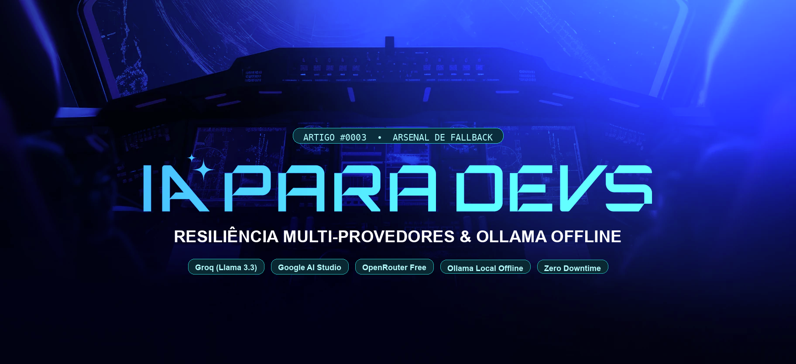

No desenvolvimento moderno de software assistido por agentes, poucas experiências são tão frustrantes quanto ver um fluxo cognitivo de refatoração ser abruptamente interrompido por uma parede de limite de taxa:

```text
HTTP Error 429: Too Many Requests (Rate limit exceeded)
```

Quando você opera o Claude Code em tarefas de engenharia complexas (executando testes, analisando dependências, iterando sobre arquivos e revisando código), o consumo de tokens e a frequência de requisições por minuto atingem picos elevados. Depender de um único provedor ou de uma única cota de API significa aceitar interrupções involuntárias no meio do seu raciocínio.

Neste artigo, apresentamos uma solução arquitetural definitiva: como transformar o **9Router** em uma central de alta disponibilidade para o **Claude Code**, mapeando **9 fontes de modelos de inteligência artificial gratuitas** e integrando 5 delas em **Combos de Fallback Inteligentes** prontos para uso. Quando uma cota atinge o teto temporário, o gateway comuta automaticamente para o próximo provedor da fila, sem que sua sessão no terminal sofra quedas ou perca o contexto de trabalho.

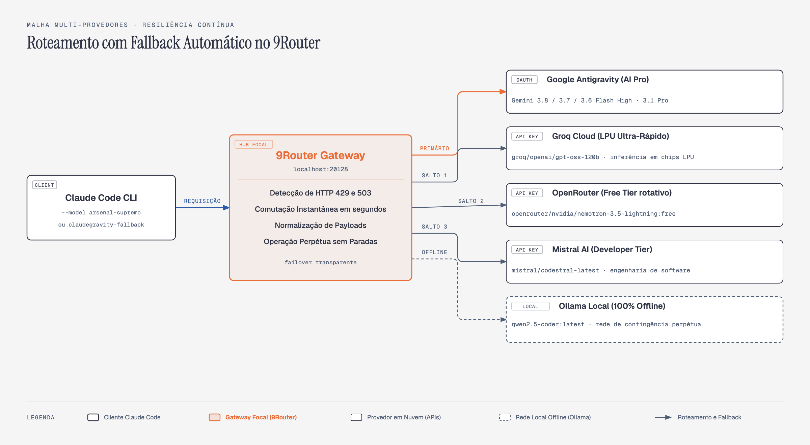

> **Figura 1:** Malha de resiliência multi-provedores com o gateway 9Router orquestrando a comutação transparente entre os grupos de provedores que alimentam o Claude Code CLI.

Este trabalho é a evolução direta da infraestrutura apresentada no [Artigo 0002 - ClaudeGravity e o Roteamento de Modelos Gemini no Claude Code via 9Router](../../0002_claude_gravity_utilizando_9router/article/ARTICLE.md). Se lá consolidamos a ponte de alta fidelidade com o Google Antigravity, aqui expandimos essa base para um ecossistema multi-provedor resiliente que nunca para de programar.

---

## 9Router e OmniRoute na Prática

Com a proliferação de gateways locais para desenvolvedores, duas ferramentas ganharam destaque no ecossistema de código aberto: o **9Router** e o **OmniRoute**. Ambas resolvem o aprisionamento tecnológico em provedores proprietários, atendem aos mesmos contratos de API (Anthropic Messages e OpenAI Chat Completions) e padronizaram a porta local `20128`  -  mas com focos distintos.

O **9Router**, que usamos neste artigo, é um gateway enxuto de *set-and-forget*: container Node.js com SQLite embarcado, cascata de prioridade simples e compressão RTK nativa. O **OmniRoute** é um orquestrador mais abrangente, com matriz dinâmica de roteamento por latência, custo e taxa de sucesso  -  mais indicado para quem quer calibrar pesos do que para quem quer um gateway que simplesmente funcione.

Escolhemos o 9Router pela previsibilidade: menos peças móveis significa menos coisas que podem falhar no meio de uma refatoração.

---

## A Resolução da URL Base no Claude Code

Uma dúvida técnica recorrente gerada por tutoriais de gateways locais envolve a variável `ANTHROPIC_BASE_URL`: devemos declarar `http://localhost:20128` ou `http://localhost:20128/v1`?

A CLI da Anthropic monta o endereço final concatenando `baseUrl + "/v1/messages"`. Declarar a base já com `/v1` produz a rota duplicada `http://localhost:20128/v1/v1/messages` (que o 9Router tolera, ambas respondem HTTP 200), mas que quebra com **HTTP 404** em proxies estritos.

A regra de ouro, portanto, é declarar a base **sem** o sufixo:

```bash
ANTHROPIC_BASE_URL="http://localhost:20128"
```

---

## A Regra Crítica de Nomenclatura de Combos

Ao criar grupos de modelos virtuais no 9Router, há uma regra essencial no código-fonte que você precisa conhecer. No serviço de resolução de modelos (`open-sse/services/combo.js`):

```js
export function getComboModelsFromData(modelStr, combosData) {
  if (modelStr.includes("/")) return null;
  ...
}
```

Essa linha de validação estabelece que:
* Se o nome passado no campo `model` contiver uma barra (`/`), o gateway **rejeita a busca como combo** e assume que se trata de uma chamada a um provedor específico (`provedor/modelo`).
* Portanto, nomear um combo como `combo/arsenal-supremo` fará o gateway tentar autenticar o provedor fictício `combo`, resultando no erro `[AUTH] No credentials for combo`.
* O nome do combo deve ser **estritamente plano**, como `arsenal-supremo`, `arsenal-rapido` ou `arsenal-offline`.

Com essa nomenclatura, o 9Router identifica o grupo de modelos na hora, inicia a tentativa pelo primeiro item e aplica a transição automática em caso de limite.

---

## O Mapeamento das 9 Fontes de IA Gratuitas para Programação

Montar um arsenal que nunca para de programar exige diversificar as origens de tokens. Mapeamos as 9 principais fontes de modelos e tiers gratuitos com alta capacidade para tarefas de código.

> **Escopo desta implementação:** as 9 fontes abaixo compõem o mapa completo do ecossistema gratuito, mas os combos de referência deste artigo (`arsenal-supremo`, `arsenal-rapido` e `arsenal-offline`) e o provisionamento automatizado em `src/setup_combos.py` integram 5 delas: **Antigravity, OpenRouter, Groq, Mistral e Ollama Local**. Kiro, Cerebras, Cloudflare Workers AI e Google AI Studio ficam documentados como fontes adicionais (o AI Studio já entra como conexão opcional via `GEMINI_API_KEY`, e as demais podem ser plugadas na mesma cascata seguindo o padrão mostrado aqui).

### 1. Google Antigravity (Google AI Pro)
* **Modelos:** `ag/gemini-3.8-flash-high`, `ag/gemini-3.7-flash-high`, `ag/claude-sonnet-4-6`.
* **Vantagem:** Janela de contexto de até 1 milhão de tokens, raciocínio profundo de última geração e cota já incluída na assinatura do AI Pro sem cobrança por token adicional.

### 2. Kiro AWS Builder
* **Modelos:** Claude 3.5/3.7 Sonnet e GLM via tokens de desenvolvedor AWS.
* **Vantagem:** Créditos mensais generosos voltados a builders, com infraestrutura de baixíssima latência na nuvem da AWS.

### 3. Google AI Studio (Gemini Free Tier)
* **Modelos no catálogo do gateway:** `gemini/gemini-3.8-flash`, `gemini/gemini-3.7-flash`, `gemini/gemini-3.6-flash`, `gemini/gemini-3.5-flash-lite`, `gemini/gemini-3.1-pro-preview`.
* **Vantagem:** Chave de API direta e gratuita, sem necessidade de cartão de crédito. Os limites do tier gratuito (requisições e tokens por minuto) variam por modelo e são revisados periodicamente pelo Google  -  consulte a [tabela oficial de rate limits](https://ai.google.dev/gemini-api/docs/rate-limits) antes de dimensionar sua cascata.

### 4. Groq Cloud
* **Modelo validado neste artigo:** `groq/openai/gpt-oss-120b`.
* **Vantagem:** Inferência acelerada por chips LPU (Language Processing Units), com as menores latências que medimos entre os provedores em nuvem  -  **0,34s a 0,55s** por resposta curta nos nossos testes. Excelente para testes unitários, linting e geração rápida de código.
* **Atenção ao catálogo:** os identificadores da Groq mudam com frequência. Confira o [catálogo vigente](https://console.groq.com/docs/models) e valide a cascata com `python3 src/test_arsenal.py` antes de confiar nela.

### 5. Cerebras Cloud
* **Modelos:** família Llama servida na infraestrutura Cerebras.
* **Vantagem:** Arquitetura Wafer-Scale Engine, orientada a latência de primeiro token (TTFT) muito baixa. Não integramos o Cerebras aos combos de referência, portanto não temos medição própria para comparar  -  trate os números divulgados pelo fornecedor como material de marketing até validar no seu ambiente.

### 6. OpenRouter Free Tier
* **Modelo validado neste artigo:** `openrouter/nvidia/nemotron-3.5-lightning:free` (contexto de 1M de tokens).
* **Vantagem:** Catálogo agregador que expõe versões gratuitas com sufixo `:free`. Na consulta que fizemos ao montar este artigo, 21 dos 430 modelos do catálogo tinham custo zero de prompt e de resposta.
* **Atenção à rotatividade:** o conjunto gratuito muda com frequência, e alguns identificadores citados em tutoriais antigos simplesmente deixam de existir. Tratamos esse ponto em detalhe, com a lista do que está respondendo, na seção [Modelos Gratuitos: Volatilidade e Catálogo Verificado](#modelos-gratuitos-volatilidade-e-catálogo-verificado).

### 7. Cloudflare Workers AI
* **Modelos:** catálogo de modelos abertos servidos na edge (`@cf/meta/...`).
* **Vantagem:** Execução em edge computing com cota diária gratuita medida em "neurônios". Não integramos o Workers AI aos combos deste artigo; consulte os [limites vigentes](https://developers.cloudflare.com/workers-ai/platform/pricing/) antes de posicioná-lo na cascata.

### 8. Mistral AI Developer Free Tier
* **Modelo integrado à cascata:** `mistral/codestral-latest`, o modelo de código do provedor ([documentação oficial](https://docs.mistral.ai/capabilities/code_generation/)).
* **Vantagem:** foi o provedor em nuvem **mais rápido de toda a nossa validação**. Medimos dez modelos da conta, e todos responderam entre **0,35s e 1,23s** por resposta curta  -  a tabela completa está na seção [O Catálogo da Mistral](#o-catálogo-da-mistral-e-o-que-a-api-não-mostra).
* **Atenção ao tier gratuito:** responder rápido não significa responder sempre. O tier de desenvolvedor tem limites de uso próprios, que não medimos; trate a Mistral como mais um nível da cascata, não como fonte ilimitada.

### 9. Ollama Local (A Rede de Segurança Definitiva)
* **Modelo validado neste artigo:** `openai-compatible-chat-ollama-local/qwen2.5-coder:latest`.
* **Sobre o prefixo:** o identificador não é `ollama/...` porque conectamos o Ollama pelo nó **OpenAI-compatible** do 9Router (`/v1/chat/completions`), e não pela rota proprietária `/api/chat`. Essa escolha garante streaming SSE nativo, como detalhamos na seção de Docker Compose.
* **Vantagem:** Execução 100% no hardware da sua máquina. Zero dependência de internet, zero risco de rate limit, privacidade absoluta para código confidencial e tokens verdadeiramente infinitos.

---

## Modelos Gratuitos, Volatilidade e Catálogo Verificado

> ⚠️ **Catálogos gratuitos mudam sem aviso.** Modelos com sufixo `:free` são cortesia do provedor, não um contrato. Qualquer lista de modelos gratuitos publicada em um artigo é um retrato do momento em que foi escrita  -  inclusive esta.
>
> Testando o catálogo gratuito pelo próprio gateway, três modos de falha aparecem com frequência:
>
> | Situação | Resposta do provedor | O que fazer |
> | :--- | :--- | :--- |
> | **Descontinuado ou migrado para a versão paga** | `404` | Substituir o identificador na cascata |
> | **Saturado no momento** | `429` | Nada  -  o gateway salta e tenta de novo depois |
> | **Requer permissão adicional na conta** | `403` | Habilitar o modelo no painel do provedor |
>
> **É exatamente por isso que a arquitetura aqui é uma cascata, e não um modelo único.** Quando um nível gratuito morre, o gateway salta para o próximo sem interromper sua sessão. Revalide periodicamente com `python3 src/test_arsenal.py`, que testa cada nível individualmente e acusa qualquer identificador quebrado.

### Modelos Gratuitos que Respondem

Até a data de escrita deste artigo, os modelos gratuitos abaixo estavam respondendo corretamente e servem para tarefas de código (use sempre com o prefixo `openrouter/`):

| Identificador | Contexto | Observação |
| :--- | ---: | :--- |
| `cohere/north-mini-code:free` | 256k | **Especializado em código** |
| `nvidia/nemotron-3.5-lightning:free` | 1M | **Melhor relação contexto/velocidade** |
| `nex-agi/nex-n2.5-mini:free` | 262k | O mais rápido entre os gratuitos |
| `nex-agi/nex-n2.5-pro:free` | 262k | Versão maior do anterior |
| `nvidia/nemotron-3-super-120b-a12b:free` | 262k | 120B parâmetros |
| `dots-studio/dots-3-note-preview:free` | 512k | Contexto amplo |
| `poolside/laguna-xs-2.1:free` | 262k |  -  |
| `inclusionai/ling-3.0-flash-fin:free` | 262k | Ajustado para domínio financeiro |
| `inclusionai/ling-3.0-flash-sante:free` | 262k | Ajustado para domínio de saúde |
| `nvidia/nemotron-3-ultra-550b-a55b:free` | 1M | 550B, mais lento para uso interativo |

Atenção a dois gratuitos que respondem, mas **não servem para programação**: `google/lyria-3-clip-preview` gera música (devolve marcações de tempo como `[4.0:8.0]` para um prompt de texto) e `nvidia/nemotron-3.5-content-safety:free` faz classificação de moderação.

Para listar os gratuitos vigentes no momento em que você ler isto, consulte o catálogo direto:

```bash
curl -s -H "Authorization: Bearer $OPENROUTER_API_KEY" https://openrouter.ai/api/v1/models \
  | python3 -c "import json,sys; [print(m['id']) for m in json.load(sys.stdin)['data'] if float(m['pricing']['prompt'])==0]"
```

### A cascata protegendo contra um nível quebrado

Para comprovar que a arquitetura absorve esse tipo de falha, montamos um combo de teste e colocamos deliberadamente um identificador inexistente no topo. O log do gateway registra o salto automático:

```text
[COMBO] Trying model 1/4: openrouter/exemplo/modelo-indisponivel:free
✗ ERROR 400 · "exemplo/modelo-indisponivel:free is not a valid model ID"
[COMBO] Model openrouter/exemplo/modelo-indisponivel:free failed, trying next {"status":503}
[COMBO] Trying model 2/4: groq/openai/gpt-oss-120b
[COMBO] Model groq/openai/gpt-oss-120b succeeded
```

A requisição foi respondida em **0,72s**, e o usuário do terminal não percebe nada além de uma resposta normal. O nível quebrado simplesmente deixa de ser usado  -  seja porque o identificador está errado, seja porque o modelo saiu do catálogo.

### Operando 100% gratuito

Os modelos gratuitos não são apenas rede de segurança: eles sustentam uma sessão inteira. Executamos a CLI oficial do Claude Code apontada diretamente para dois deles, sem nenhum modelo pago na rota:

```bash
claude -p "Responda apenas com o texto: ARSENAL_LIVRE_OK" \
  --model openrouter/cohere/north-mini-code:free --dangerously-skip-permissions
# ARSENAL_LIVRE_OK   (exit 0)

claude -p "Responda apenas com o texto: ARSENAL_LIVRE_OK" \
  --model openrouter/nvidia/nemotron-3.5-lightning:free --dangerously-skip-permissions
# ARSENAL_LIVRE_OK   (exit 0)
```

Se você não tem assinatura do Google AI Pro, monte sua cascata só com os identificadores da tabela acima mais o Ollama local  -  o custo de inferência é zero de ponta a ponta.

---

## O Catálogo da Mistral e o que a API Não Mostra

A Mistral entrou na cascata como o provedor em nuvem mais rápido que medimos. Testamos dez modelos da conta pelo próprio gateway, e **todos responderam**:

| Identificador | Latência medida | Perfil |
| :--- | ---: | :--- |
| `mistral/ministral-3b-latest` | 0,35s | O mais rápido entre os provedores em nuvem |
| `mistral/magistral-small-latest` | 0,38s | Raciocínio, porte pequeno |
| `mistral/ministral-8b-latest` | 0,39s | Pequeno e equilibrado |
| `mistral/mistral-vibe-cli-latest` | 0,43s | Voltado a uso em linha de comando |
| `mistral/magistral-medium-latest` | 0,45s | Raciocínio, porte médio |
| `mistral/codestral-latest` | 0,50s | **Código  -  é o que usamos na cascata** |
| `mistral/mistral-small-latest` | 0,52s | Uso geral |
| `mistral/mistral-large-latest` | 0,60s | Topo de linha |
| `mistral/mistral-medium-latest` | 0,66s | Uso geral |
| `mistral/mistral-code-latest` | 1,23s | Código, mais lento que o Codestral |

> **Latência não é cota.** Esses números medem o tempo de uma resposta curta, nada além disso. O tier gratuito de desenvolvedor da Mistral tem limites de uso próprios, que **não medimos**  -  um modelo rápido continua sujeito a `429` como qualquer outro. É por isso que ele entra como um nível da cascata, e não como fonte principal.

**Um detalhe que pode confundir:** o catálogo do gateway (`/v1/models`) lista apenas três modelos da Mistral  -  `codestral-latest`, `mistral-large-latest` e `mistral-medium-latest`  -  enquanto a API da Mistral expõe dezenas. Os demais **funcionam normalmente** mesmo sem aparecer na listagem: basta usar o identificador completo com o prefixo `mistral/`. Não se limite ao que o `/v1/models` mostra; se um modelo existe na sua conta, ele responde.

---

## Guia Prático para Obter as Chaves de API Gratuitas

Para que qualquer desenvolvedor possa reproduzir esta infraestrutura completa no seu computador, documentamos o procedimento passo a passo para obter as credenciais das cinco fontes gratuitas centrais do nosso arsenal.

### 1. Obtendo a Chave Gratuita no OpenRouter

O OpenRouter reúne centenas de modelos e mantém um subconjunto gratuito identificado pelo sufixo `:free`  -  na consulta que fizemos, 21 dos 430 modelos do catálogo tinham custo zero, entre eles o `nvidia/nemotron-3.5-lightning:free` que usamos na cascata.

1. Acesse o portal em [OpenRouter Keys](https://openrouter.ai/settings/keys).
2. Autentique-se com sua conta Google ou GitHub.
3. No painel de chaves, clique em **Create Key**.
4. Defina um nome identificador, como `claudegravity`.
5. No campo **Credit Limit (USD)**, configure o valor como `0.00`. Isso funciona como trava financeira: com limite zerado a chave não consegue consumir crédito, então só os modelos de custo zero respondem. O limite **não** garante que um modelo `:free` específico continue existindo  -  o catálogo gratuito é rotativo, e é por isso que validamos cada nível da cascata com `src/test_arsenal.py`.

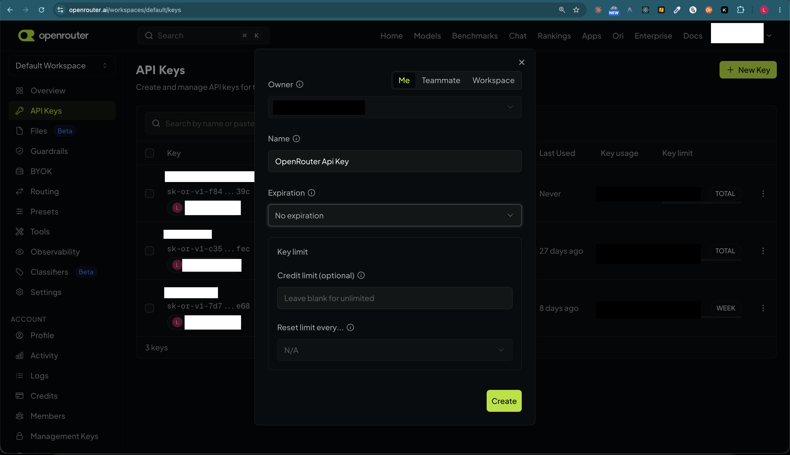

> **Figura 2:** Configuração da chave de API no OpenRouter com limite financeiro zerado ($0.00) para consumo exclusivo do catálogo gratuito.

6. Copie a chave gerada com o prefixo `sk-or-v1-`.

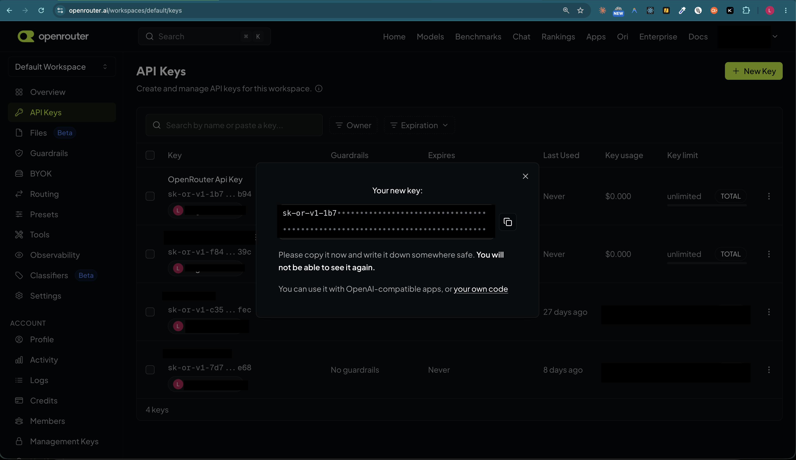

> **Figura 3:** Chave de API criada com sucesso no OpenRouter, pronta para conexão no 9Router.

### 2. Obtendo a Chave de Alta Velocidade no Groq Cloud

A Groq oferece inferência acelerada por chips LPU (Language Processing Units), e entregou **0,34s a 0,55s** por resposta curta com o `openai/gpt-oss-120b` no tier gratuito de desenvolvedor. Ficou logo atrás da Mistral na nossa medição, com diferença de centésimos.

1. Acesse o console da Groq em [Groq Console Keys](https://console.groq.com/keys).
2. Conecte-se com sua conta Google ou GitHub (sem necessidade de cartão de crédito).
3. Na seção **API Keys**, clique no botão **Create API Key**.
4. Atribua o nome identificador `9router-groq-lpu` e confirme.

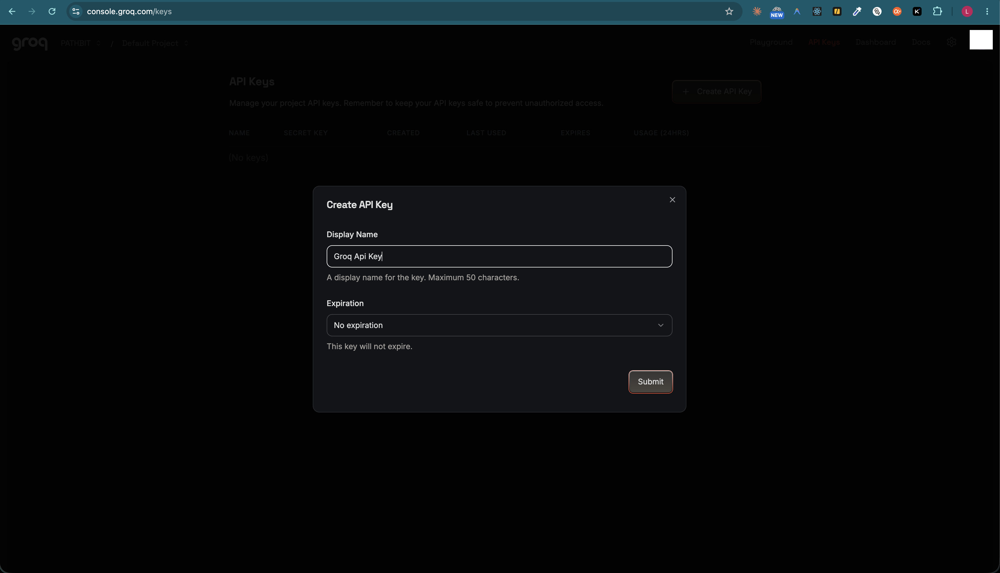

> **Figura 4:** Modal de criação de chave de API no console Groq Cloud.

5. Copie a chave exibida com o prefixo `gsk_` e guarde-a para a configuração do 9Router.

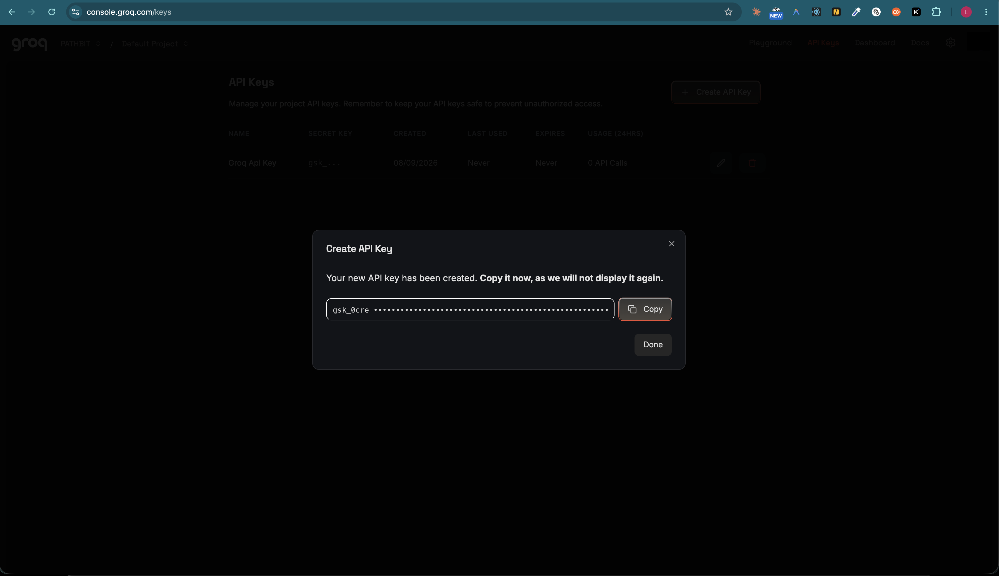

> **Figura 5:** Chave de API da Groq Cloud revelada e copiada com sucesso.

### 3. Obtendo a Chave Direta do Gemini no Google AI Studio

O Google AI Studio fornece chaves de API diretas para a família Gemini, com cotas gratuitas que variam por modelo e são revisadas periodicamente  -  consulte os [limites vigentes](https://ai.google.dev/gemini-api/docs/rate-limits) antes de dimensionar seu uso.

1. Acesse a página de credenciais em [Google AI Studio](https://aistudio.google.com/apikey).
2. Clique no botão **Get API key** (ou **Create API key in new project**).
3. Selecione ou crie um projeto associado à sua conta Google (por exemplo, `meu-projeto-ia-001`).

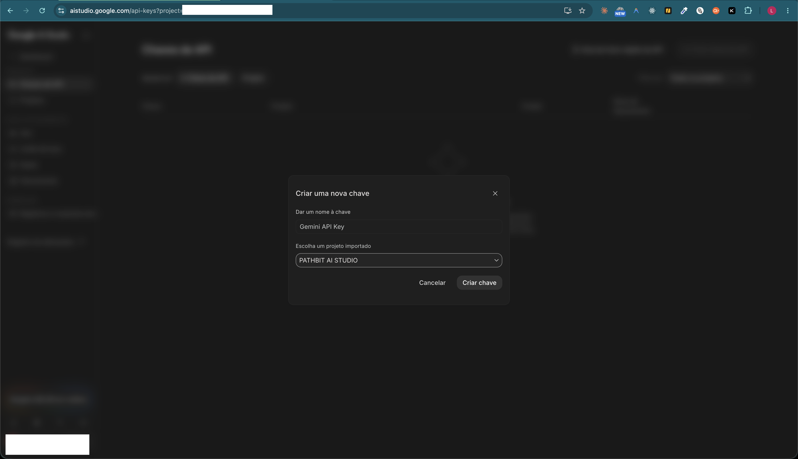

> **Figura 6:** Seleção do projeto Google Cloud no painel do Google AI Studio para geração de chave.

4. Copie a chave gerada (com formato `AQ.` ou `AIzaSy`).

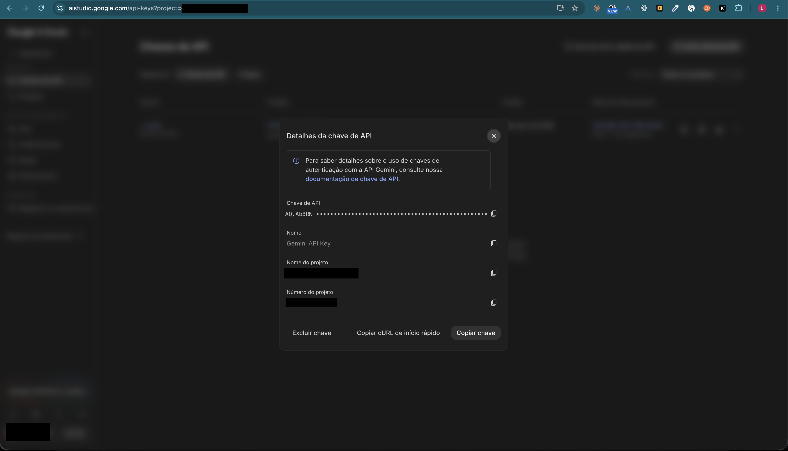

> **Figura 7:** Chave de API gratuita do Gemini no Google AI Studio exibindo a chave real gerada para o projeto.

### 4. Configurando o Ollama Local como Último Nível da Cascata

O Ollama é o componente local do arsenal. Ele roda no hardware da sua máquina ou via container Docker e cumpre um papel específico: garantir que a cascata **sempre devolva uma resposta**, mesmo com todos os provedores em nuvem indisponíveis. O gateway responde em vez de estourar erro, e a sessão não cai.

> **O que o nível local faz e o que não faz.** Testamos o harness do Claude Code contra quatro tamanhos do `qwen2.5-coder`, apontando a tag `latest` para cada um:
>
> | Modelo local | Responde ao gateway | Opera o Claude Code |
> | :--- | :--- | :--- |
> | `qwen2.5-coder:0.5b` | Sim | Não seguiu a instrução |
> | `qwen2.5-coder:1.5b` | Sim | Não seguiu a instrução |
> | `qwen2.5-coder:3b` | Sim | Não seguiu a instrução |
> | `qwen2.5-coder:7b` | Sim | Não seguiu a instrução |
>
> Todos respondem normalmente pela API (`/v1/messages`): o combo `arsenal-offline` devolve `PONG` em 0,04s. Mas o Claude Code envia um *system prompt* extenso com definições de ferramentas e exige obediência estrita a instruções mais *tool calling*, e nenhum desses modelos deu conta disso. Eles respondem qualquer coisa, não o que foi pedido.
>
> **Na prática:** o `arsenal-offline` serve para continuidade e para testar disponibilidade, não para conduzir uma sessão real de trabalho. Programar de fato sem internet exige modelo e hardware consideravelmente maiores, o que foge do escopo de uma contingência de 397 MB.

1. O Ollama já está declarado no `docker-compose.yml` deste módulo (seção "Execução Rápida do Gateway com Docker Compose"), então `docker compose up -d` sobe gateway e Ollama juntos. Use o comando avulso abaixo **apenas** se optar por não usar o Compose. Os dois caminhos são excludentes: disputam o mesmo nome de container e gravam em volumes distintos, porque o Compose prefixa o volume com o nome do projeto (`claudegravity_ollama_data`) enquanto o `docker run` cria um `ollama_data` sem prefixo.
   ```bash
   docker run -d --name claudegravity-ollama \
     -p 127.0.0.1:11434:11434 \
     -v ollama_data:/root/.ollama \
     ollama/ollama:latest
   ```
   A porta é publicada em `127.0.0.1` de propósito, igual ao Compose: um Ollama exposto em todas as interfaces aceita inferência de qualquer máquina da rede local, sem autenticação.
2. No seu terminal, baixe o modelo especialista em código e configure a tag padrão:
   ```bash
   docker exec -it claudegravity-ollama ollama pull qwen2.5-coder:0.5b
   docker exec claudegravity-ollama ollama cp qwen2.5-coder:0.5b qwen2.5-coder:latest
   ```
3. Valide que o serviço local está ativo e respondendo na porta `11434`:
   ```bash
   curl -s http://localhost:11434/api/tags
   ```

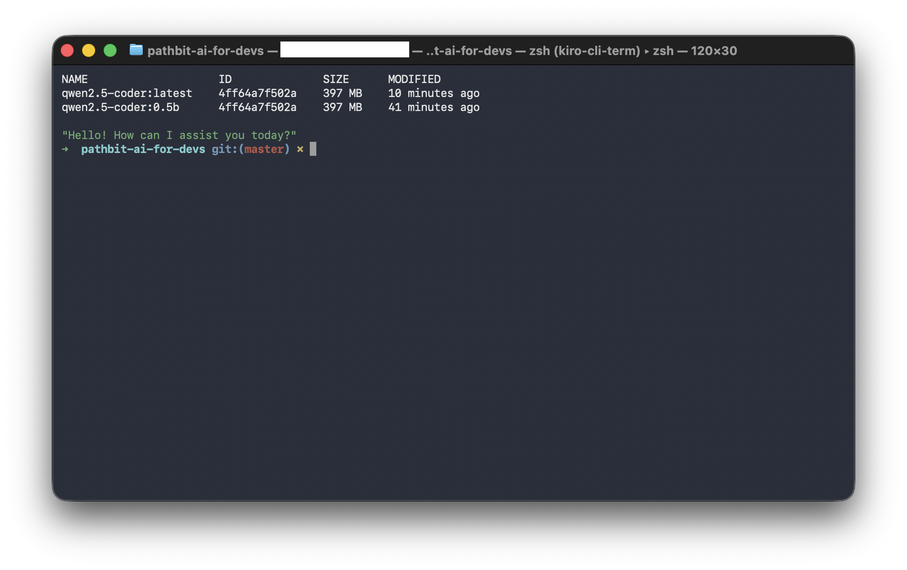

> **Figura 8:** Terminal demonstrando a execução do container Docker do Ollama, download e ativação do modelo Qwen 2.5 Coder.

Caso opte por utilizar também o endpoint cloud do Ollama no 9Router, obtenha sua chave de autenticação no portal [Ollama Keys](https://ollama.com/settings/keys):

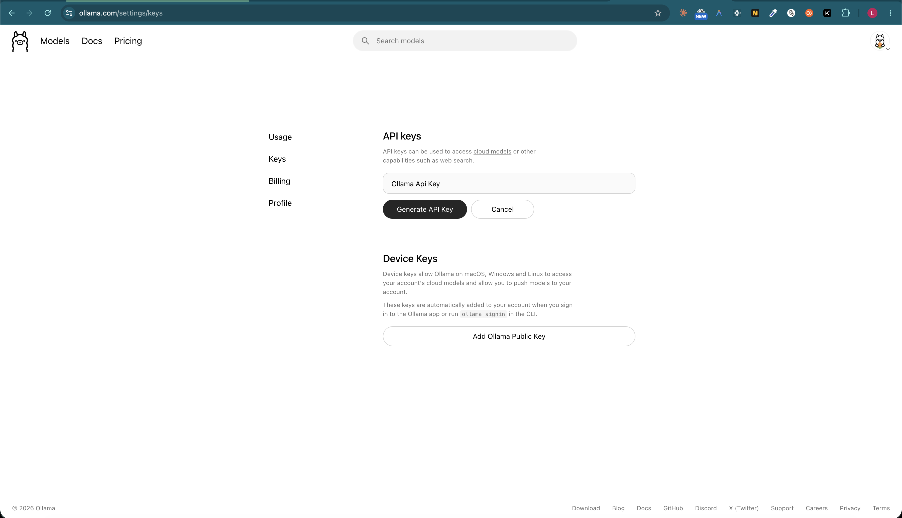

> **Figura 9:** Painel de gerenciamento de chaves de API no portal do Ollama.

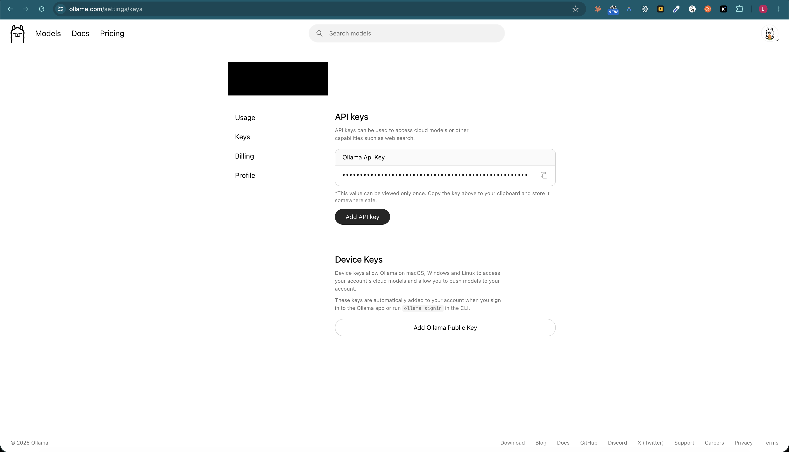

> **Figura 10:** Chave de API gerada no portal do Ollama para autenticação remota.

### 5. Obtendo a Chave da Mistral

A Mistral entra na cascata pelo `codestral-latest`, o modelo de código do provedor  -  e foi o provedor em nuvem mais rápido que medimos.

1. Acesse o console da Mistral em [console.mistral.ai](https://console.mistral.ai/) e autentique-se.
2. Na seção de chaves de API, crie uma nova chave e dê a ela um nome identificador.
3. Copie o valor gerado  -  como nos demais provedores, ele só é exibido no momento da criação.
4. Registre a chave no `.env` do módulo:
   ```bash
   MISTRAL_API_KEY=sua_chave_aqui
   ```

O `src/setup_combos.py` lê essa variável automaticamente. Se ela não existir, o script informa que o provedor foi pulado e segue provisionando os demais  -  a cascata continua funcionando, apenas sem o nível da Mistral.

---

## Configuração Visual dos Provedores e Combos no 9Router

Com as credenciais prontas, a integração no 9Router é simples e pode ser feita pelo painel gráfico (`http://localhost:20128`).

### 1. Conectando os Provedores no Painel do 9Router

No menu lateral do 9Router, clique em **Providers** (`http://localhost:20128/dashboard/providers`):

* **OpenRouter:** Clique no card do OpenRouter, visualize a cota gratuita destacada e clique em **+ Add Connection**. No modal, informe o nome e cole a chave `sk-or-v1-...`.

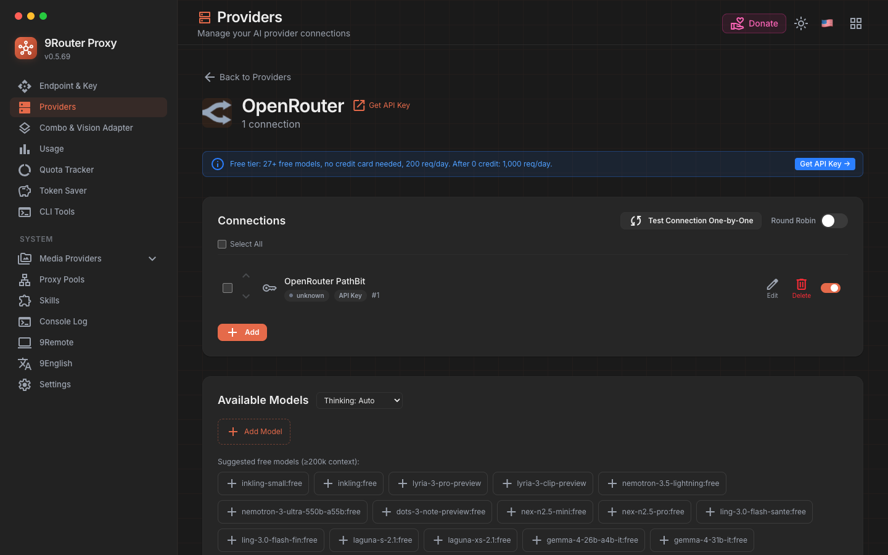

> **Figura 11:** Tela de gerenciamento do provedor OpenRouter no 9Router com destaque para a cota gratuita.

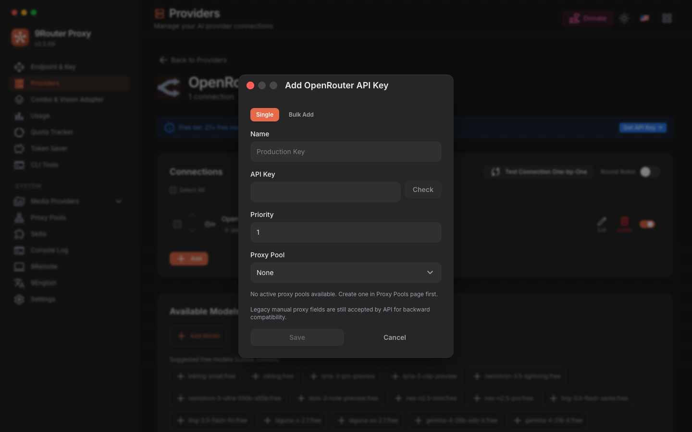

> **Figura 12:** Modal do 9Router para cadastro seguro da chave de API do provedor OpenRouter.

* **Groq Cloud:** Selecione o card da **Groq**, clique em **+ Add Connection**, insira a chave `gsk_...` e confirme. O modelo `groq/openai/gpt-oss-120b` ficará imediatamente ativo.

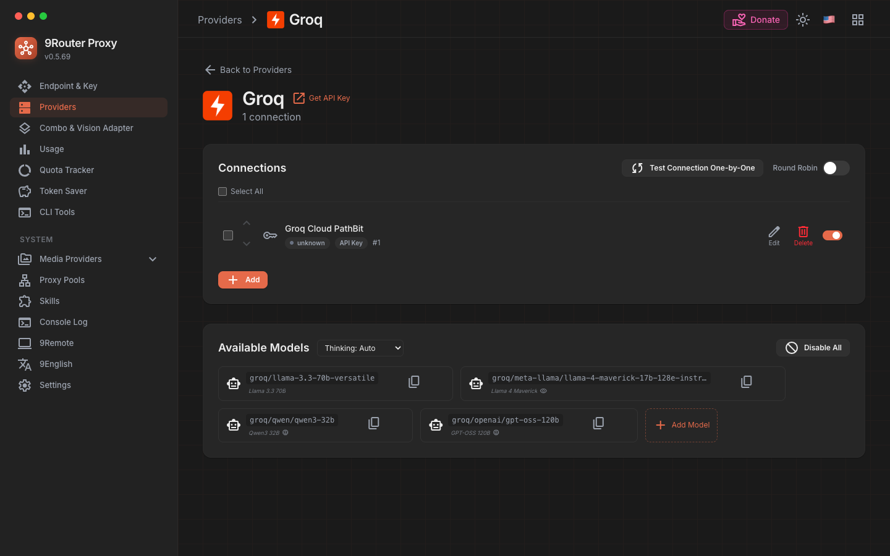

> **Figura 13:** Painel do provedor Groq no 9Router pronto para conexão.

* **Ollama Local:** Acesse o card do **Ollama** para verificar os modelos locais disponíveis e a conexão com a porta local `11434`.

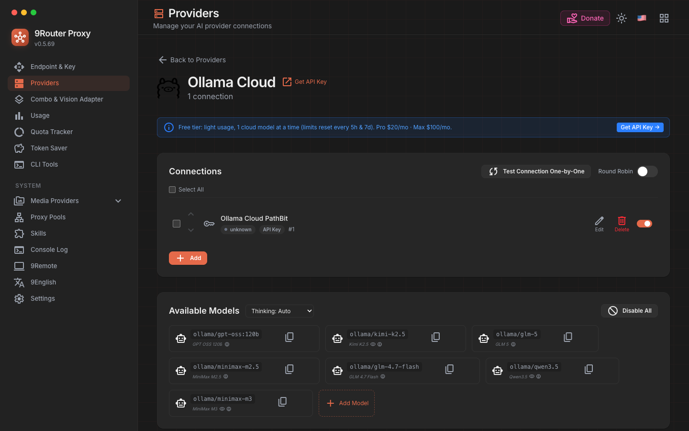

> **Figura 14:** Painel de gestão do provedor local Ollama no 9Router.

* **Mistral:** Localize o card da **Mistral**, clique em **+ Add Connection** e cole a chave do console. O `mistral/codestral-latest` fica disponível em seguida.

---

### 2. Criando o Combo de Fallback no 9Router

O mecanismo central de alta disponibilidade é o **Combo com estratégia Fallback**:

1. No menu lateral, acesse **Combo & Vision Adapter** (`http://localhost:20128/dashboard/combos`).
2. Clique no botão superior **+ Create Combo**.

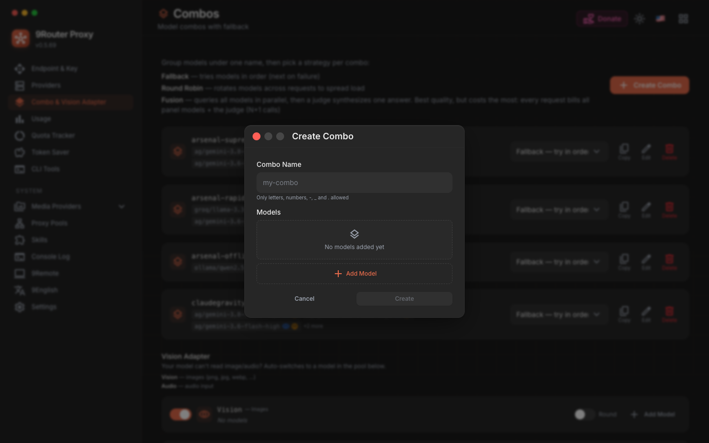

> **Figura 15:** Modal inicial para criação de novo combo virtual no 9Router.

3. Preencha os campos obrigatórios:
   * **Combo Name:** Defina o nome como `arsenal-supremo` (sem barras).
   * **Strategy:** Selecione **Fallback (tries models in order: next on failure)**.
   * **Adicionar Modelos:** Clique em **+ Add Model** e insira os modelos na ordem hierárquica da cascata.

4. Estrutura ordenada da cascata de resiliência:
   * **Nível 1:** `ag/gemini-3.8-flash-high` (Modelo primário de alto raciocínio via Antigravity)
   * **Nível 2:** `ag/gemini-3.7-flash-high` (Modelo secundário veloz)
   * **Nível 3:** `ag/gemini-3.6-flash-high` (Modelo de apoio)
   * **Nível 4:** `openrouter/cohere/north-mini-code:free` (Fallback gratuito especializado em código no OpenRouter)
   * **Nível 5:** `groq/openai/gpt-oss-120b` (Fallback de baixa latência em LPU)
   * **Nível 6:** `mistral/codestral-latest` (Fallback especializado em código)
   * **Nível 7:** `openai-compatible-chat-ollama-local/qwen2.5-coder:latest` (Continuidade local: garante resposta, não conduz a sessão)

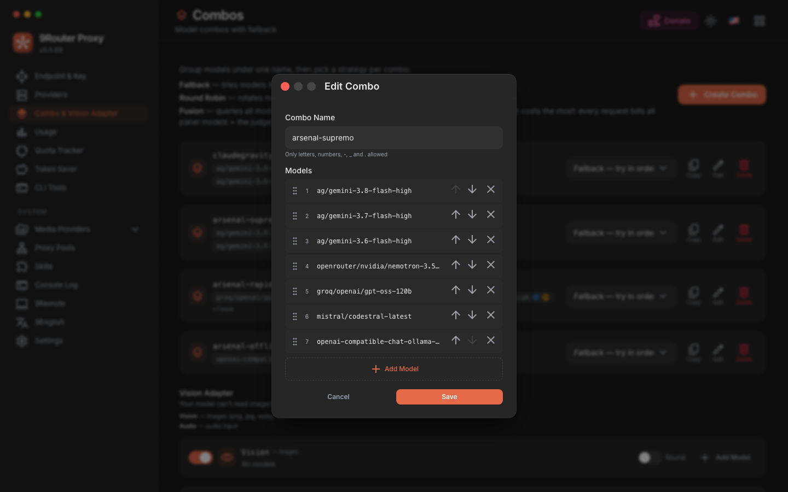

> **Figura 16:** Painel de edição do combo `arsenal-supremo` exibindo a ordem dos modelos na cascata de transição automática.

5. Clique em **Save**. O combo ficará ativo imediatamente no dashboard.

---

## Arquitetura dos Combos de Fallback

No 9Router, agrupamos os provedores em três perfis complementares, além do `claudegravity-fallback` herdado do Artigo 0002 de trabalho:

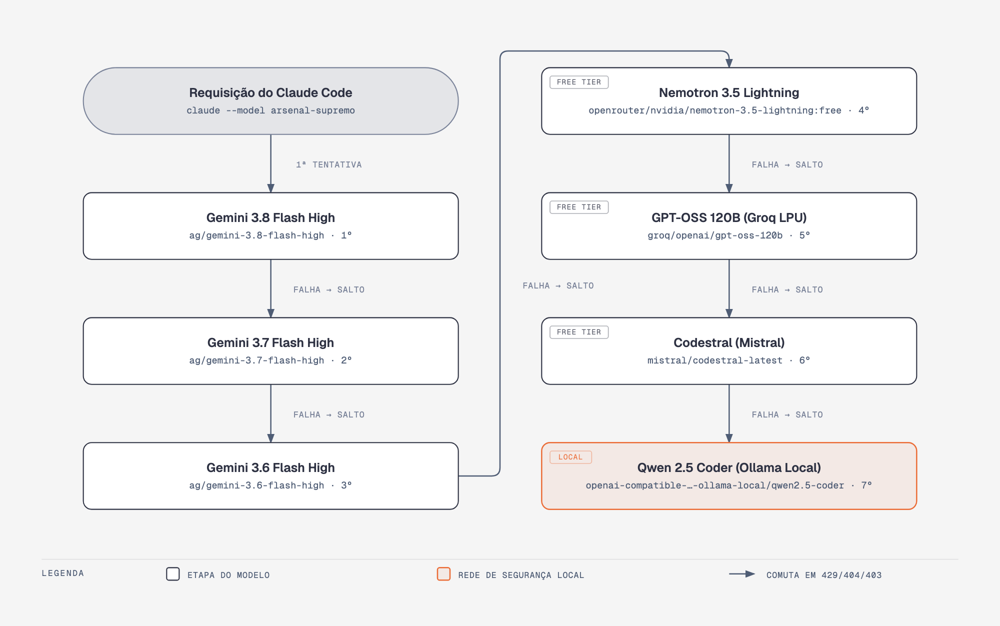

> **Figura 17:** Sequência de execução e comutação automática em cascata do combo `arsenal-supremo`, exatamente na ordem provisionada por `src/setup_combos.py`: Gemini 3.8 Flash High -> Gemini 3.7 Flash High -> Gemini 3.6 Flash High -> Cohere North Mini Code (OpenRouter) -> GPT-OSS 120B (Groq LPU) -> Codestral (Mistral) -> Ollama Local.


### Combo 1 - `arsenal-supremo` (Resiliência Máxima)

A cadeia principal para trabalho pesado diário, com os sete níveis listados acima. As latências abaixo foram medidas por `src/test_arsenal.py` contra cada nível isoladamente, em um ambiente recriado do zero:

| Nível | Modelo | Papel | Latência medida |
| :---: | :--- | :--- | ---: |
| 1 | `ag/gemini-3.8-flash-high` | Máxima capacidade analítica | 1,44s |
| 2 | `ag/gemini-3.7-flash-high` | Raciocínio balanceado | 1,05s |
| 3 | `ag/gemini-3.6-flash-high` | Baixa latência | 0,77s |
| 4 | `openrouter/cohere/north-mini-code:free` | Fallback gratuito especialista em código | 0,91s |
| 5 | `groq/openai/gpt-oss-120b` | Velocidade bruta em LPU | 0,47s |
| 6 | `mistral/codestral-latest` | Especialista em código | 0,55s |
| 7 | `openai-compatible-chat-ollama-local/qwen2.5-coder:latest` | Continuidade local | 0,08s |

Repare que os níveis não estão em ordem de velocidade, e isso é proposital: a cascata é ordenada por **capacidade**, não por latência. O Cohere North Mini Code no nível 4 entrega especialização de sintaxe e código sem custo; os mais rápidos em nuvem ficam abaixo porque servem melhor como rede de contenção rápida do que como motor principal.

### Combo 2 - `arsenal-rapido` (Iteração e Testes Ágeis)
Projetado para ciclos curtos de teste e revisão de sintaxe, priorizando baixa latência **sem abrir mão de capacidade**:
1. `groq/openai/gpt-oss-120b`
2. `mistral/codestral-latest`
3. `ag/gemini-3.7-flash-high`
4. `ag/gemini-3.6-flash-high`

> **Por que não colocar o modelo mais rápido no topo?** O `mistral/ministral-3b-latest` foi o mais veloz que medimos (0,35s contra 0,44s do GPT-OSS 120B), mas 0,09s são imperceptíveis em um ciclo agêntico  -  o tempo real é dominado pela geração da resposta, não pelo primeiro byte. Um modelo de 3B no topo de um combo que alimenta o Claude Code troca uma diferença invisível por uma perda enorme de capacidade de raciocínio e de chamada de ferramentas. Velocidade só vale quando o resultado presta.

### Combo 3 - `arsenal-offline` (Continuidade Local)
Para manter o gateway respondendo em conexões instáveis ou ambientes sem tráfego externo:
1. `openai-compatible-chat-ollama-local/qwen2.5-coder:latest`

Use-o para continuidade e verificação de disponibilidade. Como mostramos na seção do Ollama, um modelo local pequeno responde à requisição mas não conduz uma sessão de trabalho do Claude Code.

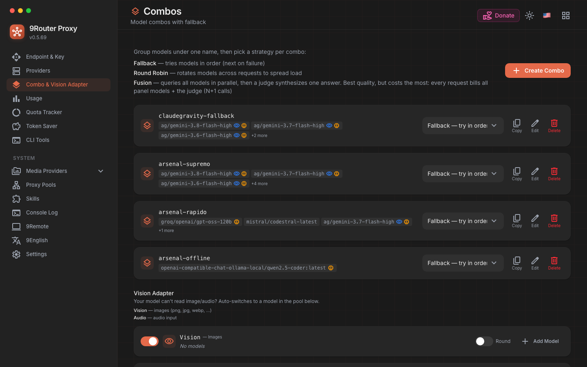

> **Figura 18:** Gestão de combos cadastrados (claudegravity-fallback, arsenal-supremo, arsenal-rapido e arsenal-offline) no painel web do 9Router em `http://localhost:20128/dashboard/combos`.

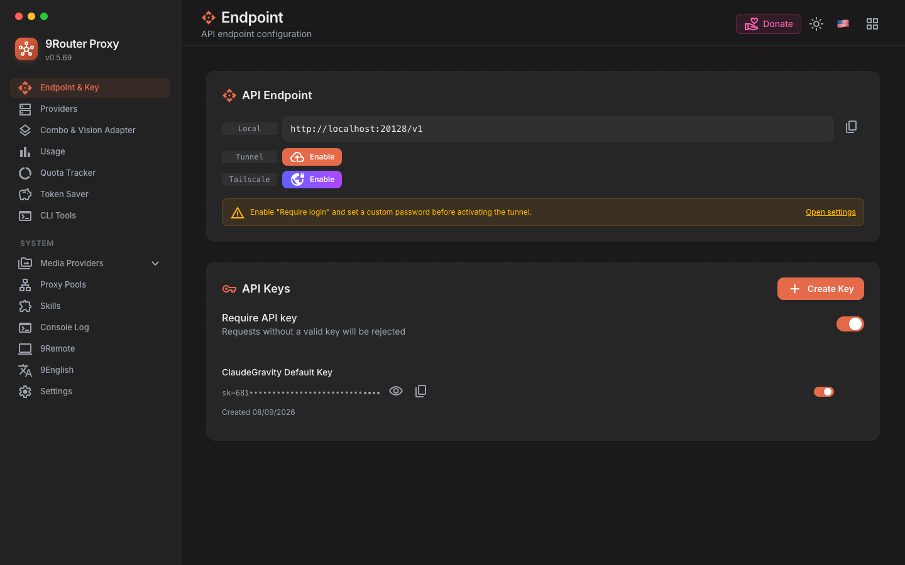

> **Figura 19:** Painel de chaves de API e porta local do 9Router em `http://localhost:20128/dashboard`.

---

## Execução Rápida do Gateway com Docker Compose

O módulo inclui um manifesto unificado pronto para provisionamento do gateway e da instância local de LLM:

```yaml
name: claudegravity

services:
  9router:
    image: decolua/9router:latest
    container_name: claudegravity-router
    restart: unless-stopped
    ports:
      # Apenas localhost: o gateway carrega credenciais reais dos provedores.
      - "127.0.0.1:20128:20128"
    environment:
      - DATA_DIR=/app/data
      - PORT=20128
      - HOSTNAME=0.0.0.0
      - NEXT_PUBLIC_BASE_URL=http://localhost:20128
      - NODE_ENV=production
      - INITIAL_PASSWORD=${INITIAL_PASSWORD:?defina INITIAL_PASSWORD no .env}
      - JWT_SECRET=${JWT_SECRET:?defina JWT_SECRET no .env}
      - REQUIRE_API_KEY=${REQUIRE_API_KEY:-false}
      - REQUIRE_LOGIN=${REQUIRE_LOGIN:-false}
    volumes:
      - 9router_data:/app/data
    extra_hosts:
      - "host.docker.internal:host-gateway"
    depends_on:
      ollama:
        condition: service_healthy
    healthcheck:
      test: ["CMD-SHELL", "node -e \"require('http').get('http://127.0.0.1:20128/dashboard',r=>process.exit(r.statusCode<500?0:1)).on('error',()=>process.exit(1))\""]
      interval: 15s
      timeout: 5s
      retries: 5
      start_period: 20s

  ollama:
    image: ollama/ollama:latest
    container_name: claudegravity-ollama
    restart: unless-stopped
    ports:
      # Apenas localhost, pelo mesmo motivo do gateway.
      - "127.0.0.1:11434:11434"
    volumes:
      - ollama_data:/root/.ollama
    healthcheck:
      test: ["CMD-SHELL", "ollama list >/dev/null 2>&1 || exit 1"]
      interval: 15s
      timeout: 5s
      retries: 5
      start_period: 10s

  token-sync:
    image: python:3.11-alpine
    container_name: claudegravity-token-sync
    restart: unless-stopped
    volumes:
      - 9router_data:/app/data
      - ${HOME}/.gemini:/root/.gemini:ro
      - ./src:/app/src:ro
      - ./.env:/app/.env:ro
    environment:
      - PYTHONUNBUFFERED=1
      - DB_PATH=/app/data/db/data.sqlite
      - SYNC_INTERVAL=300
      - REFRESH_MARGIN=900
      - MODULE=0003
    command: ["python3", "/app/src/token_daemon.py"]
    depends_on:
      9router:
        condition: service_healthy

volumes:
  9router_data:
  ollama_data:
```

Quatro detalhes de arquitetura essenciais foram incorporados neste manifesto:
1. **Compatibilidade Multiplataforma (`extra_hosts`):** A diretiva `host.docker.internal:host-gateway` garante que sistemas Linux mapeiem corretamente o gateway de rede para o host, assegurando paridade idêntica entre Linux, macOS e Windows WSL2.
2. **Streaming Nativo SSE com Ollama Local:** O 9Router consome a API compatível da OpenAI exposta pelo Ollama em `http://host.docker.internal:11434/v1` via nós `openai-compatible-*`. Ao contrário da rota proprietária `/api/chat` (que emite `application/x-ndjson`), a rota `/v1/chat/completions` entrega Server-Sent Events (`text/event-stream`), garantindo streaming nativo na inferência local. Em nossos testes com o `qwen2.5-coder:0.5b` já carregado em memória, o modelo respondeu ao gateway em **0,03s a 0,13s**; a primeira chamada após subir o container é bem mais lenta (medimos **5,09s**), porque inclui o carregamento do modelo na memória.
3. **Segredos fora do manifesto e ordem de subida:** `INITIAL_PASSWORD` e `JWT_SECRET` são lidos do `.env` (a sintaxe `${VAR:?mensagem}` aborta o `up` com um erro claro se a variável faltar), e os `healthcheck` combinados ao `depends_on: service_healthy` garantem que o 9Router só suba depois que o Ollama estiver respondendo  -  eliminando a corrida que obrigava a inserir esperas manuais nos scripts.
4. **Renovação Contínua sem Quedas (`token-sync`):** O container sidecar em Alpine Linux roda com consumo mínimo (~14 MB de RAM) e garante a longevidade dos tokens Google Antigravity e combos multi-provedor. A cada 5 minutos ele valida a credencial no SQLite compartilhado e efetua a renovação preventiva via Google OAuth antes que ocorram erros 503 ou expiração de 1 hora.

Para subir a infraestrutura completa em segundo plano:

```bash
docker compose up -d
```

Para efetuar o download do modelo leve de contingência no Ollama:

```bash
docker exec -it claudegravity-ollama ollama pull qwen2.5-coder:0.5b
docker exec claudegravity-ollama ollama cp qwen2.5-coder:0.5b qwen2.5-coder:latest
```

> **Os dois comandos são necessários.** A cascata referencia a tag `qwen2.5-coder:latest`, e o `pull` grava apenas `qwen2.5-coder:0.5b`. Sem o `cp`, o `setup_combos.py` acusa `Modelos ausentes no Ollama local` e o último nível do `arsenal-supremo` fica sem servir. Como o modelo mora no volume do container, o passo se repete toda vez que você destrói o ambiente.

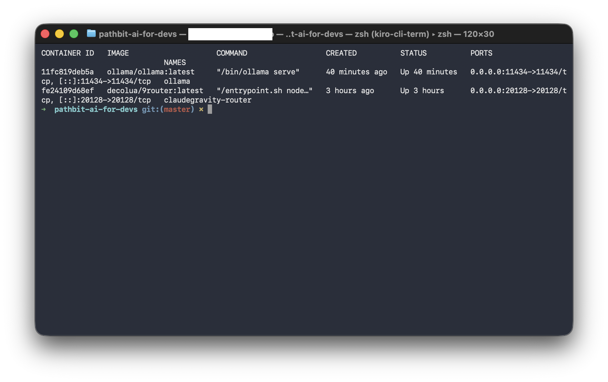

> **Figura 20:** Containers Docker `claudegravity-router` e `claudegravity-ollama` ativos e testes de provisionamento dos combos executados com sucesso.

---

## Provisionamento Automatizado de Combos via Python

Para desenvolvedores que preferem evitar cliques manuais na interface gráfica, disponibilizamos o script `src/setup_combos.py`. Ele injeta as definições dos quatro combos diretamente na base SQLite do 9Router:

```bash
python3 src/setup_combos.py
```

Trecho final da saída:

```text
[*] Provisionando combos no container claudegravity-router...
  [+] Combo cadastrado: claudegravity-fallback (5 modelos)
  [+] Combo cadastrado: arsenal-supremo (7 modelos)
  [+] Combo cadastrado: arsenal-rapido (4 modelos)
  [+] Combo cadastrado: arsenal-offline (1 modelos)
[*] Provisionamento concluído com sucesso!
```

---

## Validação de Inferência dos Combos

Antes de iniciar sua jornada de código, execute o teste de ponta a ponta com `src/test_arsenal.py`:

```bash
python3 src/test_arsenal.py
```

O script exercita **cada nível isoladamente** antes de testar o combo. É essa separação que
importa: um combo pode responder pelo primeiro nível e esconder que os seis seguintes estão mortos.

```text
=== Validador do Arsenal de Fallback do 9Router ===
    Gateway: http://localhost:20128

[*] Cascata de 'arsenal-supremo' - 7 nível(is):
  [OK   ] 1º ag/gemini-3.8-flash-high - 1.44s · 'PONG'
  [OK   ] 2º ag/gemini-3.7-flash-high - 1.05s · 'PONG'
  [OK   ] 3º ag/gemini-3.6-flash-high - 0.77s · 'PONG'
  [OK   ] 4º openrouter/cohere/north-mini-code:free - 0.91s · 'PONG'
  [OK   ] 5º groq/openai/gpt-oss-120b - 0.47s · 'PONG'
  [OK   ] 6º mistral/codestral-latest - 0.55s · 'PONG'
  [OK   ] 7º openai-compatible-chat-ollama-local/qwen2.5-coder:latest - 0.08s · 'PONG'
  [OK   ] combo 'arsenal-supremo' - 1.24s · 'PONG'

[*] Cascata de 'arsenal-rapido' - 4 nível(is):
  [OK   ] 1º groq/openai/gpt-oss-120b - 0.34s · 'PONG'
  [OK   ] 2º mistral/codestral-latest - 0.56s · 'PONG'
  [OK   ] 3º ag/gemini-3.7-flash-high - 1.30s · 'PONG'
  [OK   ] 4º ag/gemini-3.6-flash-high - 2.54s · 'PONG'
  [OK   ] combo 'arsenal-rapido' - 0.39s · 'PONG'

[*] Cascata de 'arsenal-offline' - 1 nível(is):
  [OK   ] 1º openai-compatible-chat-ollama-local/qwen2.5-coder:latest - 0.04s · 'PONG'
  [OK   ] combo 'arsenal-offline' - 0.04s · 'PONG'

======================================================================
RESUMO
======================================================================
  Níveis testados: 12 · quebrados: 0
  Combos testados: 3 · com falha: 0
```

Repare no nível 4: **19,59 s**, contra 4,45 s e 0,47 s dos vizinhos. O nível responde, então não está
quebrado, mas a diferença de duas ordens de grandeza é o tipo de sinal que só aparece testando um a
um. O nível 7, local, devolveu `OK` em vez de `PONG`  -  o modelo de 0.5B nem sempre obedece à
instrução literal, e é por isso que ele serve como rede de segurança e não como papel fixo.

---

## Laboratório de Simulação de Fallback e Resiliência Multi-Cenários

Para garantir que a arquitetura opere de forma previsível em situações adversas de produção, desenvolvemos um laboratório completo de testes automatizados no script `src/simulate_fallback.py`. Ele simula falhas reais de infraestrutura, incluindo saturação de taxa e desautenticação do provedor primário, comprovando que o Claude Code segue operando com estabilidade.

O simulador avalia cinco cenários operacionais e encerra com um resumo explícito de aprovados, falhos e pulados. O código de saída só é zero quando todos os cenários executados passam.

### 1. Cenário Nominal (Antigravity Autenticado)
Valida a comunicação direta e via combo no modelo primário `ag/gemini-3.8-flash-high`. O 9Router registra a tentativa inicial e o retorno imediato com status HTTP 200 e latência próxima a 1 segundo.

### 2. Cenário de Rate Limit e Salto Automático (Hop)
Cria um combo de teste temporário no qual o primeiro modelo é apontado para um identificador saturado que responde com erro 429 ou 404. O motor de roteamento do 9Router intercepta o erro através da função `checkFallbackError`, aplica a regra de contingência e comuta para o modelo subsequente da cadeia, entregando a resposta com sucesso HTTP 200 sem interromper a sessão do usuário. A comutação não é instantânea: o gateway ainda aplica sua política de retentativa com espera progressiva antes de desistir de um nível. No nosso teste, a requisição que precisou saltar de nível respondeu em **3,25s** de ponta a ponta  -  o que o leitor percebe é uma resposta um pouco mais lenta, nunca uma sessão interrompida.

### 3. Cenário de Logout e Token Inválido no Antigravity
Simula a situação em que a conta Google é desconectada ou o token OAuth expira. O script altera temporariamente o token no banco SQLite para uma credencial inválida. Ao tentar acessar diretamente o modelo deslogado, o gateway barra a chamada com o status esperado HTTP 503 / 401 (`[AUTH] HTTP 401`). Em combos com rotas alternativas, o 9Router salta para o próximo provedor disponível da lista.

### 4. Cenário de Auto-Cura e Restauração

> Para sessões longas, a cura preventiva vem antes do estrago: `python3 ../0002_claude_gravity_utilizando_9router/src/keep_connected.py --daemon` renova a credencial do Antigravity antes que o gateway a grave em formato inválido. O [Artigo 0002](../../0002_claude_gravity_utilizando_9router/article/ARTICLE.md) explica a causa.
Aciona o utilitário `sync_antigravity_token.py`, que renova o access token via Google OAuth e restabelece a conexão primária. O script limpa quaisquer travas residuais de rate limit e dispara uma nova requisição, confirmando que o canal com o Gemini 3.8 Flash High volta a responder instantaneamente.

### 5. Cenário de Execução Real no Claude Code CLI
Executa uma chamada direta através do binário oficial da CLI (`claude -p ... --model arsenal-supremo --dangerously-skip-permissions`), provando que a integração com o terminal de desenvolvimento do engenheiro está 100% funcional. Quando o binário `claude` não está instalado na máquina, o cenário é registrado como **pulado**, e não como aprovado.

Ao final, o script restaura as credenciais originais do Antigravity e confere se a restauração realmente foi aplicada, avisando explicitamente caso o estado divirja do backup.

Para executar a suíte de simulação:

```bash
python3 src/simulate_fallback.py
```

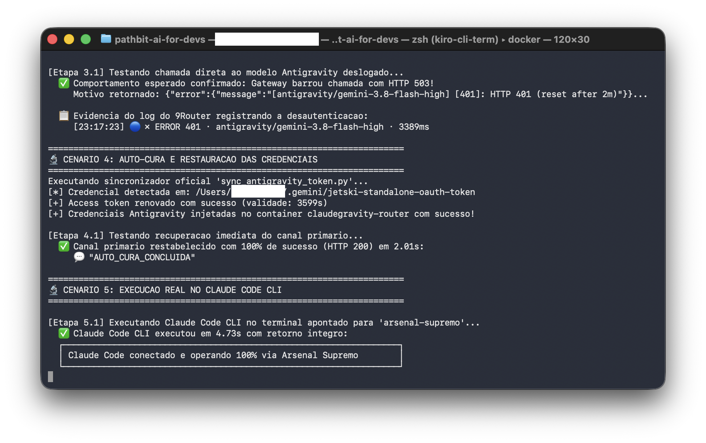

> **Figura 21:** Execução da suíte automatizada de testes `simulate_fallback.py` comprovando comutação de modelos, proteção contra desautenticação e retorno íntegro no Claude Code CLI.

---

## Configuração do Claude Code com Autonomia Completa

Para que o Claude Code utilize o combo `arsenal-supremo` como modelo nativo em todas as tarefas, estruturamos modelos de configuração exclusivamente dentro da pasta de testes do artigo (`examples/.claude/`). Para inicializar suas configurações locais:

```bash
cp examples/.claude/settings.json.example examples/.claude/settings.json
cp examples/.claude/settings.local.json.example examples/.claude/settings.local.json
cp .env.example .env
```

> **Sobre a chave `sk-sua-chave-do-9router` nos exemplos.** É um placeholder. A chave real é **gerada localmente** na primeira execução de `sync_antigravity_token.py` (artigo 0002): um valor aleatório exclusivo da sua máquina, registrado no gateway e gravado no `.env` do módulo, que não é versionado. Substitua o placeholder pela chave que o script imprimir. Os utilitários deste artigo (`test_arsenal.py`, `arsenal_launcher.py`, `simulate_fallback.py`) interrompem a execução com instruções caso a variável `ANTHROPIC_API_KEY` não esteja definida  -  de propósito, para que nenhuma chave publicada funcione como padrão silencioso.

### O que preencher no `.env`

O `.env.example` traz dezenas de variáveis, mas a maioria já vem com valor que funciona. Só estas exigem sua atenção:

| Variável | Obrigatória? | O que colocar |
| :--- | :--- | :--- |
| `INITIAL_PASSWORD` | **Sim** | Senha do painel do 9Router. O `docker compose` recusa subir sem ela. |
| `JWT_SECRET` | **Sim** | Valor longo e aleatório para assinar as sessões do painel. Gere com `openssl rand -hex 32`. |
| `ANTHROPIC_API_KEY` | **Sim** | Não invente: é impressa pelo `sync_antigravity_token.py` na primeira execução e gravada aqui. |
| `MISTRAL_API_KEY` | Sim, para a cascata completa | Console da Mistral. Alimenta o nível 6 do `arsenal-supremo` e o nível 2 do `arsenal-rapido`. |
| `GROQ_API_KEY` | Sim, para a cascata completa | `console.groq.com/keys`. Alimenta o nível 5 do `arsenal-supremo`. |
| `OPENROUTER_API_KEY` | Sim, para a cascata completa | `openrouter.ai/settings/keys`, com limite `$0.00`. Alimenta o nível 4. |
| `GEMINI_API_KEY` | Opcional | Conexão direta com o Google AI Studio, fora dos combos de referência. |
| `CEREBRAS_API_KEY` | Não | Documentada como fonte adicional; nenhum combo deste artigo a utiliza. |

Sem as chaves de provedor, o `setup_combos.py` pula a conexão correspondente e informa o motivo  -  a cascata continua funcionando com os níveis restantes, apenas mais curta.

> **Cuidado com os papéis de modelo.** As variáveis `ANTHROPIC_DEFAULT_FABLE_MODEL`, `_OPUS_MODEL`, `_SONNET_MODEL` e `_HAIKU_MODEL` dizem ao Claude Code qual modelo usar em cada classe de tarefa. Nos arquivos deste artigo elas apontam para modelos individuais do Antigravity, e os combos ficam disponíveis no menu `/model`  -  a comparação entre os dois arranjos está no [Artigo 0002](../../0002_claude_gravity_utilizando_9router/article/ARTICLE.md#modelo-individual-ou-combo-a-escolha-do-padrão). **Não coloque `arsenal-offline` em nenhuma delas, nem como padrão:** o modelo local responde ao gateway, mas não segue instruções dentro do harness, e as tarefas daquele papel falhariam sem erro visível.

### Os dois arquivos de configuração do Claude Code

Ambos ficam em `examples/.claude/`, isolados do restante do repositório  -  por isso não interferem no projeto em que você estiver trabalhando.

| Arquivo | Papel | Contém |
| :--- | :--- | :--- |
| `settings.json` | Políticas compartilhadas do projeto | Modelo padrão, papéis de modelo, permissões e variáveis de ambiente |
| `settings.local.json` | Preferências da sua máquina | O menu interativo `/model` e ajustes pessoais. **Tem precedência** sobre o anterior |

Os dois são versionados apenas na forma `.example`; as cópias ativas ficam fora do controle de versão.

### Estrutura do `settings.json.example`

```json
{
  "model": "ag/gemini-3.8-flash-high",
  "env": {
    "ANTHROPIC_BASE_URL": "http://localhost:20128",
    "ANTHROPIC_API_KEY": "sk-sua-chave-do-9router",
    "CLAUDE_CODE_DISABLE_UNKNOWN_MODEL_WINDOW_ENFORCEMENT": "1",
    "ANTHROPIC_DEFAULT_FABLE_MODEL": "ag/gemini-pro-agent",
    "ANTHROPIC_DEFAULT_OPUS_MODEL": "ag/gemini-3.8-flash-high",
    "ANTHROPIC_DEFAULT_SONNET_MODEL": "ag/gemini-3.7-flash-high",
    "ANTHROPIC_DEFAULT_HAIKU_MODEL": "ag/gemini-3.6-flash-high",
    "ANTHROPIC_MODEL": "ag/gemini-3.8-flash-high",
    "CLAUDE_CODE_ENABLE_EXPERIMENTAL_ADVISOR_TOOL": "1"
  },
  "permissions": {
    "defaultMode": "bypassPermissions",
    "allow": [
      "Bash(*)",
      "Read(*)",
      "Edit(*)",
      "Write(*)",
      "Glob(*)",
      "Grep(*)",
      "WebFetch(*)",
      "WebSearch(*)",
      "NotebookEdit(*)",
      "TodoWrite(*)",
      "Agent(*)",
      "Skill(*)"
    ]
  },
  "skipDangerousModePermissionPrompt": true,
  "includeCoAuthoredBy": false,
  "advisorModel": "ag/gemini-pro-agent",
  "modelPicker": {
    "replaceBuiltInOptions": true,
    "options": [
      {
        "model": "ag/gemini-3.8-flash-high",
        "label": "Gemini 3.8 Flash High",
        "description": "Primario do Antigravity",
        "behavesAs": "claude-opus-4-8"
      },
      {
        "model": "ag/gemini-3.7-flash-high",
        "label": "Gemini 3.7 Flash High",
        "description": "Trabalho corrente",
        "behavesAs": "claude-sonnet-4-6"
      },
      {
        "model": "ag/gemini-3.6-flash-high",
        "label": "Gemini 3.6 Flash High",
        "description": "Latencia minima",
        "behavesAs": "claude-haiku-4-5-20251001"
      },
      {
        "model": "groq/openai/gpt-oss-120b",
        "label": "GPT-OSS 120B (Groq)",
        "description": "LPU, resposta em fracao de segundo",
        "behavesAs": "claude-sonnet-4-6"
      },
      {
        "model": "mistral/codestral-latest",
        "label": "Codestral (Mistral)",
        "description": "Especialista em codigo",
        "behavesAs": "claude-sonnet-4-6"
      },
      {
        "model": "arsenal-supremo",
        "label": "Arsenal Supremo (combo)",
        "description": "7 niveis, do Gemini ao Ollama local",
        "behavesAs": "claude-opus-4-8"
      },
      {
        "model": "arsenal-rapido",
        "label": "Arsenal Rapido (combo)",
        "description": "4 niveis, otimizado para latencia",
        "behavesAs": "claude-sonnet-4-6"
      },
      {
        "model": "arsenal-offline",
        "label": "Arsenal Offline (combo)",
        "description": "So Ollama local. Responde sempre, nao opera o harness",
        "behavesAs": "claude-haiku-4-5-20251001"
      }
    ]
  },
  "modelOverrides": {
    "claude-fable-5-1": "ag/gemini-pro-agent",
    "claude-opus-5": "ag/gemini-3.8-flash-high",
    "claude-sonnet-5": "ag/gemini-3.7-flash-high"
  }
}
```

O bloco `modelOverrides` tem **três entradas, uma por família**. Ele cobre um caso específico: um
`settings.local.json` que ficou apontando para um modelo escolhido no menu `/model` antes de você
trocar a configuração. Não é preciso duplicar com o sufixo de janela (`[1m]`): a CLI normaliza o
identificador antes de consultar o mapa. O [Artigo 0002](../../0002_claude_gravity_utilizando_9router/article/ARTICLE.md)
detalha a medição que levou a esse formato enxuto.

#### Os quatro papéis e para onde eles apontam

O Claude Code escolhe sozinho qual modelo usar em cada situação, através de quatro papéis. A ordem
de capacidade vem da própria CLI: *Fable for the hardest problems, Opus for complex work, Sonnet for
most tasks, Haiku for quick questions*. Cada papel tem sua variável:

| Papel | Variável | Aponta para | Quando é acionado |
| :--- | :--- | :--- | :--- |
| Fable | `ANTHROPIC_DEFAULT_FABLE_MODEL` | `ag/gemini-pro-agent` | O que a CLI considerar mais difícil |
| Opus | `ANTHROPIC_DEFAULT_OPUS_MODEL` | `ag/gemini-3.8-flash-high` | Trabalho complexo e **todo subagente despachado** |
| Sonnet | `ANTHROPIC_DEFAULT_SONNET_MODEL` | `ag/gemini-3.7-flash-high` | A maior parte das tarefas |
| Haiku | `ANTHROPIC_DEFAULT_HAIKU_MODEL` | `ag/gemini-3.6-flash-high` | Alta frequência: **toda sessão**, para nomear a conversa |

São modelos individuais, e não os combos  -  a mesma escolha do [Artigo 0002](../../0002_claude_gravity_utilizando_9router/article/ARTICLE.md#modelo-individual-ou-combo-a-escolha-do-padrão),
pelo mesmo motivo: consumo previsível. Os combos `arsenal-*` continuam a um `/model` de distância,
e nada impede apontar um papel para eles se você preferir resiliência a previsibilidade.

Descobrir qual papel atende o quê não exige adivinhação. Aponte cada papel para um modelo diferente e
leia o log do gateway: ele registra `modelo pedido → modelo servido`. A CLI ainda ajuda, emitindo uma
linha de diagnóstico com o campo `query_source`, que nomeia quem fez o pedido:

| `query_source` | Papel acionado |
| :--- | :--- |
| `sdk` | modelo principal |
| `generate_session_title` | **Haiku**, em toda sessão |
| `agent:builtin:Explore` | **Opus** |

A segunda linha surpreende: **subagentes não usam o papel rápido, usam o de trabalho complexo.** Se
sua rotina despacha subagentes, é o Opus que domina o seu consumo, não o modelo principal.

### Estrutura do `settings.local.json.example` (Menu Interativo)

O arquivo local carrega a **mesma configuração completa** do `settings.json`. Ele existe para ficar
fora do controle de versão e para ter precedência  -  os dois trazem o conjunto completo, para que funcionem
isoladamente. O que muda é a ênfase: é aqui que você ajusta o menu e as preferências da sua máquina.

- **`modelPicker`** popula o menu `/model`. Com **`replaceBuiltInOptions` em `true`**, suas entradas
  **substituem** a lista nativa em vez de somar a ela: o menu passa a oferecer apenas os seus combos,
  e não há como selecionar por engano um modelo que o seu gateway não serve.
- **`behavesAs`** em cada linha diz à CLI qual modelo conhecido serve de referência de capacidade
  para aquele combo. Sem isso ela recusaria o identificador, porque não o encontra no catálogo dela.
- **`advisorModel`** define quem atende as funções auxiliares de revisão. Aqui ele aponta para
  `ag/gemini-pro-agent`, o modelo mais denso da conta  -  a regra é que o revisor seja **ao menos tão
  capaz** quanto o principal. Se preferir que a revisão também herde a cascata, aponte-o para
  `arsenal-supremo`: as chamadas passam a descer de nível junto com o restante em vez de falhar.

O arquivo completo:

```json
{
  "model": "ag/gemini-3.8-flash-high",
  "advisorModel": "ag/gemini-pro-agent",
  "modelPicker": {
    "replaceBuiltInOptions": true,
    "options": [
      {
        "model": "ag/gemini-3.8-flash-high",
        "label": "Gemini 3.8 Flash High",
        "description": "Primario do Antigravity",
        "behavesAs": "claude-opus-4-8"
      },
      {
        "model": "ag/gemini-3.7-flash-high",
        "label": "Gemini 3.7 Flash High",
        "description": "Trabalho corrente",
        "behavesAs": "claude-sonnet-4-6"
      },
      {
        "model": "ag/gemini-3.6-flash-high",
        "label": "Gemini 3.6 Flash High",
        "description": "Latencia minima",
        "behavesAs": "claude-haiku-4-5-20251001"
      },
      {
        "model": "groq/openai/gpt-oss-120b",
        "label": "GPT-OSS 120B (Groq)",
        "description": "LPU, resposta em fracao de segundo",
        "behavesAs": "claude-sonnet-4-6"
      },
      {
        "model": "mistral/codestral-latest",
        "label": "Codestral (Mistral)",
        "description": "Especialista em codigo",
        "behavesAs": "claude-sonnet-4-6"
      },
      {
        "model": "arsenal-supremo",
        "label": "Arsenal Supremo (combo)",
        "description": "7 niveis, do Gemini ao Ollama local",
        "behavesAs": "claude-opus-4-8"
      },
      {
        "model": "arsenal-rapido",
        "label": "Arsenal Rapido (combo)",
        "description": "4 niveis, otimizado para latencia",
        "behavesAs": "claude-sonnet-4-6"
      },
      {
        "model": "arsenal-offline",
        "label": "Arsenal Offline (combo)",
        "description": "So Ollama local. Responde sempre, nao opera o harness",
        "behavesAs": "claude-haiku-4-5-20251001"
      }
    ]
  },
  "env": {
    "ANTHROPIC_BASE_URL": "http://localhost:20128",
    "ANTHROPIC_API_KEY": "sk-sua-chave-do-9router",
    "CLAUDE_CODE_DISABLE_UNKNOWN_MODEL_WINDOW_ENFORCEMENT": "1",
    "ANTHROPIC_DEFAULT_FABLE_MODEL": "ag/gemini-pro-agent",
    "ANTHROPIC_DEFAULT_OPUS_MODEL": "ag/gemini-3.8-flash-high",
    "ANTHROPIC_DEFAULT_SONNET_MODEL": "ag/gemini-3.7-flash-high",
    "ANTHROPIC_DEFAULT_HAIKU_MODEL": "ag/gemini-3.6-flash-high",
    "ANTHROPIC_MODEL": "ag/gemini-3.8-flash-high",
    "CLAUDE_CODE_ENABLE_EXPERIMENTAL_ADVISOR_TOOL": "1"
  },
  "permissions": {
    "defaultMode": "bypassPermissions",
    "allow": [
      "Bash(*)",
      "Read(*)",
      "Edit(*)",
      "Write(*)",
      "Glob(*)",
      "Grep(*)",
      "WebFetch(*)",
      "WebSearch(*)",
      "NotebookEdit(*)",
      "TodoWrite(*)",
      "Agent(*)",
      "Skill(*)"
    ]
  },
  "skipDangerousModePermissionPrompt": true,
  "includeCoAuthoredBy": false,
  "modelOverrides": {
    "claude-fable-5-1": "ag/gemini-pro-agent",
    "claude-opus-5": "ag/gemini-3.8-flash-high",
    "claude-sonnet-5": "ag/gemini-3.7-flash-high"
  }
}
```


O arquivo completo, com todos os blocos herdados, está em `examples/.claude/settings.local.json.example`.

Com essa estrutura, quando o Claude Code solicita o modelo padrão de raciocínio, o 9Router recebe a requisição com o identificador `arsenal-supremo`. Ele envia o prompt para o Gemini 3.8 Flash; caso o rate limit por minuto seja alcançado, o gateway salta automaticamente para o Gemini 3.7 Flash e, sucessivamente, até o último nível local.

### Validando a configuração

Três comandos, em ordem, confirmam que tudo está de pé antes de você começar a trabalhar:

```bash
# 1. Provisiona provedores e combos a partir das chaves do .env
python3 src/setup_combos.py

# 2. Testa cada nível de cada cascata isoladamente e acusa identificador quebrado
python3 src/test_arsenal.py

# 3. Exercita o harness real do Claude Code contra o combo padrão
claude -p "Responda apenas: OK" --model arsenal-supremo --dangerously-skip-permissions
```

O passo 2 é o que dá segurança de verdade: ele não se contenta em ver o combo responder, porque um combo responde pelo primeiro nível mesmo com todos os outros quebrados. Ao testar nível a nível, ele acusa exatamente qual identificador saiu do catálogo.

---

## Show-Me-The-Code

O artigo disponibiliza uma malha resiliente completa de infraestrutura e execução que entrega:

- orquestração unificada via Docker Compose com 9Router e Ollama para contingência offline;
- provisionamento automatizado de combos no banco de dados SQLite sem necessidade de cliques manuais;
- suíte de testes de resiliência com 5 cenários reais (operação nominal, salto de rate limit, erro 401, auto-cura e execução no CLI);
- ambiente prático e isolado (`examples/`) com configurações prontas do Claude Code (`.claude/`) e script de teste (`sample_task.py`);
- launcher dedicado em Python (`arsenal_launcher.py`) para execução direta do Claude Code no sandbox de exemplos.

**Opção 1** Execute o ambiente e a suíte de testes de resiliência localmente pelo terminal.

[**Abrir README.md com instruções locais**](https://github.com/pathbit/pathbit-ai-for-devs/blob/master/0003_fallback_modelos_gratuitos_9router/README.md)

**Opção 2** Execute o código de testes e interaja com o Claude Code diretamente no ambiente prático isolado (`examples/`).

[**Abrir pasta de exemplos e testes práticos**](https://github.com/pathbit/pathbit-ai-for-devs/blob/master/0003_fallback_modelos_gratuitos_9router/examples/README.md)

### Pré-requisitos do Ambiente e Credenciais

Antes de rodar os scripts de provisionamento e iniciar a cascata com o Claude Code, configure os seguintes componentes na sua máquina:

1. **Python 3.10 ou superior:**
   - Verifique com `python3 --version`. Se necessário, instale via `brew install python` (macOS), `sudo apt install python3 python3-venv python3-pip` (Linux) ou `winget install Python.Python.3.12` (Windows).
   - Crie o ambiente virtual e instale o ambiente (o módulo roda só com a biblioteca padrão do Python 3.10+):
     ```bash
     python3 -m venv .venv
     source .venv/bin/activate  # No Windows: .venv\Scripts\Activate.ps1
     pip install -r requirements.txt
     ```

2. **Docker e Docker Compose:**
   - Necessário para executar os serviços do 9Router e do Ollama local em containers. Instale via Docker Desktop (macOS/Windows) ou script oficial no Linux (`curl -fsSL https://get.docker.com | sh`).
   - Garanta que os containers estejam em execução com `docker compose up -d`.

3. **Node.js e Claude Code CLI:**
   - Instale Node.js 18+ e a ferramenta oficial da Anthropic globalmente:
     ```bash
     npm install -g @anthropic-ai/claude-code
     ```
   - Verifique com `claude --version`.

4. **Credenciais e Chaves Gratuitas:**
   - **OpenRouter:** Obtenha sua API Key em [openrouter.ai/settings/keys](https://openrouter.ai/settings/keys) e configure limite financeiro de `$0.00` para restringir chamadas apenas aos modelos gratuitos (`:free`).
   - **Groq Cloud:** Obtenha sua chave gratuita com prefixo `gsk_...` em [console.groq.com/keys](https://console.groq.com/keys).
   - **Google AI Studio:** Obtenha sua chave gratuita em [aistudio.google.com/apikey](https://aistudio.google.com/apikey).
   - **Mistral AI:** Obtenha sua chave gratuita em [console.mistral.ai/api-keys](https://console.mistral.ai/api-keys).
   - **Ollama Local:** Não exige chave externa, sendo executado diretamente no container local via Docker Compose.

### Executando os Scripts de Provisionamento e Teste

```bash
# 1. Provisionar combos no gateway
python3 src/setup_combos.py

# 2. Testar inferência dos combos
python3 src/test_arsenal.py

# 3. Executar o laboratório completo de simulação de falhas
python3 src/simulate_fallback.py

# 4. Iniciar o Claude Code conectado ao Arsenal Supremo
python3 src/arsenal_launcher.py
```

Ou diretamente pelo terminal:

```bash
# macOS e Linux (bash / zsh)
export ANTHROPIC_BASE_URL="http://localhost:20128"
export ANTHROPIC_API_KEY="sk-sua-chave-do-9router"

claude --dangerously-skip-permissions --model arsenal-supremo

# Windows (PowerShell)
$env:ANTHROPIC_BASE_URL="http://localhost:20128"
$env:ANTHROPIC_API_KEY="sk-sua-chave-do-9router"

claude --dangerously-skip-permissions --model arsenal-supremo
```

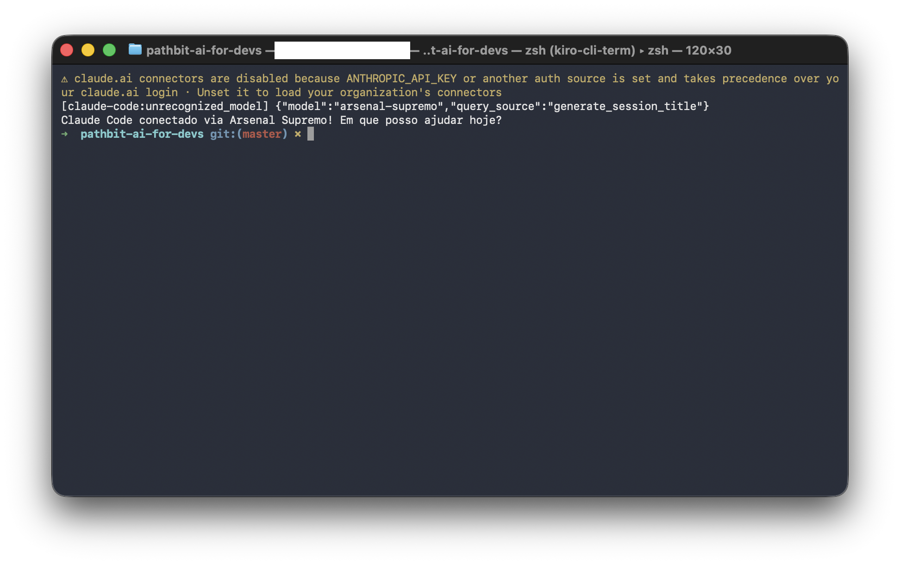

> **Figura 22:** Sessão autônoma do Claude Code operando sob o combo `arsenal-supremo`, roteando via 9Router com latência reduzida e zero custo de inferência.

---

## Boas Práticas para Operação Perpétua sem Custos

Para garantir estabilidade contínua ao longo de semanas de trabalho:

1. **Priorize Modelos de Raciocínio no Topo do Combo:** Modelos como o Gemini 3.8 Flash High devem ficar nas primeiras posições porque mantêm a capacidade de planejamento agêntico do Claude Code em alto nível. Reserve os níveis gratuitos de contexto amplo, como o `nemotron-3.5-lightning:free`, para o meio da cascata.
2. **Revalide a Cascata Periodicamente:** modelos gratuitos são descontinuados sem aviso, e um nível quebrado no meio da cascata só aparece quando os anteriores também falham. Rode `python3 src/test_arsenal.py` de tempos em tempos: ele testa cada nível isoladamente e acusa qualquer identificador que tenha saído do catálogo.
3. **Utilize o Ollama como Última Barreira de Proteção:** ter o `openai-compatible-chat-ollama-local/qwen2.5-coder:latest` como nível final assegura que a cascata nunca termine em erro, mesmo com todos os provedores em nuvem fora do ar. Trate-o como garantia de continuidade, não como substituto: um modelo local pequeno não sustenta uma sessão de trabalho do Claude Code.
4. **Mantenha Chaves de Provedores Distintas:** Crie contas específicas para desenvolvimento na Groq, OpenRouter e Google AI Studio para manter as cotas gratuitas isoladas e com monitoramento independente no dashboard do 9Router.
5. **Beneficie-se da Compressão RTK:** O 9Router traz filtros dedicados para saídas de `git diff`, `git status`, `git log`, `grep`, `tree`, `ls`, `find` e builds, ativos por padrão. Eles cortam o ruído repetitivo que o agente reenvia a cada turno e prolongam a vida útil de qualquer limite de taxa. A economia depende do tipo de saída que suas tarefas produzem  -  não medimos um percentual próprio, então trate qualquer número divulgado como estimativa até validar no seu fluxo.

---

## Conclusão e Artigos Relacionados

Ao desacoplar a camada de execução (Claude Code CLI) da camada de inferência e conectá-la a uma malha de múltiplos provedores orquestrada pelo 9Router, você elimina a maior barreira operacional da programação assistida por inteligência artificial: a vulnerabilidade a limites de cota e interrupções de serviço.

Para aprofundar na infraestrutura de permissões irrestritas do Google Antigravity, acesse o [Artigo 0001 - Google Antigravity com Acesso Total Irrestrito e sem Interrupções](../../0001_antigravity_acesso_total_irrestrito/article/ARTICLE.md).

Para aprofundar na configuração específica do Google Antigravity e na engenharia de tradução de chamadas do Claude Code, acesse o [Artigo 0002 - ClaudeGravity e o Roteamento de Modelos Gemini no Claude Code via 9Router](../../0002_claude_gravity_utilizando_9router/article/ARTICLE.md).

---

## Referências Técnicas

- [9Router GitHub Repository](https://github.com/decolua/9router)
- [Claude Code Settings & Permissions Official Guide](https://code.claude.com/docs/en/settings)
- [Anthropic Messages API Reference](https://docs.anthropic.com/en/api/messages)
- [Groq Cloud Documentation](https://console.groq.com/docs)
- [Google AI Studio Gemini API Documentation](https://ai.google.dev/gemini-api/docs)
- [OpenRouter Models Catalog](https://openrouter.ai/models)
- [Ollama Open Source LLM Runner](https://ollama.com)
