# DeepClaude: A Alternativa ao ClaudeGravity com DeepSeek e OrcaRouter no Claude Code

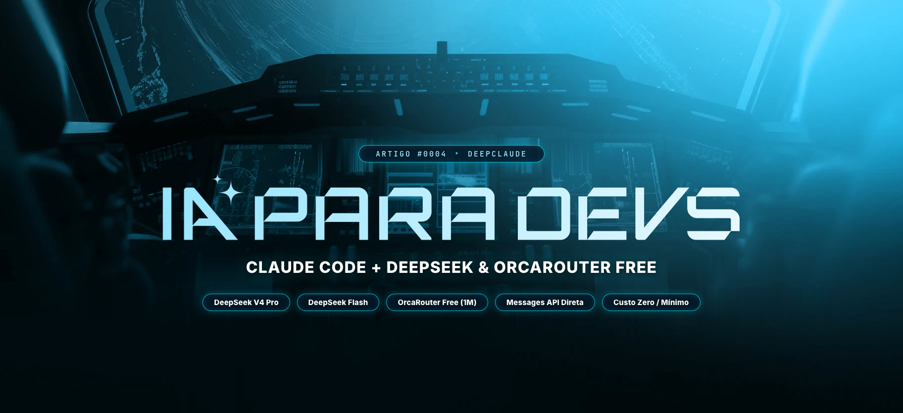

Nos artigos anteriores desta série, exploramos duas frentes essenciais da engenharia de IA moderna para desenvolvedores: primeiro, destravamos a autonomia total do motor **Agent 2.0** no [Artigo 0001](../../0001_antigravity_acesso_total_irrestrito/article/ARTICLE.md); em seguida, construímos o **ClaudeGravity** no [Artigo 0002](../../0002_claude_gravity_utilizando_9router/article/ARTICLE.md) e a malha de resiliência multi-provedores com combos de fallback no [Artigo 0003](../../0003_fallback_modelos_gratuitos_9router/article/ARTICLE.md). Nesses cenários, conectamos o **Claude Code CLI** à infraestrutura de ponta do **Google Antigravity** via gateway **9Router**, aproveitando a assinatura Google AI Pro sem custos adicionais de tokens.

Mas e se você **não possui acesso ao Google Antigravity**, ou deseja uma alternativa ultrarrápida, de baixo custo e especializada em raciocínio analítico para atuar como motor principal do seu terminal?

É aqui que entra o **DeepClaude**: o movimento de engenharia que desacopla o harness de ponta da Anthropic do seu provedor de inferência oficial, alimentando o Claude Code diretamente com os modelos da família **DeepSeek**.

Neste artigo, apresentamos a implementação definitiva dessa arquitetura em dois caminhos complementares e validados:

1. **DeepSeek Platform Direto (API Oficial):** Conexão direta com a infraestrutura oficial da DeepSeek (`https://api.deepseek.com/anthropic`), que disponibiliza os modelos **DeepSeek V4 PRO** e **DeepSeek Flash** com preços imbatíveis por milhão de tokens e compatibilidade nativa com o protocolo Anthropic Messages.
2. **OrcaRouter (Tier Gratuito):** Conexão através do gateway agregador **OrcaRouter** (`https://api.orcarouter.ai`), que oferece o modelo **DeepSeek V4 Flash FREE** com janela massiva de contexto de 1 milhão de tokens a custo zero na data da escrita deste artigo.

Mais do que uma solução focada exclusivamente na DeepSeek, **este artigo consolida um padrão arquitetural universal para toda a engenharia de IA agêntica**: o mesmo princípio pode se repetir e evoluir para qualquer família de modelos — como as linhagens **Llama**, **Qwen**, **Mistral** ou **Gemma** — conectando-se a múltiplos provedores e roteadores de inferência do mercado, a exemplo de **OpenRouter**, **Together AI**, **Groq**, **Fireworks AI**, **Novita AI** ou gateways corporativos customizados. A única condição necessária é que o roteador ou provedor de destino forneça **endpoints compatíveis com a especificação Anthropic Messages API (`/v1/messages`)**.

Contudo, vale um alerta indispensável de engenharia: **é fundamental avaliar sempre a documentação oficial do provedor ou roteador antes de iniciar qualquer implementação**. Cada plataforma adota convenções e nuances arquiteturais próprias:
- **Estrutura da Base URL:** Enquanto alguns roteadores exigem a URL raiz limpa (como `https://api.orcarouter.ai` ou `https://openrouter.ai/api`), já que a CLI anexa automaticamente `/v1/messages`, outros provedores disponibilizam rotas dedicadas (como o sufixo `/anthropic` na DeepSeek). Configurar um `/v1` adicional onde o cliente já o concatena causa erros imediatos de rota duplicada (`/v1/v1/messages` com HTTP 404).
- **Método de Autenticação:** A maioria dos roteadores e APIs de terceiros espera o token no formato padrão `Authorization: Bearer <token>`, o que torna obrigatório o uso de `ANTHROPIC_AUTH_TOKEN` (em vez de `ANTHROPIC_API_KEY`, que dispara o cabeçalho proprietário `x-api-key`).
- **Suporte a Recursos Agênticos Avançados:** Nem todo endpoint anunciado como "compatível com Anthropic" suporta 100% dos recursos que o Claude Code exige para operar com alta produtividade. É imperativo conferir na documentação técnica se a API implementa suporte pleno a streaming SSE (*Server-Sent Events*), chamadas a ferramentas (*tool calling* / *function calling*), blocos de raciocínio (*thinking blocks*) e cabeçalhos de *prompt caching* (`cache_control`).

Além do passo a passo visual com 41 capturas de tela e diagramas cobrindo desde a obtenção das chaves até a operação no terminal, detalharemos a fundo a arquitetura de configurações do Claude Code, esclarecendo a diferença entre `settings.json` e `settings.local.json`, o que o sufixo `[1m]` realmente faz, como a escolha do menu `/model` vaza para a sua conta pessoal e por que o Advisor experimental deve ser rigorosamente desativado em qualquer integração com terceiros.

---

## Comparativo de Arquiteturas: Claude Nativo vs ClaudeGravity vs DeepClaude

Para entender onde o DeepClaude se posiciona no arsenal de um desenvolvedor, compare as três abordagens principais:

| Dimensão | Claude Nativo (Anthropic Cloud) | ClaudeGravity (Artigo 0002) | DeepClaude (Este Artigo) |
| :--- | :--- | :--- | :--- |
| **Harness CLI** | Claude Code CLI oficial | Claude Code CLI oficial | Claude Code CLI oficial |
| **Provedor de Modelos** | Anthropic (Claude 3.7 / 4.6 Sonnet / Opus) | Google Antigravity (Gemini 3.8 / 3.7 Flash) | DeepSeek Platform / OrcaRouter |
| **Modelo Principal** | `claude-sonnet-4-6` / `claude-opus-5` | `ag/gemini-3.8-flash-high` | `deepseek-v4-pro` / `deepseek-flash` |
| **Raciocínio Lógico (Reasoning)** | Nativo (Thinking Blocks) | Nativo (Gemini Thinking) | Nativo (DeepSeek R1 / V4 Reasoning) |
| **Janela de Contexto** | 200k padrão (1M em beta pago) | 1 milhão de tokens nativo | 1 milhão de tokens (OrcaRouter / Platform) |
| **Custo Operacional** | Faturado por token ($3 a $15 / 1M) | Custo zero (aproveita assinatura Google AI Pro) | Centavos por 1M de tokens (Platform) ou Gratuito (OrcaRouter) |
| **Dependência de Gateway Local** | Nenhuma | Exige 9Router (Docker) para traduzir protocolo | **Zero** (a API do DeepSeek já fala Anthropic Messages) |
| **Advisor (`/advisor`)** | Suportado nativamente | Incompatível (rejeitado pelo gateway) | Incompatível (rejeitado pelo DeepSeek) |

A grande vantagem do DeepClaude é a **simplicidade arquitetural**: como a API da DeepSeek e o OrcaRouter já expõem endpoints compatíveis com a especificação da Anthropic (`/anthropic` ou `/v1/messages`), **você não precisa subir nenhum container Docker nem rodar proxy local** se quiser operar exclusivamente com eles. Basta configurar o arquivo `.claude/settings.local.json` no diretório do projeto e abrir o terminal.

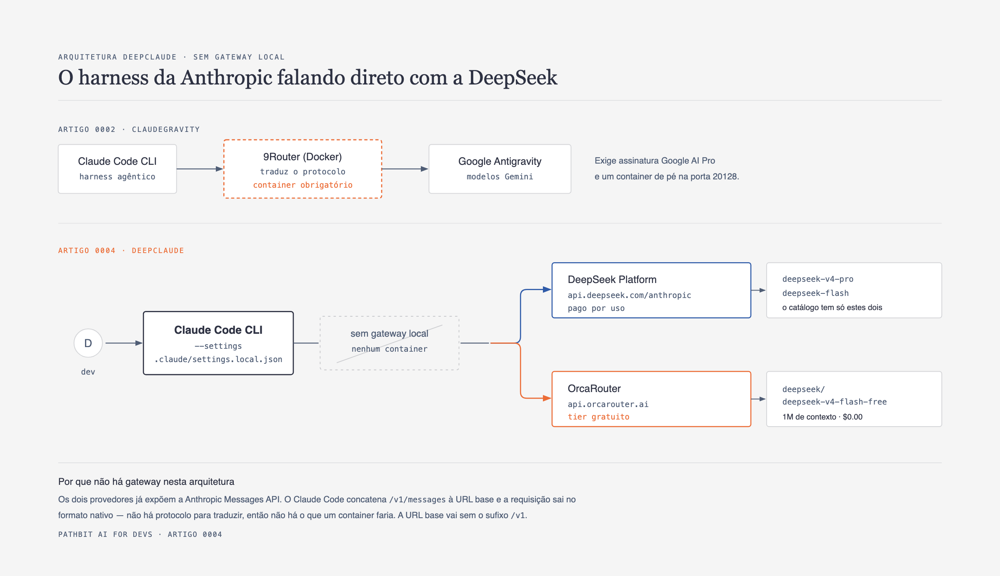

> **Figura 1:** As duas arquiteturas lado a lado. No ClaudeGravity (Artigo 0002) o 9Router em container é obrigatório, porque é ele que traduz o protocolo da Anthropic para o do Google Antigravity. No DeepClaude não há o que traduzir: a DeepSeek e o OrcaRouter já falam Anthropic Messages, então o Claude Code aponta direto para a URL base e a camada de gateway desaparece.

---

## Caminho 1: Configuração na Plataforma Oficial DeepSeek (Paga por Uso)

A API oficial da DeepSeek é reconhecida mundialmente pela excelente relação custo-benefício. Ao contrário dos provedores tradicionais que cobram valores elevados por chamadas de raciocínio, a DeepSeek cobra frações de centavos por milhão de tokens, viabilizando sessões contínuas de agentes autônomos sem estresse financeiro.

Abaixo está o roteiro de provisionamento de credenciais na plataforma oficial:

### 1. Criação de Conta e Acesso ao Dashboard

Acesse a página inicial da plataforma de desenvolvedores em [platform.deepseek.com/sign_in](https://platform.deepseek.com/sign_in) e efetue o cadastro ou login:

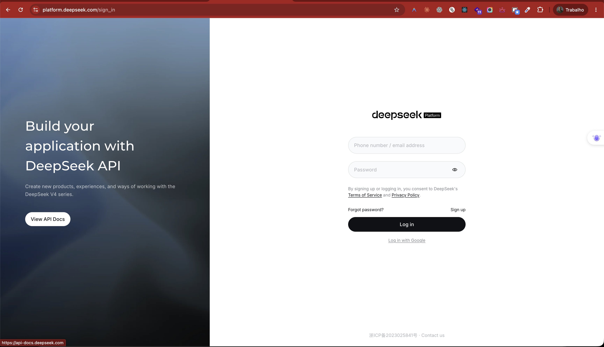

> **Figura 2:** Tela de autenticação oficial da plataforma de desenvolvedores da DeepSeek.

Após a validação, você será direcionado ao painel principal, onde são exibidos os gráficos de consumo, latência e estatísticas das chamadas de API:

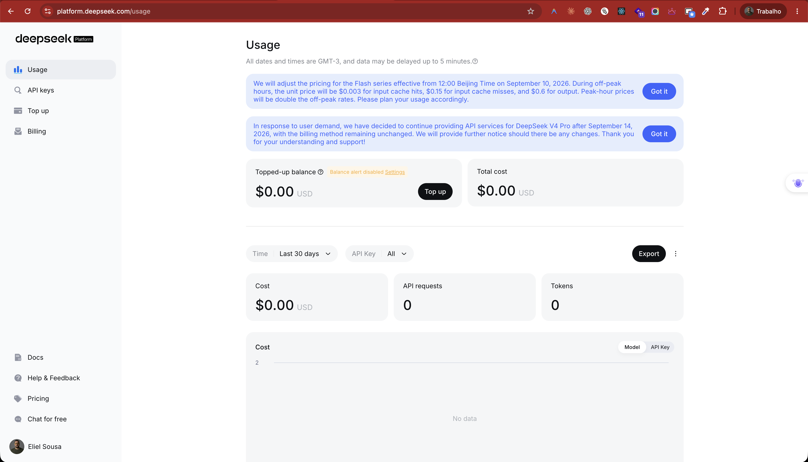

> **Figura 3:** Dashboard da plataforma DeepSeek com métricas de requisições e visão geral da conta.

### 2. Recarga Inicial de Créditos

A API da DeepSeek opera no modelo pré-pago (*pay-as-you-go*), o que garante controle absoluto sobre o orçamento: você nunca terá surpresas no fechamento da fatura. Para adicionar saldo, clique no menu **Top Up**:

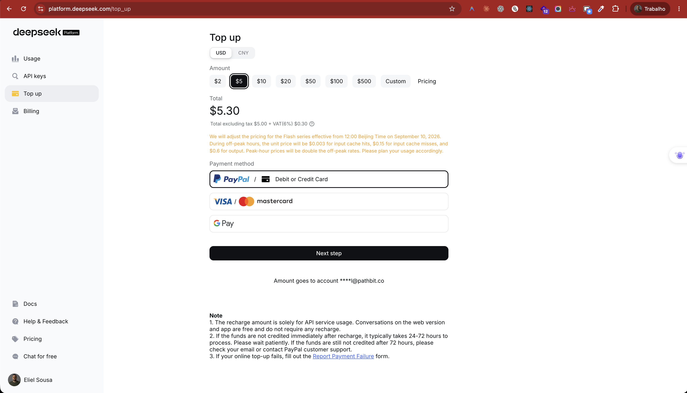

> **Figura 4:** Interface de recarga de créditos com suporte a valores a partir de $2 dólares.

Após a confirmação do pagamento, o saldo é creditado instantaneamente na sua conta:

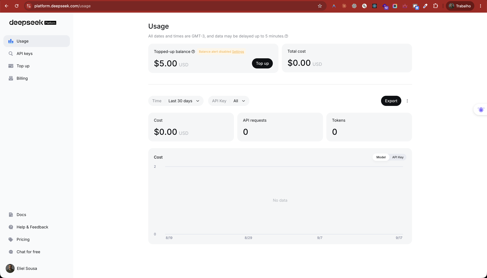

> **Figura 5:** Saldo ativo disponível para consumo imediato pelas ferramentas agênticas.

### 3. Geração da API Key Dedicada

No menu lateral esquerdo, navegue até **API Keys** e clique em **Create new API key**. Recomendamos atribuir um nome descritivo para identificar que a chave é destinada ao Claude Code:

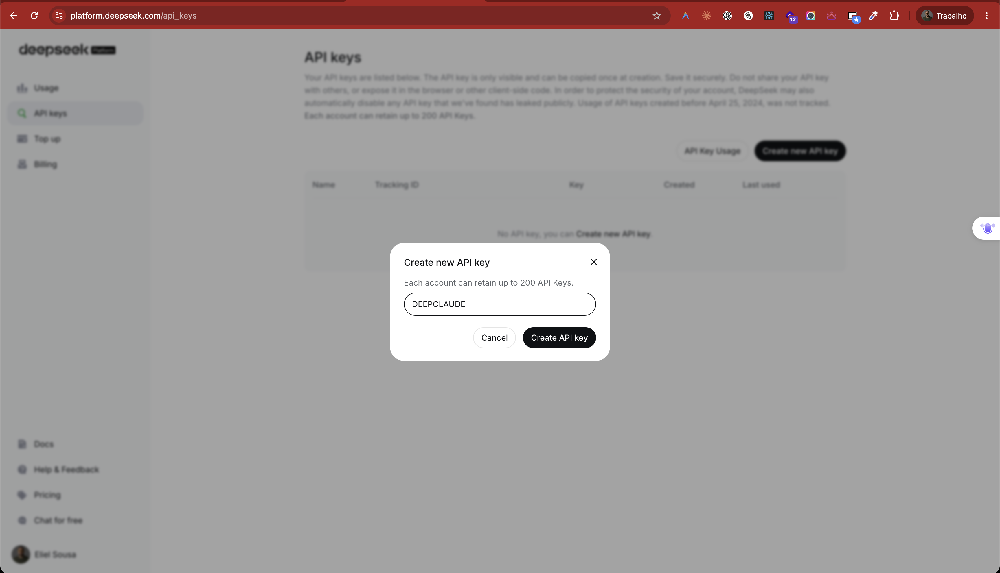

> **Figura 6:** Criação de uma chave de API nomeada para o ambiente do Claude Code.

Ao confirmar, a plataforma exibirá o token secreto iniciado por `sk-`. Copie o valor imediatamente, pois por razões de segurança ele não será exibido novamente:

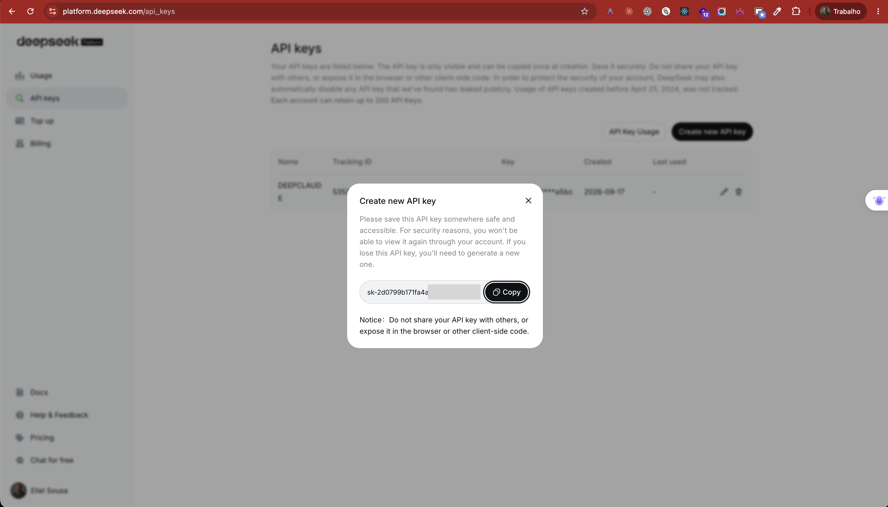

> **Figura 7:** Token de autenticação gerado com sucesso na DeepSeek.

Na lista de chaves, você pode monitorar a data de criação, status e revogar chaves antigas se necessário:

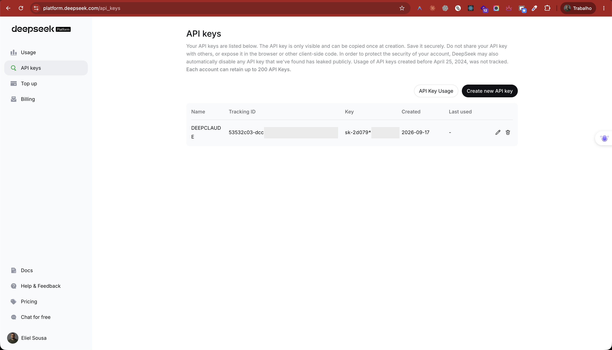

> **Figura 8:** Gerenciamento das credenciais ativas na plataforma.

### 4. Endpoints Oficiais e Compatibilidade Anthropic

Na documentação da DeepSeek, localize os endpoints de inferência:

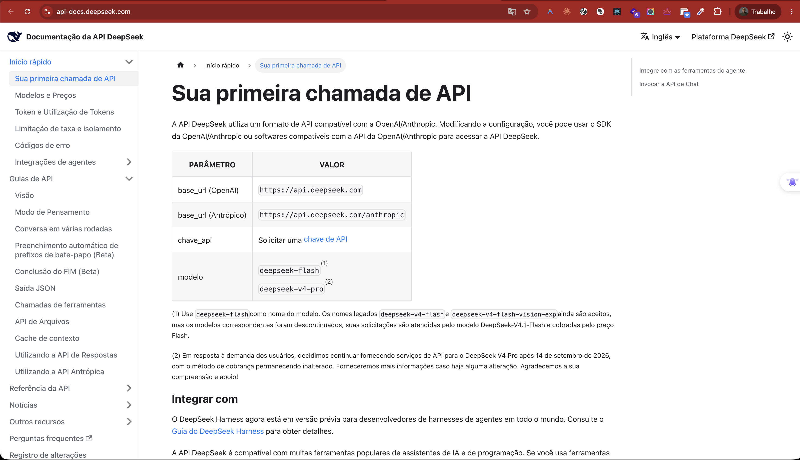

> **Figura 9:** Endpoints oficiais da DeepSeek, destacando a rota compatível com a Anthropic Messages API.

> [!IMPORTANT]
> ### A Rota de Compatibilidade da Anthropic na DeepSeek
> Para que o Claude Code consiga se comunicar com a DeepSeek sem intermediários, a URL base deve apontar para:
> ```text
> https://api.deepseek.com/anthropic
> ```
> O Claude Code concatena internamente `/v1/messages` a essa base, disparando requisições contra `https://api.deepseek.com/anthropic/v1/messages`, que a DeepSeek atende no protocolo idêntico ao da Anthropic.

### O Catálogo da DeepSeek Tem Exatamente Dois Modelos

Antes de escrever qualquer configuração, vale consultar o catálogo real em vez de confiar em nomes vistos em tutoriais antigos. Uma chamada resolve:

```bash
curl -s https://api.deepseek.com/models -H "Authorization: Bearer $DEEPSEEK_API_KEY"
```

Resposta na data de publicação deste artigo:

```json
{
    "object": "list",
    "data": [
        { "id": "deepseek-flash",  "object": "model", "owned_by": "deepseek" },
        { "id": "deepseek-v4-pro", "object": "model", "owned_by": "deepseek" }
    ]
}
```

São **dois modelos, e apenas dois**. Isso tem uma consequência direta no desenho da configuração: o Claude Code trabalha com quatro papéis (`OPUS`, `SONNET`, `FABLE` e `HAIKU`), então é matematicamente impossível ter quatro destinos distintos. O mapeamento sensato agrupa por perfil de tarefa:

| Papel no Claude Code | Modelo DeepSeek | Racional |
| :--- | :--- | :--- |
| **Opus** (raciocínio primário) | `deepseek-v4-pro` | Modelo de maior capacidade, para planejamento e problemas difíceis |
| **Fable** (tarefas longas) | `deepseek-v4-pro` | Mesmo perfil do Opus: profundidade acima de latência |
| **Sonnet** (trabalho corrente) | `deepseek-flash` | O cavalo de batalha: rápido o suficiente para o laço de edição |
| **Haiku** (respostas rápidas) | `deepseek-flash` | Latência mínima para tarefas auxiliares e subagentes |

No OrcaRouter a conta é ainda mais simples: como só o `deepseek/deepseek-v4-flash-free` é gratuito, os quatro papéis apontam para ele. Você continua com quatro rótulos legíveis no menu `/model`, todos servidos pelo mesmo modelo.

---

## Caminho 2: Configuração no OrcaRouter (DeepSeek Gratuito)

O **OrcaRouter** ([orcarouter.ai](https://www.orcarouter.ai/login)) é uma plataforma agregadora de modelos de inteligência artificial que oferece rotas gratuitas para desenvolvedores experimentarem modelos abertos e proprietários. Na data de publicação deste artigo, o OrcaRouter disponibiliza o modelo `deepseek/deepseek-v4-flash-free` com custo zero por token e suporte a 1 milhão de tokens de contexto.

### 1. Criação de Conta e Overview

Acesse [orcarouter.ai/login](https://www.orcarouter.ai/login) e efetue login com sua conta:

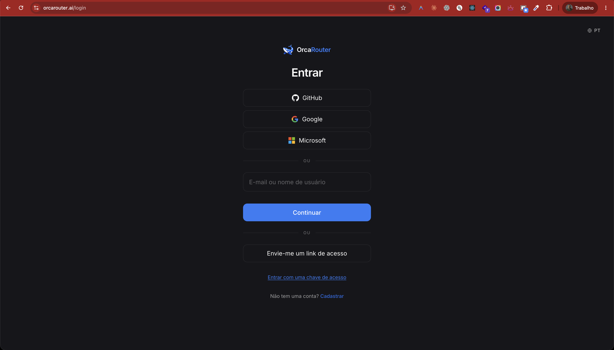

> **Figura 10:** Tela de login no portal do OrcaRouter.

Ao entrar, a página de visão geral apresenta o ecossistema de APIs unificadas e os benefícios do roteamento inteligente:

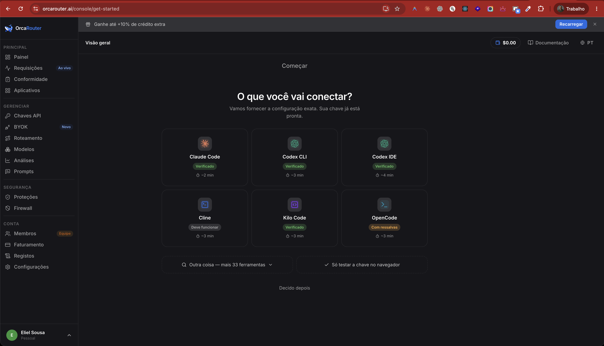

> **Figura 11:** Apresentação da arquitetura multi-provedor do OrcaRouter.

Navegue até o **Dashboard** principal para visualizar o painel operacional:

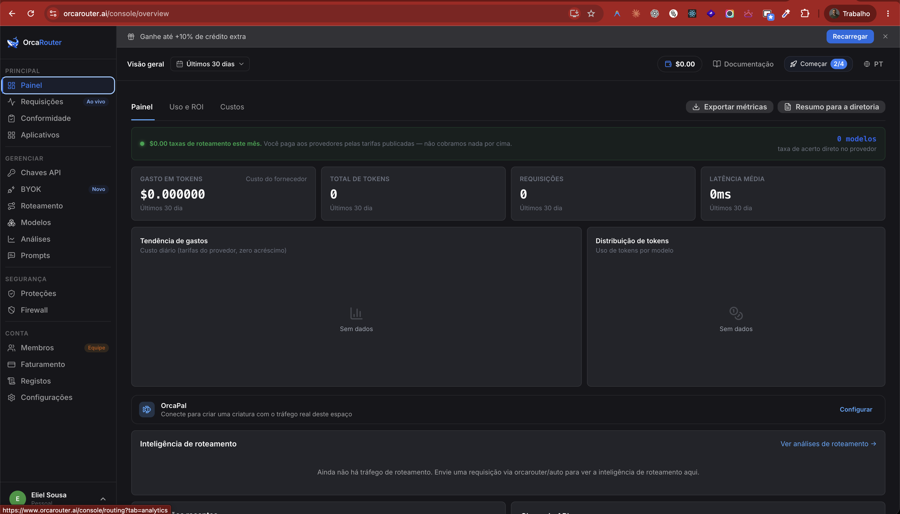

> **Figura 12:** Dashboard de monitoramento do OrcaRouter.

### 2. Navegação no Catálogo de Modelos e Provedores

Na aba **Providers**, você encontra a lista de empresas integradas à rede:

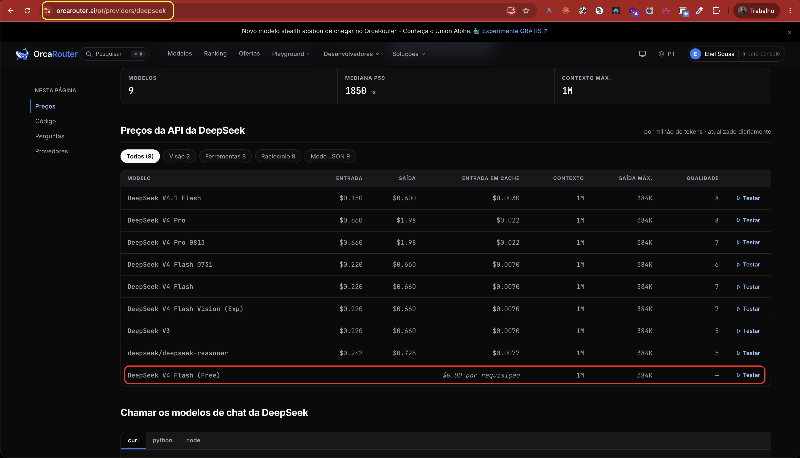

> **Figura 13:** Provedores de modelos disponíveis na plataforma.

Acessando a seção **Models**, consulte o catálogo global de inteligência artificial:

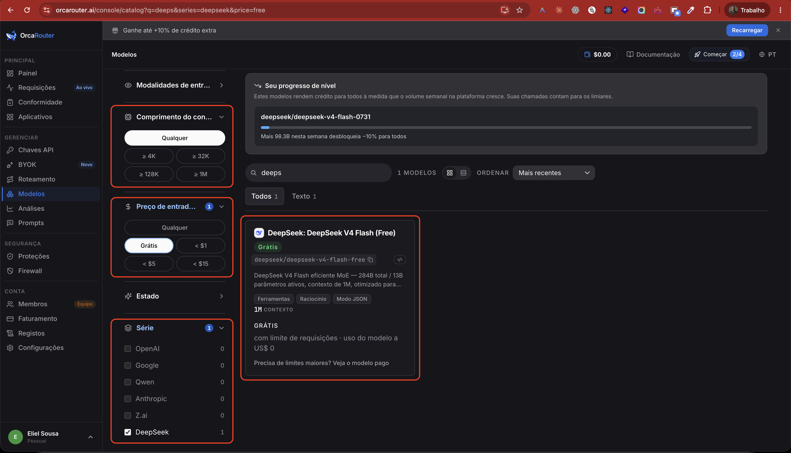

> **Figura 14:** Lista de modelos indexados no gateway.

Filtre os modelos disponíveis para localizar as variantes gratuitas com o rótulo **FREE**:

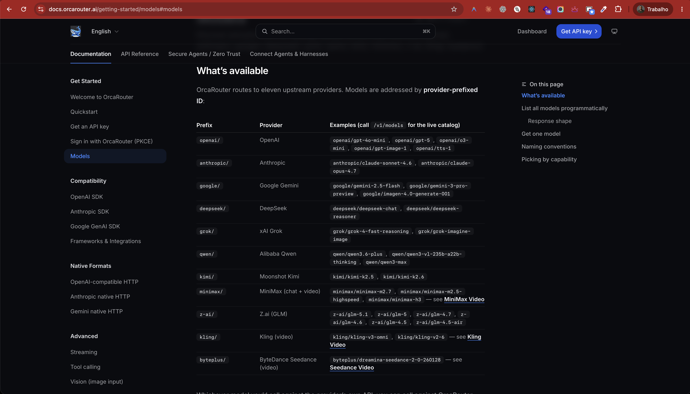

> **Figura 15:** Filtro de modelos, destacando o `deepseek/deepseek-v4-flash-free` com janela massiva de contexto.

### 3. Vinculação do GitHub: o Requisito de Elegibilidade dos Modelos Gratuitos

Aqui está o detalhe que costuma passar despercebido e depois vira um erro de cota inexplicável. Na **Visão geral** do console, o card do GitHub explica a regra em uma frase:

> *"Uma conta GitHub associada conta para a elegibilidade dos modelos gratuitos nos espaços de trabalho de que é proprietário."*

Ou seja: a vinculação **não serve para criar chaves** — você consegue gerar uma chave sem ela. Ela é o que torna a sua conta elegível ao tier gratuito. Sem esse passo, o `deepseek/deepseek-v4-flash-free` existe no catálogo mas as chamadas não são atendidas como gratuitas.

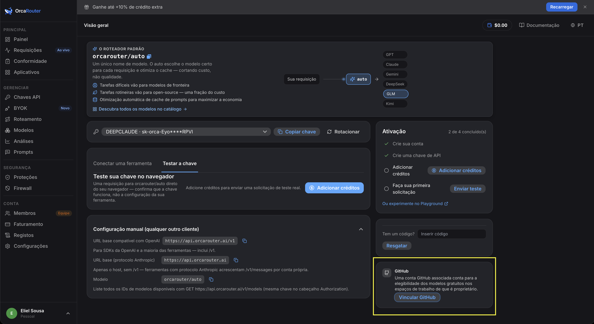

> **Figura 16:** Visão geral do console do OrcaRouter. À direita, o card **Vincular GitHub** (destacado) e o checklist de ativação em "2 de 4 concluídos". À esquerda, o bloco **Configuração manual** já entrega os dois dados que vamos usar: a URL base compatível com OpenAI (`https://api.orcarouter.ai/v1`) e a **URL base do protocolo Anthropic** (`https://api.orcarouter.ai`, sem `/v1`).

Após autorizar, o card passa a exibir o selo **Vinculada**. Nessa mesma tela, a aba *Conectar uma ferramenta* mostra o **Claude Code** com o rótulo **Verificado** e entrega o bloco de variáveis pronto:

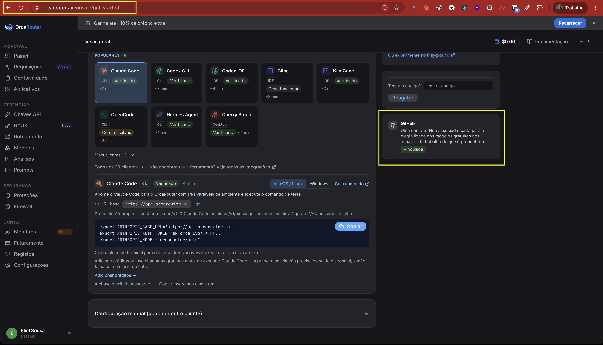

> **Figura 17:** GitHub com o selo "Vinculada" e o Claude Code listado entre os 39 clientes suportados, marcado como "Verificado" com instalação estimada em ~2 min. O painel exibe o mesmo trio de variáveis que usamos no `settings.local.json` (`ANTHROPIC_BASE_URL`, `ANTHROPIC_AUTH_TOKEN`, `ANTHROPIC_MODEL`).

> [!WARNING]
> ### O Aviso do `/v1` Duplicado Está na Própria Tela
> Note a frase exibida pelo OrcaRouter logo abaixo da URL base:
>
> > *"Protocolo Anthropic — host puro, sem /v1. O Claude Code adiciona /v1/messages sozinho; incluir /v1 gera /v1/v1/messages e falha."*
>
> É o erro de integração mais comum com gateways compatíveis. A URL base vai **sem** o sufixo: `https://api.orcarouter.ai`. Quem copia a URL do SDK da OpenAI (que termina em `/v1`) por engano recebe uma falha de rota que não menciona a causa. O verificador `src/verify_deepclaude.py` deste módulo checa exatamente isso.

### 4. Geração do Token de API no OrcaRouter

No menu lateral, selecione **API Keys** e clique em **Create Key**:

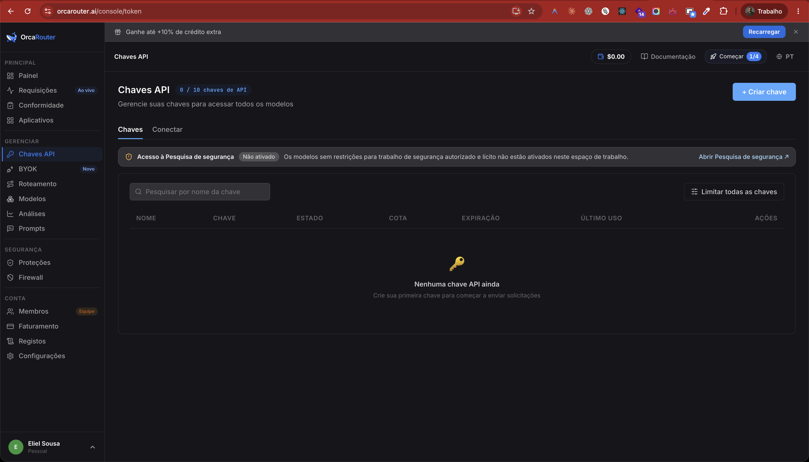

> **Figura 18:** Painel **Chaves API** ainda zerado (`0 / 10 chaves de API`), com o botão **+ Criar chave** no canto superior direito.

Dê um nome à chave (usamos `DEEPCLAUDE`) e, no campo **Acesso a modelos**, restrinja-a explicitamente ao modelo gratuito. Essa restrição é uma trava de custo: uma chave irrestrita pode, por engano de configuração, cair em um modelo pago do catálogo.

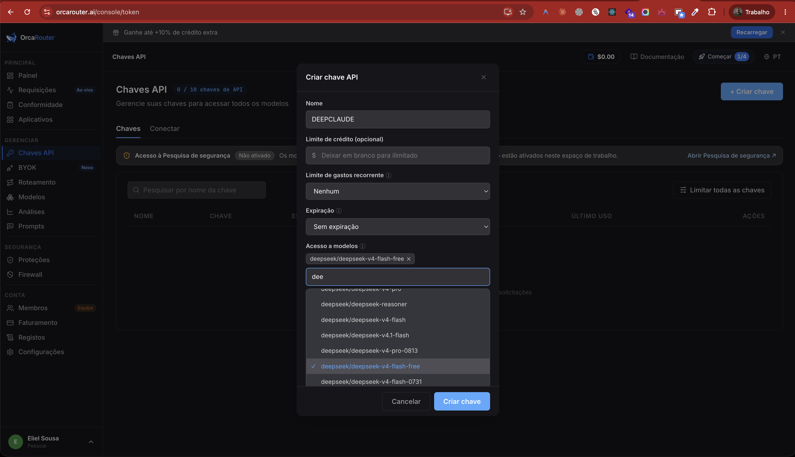

> **Figura 19:** Campo **Acesso a modelos** com `deepseek/deepseek-v4-flash-free` selecionado. O dropdown revela que o OrcaRouter carrega a família DeepSeek inteira — `deepseek-v4-pro`, `deepseek-reasoner`, `deepseek-v4-flash`, `deepseek-v4.1-flash`, `deepseek-v4-pro-0813`, `deepseek-v4-flash-0731` — mas **apenas a variante com sufixo `-free` é gratuita**.

O restante do formulário define os limites de governança da chave: limite de crédito, gasto recorrente, expiração, *guardrail*, política de firewall e acesso ao gateway MCP.


> **Figura 20:** Formulário completo de criação. Para o laboratório deste artigo, os padrões servem: crédito ilimitado, sem expiração e sem guardrail.

Ao confirmar, o OrcaRouter exibe a chave **uma única vez**, junto de um trecho pronto de primeira chamada em cURL, Python ou Node.js:

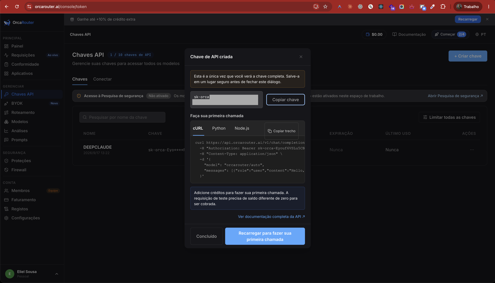

> **Figura 21:** Diálogo **Chave de API criada**, com o alerta *"Esta é a única vez que você verá a chave completa"*. Observe também o aviso de que a requisição de teste do painel exige saldo — ele se aplica ao botão de teste, não ao modelo `-free`, que responde sem crédito.

Fechado o diálogo, a chave aparece na listagem com o estado **Ativo**:

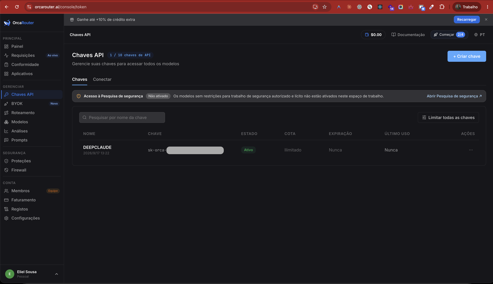

> **Figura 22:** Chave `DEEPCLAUDE` ativa, com cota **Ilimitado**, sem expiração e ainda sem uso registrado. O contador do topo agora marca `1 / 10 chaves de API`.

### 5. Endpoints e Modelos Gratuitos no Catálogo

A documentação oficial do OrcaRouter tem uma página dedicada à compatibilidade com o SDK da Anthropic, que confirma o desenho que estamos usando:


> **Figura 23:** Página *Compatibilidade → SDK da Anthropic* em `docs.orcarouter.ai`. O texto é explícito: *"O SDK da Anthropic anexa `/v1/messages` ao seu `base_url`, então o host puro (sem `/v1`) é a forma correta"*. Streaming, uso de ferramentas, *prompt caching* (`cache_control`) e visão funcionam de ponta a ponta.

Filtrando o catálogo por preço **Grátis**, vemos o conjunto completo do tier gratuito na data de publicação:


> **Figura 24:** Seis modelos gratuitos disponíveis, ordenados por janela de contexto: `deepseek/deepseek-v4-flash-free` e `z-ai/glm-5.3-flash-free` (ambos com **1M**), `stealth/union-alpha-free` e `tencent/hy3-free` (262K), além de `orcarouter/free` e `orca/orcaverify-text1.0-free`. Todos marcados como **GRÁTIS COM LIMITE DE REQUISIÇÕES** — a gratuidade vem acompanhada de limite de taxa, não de um teto de tokens.

### 6. Testando o Modelo no Playground Oficial antes de Configurar a CLI

Uma das grandes vantagens do ecossistema OrcaRouter é a existência de um Playground interativo web. Antes mesmo de abrir o terminal ou configurar o Claude Code, você pode validar a disponibilidade, a velocidade de inferência e a qualidade de raciocínio do modelo gratuito diretamente pelo link oficial:

👉 **[OrcaRouter Playground - DeepSeek V4 Flash FREE](https://www.orcarouter.ai/pt/playground?model=deepseek%2Fdeepseek-v4-flash-free)**

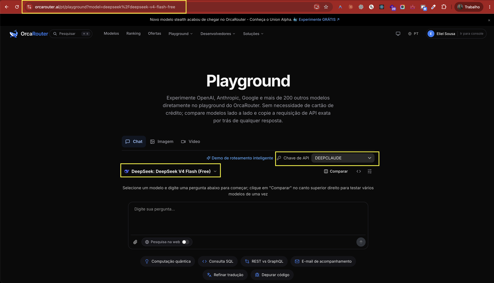

> **Figura 25:** Playground do OrcaRouter carregando o modelo `deepseek/deepseek-v4-flash-free` pronto para inferência interativa.

Envie um prompt de teste para verificar a latência e a precisão da resposta gerada:

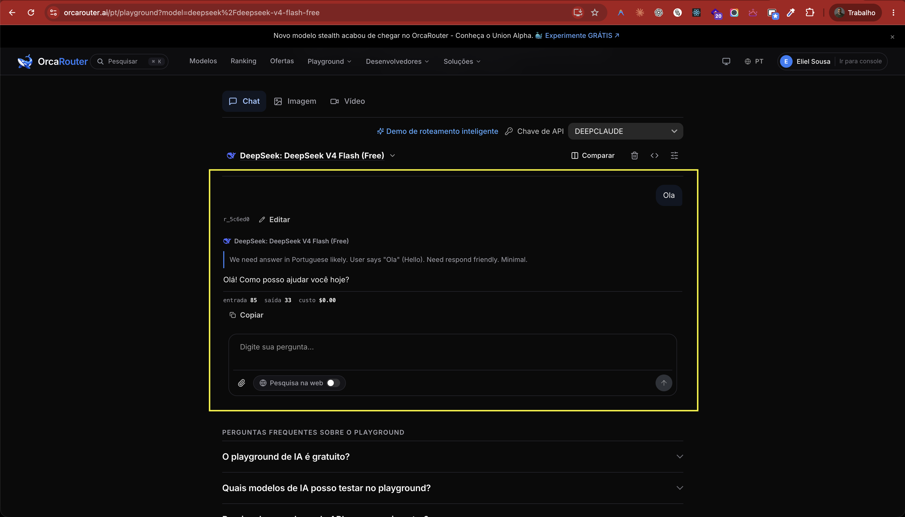

> **Figura 26:** Resposta gerada no Playground com a chave `DEEPCLAUDE` selecionada. O rodapé da resposta fecha a prova: `entrada 85 · saída 33 · custo $0.00`. Note também o bloco de raciocínio exibido antes da resposta — o DeepSeek V4 Flash emite *thinking* nativo, que é o que o Claude Code aproveita nas tarefas agênticas.

> [!WARNING]
> ### Regra de Volatilidade de Provedores Gratuitos
> Conforme detalhamos no [Artigo 0003](../../0003_fallback_modelos_gratuitos_9router/article/ARTICLE.md#modelos-gratuitos-volatilidade-e-catálogo-verificado), **modelos com sufixo `:free` ou gratuitos são concessões temporárias dos provedores, não contratos permanentes**. O catálogo pode ser alterado, exigir novas permissões ou sofrer limites de requisição por minuto. Por essa razão, manter o DeepSeek Platform como alternativa de prontidão ou associar o OrcaRouter a uma cascata de fallback no 9Router é a prática recomendada de engenharia.

---

## A Arquitetura de Configurações do Claude Code: `settings.json` vs `settings.local.json`

Uma das dúvidas mais frequentes entre desenvolvedores que configuram o Claude Code com provedores alternativos é: *onde devo declarar as configurações? Em um `settings.json` ou em um `settings.local.json`? E qual é a precedência entre eles?*

### Os Cinco Escopos de Configuração da CLI

O Claude Code resolve configurações por camadas. A ordem de precedência (do mais forte para o mais fraco) é:

```text
1. Políticas Corporativas / Gerenciadas (managed settings)
      ↓ (sobrescreve)
2. Flag de Linha de Comando (claude --settings <arquivo>)
      ↓ (sobrescreve)
3. Configuração Local da Máquina (.claude/settings.local.json)
      ↓ (sobrescreve)
4. Configuração Compartilhada do Projeto (.claude/settings.json)
      ↓ (sobrescreve)
5. Configuração Global de Usuário (~/.claude/settings.json)
```

Essa nomenclatura não é invenção nossa: ela está no próprio binário da CLI, que identifica internamente as cinco fontes como `policySettings`, `flagSettings`, `localSettings`, `projectSettings` e `userSettings`.

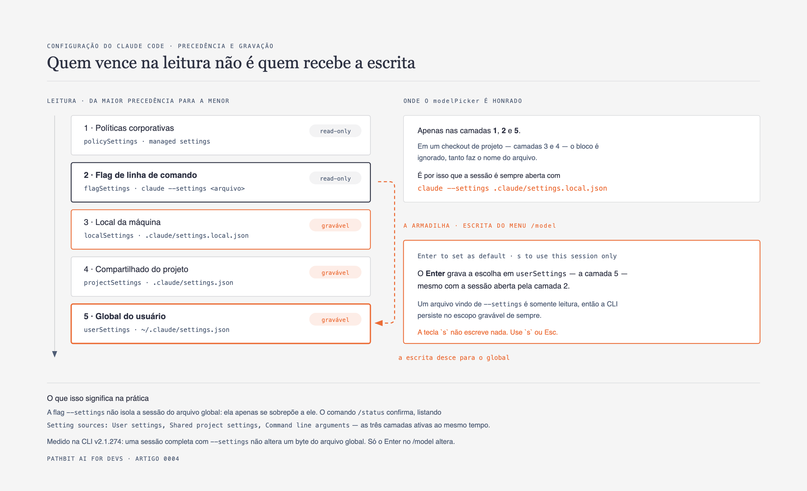

> **Figura 27:** As cinco camadas em ordem de precedência de **leitura**, com duas informações que costumam ser confundidas. À direita, em cima: o `modelPicker` só é honrado nas camadas 1, 2 e 5 — nunca a partir de um checkout de projeto. À direita, embaixo: o caminho de **escrita** do menu `/model`, que ignora a camada pela qual a sessão foi aberta e vai sempre parar na camada 5, o arquivo global do usuário.

### Por Que Este Repositório Usa `settings.local.json` (e Não `settings.json`)

| Arquivo | Finalidade Técnica | Decisão deste Repositório |
| :--- | :--- | :--- |
| **`.claude/settings.json`** | Políticas e variáveis **compartilhadas do repositório**, comitadas no Git para todo o time herdar. | **Não usamos.** Um arquivo commitado que redireciona o harness para outro provedor seria imposto a qualquer pessoa que clonasse o repositório. |
| **`.claude/settings.local.json`** | Preferências **exclusivas da sua máquina**, equivalentes a uma credencial pessoal. Tem precedência sobre o anterior. | **É o que usamos.** O arquivo carrega o seu token privado, então ele é pessoal por natureza — e já está protegido pelo `.gitignore`. |

Versionamos apenas os templates terminados em `.example`; a cópia ativa `settings.local.json` nunca entra no Git. Assim, o token real jamais é comitado por acidente.

> [!IMPORTANT]
> ### Um Arquivo Ativo na Pasta Vale para Qualquer Sessão Aberta Ali
> Tanto `settings.json` quanto `settings.local.json` são **carregados automaticamente** quando você roda `claude` dentro daquela pasta — com ou sem a flag `--settings`. Isso é o comportamento desejado no diretório de laboratório (`examples/`), mas significa que, enquanto o arquivo ativo existir ali, **qualquer** sessão aberta nessa pasta usará o DeepSeek, inclusive se você estiver logado com a sua conta Anthropic.
>
> Se quiser voltar a usar a sua conta Anthropic normalmente, faça uma destas duas coisas: abra o Claude Code **fora** de `examples/`, ou remova o arquivo ativo (`rm .claude/settings.local.json`). Os templates `.example` continuam no lugar para você recriá-lo quando quiser.

### A Limitação Crítica do `modelPicker` em Checkouts de Projeto

Muitos desenvolvedores declaram o bloco `modelPicker` no `.claude/settings.json` ou `.claude/settings.local.json` do projeto esperando que o comando `/model` exiba um menu com os nomes customizados — e nada acontece.

A razão está documentada dentro do próprio binário da CLI, na descrição da chave:

> *"Curate the /model picker: an ordered list of models with your own labels... **Honored from managed, --settings/SDK, and user settings only (not from a project checkout)**; the highest-precedence of those that defines modelPicker wins outright (no merging across sources)."*

Ou seja: o `modelPicker` é honrado em exatamente três situações — políticas corporativas, o arquivo global `~/.claude/settings.json`, ou um arquivo passado explicitamente com `--settings`. **Um arquivo dentro de `.claude/` do projeto nunca serve**, independentemente de se chamar `settings.json` ou `settings.local.json`.

É exatamente por isso que, neste artigo, iniciamos a sessão sempre assim:

```bash
claude --settings .claude/settings.local.json
```

A flag transforma o arquivo na fonte `flagSettings`, que fica logo abaixo das políticas corporativas na hierarquia — e aí, sim, o menu `/model` passa a exibir os rótulos que você escreveu.

Como reforço (e para o caso de alguém abrir a sessão sem a flag), os templates também declaram `ANTHROPIC_DEFAULT_*_MODEL_NAME` e `ANTHROPIC_DEFAULT_*_MODEL_DESCRIPTION`. Essas variáveis alimentam os rótulos dos quatro papéis nativos (`OPUS`, `SONNET`, `FABLE` e `HAIKU`) e funcionam mesmo quando o `modelPicker` é ignorado.

> [!WARNING]
> ### O `--settings` Não "Isola" da Configuração Global — Ele se Sobrepõe a Ela
> É comum ler que a flag `--settings` blinda a sessão contra o arquivo global. **Não é o que acontece.** A flag adiciona uma camada de precedência mais alta; o `~/.claude/settings.json` continua sendo lido e tudo que ele define e o seu arquivo não sobrescreve permanece valendo.
>
> Você pode conferir isso na própria CLI: rode `/status` e observe a linha `Setting sources`. Com a sessão iniciada via flag, ela mostra as três fontes ativas simultaneamente — como aparece na Figura 35 deste artigo:
>
> ```text
> Setting sources:  User settings, Shared project settings, Command line arguments
> ```
>
> Na prática isso raramente incomoda, porque os templates deste repositório declaram explicitamente tudo que importa (modelo, URL base, token, permissões). Mas é a diferença entre entender a ferramenta e repetir uma crença.

## Anatomia das Configurações Prontas para Uso

Abaixo transcrevemos integralmente os dois modelos de configuração que você encontra na pasta [examples/.claude/](../examples/.claude/). Ambos já vêm com permissões completas, supressão de diálogos de risco, mapeamento dos quatro papéis e as chaves que evitam as falhas em tempo de execução descritas ao longo do artigo.

> [!IMPORTANT]
> ### Passo Obrigatório: Faça a Cópia do `.example` ANTES de Iniciar os Testes
> Por questões de segurança e boas práticas de engenharia, este repositório **apenas versiona arquivos de template** terminados em `.example` (o arquivo ativo `settings.local.json` fica protegido no `.gitignore` para você nunca comitar suas credenciais privadas acidentalmente no Git).
> 
> Antes de abrir o Claude Code ou rodar qualquer comando no terminal:
> 1. Escolha o provedor desejado e copie o modelo para o arquivo ativo `.claude/settings.local.json`:
>    * **Se for utilizar a DeepSeek Platform:**
>      ```bash
>      cp examples/.claude/settings.local.json.deepseek.example examples/.claude/settings.local.json
>      ```
>    * **Se for utilizar o OrcaRouter (cota gratuita):**
>      ```bash
>      cp examples/.claude/settings.local.json.orcarouter.example examples/.claude/settings.local.json
>      ```
> 2. Abra o arquivo gerado (`examples/.claude/settings.local.json`) e preencha a variável `ANTHROPIC_AUTH_TOKEN` com a sua chave real (`sk-...`).
> 3. **Regra de Ouro de Execução:** Inicie a sessão **sempre** com a flag `--settings`:
>    ```bash
>    cd examples
>    claude --settings .claude/settings.local.json
>    ```
>    Essa prática é o que faz o bloco `modelPicker` ser honrado: sem a flag, um arquivo dentro de `.claude/` é tratado como *project checkout* e o menu customizado é ignorado. A flag também coloca o seu arquivo acima do global na ordem de precedência — o que **não** é o mesmo que isolar a sessão dele (veja o aviso na seção anterior).

### Exemplo 1: DeepSeek Platform (`settings.local.json.deepseek.example`)

```json
{
    "model": "deepseek-v4-pro",
    "env": {
        "ANTHROPIC_BASE_URL": "https://api.deepseek.com/anthropic",
        "ANTHROPIC_AUTH_TOKEN": "sk-sua-chave-do-DEEPSEEK-PLATFORM",
        "CLAUDE_CODE_DISABLE_UNKNOWN_MODEL_WINDOW_ENFORCEMENT": "1",
        "ANTHROPIC_DEFAULT_OPUS_MODEL": "deepseek-v4-pro",
        "ANTHROPIC_DEFAULT_OPUS_MODEL_NAME": "DeepSeek V4 PRO (Opus)",
        "ANTHROPIC_DEFAULT_OPUS_MODEL_DESCRIPTION": "Primario: raciocinio alto, 1M de contexto",
        "ANTHROPIC_DEFAULT_SONNET_MODEL": "deepseek-flash",
        "ANTHROPIC_DEFAULT_SONNET_MODEL_NAME": "DeepSeek Flash (Sonnet)",
        "ANTHROPIC_DEFAULT_SONNET_MODEL_DESCRIPTION": "Trabalho corrente: alta velocidade e baixa latencia",
        "ANTHROPIC_DEFAULT_FABLE_MODEL": "deepseek-v4-pro",
        "ANTHROPIC_DEFAULT_FABLE_MODEL_NAME": "DeepSeek V4 PRO (Fable)",
        "ANTHROPIC_DEFAULT_FABLE_MODEL_DESCRIPTION": "Tarefas longas e raciocinio profundo",
        "ANTHROPIC_DEFAULT_HAIKU_MODEL": "deepseek-flash",
        "ANTHROPIC_DEFAULT_HAIKU_MODEL_NAME": "DeepSeek Flash (Haiku)",
        "ANTHROPIC_DEFAULT_HAIKU_MODEL_DESCRIPTION": "Latencia minima e respostas rapidas",
        "ANTHROPIC_MODEL": "deepseek-flash",
        "CLAUDE_CODE_SUBAGENT_MODEL": "deepseek-flash",
        "CLAUDE_CODE_EFFORT_LEVEL": "max",
        "CLAUDE_CODE_AUTO_COMPACT_WINDOW": "786432",
        "CLAUDE_CODE_DISABLE_ADVISOR_TOOL": "1"
    },
    "permissions": {
        "defaultMode": "bypassPermissions",
        "allow": [
            "Bash(*)",
            "Read(*)",
            "Edit(*)",
            "Write(*)",
            "Glob(*)",
            "Grep(*)",
            "WebFetch(*)",
            "WebSearch(*)",
            "NotebookEdit(*)",
            "TodoWrite(*)",
            "Agent(*)",
            "Skill(*)"
        ]
    },
    "skipDangerousModePermissionPrompt": true,
    "includeCoAuthoredBy": false,
    "modelPicker": {
        "replaceBuiltInOptions": true,
        "options": [
            {
                "model": "deepseek-flash",
                "label": "DeepSeek Flash (Sonnet)",
                "description": "Trabalho corrente: alta velocidade e baixa latencia",
                "behavesAs": "claude-sonnet-4-6"
            },
            {
                "model": "deepseek-v4-pro",
                "label": "DeepSeek V4 PRO (Opus)",
                "description": "Primario: raciocinio alto, 1M de contexto",
                "behavesAs": "claude-sonnet-4-6"
            },
            {
                "model": "deepseek-v4-pro",
                "label": "DeepSeek V4 PRO (Fable)",
                "description": "Tarefas longas e raciocinio profundo",
                "behavesAs": "claude-sonnet-4-6"
            },
            {
                "model": "deepseek-flash",
                "label": "DeepSeek Flash (Haiku)",
                "description": "Latencia minima e respostas rapidas",
                "behavesAs": "claude-haiku-4-5-20251001"
            }
        ]
    },
    "modelOverrides": {
        "claude-fable-5-1": "deepseek-v4-pro",
        "claude-opus-5": "deepseek-v4-pro",
        "claude-sonnet-5": "deepseek-flash"
    }
}
```

### Exemplo 2: OrcaRouter (`settings.local.json.orcarouter.example`)

```json
{
    "model": "deepseek/deepseek-v4-flash-free",
    "env": {
        "ANTHROPIC_BASE_URL": "https://api.orcarouter.ai",
        "ANTHROPIC_AUTH_TOKEN": "sk-sua-chave-do-ORCA-ROUTER",
        "CLAUDE_CODE_DISABLE_UNKNOWN_MODEL_WINDOW_ENFORCEMENT": "1",
        "ANTHROPIC_DEFAULT_OPUS_MODEL": "deepseek/deepseek-v4-flash-free",
        "ANTHROPIC_DEFAULT_OPUS_MODEL_NAME": "DeepSeek V4 Flash FREE (Opus)",
        "ANTHROPIC_DEFAULT_OPUS_MODEL_DESCRIPTION": "OrcaRouter Free: 1M contexto",
        "ANTHROPIC_DEFAULT_SONNET_MODEL": "deepseek/deepseek-v4-flash-free",
        "ANTHROPIC_DEFAULT_SONNET_MODEL_NAME": "DeepSeek V4 Flash FREE (Sonnet)",
        "ANTHROPIC_DEFAULT_SONNET_MODEL_DESCRIPTION": "OrcaRouter Free: alta velocidade",
        "ANTHROPIC_DEFAULT_FABLE_MODEL": "deepseek/deepseek-v4-flash-free",
        "ANTHROPIC_DEFAULT_FABLE_MODEL_NAME": "DeepSeek V4 Flash FREE (Fable)",
        "ANTHROPIC_DEFAULT_FABLE_MODEL_DESCRIPTION": "OrcaRouter Free: tarefas analiticas",
        "ANTHROPIC_DEFAULT_HAIKU_MODEL": "deepseek/deepseek-v4-flash-free",
        "ANTHROPIC_DEFAULT_HAIKU_MODEL_NAME": "DeepSeek V4 Flash FREE (Haiku)",
        "ANTHROPIC_DEFAULT_HAIKU_MODEL_DESCRIPTION": "OrcaRouter Free: respostas rapidas",
        "ANTHROPIC_MODEL": "deepseek/deepseek-v4-flash-free",
        "CLAUDE_CODE_SUBAGENT_MODEL": "deepseek/deepseek-v4-flash-free",
        "CLAUDE_CODE_EFFORT_LEVEL": "max",
        "CLAUDE_CODE_AUTO_COMPACT_WINDOW": "786432",
        "CLAUDE_CODE_DISABLE_ADVISOR_TOOL": "1"
    },
    "permissions": {
        "defaultMode": "bypassPermissions",
        "allow": [
            "Bash(*)",
            "Read(*)",
            "Edit(*)",
            "Write(*)",
            "Glob(*)",
            "Grep(*)",
            "WebFetch(*)",
            "WebSearch(*)",
            "NotebookEdit(*)",
            "TodoWrite(*)",
            "Agent(*)",
            "Skill(*)"
        ]
    },
    "skipDangerousModePermissionPrompt": true,
    "includeCoAuthoredBy": false,
    "modelPicker": {
        "replaceBuiltInOptions": true,
        "options": [
            {
                "model": "deepseek/deepseek-v4-flash-free",
                "label": "DeepSeek V4 Flash FREE (Sonnet)",
                "description": "OrcaRouter Free: trabalho corrente e 1M de contexto",
                "behavesAs": "claude-sonnet-4-6"
            },
            {
                "model": "deepseek/deepseek-v4-flash-free",
                "label": "DeepSeek V4 Flash FREE (Opus)",
                "description": "OrcaRouter Free: raciocinio primario",
                "behavesAs": "claude-sonnet-4-6"
            },
            {
                "model": "deepseek/deepseek-v4-flash-free",
                "label": "DeepSeek V4 Flash FREE (Fable)",
                "description": "OrcaRouter Free: tarefas analiticas e longas",
                "behavesAs": "claude-sonnet-4-6"
            },
            {
                "model": "deepseek/deepseek-v4-flash-free",
                "label": "DeepSeek V4 Flash FREE (Haiku)",
                "description": "OrcaRouter Free: latencia minima e respostas rapidas",
                "behavesAs": "claude-haiku-4-5-20251001"
            }
        ]
    },
    "modelOverrides": {
        "claude-fable-5-1": "deepseek/deepseek-v4-flash-free",
        "claude-opus-5": "deepseek/deepseek-v4-flash-free",
        "claude-sonnet-5": "deepseek/deepseek-v4-flash-free"
    }
}
```

---

## O Sufixo `[1m]`: Por Que Ele Não Pertence a um Modelo de Terceiros

Quem vem da nuvem oficial da Anthropic está acostumado com o sufixo `[1m]` (como `claude-opus-5[1m]` ou `claude-sonnet-5[1m]`), usado para pedir a janela estendida de 1 milhão de tokens. Daí vem a tentação de escrever:

```json
// ❌ Não faça isso em um modelo de terceiros
"modelOverrides": {
    "claude-fable-5-1": "deepseek-v4-pro[1m]"
}
```

Essa configuração **não derruba a sessão** — e é justamente por isso que ela engana. Vale entender exatamente o que acontece.

### O Que a CLI Faz com o Sufixo

O `[1m]` é um marcador **interno da CLI**, não parte do identificador do modelo. Antes de montar a requisição HTTP, o Claude Code normaliza o nome removendo o sufixo (a função responsável no binário é literalmente `e.replace(/\[1m\]$/i, "")`) e, para os modelos que suportam, traduz o pedido em um cabeçalho beta (`ANTHROPIC_BETAS`).

Consequência prática: ao rodar dentro do Claude Code, `deepseek-v4-pro[1m]` até funciona, porque quem limpa a string é a própria CLI. O rótulo poluído aparece no menu `/model` (*"Use the default model (currently deepseek-v4-pro[1m])"*), mas o payload enviado leva o nome limpo.

### Por Que Remover Assim Mesmo

A limpeza só existe **dentro** do Claude Code. No instante em que o mesmo identificador é usado em qualquer outra camada — um script, um `curl`, um combo do 9Router, um SDK — ele viaja cru e o provedor faz busca exata no catálogo. Comprovamos os dois comportamentos com chamadas reais:

| Destino | Requisição com `[1m]` | Resultado medido |
| :--- | :--- | :--- |
| **DeepSeek Platform** (`api.deepseek.com/anthropic`) | `"model": "deepseek-v4-pro[1m]"` | `HTTP 200` — a plataforma normaliza e responde como `deepseek-v4-pro` |
| **OrcaRouter** (`api.orcarouter.ai`) | `"model": "deepseek/deepseek-v4-flash-free[1m]"` | `HTTP 404 model_not_found` — *"Did you mean deepseek/deepseek-v4-flash-free?"* |

Ou seja: o mesmo sufixo passa silenciosamente em um provedor e quebra no outro. Como este artigo opera os dois caminhos — e como o Artigo 0003 encadeia ambos numa cascata de fallback — manter o identificador canônico puro é a única forma de ter um valor que funciona em todos os pontos da malha.

**A regra é simples:** o `[1m]` não adiciona contexto nenhum em um modelo de terceiros. A janela desses modelos é definida pelo provedor, não por um sufixo no nome. Use sempre `deepseek-v4-pro`, `deepseek-flash` e `deepseek/deepseek-v4-flash-free`.

### A Forma Correta de Controlar a Janela

Para operar janelas grandes sem inventar sufixos, o Claude Code oferece duas chaves no bloco `env`:

1. **`"CLAUDE_CODE_DISABLE_UNKNOWN_MODEL_WINDOW_ENFORCEMENT": "1"`** — impede que a CLI trave o limite de contexto em 200k ao encontrar um modelo fora da lista nativa da Anthropic.
2. **`"CLAUDE_CODE_AUTO_COMPACT_WINDOW": "786432"`** — define o ponto em que a compactação automática do histórico é disparada. O valor `786432` (75% de 1M) deixa bastante folga antes de a sessão começar a resumir mensagens antigas.

---

## Blindagem Contra o Estado Global da CLI (`~/.claude.json`)

O Claude Code armazena fora do projeto, em `~/.claude.json`, um conjunto de estados que nenhuma chave de `settings.local.json` local consegue alterar por desenho:

| Estado Global | Onde Fica Salvo | O Que Provoca Perda do Estado |
| :--- | :--- | :--- |
| **Assistente de primeiro uso** (seleção de tema, notas de segurança) | `~/.claude.json` | Executar `/logout` ou uma instalação nova |
| **Login na conta Anthropic** | `~/.claude.json` + chaveiro do sistema | Executar `/logout` |
| **Aprovação da chave de API** (*"Do you want to use this API key?"*) | `~/.claude.json` | Executar `/logout` |
| **Confiança na pasta do projeto** (*"Do you trust the files in this folder?"*) | `~/.claude.json` (por caminho absoluto) | Renomear, mover ou clonar a pasta em outro local |

Verificamos no código binário da versão 2.1.268 da CLI: o comando `/logout` apaga a lista de chaves aprovadas e marca o assistente de boas-vindas como incompleto. **Enquanto o assistente de primeiro uso está rodando na tela, o `settings.local.json` do projeto ainda não foi carregado.** É por isso que você abre o terminal na pasta e a CLI mostra a tela *"Select login method"*, como se o seu arquivo não existisse.

### As Duas Decisões Arquiteturais que Blindam o Ambiente

1. **`ANTHROPIC_AUTH_TOKEN` no Lugar de `ANTHROPIC_API_KEY`:**
   A variável `ANTHROPIC_API_KEY` vinda de arquivos de configuração exige confirmação interativa do usuário e grava aprovação no `~/.claude.json`. Já `ANTHROPIC_AUTH_TOKEN` é despachada diretamente no cabeçalho HTTP `Authorization: Bearer <token>`, sem exigir diálogo de aprovação nem depender de estado global. Tanto a DeepSeek quanto o OrcaRouter aceitam esse cabeçalho.
2. **Inicialização com `--settings` na Primeira Vez:**
   Ao executar:
   ```bash
   claude --settings .claude/settings.local.json
   ```
   A flag aplica o arquivo de configuração **antes** da execução do assistente de boas-vindas. Com isso, a CLI reconhece a URL customizada de imediato e não exibe nenhuma tela de login da Anthropic. Depois que a pasta for marcada como confiável, as sessões subsequentes podem ser iniciadas diretamente com `claude`.

### ⚠️ A Armadilha do `/model`: Como o DeepSeek Vira o Padrão da Sua Conta Anthropic

Existe um caminho — silencioso e fácil de acionar — pelo qual a configuração do laboratório escapa para a sua conta pessoal. Ele não tem nada a ver com o arquivo do projeto, e é a causa do sintoma *"fiz login com a minha conta Anthropic e o modelo padrão estava DeepSeek"*.

Abra o menu com `/model` e olhe o rodapé do seletor:

```text
Enter to set as default  ·  s to use this session only  ·  Esc to cancel
```

A opção acionada pelo **Enter** — a mais natural, a que todo mundo aperta — significa *"salve como meu padrão para novas sessões"*. E o destino dessa gravação é fixo. Inspecionando o binário da CLI v2.1.274, a função que persiste a escolha é:

```js
async function Bze(e, t, n = O) {
    let i = await pt(en("userSettings", { model: e ?? undefined }, undefined, t), n);
    ...
}
```

O primeiro argumento é `"userSettings"` — literal, sem alternativa. **A escolha do `/model` é sempre gravada como `"model"` no seu `~/.claude/settings.json` global**, mesmo que a sessão tenha sido iniciada com `--settings` apontando para um arquivo do projeto. O motivo é coerente: um arquivo passado por flag é uma fonte *somente leitura* para a CLI (ela avisa isso em outros contextos: *"This rule comes from a read-only source (the --settings flag) and cannot be modified here"*), então, quando precisa persistir algo, ela grava no escopo gravável de sempre.

O resultado é que `~/.claude/settings.json` passa a conter:

```json
{
    "model": "deepseek/deepseek-v4-flash-free"
}
```

E, a partir daí, **toda** nova sessão do Claude Code — em qualquer pasta, com a sua conta Anthropic, sem nenhum arquivo de projeto envolvido — tenta abrir com o modelo DeepSeek.

> [!CAUTION]
> ### As Duas Regras que Evitam o Vazamento
>
> **1. No menu `/model`, use `s`, nunca Enter.** A tecla `s` aplica o modelo apenas à sessão corrente e não escreve nada em disco. Se o seu objetivo é só conferir se os rótulos apareceram corretamente, `Esc` já basta.
>
> **2. Você não precisa do `/model` neste artigo.** Os templates já mapeiam os quatro papéis e definem o modelo ativo. O seletor aqui serve para *inspeção visual*, não para configuração.
>
> **Se já aconteceu com você**, a limpeza é remover a chave `model` do arquivo global:
>
> ```bash
> python3 - <<'PY'
> import json, pathlib
> p = pathlib.Path.home() / ".claude" / "settings.json"
> d = json.loads(p.read_text())
> removido = d.pop("model", None)
> p.write_text(json.dumps(d, indent=2, ensure_ascii=False) + "\n")
> print("Removido:", removido or "(nada a limpar)")
> PY
> ```
>
> O script `src/verify_deepclaude.py` deste módulo faz essa verificação automaticamente e avisa se o seu ambiente global foi contaminado.

Vale registrar o contraponto, porque ele é fácil de confundir: **a flag `--settings`, sozinha, não escreve nada no seu arquivo global.** Medimos o hash SHA-256 de `~/.claude/settings.json` antes e depois de uma sessão completa iniciada com `--settings` (incluindo uma inferência real) e o valor permaneceu idêntico. O vazamento vem exclusivamente do Enter no seletor de modelos.

---

## O Advisor (`/advisor`) NÃO Funciona com Modelos de Terceiros

> [!CAUTION]
> ### REGRA CRÍTICA: Desligue o Advisor com o Kill Switch Documentado
>
> O recurso de Advisor do Claude Code **não é uma chamada adicional feita pela CLI ao LLM**. Ele é uma *server tool* da infraestrutura proprietária da Anthropic: a cada requisição de turno, o Claude Code anexa ao array `tools` um objeto interno:
> ```json
> {"type": "advisor_20260301", "name": "advisor", "model": "..."}
> ```
> É o servidor da nuvem da Anthropic que decide quando consultar o revisor e devolve blocos `advisor_result`. A [documentação oficial da Anthropic](https://code.claude.com/docs/en/advisor) é taxativa: *"the advisor runs server-side on Anthropic's infrastructure as a server tool"* e *"requires the Anthropic API"*.
>
> **O que acontece ao apontar para a DeepSeek ou OrcaRouter com o Advisor ligado:**
> 1. O servidor da DeepSeek recebe a ferramenta desconhecida e rejeita a chamada inteira:
>    ```text
>    HTTP 400 invalid_request_error: tools[0]: unknown variant advisor_20260301, expected web_search_20250305 or web_search_20260209
>    ```
>    Isso derruba a sessão do agente imediatamente no meio de uma tarefa.
> 2. Nenhuma chave como `advisorModel` ou `modelOverrides` resolve isso, pois elas apenas selecionam o modelo dentro da ferramenta, mas não mudam o fato de que a DeepSeek não implementa a execução de ferramentas de servidor da Anthropic.
> 3. **O bug do menu `/advisor`:** O menu interativo lista apenas os três aliases da Anthropic (`fable`, `opus`, `sonnet`). Se dois papéis apontam para o mesmo modelo (por exemplo, `deepseek-v4-pro`), o menu exibe opções duplicadas (como duas linhas com o nome "Fable").
>
> **Como Desligar Definitivamente:**
> No bloco `env` dos seus arquivos de configuração, inclua:
> ```json
> "CLAUDE_CODE_DISABLE_ADVISOR_TOOL": "1"
> ```
> Esse é o kill switch oficial que remove o comando `/advisor` da CLI e impede que a ferramenta seja anexada nas requisições HTTP. Não use `CLAUDE_CODE_ENABLE_EXPERIMENTAL_ADVISOR_TOOL: "0"`, pois o Claude Code interpreta valores `"0"` como variável não definida.

---

## Execução Prática no Terminal e Validação Visual

Vamos acompanhar a execução real do Claude Code em ambos os cenários de arquitetura: primeiro conectando à API direta da **DeepSeek Platform** e, em seguida, alternando para a cota gratuita do **OrcaRouter**.

---

### Cenário 1: Execução e Validação com DeepSeek Platform

Após copiar o template (`cp examples/.claude/settings.local.json.deepseek.example examples/.claude/settings.local.json`) e inserir sua chave de API, inicializamos a CLI isolada de qualquer configuração global.

#### 1. Inicializando a Sessão com `--settings`

No diretório de trabalho, inicialize o Claude Code apontando explicitamente para o arquivo de configuração local:

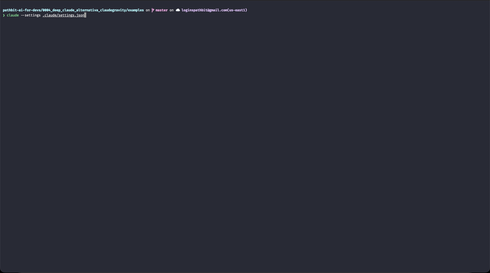

> **Figura 28:** Execução de `claude --settings`, a forma recomendada de abrir a sessão. A flag coloca o arquivo do laboratório acima do global na ordem de precedência e é a única maneira de o `modelPicker` ser honrado a partir de uma pasta de projeto.
>
> *(Nota: a captura foi feita quando o arquivo ativo ainda se chamava `settings.json`. A convenção deste repositório passou a ser `settings.local.json` — por ser um arquivo pessoal, que carrega o seu token e nunca é comitado. O comando é idêntico, mudando apenas o nome do arquivo: `claude --settings .claude/settings.local.json`.)*

A CLI inicia o processo de boot e reconhece as permissões pré-aprovadas:

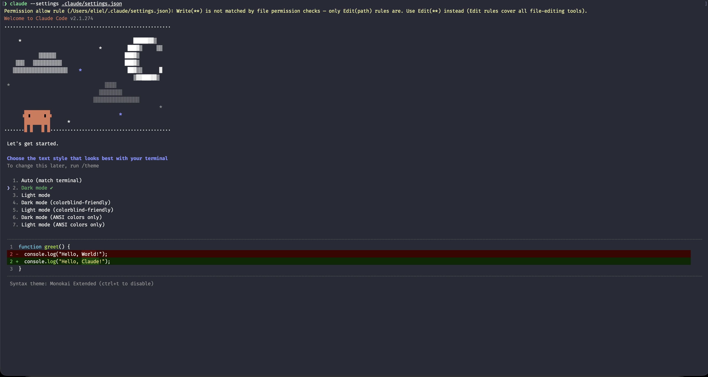

> **Figura 29:** Mensagem de inicialização da CLI Claude Code sem requisição de login na nuvem da Anthropic.

As notas de boas-vindas e o contexto da versão são apresentados de forma limpa:

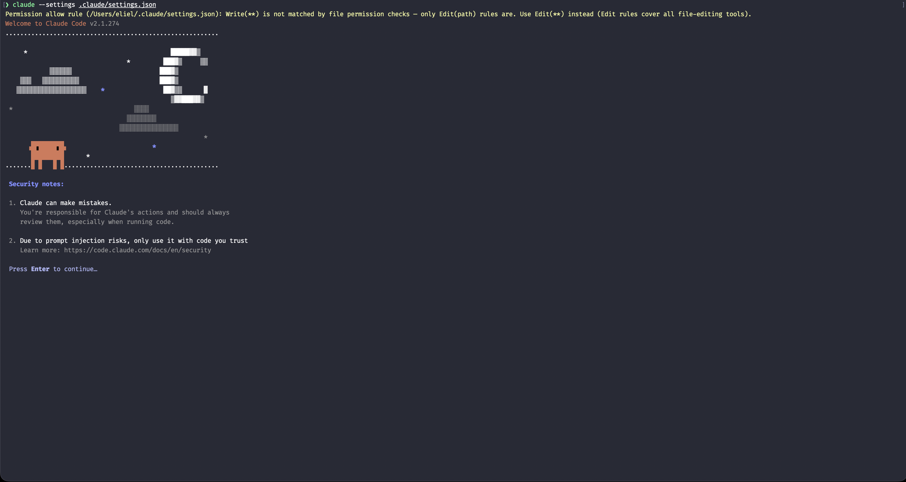

> **Figura 30:** Confirmação de inicialização do ambiente e parâmetros de sessão.

O setup de ferramentas e modos autônomos é carregado com bypass de confirmações de risco:

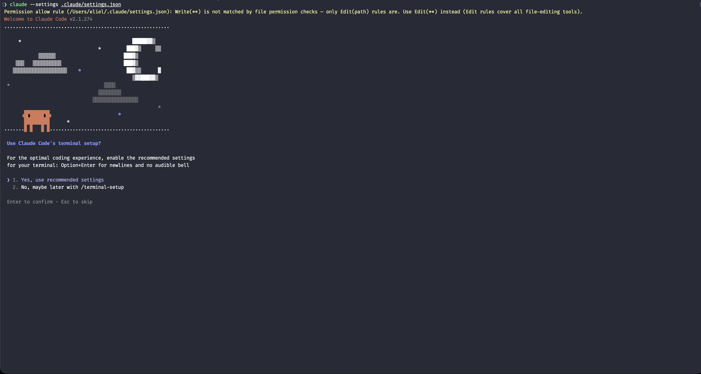

> **Figura 31:** Configurações de permissões ativas, contornando diálogos interativos repetitivos.

#### 2. Sessão Interativa Ativa Conectada à DeepSeek

O terminal abre diretamente no prompt de comando, operacional e conectado ao endpoint oficial da DeepSeek:

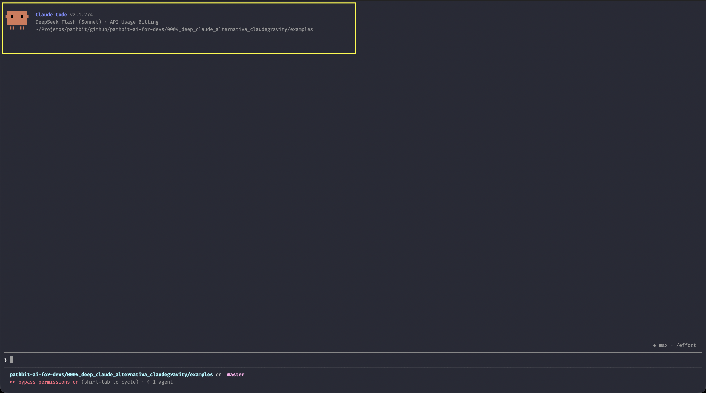

> **Figura 32:** Claude Code em execução ativa conectado ao endpoint oficial da DeepSeek com permissões automáticas.

#### 3. Menu `/model` sem Nenhum Modelo Anthropic

Ao abrir o seletor com `/model`, o Claude Code honra o bloco `modelPicker` com `"replaceBuiltInOptions": true` — e o resultado é o que interessa: **nenhum modelo da Anthropic aparece na lista**.

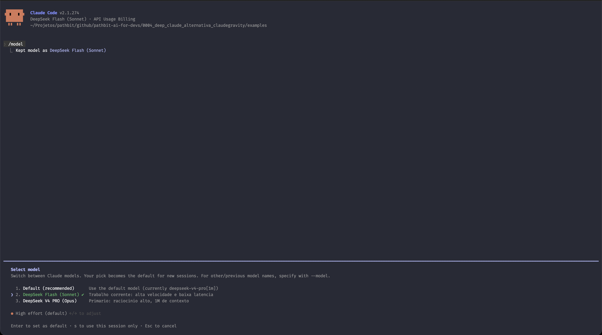

> **Figura 33:** Menu `/model` exibindo apenas `Default (recommended)`, `DeepSeek Flash (Sonnet)` (ativo, marcado com ✔) e `DeepSeek V4 PRO (Opus)`, com as descrições que escrevemos no `modelPicker`. A linha superior confirma `Kept model as DeepSeek Flash (Sonnet)`.

> [!NOTE]
> ### Por Que Aparecem 3 Linhas e Não 4 Papéis
> O `settings.local.json` mapeia quatro papéis (`OPUS`, `SONNET`, `FABLE` e `HAIKU`), mas o seletor lista **modelos distintos**, não papéis. Como `Opus` e `Fable` apontam ambos para `deepseek-v4-pro`, e `Sonnet` e `Haiku` para `deepseek-flash`, o menu consolida os destinos repetidos e mostra duas entradas reais, mais a linha `Default`. Isso é esperado: a DeepSeek Platform oferece exatamente dois modelos, então quatro papéis distintos são impossíveis por definição.
>
> ⚠️ **Não pressione Enter neste menu.** Enter significa *"salvar como padrão"* e grava a escolha no seu `~/.claude/settings.json` global. Use `s` (apenas esta sessão) ou `Esc`. O motivo completo está na seção [A Armadilha do `/model`](#️-a-armadilha-do-model-como-o-deepseek-vira-o-padrão-da-sua-conta-anthropic).

#### 4. Verificação de Status do Modelo Ativo

Para inspecionar o status detalhado da conexão e do modelo atualmente em uso:

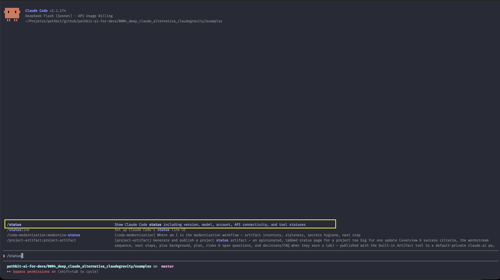

> **Figura 34:** Invocação do comando de status do modelo na sessão do Claude Code.

O painel de status é a melhor evidência de que a configuração foi aplicada como planejado:

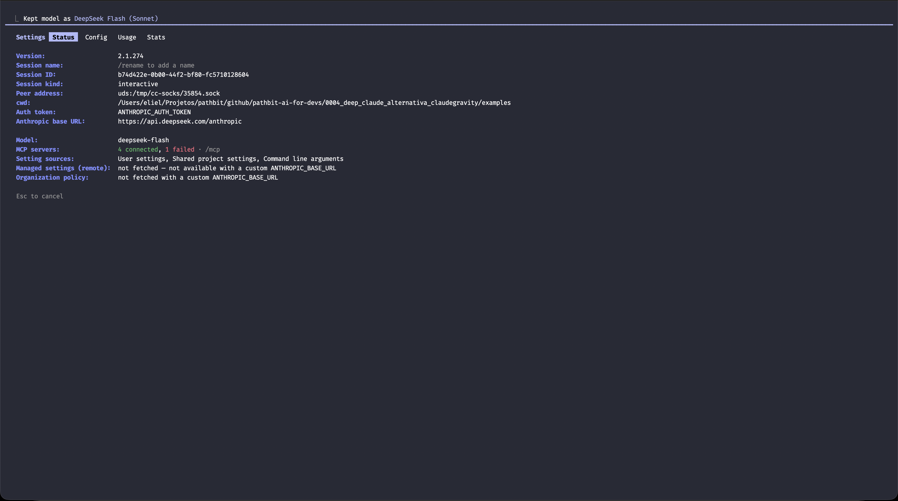

> **Figura 35:** Aba **Status** da sessão. Quatro linhas provam o desenho do artigo: `Auth token: ANTHROPIC_AUTH_TOKEN` (e não `ANTHROPIC_API_KEY`), `Anthropic base URL: https://api.deepseek.com/anthropic`, `Model: deepseek-flash` e `Setting sources: User settings, Shared project settings, Command line arguments`. As duas últimas linhas registram que *managed settings* e política da organização não são buscadas quando existe uma `ANTHROPIC_BASE_URL` customizada.

> [!IMPORTANT]
> Repare na linha `Setting sources`. Ela lista **três** fontes ativas ao mesmo tempo — inclusive `User settings`. É a confirmação prática do que explicamos antes: a flag `--settings` (exibida aqui como *Command line arguments*) **se sobrepõe** ao arquivo global, mas não o desliga.

#### 5. Execução de Tarefas e Validação da Resposta

Submetemos uma pergunta técnica no prompt para testar a inferência do modelo DeepSeek:

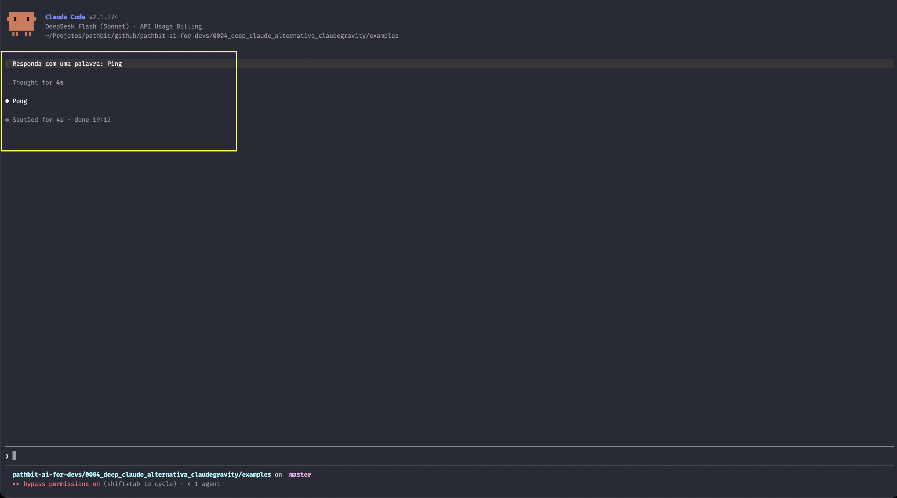

> **Figura 36:** Pergunta submetida no terminal para validação de inferência e raciocínio técnico.

A resposta confirma os três dados que queríamos verificar:

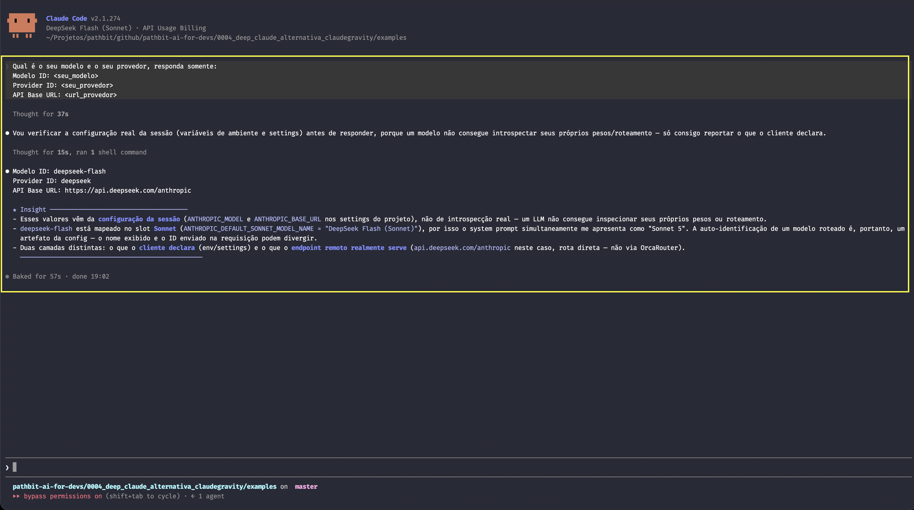

> **Figura 37:** O modelo reporta `Modelo ID: deepseek-flash`, `Provider ID: deepseek` e `API Base URL: https://api.deepseek.com/anthropic`, com blocos de raciocínio visíveis (`Thought for 37s`, `Thought for 15s`). O próprio modelo faz a ressalva correta: esses valores vêm da configuração da sessão, não de introspecção — um LLM não consegue inspecionar os próprios pesos. É por isso que o `/status` da Figura 35 e a resposta do provedor valem mais como prova do que a auto-identificação do modelo.

---

### Cenário 2: Execução e Validação com OrcaRouter Free

Agora, para comutar para a cota gratuita do OrcaRouter, copiamos o segundo template:

```bash
cp examples/.claude/settings.local.json.orcarouter.example examples/.claude/settings.local.json
```

Inserimos a chave gerada no OrcaRouter na variável `ANTHROPIC_AUTH_TOKEN` e disparamos a sessão com `claude --settings .claude/settings.local.json`.

#### 1. Sessão Interativa Ativa com OrcaRouter

A CLI inicializa apontando para a base `https://api.orcarouter.ai` com autenticação Bearer transparente:

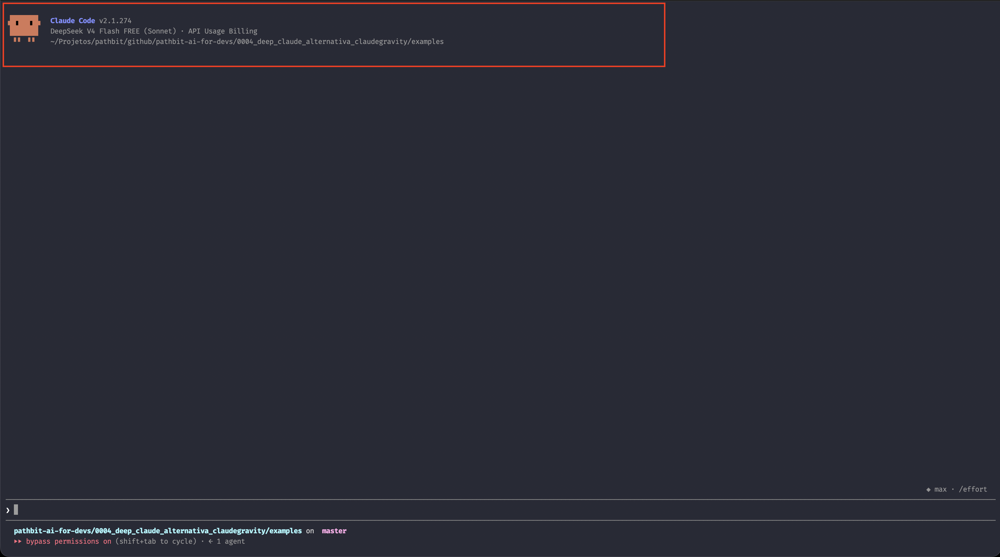

> **Figura 38:** Claude Code operacional e autenticado no gateway OrcaRouter sem qualquer custo de assinatura.

#### 2. Menu `/model` do OrcaRouter

Ao abrir o seletor com `/model`, a lista fica ainda mais enxuta:

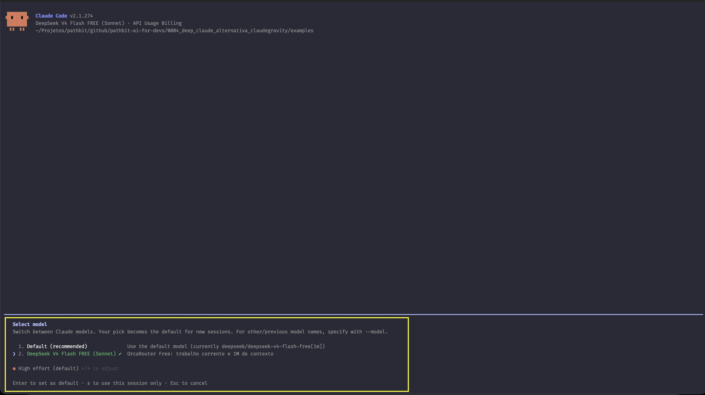

> **Figura 39:** Como no OrcaRouter os quatro papéis apontam para o mesmo `deepseek/deepseek-v4-flash-free`, o seletor consolida tudo em uma única entrada real — `DeepSeek V4 Flash FREE (Sonnet)` — além da linha `Default`. Novamente: nenhum modelo Anthropic na lista, e novamente vale a regra de usar `s` em vez de Enter.

#### 3. Painel de Status do OrcaRouter

Disparando o comando de verificação de status:

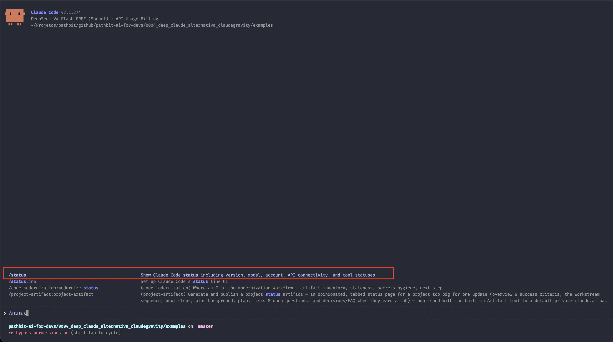

> **Figura 40:** Comando de status disparado na sessão do OrcaRouter.

O painel de status confirma a troca completa de provedor sem nenhuma alteração no harness:

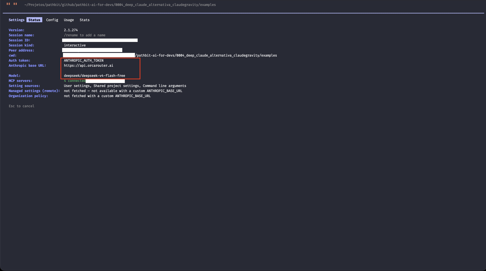

> **Figura 41:** Mesma sessão, outro provedor. `Anthropic base URL` agora aponta para `https://api.orcarouter.ai` e `Model` para `deepseek/deepseek-v4-flash-free`, mantendo `ANTHROPIC_AUTH_TOKEN` como método de autenticação. Trocar de provedor custou exatamente um `cp` de template.

#### 4. Submissão de Prompt e Validação de Resposta Gratuita

Enviamos um prompt no terminal do Claude Code:

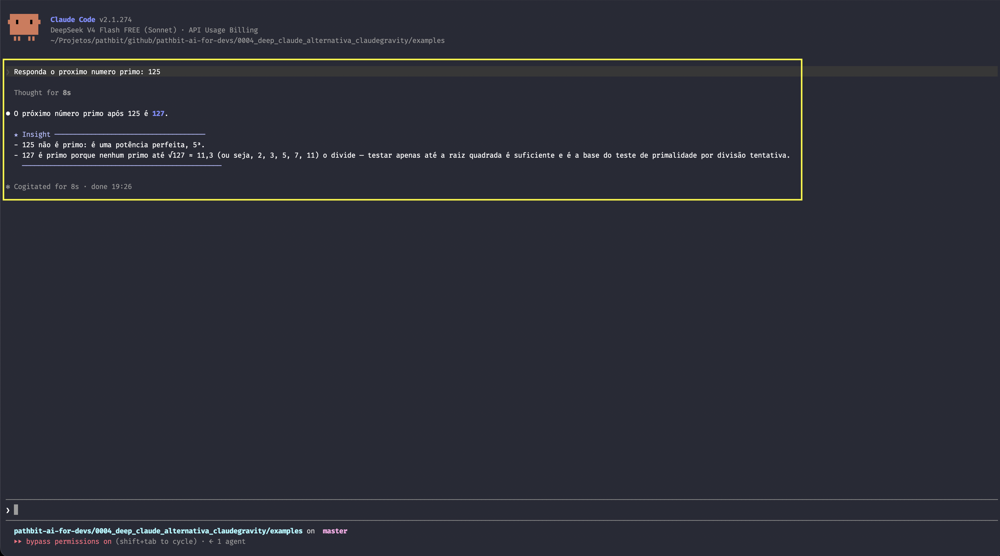

> **Figura 42:** Envio de pergunta no terminal para testar a cota gratuita do OrcaRouter.

A inferência é completada com sucesso, gerando a resposta esperada através da infraestrutura gratuita do OrcaRouter:

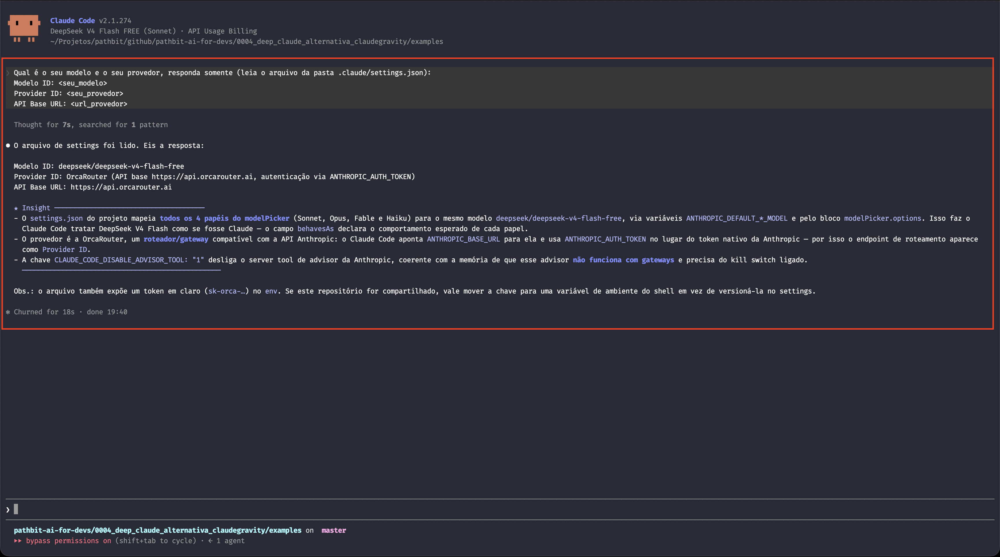

> **Figura 43:** Resposta conclusiva gerada com sucesso via OrcaRouter sem qualquer custo de API.

---

## Integrando DeepSeek e OrcaRouter no 9Router (Conexão com Artigos 0002 e 0003)

Se você já utiliza o gateway **9Router** configurado no [Artigo 0002](../../0002_claude_gravity_utilizando_9router/article/ARTICLE.md) e a malha de resiliência multi-provedores do [Artigo 0003](../../0003_fallback_modelos_gratuitos_9router/article/ARTICLE.md), você não precisa escolher entre o Google Antigravity e o DeepSeek: **você pode ter os dois operando juntos na mesma cascata de fallback**.

No 9Router, cadastre os provedores no painel de administração (`http://localhost:20128`):
1. **DeepSeek Platform:** Provedor do tipo OpenAI ou Anthropic com base `https://api.deepseek.com` e sua chave `sk-...`.
2. **OrcaRouter:** Provedor com base `https://api.orcarouter.ai` e a chave obtida na plataforma.

Em seguida, crie um **Combo de Fallback Híbrido** (por exemplo, `arsenal-cognitivo`):

```text
Nível 1: ag/gemini-3.8-flash-high       (Google Antigravity - rápido, 1M contexto)
   ↓ (se atingir rate limit ou cota)
Nível 2: deepseek/deepseek-v4-pro       (DeepSeek Platform - raciocínio analítico profundo)
   ↓ (se atingir cota de saldo)
Nível 3: orcarouter/deepseek-v4-flash   (OrcaRouter Free - gratuidade com 1M contexto)
   ↓ (se indisponível)
Nível 4: groq/openai/gpt-oss-120b       (Groq LPU - velocidade extrema em frações de segundo)
   ↓
Nível 5: ollama/qwen2.5-coder:7b        (Ollama local - resiliência offline definitiva)
```

Dessa forma, se sua cota diária do Antigravity atingir o teto de requisições, o gateway comuta transparentemente para o DeepSeek V4 PRO sem que o Claude Code interrompa a refatoração ou perca o contexto dos arquivos abertos.

---

## Validação de Ponta a Ponta: as Medições

Nenhuma afirmação deste artigo é de segunda mão. Cada uma foi verificada contra as APIs reais em **17 de setembro de 2026**, com o Claude Code v2.1.274. Abaixo estão os comandos e os resultados obtidos, para você reproduzir no seu ambiente.

### 1. Inferência real nos dois provedores

```bash
# OrcaRouter (protocolo Anthropic, host puro)
curl -s https://api.orcarouter.ai/v1/messages \
  -H "Authorization: Bearer $ORCAROUTER_API_KEY" \
  -H "content-type: application/json" -H "anthropic-version: 2023-06-01" \
  -d '{"model":"deepseek/deepseek-v4-flash-free","max_tokens":64,
       "messages":[{"role":"user","content":"Responda somente: OK"}]}'
```

| Provedor | Modelo pedido | Resultado | Modelo que de fato serviu |
| :--- | :--- | :--- | :--- |
| OrcaRouter | `deepseek/deepseek-v4-flash-free` | `HTTP 200` · `"OK"` | `deepseek-v4-flash-ga-260731` |
| DeepSeek Platform | `deepseek-v4-pro` | `HTTP 200` · `"OK"` | `deepseek-v4-pro` (com bloco `thinking`) |

O campo `model` da resposta do OrcaRouter revela um detalhe útil: o alias `-free` é resolvido para um *snapshot* datado. É por isso que tratamos o tier gratuito como concessão temporária, não como contrato.

### 2. O Claude Code CLI de verdade, não só `curl`

```bash
cd examples
claude --settings .claude/settings.local.json -p "Responda somente OK" --max-turns 1
```

Saída: `OK`. A sessão subiu sem tela de login, sem diálogo de aprovação de chave e sem o Advisor ser anexado à requisição.

### 3. A flag `--settings` não escreve no seu arquivo global

Esta era a dúvida mais importante a resolver, e ela se responde com um hash:

```bash
shasum -a256 ~/.claude/settings.json          # antes da sessão
claude --settings .claude/settings.local.json -p "Responda somente OK" --max-turns 1
shasum -a256 ~/.claude/settings.json          # depois da sessão
```

O digest permaneceu **idêntico** (`68d8fa2a...a449`) antes e depois de uma sessão completa com inferência real. Conclusão: a flag, sozinha, não contamina nada. O que contamina é o Enter no menu `/model`, como detalhamos na seção da armadilha.

### 4. O comportamento do sufixo `[1m]`, medido nos dois provedores

| Requisição | Resposta |
| :--- | :--- |
| `"model": "deepseek-v4-pro[1m]"` → DeepSeek Platform | `HTTP 200` — normalizado silenciosamente para `deepseek-v4-pro` |
| `"model": "deepseek/deepseek-v4-flash-free[1m]"` → OrcaRouter | `HTTP 404 model_not_found` — *"Did you mean deepseek/deepseek-v4-flash-free?"* |

Dois provedores, dois comportamentos para a mesma string. É o argumento definitivo para usar apenas identificadores canônicos.

### 5. A Prova no Fio: os Modelos da Anthropic Realmente Somem?

Ocultar os modelos da Anthropic no menu `/model` é uma promessa sobre **comportamento**, e comportamento não se comprova lendo arquivo de configuração. O `replaceBuiltInOptions` declarado no settings mostra a intenção; o que interessa é o que sai na requisição HTTP.

Para verificar isso sem depender de nenhum provedor, o repositório traz uma sonda que finge ser a API da Anthropic, registra o corpo de cada requisição e devolve uma resposta válida:

```bash
make prova-no-fio
```

A sonda sobe em `127.0.0.1`, o Claude Code roda **de verdade** apontado para ela com o settings de cada artigo, e são disparadas três sessões por cenário — a terceira e a segunda pedindo **de propósito** um modelo da Anthropic:

```bash
claude --settings <arquivo> -p "oi"                                # sessão normal
claude --settings <arquivo> --model claude-opus-5 -p "oi"          # pedindo Opus 5
claude --settings <arquivo> --model 'claude-sonnet-5[1m]' -p "oi"  # Sonnet 5 com [1m]
```

Resultado da execução de 17/09/2026, com a CLI v2.1.274:

| Cenário | Modelos que saíram no fio | Modelo Anthropic | Sufixo `[1m]` | Advisor |
| :--- | :--- | :---: | :---: | :---: |
| **0002** · ClaudeGravity | `ag/gemini-3.8-flash-high`, `ag/gemini-3.7-flash-high` | nenhum | nenhum | nenhum |
| **0003** · Arsenal Fallback | `ag/gemini-3.8-flash-high`, `ag/gemini-3.7-flash-high` | nenhum | nenhum | nenhum |
| **0004** · DeepSeek Platform | `deepseek-v4-pro`, `deepseek-flash` | nenhum | nenhum | nenhum |
| **0004** · OrcaRouter | `deepseek/deepseek-v4-flash-free` | nenhum | nenhum | nenhum |

**24 requisições reais capturadas, nenhuma com um identificador `claude-*`.** Mesmo quando o modelo da Anthropic é pedido explicitamente na linha de comando, o `modelOverrides` intercepta antes de a requisição ser montada e o que viaja é o modelo do provedor configurado. O sufixo `[1m]` some no caminho, confirmando a normalização que a CLI faz.

A sonda também registra os cabeçalhos: em todas as 24 requisições a credencial chegou como `Authorization: Bearer`, e **nenhuma** carregou `x-api-key` — é a diferença prática entre `ANTHROPIC_AUTH_TOKEN` e `ANTHROPIC_API_KEY` descrita neste artigo.

> **Por que isto é mais forte do que um print do menu `/model`.** Uma captura de tela mostra o que a interface desenhou; a sonda mostra o que o processo enviou. São coisas diferentes, e só a segunda responde "meus dados foram para a Anthropic?".


### 6. O verificador do módulo

```bash
python3 src/verify_deepclaude.py --online
```

```text
-- settings.local.json.deepseek.example
  [OK]    URL base sem /v1: https://api.deepseek.com/anthropic
  [OK]    modelPicker com replaceBuiltInOptions: os modelos Anthropic não aparecem no /model
  [OK]    template sem credencial real
-- settings.local.json
  [OK]    token real configurado (sk-orca-Eyou...)
-- inferência real em https://api.orcarouter.ai com deepseek/deepseek-v4-flash-free
  [OK]    HTTP 200 -- modelo respondeu 'OK' (servido por deepseek-v4-flash-ga-260731)
-- ~/.claude/settings.json (arquivo global do usuário)
  [OK]    nenhuma chave "model" gravada -- ambiente global limpo

RESULTADO: tudo consistente (0 aviso(s))
```

O verificador é a forma mais rápida de responder "está tudo certo?" depois de qualquer alteração: ele valida os JSONs, recusa o sufixo `[1m]` em qualquer lugar da configuração, confere que os templates versionados não carregam credencial real e checa se o seu ambiente global foi contaminado.

> **Sobre a validade destes números.** São resultados de uma execução, contra serviços em nuvem cuja disponibilidade e catálogo mudam. O que se espera que permaneça estável são os *comportamentos* (a normalização do `[1m]`, o destino da gravação do `/model`, a regra do host sem `/v1`), não os identificadores de *snapshot* nem a existência do tier gratuito.

---

## Guia Rápido de Solução de Problemas

Antes de qualquer diagnóstico manual, rode o verificador do módulo — ele cobre a maioria dos casos abaixo automaticamente:

```bash
python3 src/verify_deepclaude.py --online
```

| Sintoma | Causa Mais Provável | Solução Imediata |
| :--- | :--- | :--- |
| **O DeepSeek virou o modelo padrão da minha conta Anthropic** | O Enter foi pressionado no menu `/model`, que grava `"model"` no `~/.claude/settings.json` global. | Rode `python3 src/verify_deepclaude.py --fix-global`. Daqui em diante, use `s` no seletor, nunca Enter. |
| **Claude Code pede login na Anthropic ao entrar na pasta** | O assistente de primeiro uso roda antes de o settings do projeto ser carregado, ou há erro de sintaxe no JSON. | 1. Valide com `python3 -c "import json; json.load(open('.claude/settings.local.json'))"`.<br>2. Inicie a primeira sessão com `claude --settings .claude/settings.local.json`. |
| **O menu `/model` ignora meus rótulos customizados** | O `modelPicker` não é lido de um checkout de projeto, seja `settings.json` ou `settings.local.json`. | Inicie com `claude --settings .claude/settings.local.json`. É a única forma a partir de uma pasta de projeto. |
| **`HTTP 400 invalid_request_error: tools[0]: unknown variant advisor_20260301`** | O Advisor está ativo e enviou uma *server tool* da Anthropic para a DeepSeek. | Garanta `"CLAUDE_CODE_DISABLE_ADVISOR_TOOL": "1"` no bloco `env`. |
| **`HTTP 404 model_not_found` no OrcaRouter** | O identificador enviado não existe no catálogo — quase sempre por causa do sufixo `[1m]`. | Use o nome canônico `deepseek/deepseek-v4-flash-free`. A própria resposta sugere: *"Did you mean..."*. |
| **Requisições caem em `/v1/v1/messages`** | A `ANTHROPIC_BASE_URL` foi copiada do SDK da OpenAI, que termina em `/v1`. | Use o host puro: `https://api.orcarouter.ai`. A CLI anexa `/v1/messages` sozinha. |
| **A sessão trava em `Do you want to use this API key?`** | A chave foi declarada como `ANTHROPIC_API_KEY` em vez de `ANTHROPIC_AUTH_TOKEN`. | Troque o nome da variável no bloco `env`. |
| **Abri o Claude Code na pasta e ele usou DeepSeek sem eu pedir** | Existe um `settings.local.json` ativo em `examples/.claude/`, e ele é carregado por qualquer sessão aberta ali. | Comportamento esperado no laboratório. Para usar sua conta Anthropic, abra o Claude Code fora de `examples/` ou remova o arquivo ativo. |
| **O modelo gratuito responde erro de cota** | A conta não está elegível ao tier gratuito. | Vincule sua conta GitHub no console do OrcaRouter (Figura 16). |
| **`CERTIFICATE_VERIFY_FAILED` ao rodar o verificador** | Rede com proxy TLS corporativo: o Python valida contra o próprio bundle de CAs, não contra o keychain do sistema. | `export SSL_CERT_FILE=/caminho/ca.pem` ou rode com `--insecure`. Não é erro da configuração do artigo. |

---

## Conclusão e Próximos Passos

O **DeepClaude** consolida a independência definitiva do desenvolvedor em relação a provedores monopolistas de inferência. Ao manter o Claude Code como o harness central de orquestração e ferramentas, você preserva a melhor experiência de desenvolvimento autônomo do mercado enquanto escolhe livremente onde e quanto pagar pelo processamento cognitivo dos seus modelos.

Seja rodando direto contra a API oficial da DeepSeek, aproveitando as janelas gratuitas do OrcaRouter ou combinando tudo em cascatas inteligentes no 9Router, sua estação de trabalho agora possui autonomia irrestrita, custo previsível e alta disponibilidade.

### Artigos da Série Pathbit AI for Devs

* **[Artigo 0001 - Google Antigravity com Acesso Total Irrestrito e sem Interrupções](../../0001_antigravity_acesso_total_irrestrito/article/ARTICLE.md):** Configuração de autonomia máxima no Agent 2.0 e na CLI `agy`.
* **[Artigo 0002 - ClaudeGravity e o Roteamento de Modelos Gemini no Claude Code via 9Router](../../0002_claude_gravity_utilizando_9router/article/ARTICLE.md):** A ponte profissional entre Claude Code e a conta Google AI Pro.
* **[Artigo 0003 - Claude Code sem Limites com Arsenal de Modelos Gratuitos e Fallback no 9Router](../../0003_fallback_modelos_gratuitos_9router/article/ARTICLE.md):** Criação de combos com comutação automática entre 9 fontes de IA.
* **[Artigo 0004 - DeepClaude: A Alternativa ao ClaudeGravity com DeepSeek e OrcaRouter no Claude Code](./ARTICLE.md):** O guia completo para operar o Claude Code com DeepSeek e OrcaRouter.
