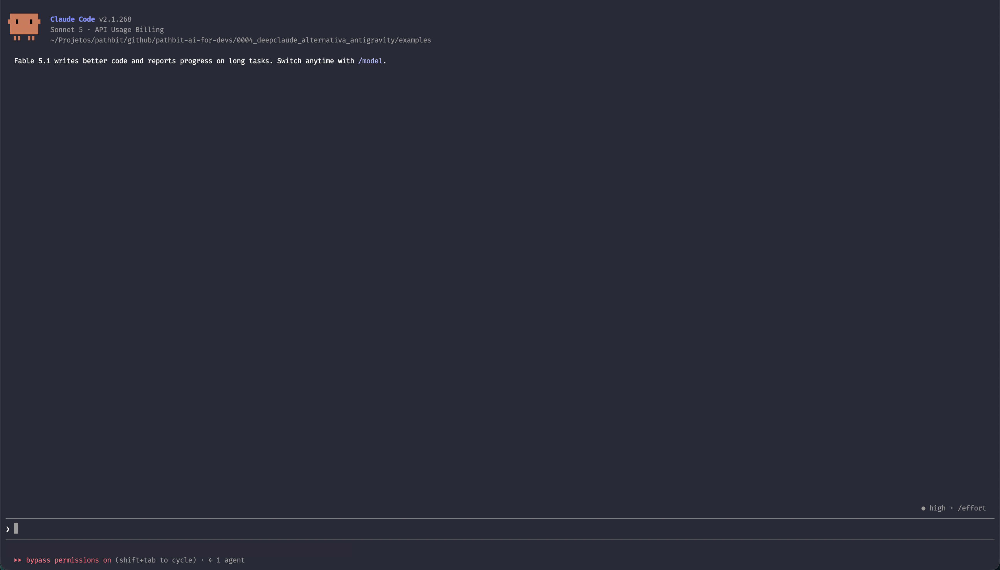
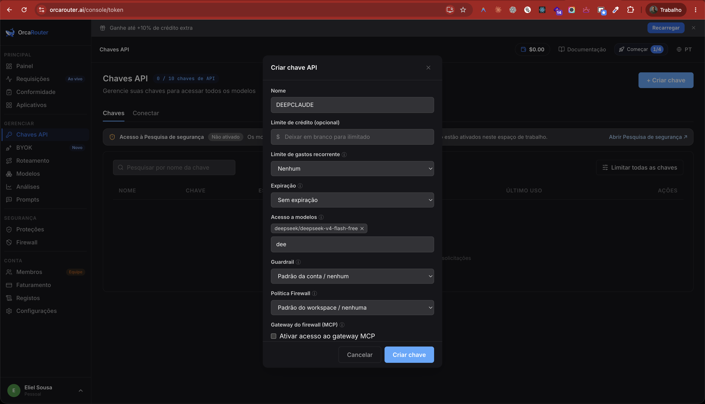
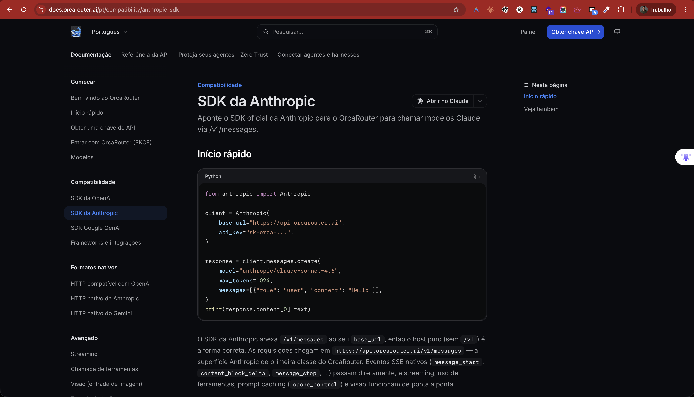
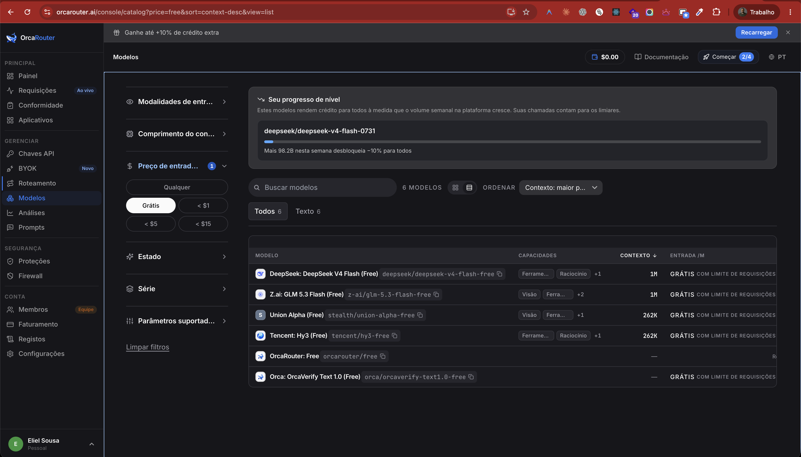
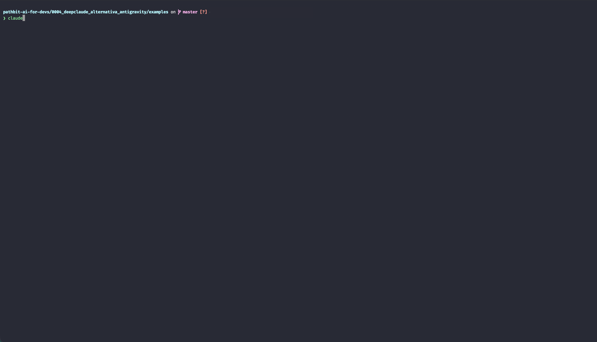
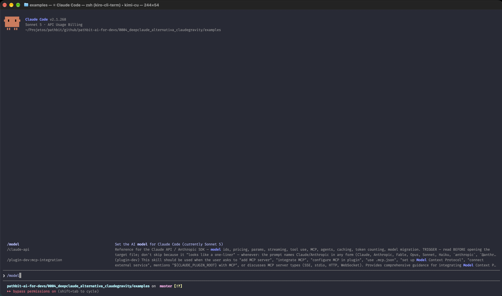
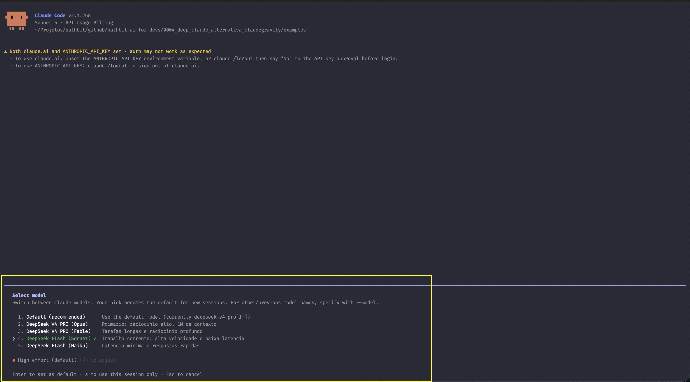
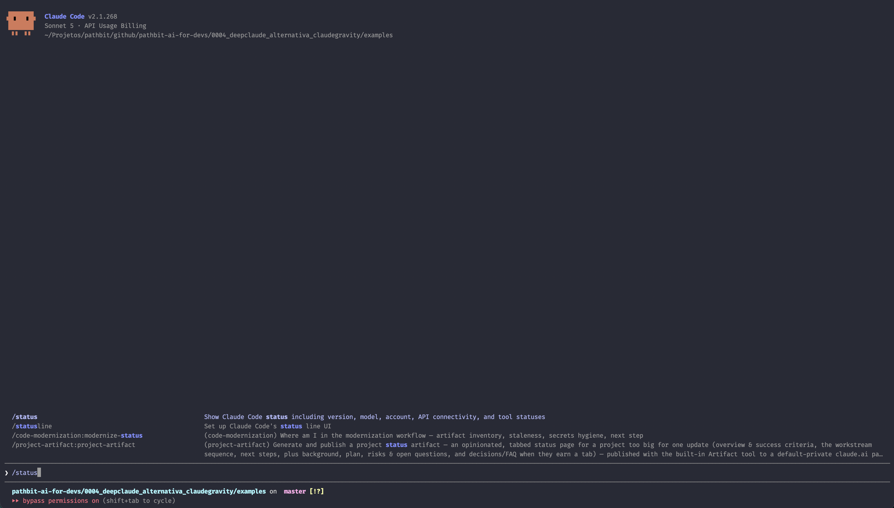
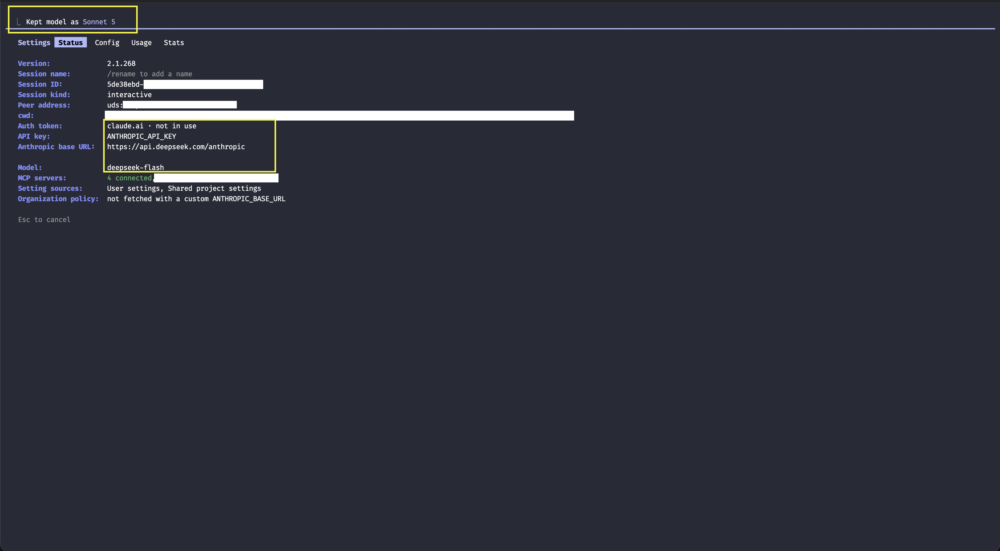
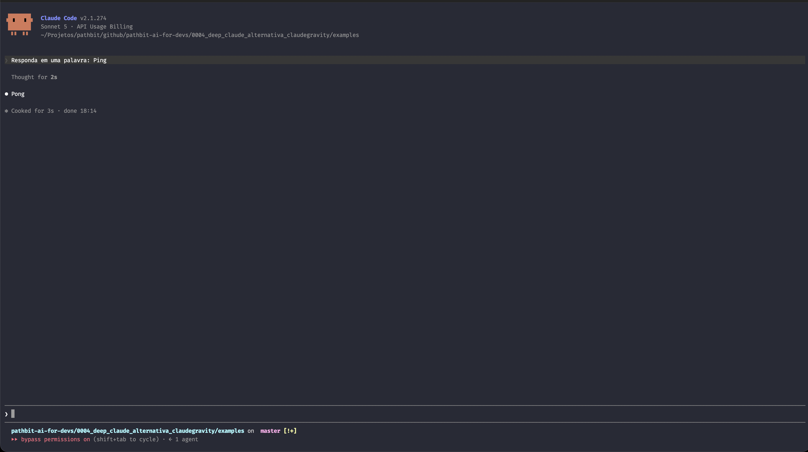

# DeepClaude: A Alternativa ao ClaudeGravity com DeepSeek e OrcaRouter no Claude Code



Nos artigos anteriores desta série, exploramos duas frentes essenciais da engenharia de IA moderna para desenvolvedores: primeiro, destravamos a autonomia total do motor **Agent 2.0** no [Artigo 0001](../../0001_antigravity_acesso_total_irrestrito/article/ARTICLE.md); em seguida, construímos o **ClaudeGravity** no [Artigo 0002](../../0002_claude_gravity_utilizando_9router/article/ARTICLE.md) e a malha de resiliência multi-provedores com combos de fallback no [Artigo 0003](../../0003_fallback_modelos_gratuitos_9router/article/ARTICLE.md). Nesses cenários, conectamos o **Claude Code CLI** à infraestrutura de ponta do **Google Antigravity** via gateway **9Router**, aproveitando a assinatura Google AI Pro sem custos adicionais de tokens.

Mas e se você **não possui acesso ao Google Antigravity**, ou deseja uma alternativa ultrarrápida, de baixo custo e especializada em raciocínio analítico para atuar como motor principal do seu terminal?

É aqui que entra o **DeepClaude**: o movimento de engenharia que desacopla o harness de ponta da Anthropic do seu provedor de inferência oficial, alimentando o Claude Code diretamente com os modelos da família **DeepSeek**.

Neste artigo, apresentamos a implementação definitiva dessa arquitetura em dois caminhos complementares e validados:

1. **DeepSeek Platform Direto (API Oficial):** Conexão direta com a infraestrutura oficial da DeepSeek (`https://api.deepseek.com/anthropic`), que disponibiliza os modelos **DeepSeek V4 PRO** e **DeepSeek Flash** com preços imbatíveis por milhão de tokens e compatibilidade nativa com o protocolo Anthropic Messages.
2. **OrcaRouter (Tier Gratuito):** Conexão através do gateway agregador **OrcaRouter** (`https://api.orcarouter.ai`), que oferece o modelo **DeepSeek V4 Flash FREE** com janela massiva de contexto de 1 milhão de tokens a custo zero na data da escrita deste artigo.

Além do passo a passo visual com 27 capturas de tela cobrindo desde a obtenção das chaves até a operação no terminal, detalharemos a fundo a arquitetura de configurações do Claude Code, desmistificando o papel de `settings.json` versus `settings.local.json`, os riscos do sufixo `[1m]`, a blindagem contra o estado global da CLI e por que o Advisor experimental deve ser rigorosamente desativado em qualquer integração com terceiros.

---

## Comparativo de Arquiteturas: Claude Nativo vs ClaudeGravity vs DeepClaude

Para entender onde o DeepClaude se posiciona no arsenal de um desenvolvedor, compare as três abordagens principais:

| Dimensão | Claude Nativo (Anthropic Cloud) | ClaudeGravity (Artigo 0002) | DeepClaude (Este Artigo) |
| :--- | :--- | :--- | :--- |
| **Harness CLI** | Claude Code CLI oficial | Claude Code CLI oficial | Claude Code CLI oficial |
| **Provedor de Modelos** | Anthropic (Claude 3.7 / 4.6 Sonnet / Opus) | Google Antigravity (Gemini 3.8 / 3.7 Flash) | DeepSeek Platform / OrcaRouter |
| **Modelo Principal** | `claude-sonnet-4-6` / `claude-opus-5` | `ag/gemini-3.8-flash-high` | `deepseek-v4-pro` / `deepseek-flash` |
| **Raciocínio Lógico (Reasoning)** | Nativo (Thinking Blocks) | Nativo (Gemini Thinking) | Nativo (DeepSeek R1 / V4 Reasoning) |
| **Janela de Contexto** | 200k padrão (1M em beta pago) | 1 milhão de tokens nativo | 1 milhão de tokens (OrcaRouter / Platform) |
| **Custo Operacional** | Faturado por token ($3 a $15 / 1M) | Custo zero (aproveita assinatura Google AI Pro) | Centavos por 1M de tokens (Platform) ou Gratuito (OrcaRouter) |
| **Dependência de Gateway Local** | Nenhuma | Exige 9Router (Docker) para traduzir protocolo | **Zero** (a API do DeepSeek já fala Anthropic Messages) |
| **Advisor (`/advisor`)** | Suportado nativamente | Incompatível (rejeitado pelo gateway) | Incompatível (rejeitado pelo DeepSeek) |

A grande vantagem do DeepClaude é a **simplicidade arquitetural**: como a API da DeepSeek e o OrcaRouter já expõem endpoints compatíveis com a especificação da Anthropic (`/anthropic` ou `/v1/messages`), **você não precisa subir nenhum container Docker nem rodar proxy local** se quiser operar exclusivamente com eles. Basta configurar o arquivo `.claude/settings.json` no diretório do projeto e abrir o terminal.

---

## Caminho 1: Configuração na Plataforma Oficial DeepSeek (Paga por Uso)

A API oficial da DeepSeek é reconhecida mundialmente pela excelente relação custo-benefício. Ao contrário dos provedores tradicionais que cobram valores elevados por chamadas de raciocínio, a DeepSeek cobra frações de centavos por milhão de tokens, viabilizando sessões contínuas de agentes autônomos sem estresse financeiro.

Abaixo está o roteiro de provisionamento de credenciais na plataforma oficial:

### 1. Criação de Conta e Acesso ao Dashboard

Acesse a página inicial da plataforma de desenvolvedores em [platform.deepseek.com/sign_in](https://platform.deepseek.com/sign_in) e efetue o cadastro ou login:


> **Figura 1:** Tela de autenticação oficial da plataforma de desenvolvedores da DeepSeek.

Após a validação, você será direcionado ao painel principal, onde são exibidos os gráficos de consumo, latência e estatísticas das chamadas de API:


> **Figura 2:** Dashboard da plataforma DeepSeek com métricas de requisições e visão geral da conta.

### 2. Recarga Inicial de Créditos

A API da DeepSeek opera no modelo pré-pago (*pay-as-you-go*), o que garante controle absoluto sobre o orçamento: você nunca terá surpresas no fechamento da fatura. Para adicionar saldo, clique no menu **Top Up**:


> **Figura 3:** Interface de recarga de créditos com suporte a valores a partir de $2 dólares.

Após a confirmação do pagamento, o saldo é creditado instantaneamente na sua conta:


> **Figura 4:** Saldo ativo disponível para consumo imediato pelas ferramentas agênticas.

### 3. Geração da API Key Dedicada

No menu lateral esquerdo, navegue até **API Keys** e clique em **Create new API key**. Recomendamos atribuir um nome descritivo para identificar que a chave é destinada ao Claude Code:


> **Figura 5:** Criação de uma chave de API nomeada para o ambiente do Claude Code.

Ao confirmar, a plataforma exibirá o token secreto iniciado por `sk-`. Copie o valor imediatamente, pois por razões de segurança ele não será exibido novamente:


> **Figura 6:** Token de autenticação gerado com sucesso na DeepSeek.

Na lista de chaves, você pode monitorar a data de criação, status e revogar chaves antigas se necessário:


> **Figura 7:** Gerenciamento das credenciais ativas na plataforma.

### 4. Endpoints Oficiais e Compatibilidade Anthropic

Na documentação da DeepSeek, localize os endpoints de inferência:


> **Figura 8:** Endpoints oficiais da DeepSeek, destacando a rota compatível com a Anthropic Messages API.

> [!IMPORTANT]
> ### A Rota de Compatibilidade da Anthropic na DeepSeek
> Para que o Claude Code consiga se comunicar com a DeepSeek sem intermediários, a URL base deve apontar para:
> ```text
> https://api.deepseek.com/anthropic
> ```
> O Claude Code concatena internamente `/v1/messages` a essa base, disparando requisições contra `https://api.deepseek.com/anthropic/v1/messages`, que a DeepSeek atende no protocolo idêntico ao da Anthropic.

---

## Caminho 2: Configuração no OrcaRouter (DeepSeek Gratuito)

O **OrcaRouter** ([orcarouter.ai](https://www.orcarouter.ai/login)) é uma plataforma agregadora de modelos de inteligência artificial que oferece rotas gratuitas para desenvolvedores experimentarem modelos abertos e proprietários. Na data de publicação deste artigo, o OrcaRouter disponibiliza o modelo `deepseek/deepseek-v4-flash-free` com custo zero por token e suporte a 1 milhão de tokens de contexto.

### 1. Criação de Conta e Overview

Acesse [orcarouter.ai/login](https://www.orcarouter.ai/login) e efetue login com sua conta:


> **Figura 9:** Tela de login no portal do OrcaRouter.

Ao entrar, a página de visão geral apresenta o ecossistema de APIs unificadas e os benefícios do roteamento inteligente:


> **Figura 10:** Apresentação da arquitetura multi-provedor do OrcaRouter.

Navegue até o **Dashboard** principal para visualizar o painel operacional:


> **Figura 11:** Dashboard de monitoramento do OrcaRouter.

### 2. Navegação no Catálogo de Modelos e Provedores

Na aba **Providers**, você encontra a lista de empresas integradas à rede:


> **Figura 12:** Provedores de modelos disponíveis na plataforma.

Acessando a seção **Models**, consulte o catálogo global de inteligência artificial:


> **Figura 13:** Lista de modelos indexados no gateway.

Filtre os modelos disponíveis para localizar as variantes gratuitas com o rótulo **FREE**:


> **Figura 14:** Filtro de modelos, destacando o `deepseek/deepseek-v4-flash-free` com janela massiva de contexto.

### 3. Geração do Token de API no OrcaRouter

No menu lateral, selecione **API Keys** e clique em **Create Key**:


> **Figura 15:** Painel de criação e gerenciamento de tokens de acesso.

O OrcaRouter permite vincular a chave a modelos específicos ou deixá-la irrestrita. Para garantir foco no modelo gratuito, você pode selecionar `deepseek/deepseek-v4-flash-free`:


> **Figura 16:** Associação da chave de API ao modelo gratuito do DeepSeek.

Atribua um nome à chave e configure os limites de orçamento e expiração:



> **Figura 17:** Definição dos parâmetros da chave de API no OrcaRouter.

Copie a chave gerada:


> **Figura 18:** Chave de API pronta para ser utilizada na configuração do Claude Code.

A lista de chaves ativas permite acompanhar o uso e criar novas regras de restrição:


> **Figura 19:** Painel de gestão de credenciais do OrcaRouter.

### 4. Endpoints e Volatilidade de Catálogos Gratuitos

Consulte a documentação de endpoints do OrcaRouter para obter a URL base oficial:



> **Figura 20:** Endpoints de integração compatíveis (`https://api.orcarouter.ai`).

O catálogo de modelos gratuitos do OrcaRouter inclui também variantes abertas e experimentais:



> **Figura 21:** Outros modelos disponíveis no tier gratuito do OrcaRouter.

> [!WARNING]
> ### Regra de Volatilidade de Provedores Gratuitos
> Conforme detalhamos no [Artigo 0003](../../0003_fallback_modelos_gratuitos_9router/article/ARTICLE.md#modelos-gratuitos-volatilidade-e-catálogo-verificado), **modelos com sufixo `:free` ou gratuitos são concessões temporárias dos provedores, não contratos permanentes**. O catálogo pode ser alterado, exigir novas permissões ou sofrer limites de requisição por minuto. Por essa razão, manter o DeepSeek Platform como alternativa de prontidão ou associar o OrcaRouter a uma cascata de fallback no 9Router é a prática recomendada de engenharia.

---

## A Arquitetura de Configurações do Claude Code: `settings.json` vs `settings.local.json`

Uma das dúvidas mais frequentes entre desenvolvedores que configuram o Claude Code com provedores alternativos é: *onde devo declarar as configurações? Devo criar um `settings.json` ou um `settings.local.json`? E qual é a precedência entre eles?*

### Os Cinco Escopos de Configuração da CLI

O Claude Code possui uma hierarquia estrita de resolução de configurações. A ordem de precedência (do mais forte para o mais fraco) é:

```text
1. Políticas Corporativas / Gerenciadas (Managed Settings)
      ↓ (sobrescreve)
2. Flag de Linha de Comando (claude --settings <arquivo>)
      ↓ (sobrescreve)
3. Configuração Local da Máquina (.claude/settings.local.json)
      ↓ (sobrescreve)
4. Configuração Compartilhada do Projeto (.claude/settings.json)
      ↓ (sobrescreve)
5. Configuração Global de Usuário (~/.claude/settings.json)
```

### Por Que Este Repositório Utiliza Apenas `settings.json.example`?

| Arquivo | Finalidade Técnica Original | Por que NÃO versionamos `settings.local.json.example` |
| :--- | :--- | :--- |
| **`settings.json`** | Políticas e variáveis compartilhadas do repositório, comitadas no Git. | É o arquivo padrão do projeto. Em nossos módulos, criamos arquivos como `settings.json.deepseek.example` e `settings.json.orcarouter.example` contendo 100% da configuração pronta. A cópia ativa `settings.json` fica no `.gitignore`. |
| **`settings.local.json`** | Preferências exclusivas da sua máquina (como uma chave privada pessoal). **Tem precedência** sobre o anterior. | Manter um `settings.local.json.example` com o mesmo conteúdo do `settings.json.example` gerava **dois lugares idênticos para manter a mesma coisa**, provocando divergências e confusão de sincronização. |

> [!NOTE]
> Se você estiver trabalhando em um repositório corporativo compartilhado onde o `.claude/settings.json` principal está commitado no Git do time, você pode usar o `.claude/settings.local.json` para sobrescrever as configurações localmente na sua máquina sem alterar o repositório da equipe. Mas em nosso ambiente de testes e tutoriais, tudo o que você precisa mora diretamente no arquivo único `settings.json`.

### A Limitação Crítica do `modelPicker` em Checkouts Locais

Muitos desenvolvedores tentam declarar o bloco `modelPicker` dentro do `.claude/settings.json` ou `.claude/settings.local.json` do projeto esperando que o comando `/model` exiba um menu bonito com os nomes customizados.

**No binário do Claude Code (versão 2.1.x), o bloco `modelPicker` é expressamente ignorado em checkouts locais de projeto.** Ele só é carregado e honrado pela CLI em três circunstâncias:
1. No arquivo global de usuário: `~/.claude/settings.json`.
2. Em políticas corporativas (*managed settings*).
3. Ao iniciar a CLI explicitamente com o parâmetro `--settings`:
   ```bash
   claude --settings .claude/settings.json
   ```

Quando o Claude Code roda em uma pasta de projeto sem a flag `--settings`, ele monta o menu `/model` **a partir das variáveis de ambiente dos 4 papéis nativos** (`OPUS`, `SONNET`, `FABLE` e `HAIKU`). É por isso que declaramos `ANTHROPIC_DEFAULT_*_MODEL_NAME` e `ANTHROPIC_DEFAULT_*_MODEL_DESCRIPTION` em nossos arquivos de exemplo: assim, o menu `/model` exibe rótulos claros e informativos mesmo quando o `modelPicker` for ignorado pela CLI.

---

## Anatomia das Configurações Prontas para Uso

Abaixo transcrevemos integralmente os dois modelos de configuração que você encontra na pasta [examples/.claude/](../examples/.claude/). Ambos já vêm pré-configurados com permissões completas, supressão de diálogos de risco, mapeamento de papéis e a blindagem de segurança que impede falhas em tempo de execução.

### Exemplo 1: DeepSeek Platform (`settings.json.deepseek.example`)

```json
{
    "model": "deepseek-v4-pro",
    "env": {
        "ANTHROPIC_BASE_URL": "https://api.deepseek.com/anthropic",
        "ANTHROPIC_AUTH_TOKEN": "sk-sua-chave-do-DEEPSEEK-PLATFORM",
        "CLAUDE_CODE_DISABLE_UNKNOWN_MODEL_WINDOW_ENFORCEMENT": "1",
        "ANTHROPIC_DEFAULT_OPUS_MODEL": "deepseek-v4-pro",
        "ANTHROPIC_DEFAULT_OPUS_MODEL_NAME": "DeepSeek V4 PRO (Opus)",
        "ANTHROPIC_DEFAULT_OPUS_MODEL_DESCRIPTION": "Primario: raciocinio alto, 1M de contexto",
        "ANTHROPIC_DEFAULT_SONNET_MODEL": "deepseek-flash",
        "ANTHROPIC_DEFAULT_SONNET_MODEL_NAME": "DeepSeek Flash (Sonnet)",
        "ANTHROPIC_DEFAULT_SONNET_MODEL_DESCRIPTION": "Trabalho corrente: alta velocidade e baixa latencia",
        "ANTHROPIC_DEFAULT_FABLE_MODEL": "deepseek-v4-pro",
        "ANTHROPIC_DEFAULT_FABLE_MODEL_NAME": "DeepSeek V4 PRO (Fable)",
        "ANTHROPIC_DEFAULT_FABLE_MODEL_DESCRIPTION": "Tarefas longas e raciocinio profundo",
        "ANTHROPIC_DEFAULT_HAIKU_MODEL": "deepseek-flash",
        "ANTHROPIC_DEFAULT_HAIKU_MODEL_NAME": "DeepSeek Flash (Haiku)",
        "ANTHROPIC_DEFAULT_HAIKU_MODEL_DESCRIPTION": "Latencia minima e respostas rapidas",
        "ANTHROPIC_MODEL": "deepseek-flash",
        "CLAUDE_CODE_SUBAGENT_MODEL": "deepseek-flash",
        "CLAUDE_CODE_EFFORT_LEVEL": "max",
        "CLAUDE_CODE_AUTO_COMPACT_WINDOW": "786432",
        "CLAUDE_CODE_DISABLE_ADVISOR_TOOL": "1"
    },
    "permissions": {
        "defaultMode": "bypassPermissions",
        "allow": [
            "Bash(*)",
            "Read(*)",
            "Edit(*)",
            "Write(*)",
            "Glob(*)",
            "Grep(*)",
            "WebFetch(*)",
            "WebSearch(*)",
            "NotebookEdit(*)",
            "TodoWrite(*)",
            "Agent(*)",
            "Skill(*)"
        ]
    },
    "skipDangerousModePermissionPrompt": true,
    "includeCoAuthoredBy": false,
    "modelPicker": {
        "replaceBuiltInOptions": true,
        "options": [
            {
                "model": "deepseek-flash",
                "label": "DeepSeek Flash (Sonnet)",
                "description": "Trabalho corrente: alta velocidade e baixa latencia",
                "behavesAs": "claude-sonnet-4-6"
            },
            {
                "model": "deepseek-v4-pro",
                "label": "DeepSeek V4 PRO (Opus)",
                "description": "Primario: raciocinio alto, 1M de contexto",
                "behavesAs": "claude-sonnet-4-6"
            }
        ]
    },
    "modelOverrides": {
        "claude-fable-5-1": "deepseek-v4-pro",
        "claude-opus-5": "deepseek-v4-pro",
        "claude-sonnet-5": "deepseek-flash"
    }
}
```

### Exemplo 2: OrcaRouter (`settings.json.orcarouter.example`)

```json
{
    "model": "deepseek/deepseek-v4-flash-free",
    "env": {
        "ANTHROPIC_BASE_URL": "https://api.orcarouter.ai",
        "ANTHROPIC_AUTH_TOKEN": "sk-sua-chave-do-ORCA-ROUTER",
        "CLAUDE_CODE_DISABLE_UNKNOWN_MODEL_WINDOW_ENFORCEMENT": "1",
        "ANTHROPIC_DEFAULT_OPUS_MODEL": "deepseek/deepseek-v4-flash-free",
        "ANTHROPIC_DEFAULT_OPUS_MODEL_NAME": "DeepSeek V4 Flash FREE (Opus)",
        "ANTHROPIC_DEFAULT_OPUS_MODEL_DESCRIPTION": "OrcaRouter Free: 1M contexto",
        "ANTHROPIC_DEFAULT_SONNET_MODEL": "deepseek/deepseek-v4-flash-free",
        "ANTHROPIC_DEFAULT_SONNET_MODEL_NAME": "DeepSeek V4 Flash FREE (Sonnet)",
        "ANTHROPIC_DEFAULT_SONNET_MODEL_DESCRIPTION": "OrcaRouter Free: alta velocidade",
        "ANTHROPIC_DEFAULT_FABLE_MODEL": "deepseek/deepseek-v4-flash-free",
        "ANTHROPIC_DEFAULT_FABLE_MODEL_NAME": "DeepSeek V4 Flash FREE (Fable)",
        "ANTHROPIC_DEFAULT_FABLE_MODEL_DESCRIPTION": "OrcaRouter Free: tarefas analiticas",
        "ANTHROPIC_DEFAULT_HAIKU_MODEL": "deepseek/deepseek-v4-flash-free",
        "ANTHROPIC_DEFAULT_HAIKU_MODEL_NAME": "DeepSeek V4 Flash FREE (Haiku)",
        "ANTHROPIC_DEFAULT_HAIKU_MODEL_DESCRIPTION": "OrcaRouter Free: respostas rapidas",
        "ANTHROPIC_MODEL": "deepseek/deepseek-v4-flash-free",
        "CLAUDE_CODE_SUBAGENT_MODEL": "deepseek/deepseek-v4-flash-free",
        "CLAUDE_CODE_EFFORT_LEVEL": "max",
        "CLAUDE_CODE_AUTO_COMPACT_WINDOW": "786432",
        "CLAUDE_CODE_DISABLE_ADVISOR_TOOL": "1"
    },
    "permissions": {
        "defaultMode": "bypassPermissions",
        "allow": [
            "Bash(*)",
            "Read(*)",
            "Edit(*)",
            "Write(*)",
            "Glob(*)",
            "Grep(*)",
            "WebFetch(*)",
            "WebSearch(*)",
            "NotebookEdit(*)",
            "TodoWrite(*)",
            "Agent(*)",
            "Skill(*)"
        ]
    },
    "skipDangerousModePermissionPrompt": true,
    "includeCoAuthoredBy": false,
    "modelPicker": {
        "replaceBuiltInOptions": true,
        "options": [
            {
                "model": "deepseek/deepseek-v4-flash-free",
                "label": "DeepSeek V4 Flash FREE (Sonnet)",
                "description": "Gratuito no OrcaRouter: alta velocidade e 1M de contexto",
                "behavesAs": "claude-sonnet-4-6"
            }
        ]
    },
    "modelOverrides": {
        "claude-fable-5-1": "deepseek/deepseek-v4-flash-free",
        "claude-opus-5": "deepseek/deepseek-v4-flash-free",
        "claude-sonnet-5": "deepseek/deepseek-v4-flash-free"
    }
}
```

---

## Por Que NUNCA Usar o Sufixo `[1m]` em Modelos de Terceiros

Muitos desenvolvedores que utilizam a Anthropic estão acostumados com o sufixo `[1m]` (como `claude-opus-5[1m]` ou `claude-sonnet-5[1m]`), usado para solicitar a janela estendida de 1 milhão de tokens na nuvem oficial da Anthropic.

Isso leva à tentação de declarar no `settings.json`:
```json
// ❌ INCORRETO: NÃO FAÇA ISSO!
"modelOverrides": {
    "claude-fable-5-1": "deepseek-v4-pro[1m]"
}
```

### O Que Acontece Debaixo dos Panos

1. Quando o Claude Code faz uma chamada de inferência, o bloco `modelOverrides` substitui o identificador Anthropic pelo valor que você declarou ali.
2. Esse valor exato é colocado no campo `"model"` do payload HTTP JSON enviado para a API remota:
   ```json
   POST /anthropic/v1/messages
   {
       "model": "deepseek-v4-pro[1m]",
       "messages": [...]
   }
   ```
3. **No DeepSeek Platform:** Embora a API oficial da DeepSeek normalize algumas strings, ela reconhece estritamente os nomes `deepseek-chat`, `deepseek-coder`, `deepseek-v4-pro` e `deepseek-flash`.
4. **No OrcaRouter e em outros gateways:** Roteadores externos realizam busca exata no catálogo. Ao receber `deepseek-v4-pro[1m]` ou `deepseek/deepseek-v4-flash-free[1m]`, a plataforma não encontra o modelo e rejeita a requisição imediatamente com:
   ```text
   HTTP 400 Bad Request: Model 'deepseek-v4-pro[1m]' does not exist
   ```

### A Forma Correta de Controlar a Janela no Claude Code

Para usufruir de janelas de contexto grandes (como 786k ou 1M de tokens) em modelos de terceiros sem quebrar a API, o Claude Code oferece duas chaves no bloco `env`:

1. **`"CLAUDE_CODE_DISABLE_UNKNOWN_MODEL_WINDOW_ENFORCEMENT": "1"`:** Impede que a CLI trave o limite de contexto no valor padrão de 200k quando detecta um modelo que não pertence à lista nativa da Anthropic.
2. **`"CLAUDE_CODE_AUTO_COMPACT_WINDOW": "786432"`:** Define o ponto de gatilho em que a CLI deve disparar a compactação automática do histórico da conversa. O valor `786432` (75% de 1M) garante que a sessão opere com folga extrema antes de resumir mensagens antigas.

Use sempre os identificadores canônicos puros: **`deepseek-v4-pro`**, **`deepseek-flash`** e **`deepseek/deepseek-v4-flash-free`**.

---

## Blindagem Contra o Estado Global da CLI (`~/.claude.json`)

O Claude Code armazena fora do projeto, em `~/.claude.json`, um conjunto de estados que nenhuma chave de `settings.json` local consegue alterar por desenho:

| Estado Global | Onde Fica Salvo | O Que Provoca Perda do Estado |
| :--- | :--- | :--- |
| **Assistente de primeiro uso** (seleção de tema, notas de segurança) | `~/.claude.json` | Executar `/logout` ou uma instalação nova |
| **Login na conta Anthropic** | `~/.claude.json` + chaveiro do sistema | Executar `/logout` |
| **Aprovação da chave de API** (*"Do you want to use this API key?"*) | `~/.claude.json` | Executar `/logout` |
| **Confiança na pasta do projeto** (*"Do you trust the files in this folder?"*) | `~/.claude.json` (por caminho absoluto) | Renomear, mover ou clonar a pasta em outro local |

Verificamos no código binário da versão 2.1.268 da CLI: o comando `/logout` apaga a lista de chaves aprovadas e marca o assistente de boas-vindas como incompleto. **Enquanto o assistente de primeiro uso está rodando na tela, o `settings.json` do projeto ainda não foi carregado.** É por isso que você abre o terminal na pasta e a CLI mostra a tela *"Select login method"*, como se o seu arquivo não existisse.

### As Duas Decisões Arquiteturais que Blindam o Ambiente

1. **`ANTHROPIC_AUTH_TOKEN` no Lugar de `ANTHROPIC_API_KEY`:**
   A variável `ANTHROPIC_API_KEY` vinda de arquivos de configuração exige confirmação interativa do usuário e grava aprovação no `~/.claude.json`. Já `ANTHROPIC_AUTH_TOKEN` é despachada diretamente no cabeçalho HTTP `Authorization: Bearer <token>`, sem exigir diálogo de aprovação nem depender de estado global. Tanto a DeepSeek quanto o OrcaRouter aceitam esse cabeçalho.
2. **Inicialização com `--settings` na Primeira Vez:**
   Ao executar:
   ```bash
   claude --settings .claude/settings.json
   ```
   A flag aplica o arquivo de configuração **antes** da execução do assistente de boas-vindas. Com isso, a CLI reconhece a URL customizada de imediato e não exibe nenhuma tela de login da Anthropic. Depois que a pasta for marcada como confiável, as sessões subsequentes podem ser iniciadas diretamente com `claude`.

---

## O Advisor (`/advisor`) NÃO Funciona com Modelos de Terceiros

> [!CAUTION]
> ### REGRA CRÍTICA: Desligue o Advisor com o Kill Switch Documentado
>
> O recurso de Advisor do Claude Code **não é uma chamada adicional feita pela CLI ao LLM**. Ele é uma *server tool* da infraestrutura proprietária da Anthropic: a cada requisição de turno, o Claude Code anexa ao array `tools` um objeto interno:
> ```json
> {"type": "advisor_20260301", "name": "advisor", "model": "..."}
> ```
> É o servidor da nuvem da Anthropic que decide quando consultar o revisor e devolve blocos `advisor_result`. A [documentação oficial da Anthropic](https://code.claude.com/docs/en/advisor) é taxativa: *"the advisor runs server-side on Anthropic's infrastructure as a server tool"* e *"requires the Anthropic API"*.
>
> **O que acontece ao apontar para a DeepSeek ou OrcaRouter com o Advisor ligado:**
> 1. O servidor da DeepSeek recebe a ferramenta desconhecida e rejeita a chamada inteira:
>    ```text
>    HTTP 400 invalid_request_error: tools[0]: unknown variant advisor_20260301, expected web_search_20250305 or web_search_20260209
>    ```
>    Isso derruba a sessão do agente imediatamente no meio de uma tarefa.
> 2. Nenhuma chave como `advisorModel` ou `modelOverrides` resolve isso, pois elas apenas selecionam o modelo dentro da ferramenta, mas não mudam o fato de que a DeepSeek não implementa a execução de ferramentas de servidor da Anthropic.
> 3. **O bug do menu `/advisor`:** O menu interativo lista apenas os três aliases da Anthropic (`fable`, `opus`, `sonnet`). Se dois papéis apontam para o mesmo modelo (por exemplo, `deepseek-v4-pro`), o menu exibe opções duplicadas (como duas linhas com o nome "Fable").
>
> **Como Desligar Definitivamente:**
> No bloco `env` dos seus arquivos de configuração, inclua:
> ```json
> "CLAUDE_CODE_DISABLE_ADVISOR_TOOL": "1"
> ```
> Esse é o kill switch oficial que remove o comando `/advisor` da CLI e impede que a ferramenta seja anexada nas requisições HTTP. Não use `CLAUDE_CODE_ENABLE_EXPERIMENTAL_ADVISOR_TOOL: "0"`, pois o Claude Code interpreta valores `"0"` como variável não definida.

---

## Execução Prática no Terminal e Validação Visual

Vamos acompanhar a execução real do Claude Code configurado com o DeepSeek.

### 1. Inicializando a Sessão de Trabalho

Navegue até a pasta de testes e inicialize a CLI aplicando a configuração:



> **Figura 22:** Disparo do comando de inicialização com `--settings` apontando para o arquivo de configuração do DeepSeek.

A sessão abre instantaneamente no terminal com o prompt pronto para receber comandos, contornando qualquer assistente de login:


> **Figura 23:** Claude Code operacional, conectado à API da DeepSeek com permissões completas ativas.

### 2. Alternando Modelos Interativamente

Para verificar as opções de modelos configuradas no projeto e alternar entre tarefas analíticas e trabalho corrente, abra o seletor com `/model`:



> **Figura 24:** Disparo do seletor interativo de modelos da CLI.

O menu exibe as opções limpas e descritivas configuradas no nosso arquivo:



> **Figura 25:** Menu interativo exibindo com clareza o DeepSeek Flash para tarefas correntes e o DeepSeek V4 PRO para raciocínio profundo de 1M de contexto.

### 3. Verificando o Modelo em Operação

Para inspecionar o status detalhado do modelo ativo no terminal:



> **Figura 26:** Invocação do comando de status do modelo.

A CLI confirma que o modelo ativo é o `DeepSeek Flash (Sonnet)` para trabalho corrente de alta velocidade e baixa latência:



> **Figura 27:** Confirmação de que o modelo DeepSeek Flash está respondendo pelo papel Sonnet.

### 4. Executando Tarefas e Respostas no Terminal

Ao submeter um prompt de desenvolvimento, a inferência é executada de ponta a ponta pelo motor DeepSeek, preservando o suporte a subagentes, leitura de arquivos e geração de código:



> **Figura 28:** Claude Code gerando resposta rápida e precisa através da inferência do DeepSeek no terminal.

---

## Integrando DeepSeek e OrcaRouter no 9Router (Conexão com Artigos 0002 e 0003)

Se você já utiliza o gateway **9Router** configurado no [Artigo 0002](../../0002_claude_gravity_utilizando_9router/article/ARTICLE.md) e a malha de resiliência multi-provedores do [Artigo 0003](../../0003_fallback_modelos_gratuitos_9router/article/ARTICLE.md), você não precisa escolher entre o Google Antigravity e o DeepSeek: **você pode ter os dois operando juntos na mesma cascata de fallback**.

No 9Router, cadastre os provedores no painel de administração (`http://localhost:20128`):
1. **DeepSeek Platform:** Provedor do tipo OpenAI ou Anthropic com base `https://api.deepseek.com` e sua chave `sk-...`.
2. **OrcaRouter:** Provedor com base `https://api.orcarouter.ai` e a chave obtida na plataforma.

Em seguida, crie um **Combo de Fallback Híbrido** (por exemplo, `arsenal-cognitivo`):

```text
Nível 1: ag/gemini-3.8-flash-high       (Google Antigravity - rápido, 1M contexto)
   ↓ (se atingir rate limit ou cota)
Nível 2: deepseek/deepseek-v4-pro       (DeepSeek Platform - raciocínio analítico profundo)
   ↓ (se atingir cota de saldo)
Nível 3: orcarouter/deepseek-v4-flash   (OrcaRouter Free - gratuidade com 1M contexto)
   ↓ (se indisponível)
Nível 4: groq/openai/gpt-oss-120b       (Groq LPU - velocidade extrema em frações de segundo)
   ↓
Nível 5: ollama/qwen2.5-coder:7b        (Ollama local - resiliência offline definitiva)
```

Dessa forma, se sua cota diária do Antigravity atingir o teto de requisições, o gateway comuta transparentemente para o DeepSeek V4 PRO sem que o Claude Code interrompa a refatoração ou perca o contexto dos arquivos abertos.

---

## Guia Rápido de Solução de Problemas

Se você encontrar qualquer comportamento inesperado ao iniciar a sessão, siga este checklist ordenado:

| Sintoma | Causa Mais Provável | Solução Imediata |
| :--- | :--- | :--- |
| **Claude Code pede login na Anthropic ao entrar na pasta** | O assistente de primeiro uso foi acionado antes do `settings.json` ser carregado, ou há erro de sintaxe no JSON. | 1. Valide o JSON com `python3 -c "import json; json.load(open('.claude/settings.json'))"`.<br>2. Inicie a primeira sessão com `claude --settings .claude/settings.json`. |
| **Erro `HTTP 400 invalid_request_error: tools[0]: unknown variant advisor_20260301`** | O Advisor experimental está ativo e enviou a *server tool* da Anthropic para a DeepSeek. | Certifique-se de que `"CLAUDE_CODE_DISABLE_ADVISOR_TOOL": "1"` está no bloco `env` do seu arquivo de configuração. |
| **Erro `Model 'deepseek-v4-pro[1m]' does not exist`** | O sufixo `[1m]` foi colocado no identificador do modelo em `modelOverrides` ou `model`. | Remova o sufixo `[1m]` e use apenas o identificador canônico `deepseek-v4-pro`. |
| **O menu `/model` mostra rótulos duplicados ("Fable" duas vezes)** | Múltiplos papéis de modelo estão resolvendo para o mesmo destino em `modelOverrides`. | Alinhe os papéis com nomes distintos via `ANTHROPIC_DEFAULT_*_MODEL_NAME` ou inicie via `claude --settings`. |
| **A sessão trava dizendo `Do you want to use this API key?`** | A chave foi declarada como `ANTHROPIC_API_KEY` em vez de `ANTHROPIC_AUTH_TOKEN`. | Troque o nome da variável no bloco `env` para `ANTHROPIC_AUTH_TOKEN`. |

---

## Conclusão e Próximos Passos

O **DeepClaude** consolida a independência definitiva do desenvolvedor em relação a provedores monopolistas de inferência. Ao manter o Claude Code como o harness central de orquestração e ferramentas, você preserva a melhor experiência de desenvolvimento autônomo do mercado enquanto escolhe livremente onde e quanto pagar pelo processamento cognitivo dos seus modelos.

Seja rodando direto contra a API oficial da DeepSeek, aproveitando as janelas gratuitas do OrcaRouter ou combinando tudo em cascatas inteligentes no 9Router, sua estação de trabalho agora possui autonomia irrestrita, custo previsível e alta disponibilidade.

### Artigos da Série Pathbit AI for Devs

* **[Artigo 0001 - Google Antigravity com Acesso Total Irrestrito e sem Interrupções](../../0001_antigravity_acesso_total_irrestrito/article/ARTICLE.md):** Configuração de autonomia máxima no Agent 2.0 e na CLI `agy`.
* **[Artigo 0002 - ClaudeGravity e o Roteamento de Modelos Gemini no Claude Code via 9Router](../../0002_claude_gravity_utilizando_9router/article/ARTICLE.md):** A ponte profissional entre Claude Code e a conta Google AI Pro.
* **[Artigo 0003 - Claude Code sem Limites com Arsenal de Modelos Gratuitos e Fallback no 9Router](../../0003_fallback_modelos_gratuitos_9router/article/ARTICLE.md):** Criação de combos com comutação automática entre 9 fontes de IA.
* **[Artigo 0004 - DeepClaude: A Alternativa ao ClaudeGravity com DeepSeek e OrcaRouter no Claude Code](./ARTICLE.md):** O guia completo para operar o Claude Code com DeepSeek e OrcaRouter.
