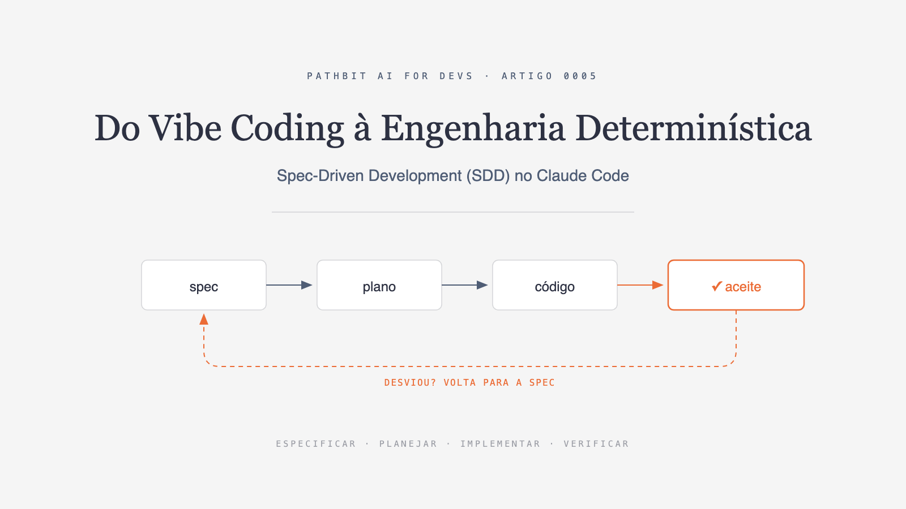
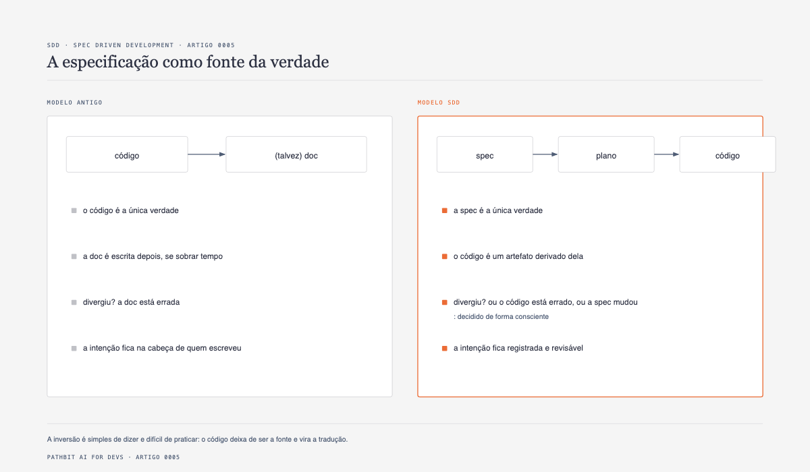
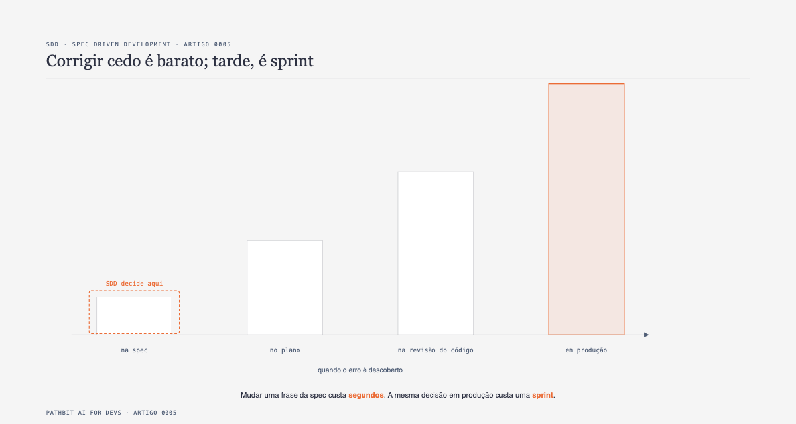
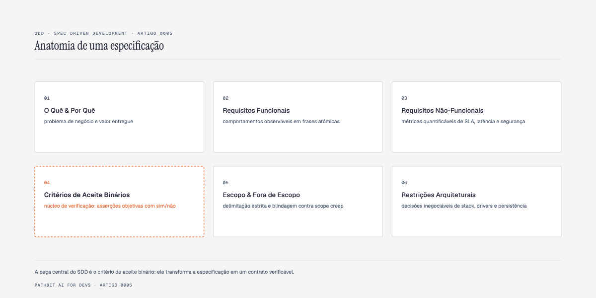
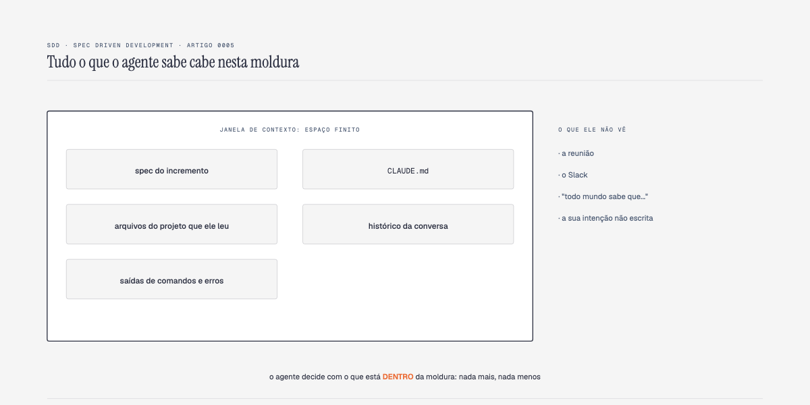
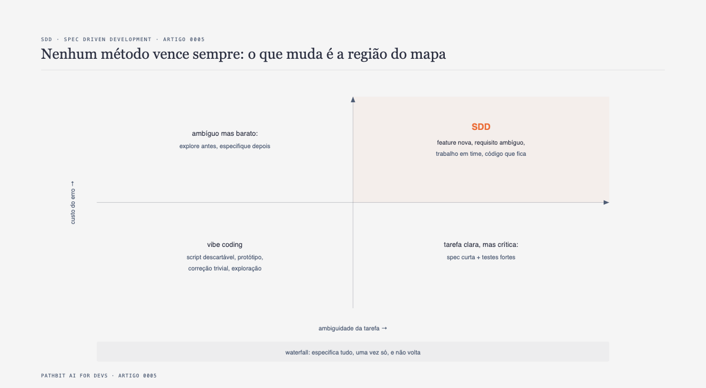
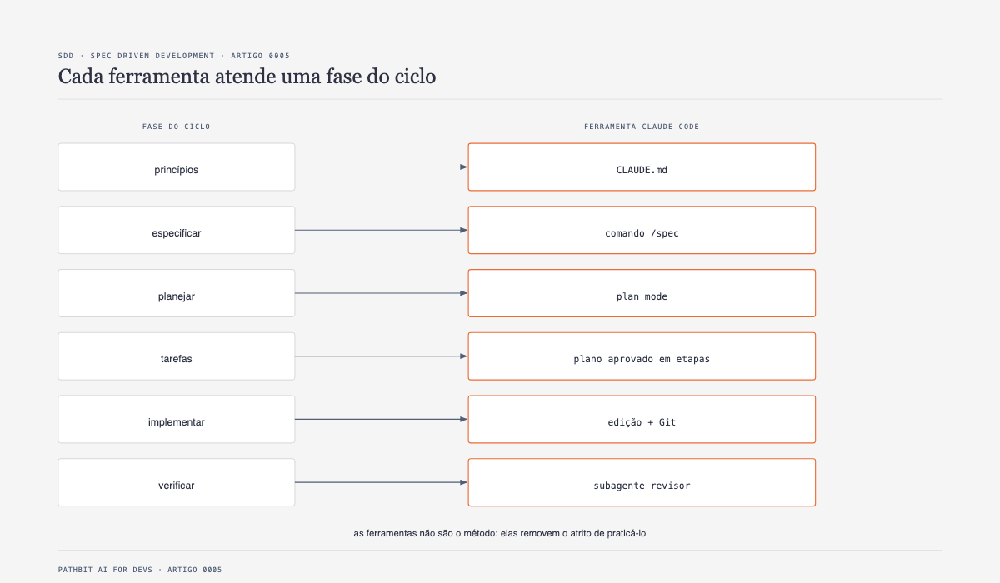

# Do Vibe Coding à Engenharia Determinística usando Spec-Driven Development (SDD) no Claude Code

Nos últimos meses, a engenharia de software presenciou uma das maiores transformações de produtividade da história da computação. Ferramentas agênticas operando direto no terminal, como o Claude Code CLI, trouxeram janelas massivas de contexto, capacidade de leitura autônoma de diretórios e execução de comandos sem necessidade de intervenção manual contínua.

Com modelos avançados disponíveis a custos irrisórios ou até sem custo adicional de tokens por meio de gateways locais, o gargalo tradicional da programação mudou de lugar. Digitar trezentas linhas de código deixou de ser um trabalho demorado. Um agente moderno gera implementações completas, tipadas e sintaticamente funcionais em menos de quinze segundos.

No entanto, essa velocidade revelou um paradoxo brutal nos times de tecnologia. O custo de gerar código caiu para praticamente zero, mas o custo de gerar o código errado continua exatamente o mesmo de sempre. Na verdade, ele ficou pior: o software equivocado agora chega instantaneamente, empacotado em abstrações convincentes e testes unitários rasos que mascaram premissas incorretas de negócio.

A resposta da maior parte do mercado a essa nova realidade tem sido o improviso conhecido como *vibe coding*. O desenvolvedor abre a CLI, digita um pedido genérico de uma linha e torce para que o modelo decida a arquitetura ideal por telepatia.

Este artigo demonstra por que o *vibe coding* é insustentável na engenharia de software profissional e apresenta o **Spec Driven Development (SDD)**: a metodologia que transforma a especificação técnica na fonte primária da verdade, convertendo o código-fonte em um subproduto rigorosamente derivado e verificável.

## SDD torna a entrega verificável, não a geração determinística

Considere um pedido de importação de RSS: “não duplicar links” é uma intenção;
uma restrição UNIQUE e um teste de reimportação são evidências. A spec define
o alvo, o agente propõe a implementação, e revisão/testes verificam o contrato.
Markdown não é compilador nem prova formal; duas execuções podem gerar códigos
diferentes, e uma spec pode estar ambígua ou desatualizada.

O título usa “determinística” no sentido de critérios verificáveis. Não há
experimento neste repo que prove multiplicadores universais de economia,
taxa de acerto inicial ou ausência de regressões. Meça tempo até aceite,
retrabalho, tokens e falhas em tarefas equivalentes antes de prometer ganhos.

Este método não exige 9Router, Antigravity nem acesso irrestrito. A infraestrutura
dos artigos anteriores é uma opção de execução; escopo, menor privilégio,
revisão humana e evidências continuam sendo decisões de engenharia.

---

## A armadilha do improviso e o autocompletamento estatístico

Para entender por que métodos puramente conversacionais falham em sistemas de produção, é preciso desmistificar como um modelo de linguagem opera no nível cognitivo.

Quando um desenvolvedor envia uma instrução vaga para o agente no terminal, como "crie um endpoint que liste as transações do mês", o modelo de linguagem se depara com um vácuo de decisões críticas de produto:

- Qual é a definição exata de "mês"? São os trinta dias corridos retroativos a partir de hoje? É o mês calendário de primeiro ao último dia? Ou seria o mês contábil da organização, cujo fechamento ocorre no dia 25?
- Como esses registros devem ser ordenados por padrão? Como a paginação deve se comportar diante de dezenas de milhares de lançamentos? O que acontece caso o cliente solicite um filtro sem transações correspondentes?

Diante dessas lacunas não preenchidas, uma rede neural probabilística não interrompe o processo para fazer perguntas conceituais. Ela segue a física estatística dos seus pesos treinados e preenche cada decisão em aberto com a continuação mais provável encontrada em bases públicas de código.

Essa escolha acontece em silêncio absoluto. O agente assume uma premissa arbitrária, constrói trezentas linhas de código estritamente fiéis a essa premissa e gera uma suíte de testes verdes que comprovam a sua própria hipótese inventada. 

O resultado é um software internamente impecável, porém externamente inadequado. O desenvolvedor percebe a discrepância semanas depois, geralmente durante a integração com outros módulos ou após reclamações de clientes em produção. O tempo economizado ao digitar o prompt de uma linha é rapidamente engolido por dias de depuração arqueológica para consertar premissas que nunca deveriam ter sido adotadas.

---

## A inversão hierárquica da documentação morta para a especificação executável

No desenvolvimento de software tradicional, o código é historicamente reverenciado como a única fonte da verdade. A documentação técnica costuma ser tratada como um fardo burocrático, redigida com atraso após a entrega da funcionalidade e rapidamente esquecida em wikis desatualizadas.

O Spec Driven Development quebra esse ciclo invertendo explicitamente a hierarquia do projeto.

No modelo do SDD, a especificação escrita é o artefato central e primário da verdade. O código-fonte, os schemas de migração de banco de dados e os testes automatizados são artefatos secundários, derivados mecanicamente a partir dos requisitos estabelecidos.

Essa inversão gera três transformações imediatas no fluxo de trabalho:

Primeiro, unifica-se a comunicação. O mesmo arquivo em Markdown que expressa os requisitos de produto para a equipe humana de negócios serve como contexto de altíssima densidade semântica para guiar o agente autônomo no terminal. Não existem duas conversas paralelas.

Segundo, a intenção do sistema deixa de ser um pensamento efêmero perdido no histórico de chat da CLI do desenvolvedor. A especificação reside no repositório, dentro da pasta `specs/`, versionada no Git e sujeita à revisão rigorosa em Pull Requests antes mesmo da primeira linha de código ser escrita.

Terceiro, estabelece-se uma barreira contra o crescimento exponencial do custo do erro.

Na engenharia de software clássica, a curva de custo de correção formulada por Barry Boehm demonstra que quanto mais tarde uma falha de requisito é descoberta, mais cara se torna a sua resolução. Quando o trabalho é executado por agentes autônomos, essa curva se torna ainda mais íngreme. 

Modificar uma premissa errada em uma especificação de texto consome trinta segundos do arquiteto. Corrigir essa mesma premissa depois que ela se desdobrou em migrations no banco de dados, adapters externos e interfaces gráficas exige reescrever componentes inteiros e desfazer efeitos colaterais complexos. O SDD força a validação técnica no estágio mais econômico possível: antes de qualquer código existir no disco.

---

## Anatomia de uma especificação executável

Uma boa especificação para agentes de inteligência artificial é concisa, direta e orientada a comportamentos verificáveis. Documentos extensos e narrativos diluem a atenção do modelo e aumentam a chance de alucinação.

Uma especificação madura no SDD é construída sobre seis blocos essenciais.

### 1. Objetivo claro
O propósito do incremento de software e o usuário impactado, resumidos em no máximo três linhas diretas.

### 2. Requisitos funcionais
Declarações objetivas descrevendo as ações executadas pelo sistema e seus resultados observáveis, um por linha.

### 3. Requisitos não-funcionais
Critérios de arquitetura, tolerância a falhas, tempo de resposta e segurança expressos numericamente, como limites de latência p95 e isolamento de credenciais via variáveis de ambiente.

### 4. Critérios de aceite binários
O coração técnico da especificação. São afirmações lógicas que só podem ser respondidas com sim ou não. Requisitos subjetivos como "o sistema deve ser rápido" ou "evitar duplicação de dados" são proibidos.

Em vez disso, a regra de desduplicação deve ser expressa de forma determinística: "Requisitar a sincronização da mesma URL duas vezes seguidas não gera registros repetidos na tabela de artigos, mantendo o total de novos itens zerado na segunda chamada e utilizando o campo link como identificador único". Com critérios nesse nível de precisão, não sobra espaço para o agente improvisar premissas.

### 5. Escopo e fora de escopo
Duas listas complementares que delimitam com rigor as fronteiras do que deve e do que não deve ser construído. A lista do que está fora de escopo protege o repositório contra over-engineering, impedindo que o modelo decida implementar autenticação JWT ou cache distribuído quando o objetivo da tarefa era apenas uma rota estática de listagem.

### 6. Restrições técnicas fundamentais
Decisões de stack e infraestrutura já acordadas pela equipe que não podem ser alteradas pelo modelo, como a versão do runtime, a biblioteca de banco de dados e as convenções de diretórios.

### A regra de ouro do método

Para checar se a sua especificação está pronta para o agente, utilize um teste prático:

> Se um desenvolvedor novo na equipe conseguisse implementar a funcionalidade lendo apenas a especificação, sem fazer nenhuma pergunta aos colegas, então o agente autônomo também conseguirá.

Toda vez que você reler o texto e sentir vontade de perguntar um detalhe de regra de negócio, você encontrou uma decisão que o modelo preencherá por adivinhação.

---

## As armadilhas comuns e seus antídotos

Ao especificar para agentes, quatro armadilhas são frequentes em equipes de tecnologia:

1. **Adjetivos no lugar de números:** Troque palavras como "rápido" ou "escalável" por métricas mensuráveis (ex: "resposta abaixo de 300 ms sob 10.000 registros").
2. **Descrever apenas o caminho feliz:** Adicione sempre a pergunta "e se der errado?", definindo o código de status HTTP e a mensagem para cenários de erro e parâmetros ausentes.
3. **Especificação monolítica:** Nunca tente descrever o produto inteiro em um único documento. Escreva uma especificação atômica por incremento funcional.
4. **Especificação que é código disfarçado:** Não prescreva nomes de classes internas ou laços de repetição. Deixe o "como" para o agente e concentre-se no comportamento observável de fora.

---

## O ciclo iterativo em seis fases e o loopback consciente

O SDD não revive a rigidez do modelo em cascata tradicional. Ele opera como um loop contínuo de pequenos ciclos atômicos, onde cada incremento de produto passa por seis fases bem definidas.

1. **Fase 0: Princípios globais.** Padrões arquiteturais e convenções universais do repositório centralizados no arquivo `CLAUDE.md`.
2. **Fase 1: Especificar.** Redação da especificação de no máximo cinquenta linhas cobrindo apenas o próximo incremento atômico na pasta `specs/`.
3. **Fase 2: Planejar.** O agente de IA analisa o código existente e propõe uma estratégia técnica passo a passo em modo somente leitura (plan mode). O desenvolvedor valida o plano antes que qualquer linha seja gravada no disco.
4. **Fase 3: Tarefas.** O plano técnico validado é decomposto em uma sequência curta de tarefas ordenadas.
5. **Fase 4: Implementar.** O agente codifica as alterações, cria arquivos e roda migrações de forma coordenada com a rota planejada.
6. **Fase 5: Verificar.** A entrega é submetida a uma validação estrita contra cada um dos critérios de aceite da especificação.

O ponto crucial desse fluxo é o laço de retorno consciente (loopback). Encontrar um obstáculo técnico durante a implementação não é um erro de processo, mas um gatilho legítimo de revisão. Se uma premissa se mostrar inadequada no meio da escrita do código, a execução é interrompida, a especificação é ajustada e commitada, e o ciclo é retomado a partir de um alinhamento claro.

---

## Engenharia de contexto e o que o agente realmente enxerga

Para maximizar a eficácia de um agente autônomo, o engenheiro precisa gerenciar ativamente o que entra e o que sai da sua janela de contexto.

A janela de contexto é uma fronteira finita e sensível. Fazem parte do campo de visão do modelo apenas os arquivos abertos, o histórico imediato da conversa, os arquivos de configuração do projeto como o `CLAUDE.md` e os outputs de comandos bash recém-executados.

Ficam inteiramente fora da visão do modelo os acordos verbais da equipe, as discussões informais no chat da empresa e todas as expectativas implícitas que nunca foram formalizadas em texto.

A boa engenharia de contexto no SDD não consiste em entupir a conversa com dezenas de arquivos desnecessários na esperança de que o modelo compreenda o quadro geral. Esse comportamento gera dispersão de atenção, perda de precisão e alucinações. O segredo da assertividade reside na curadoria enxuta: uma especificação concisa por ciclo, regras permanentes consolidadas e o reinício frequente de sessões limpas para evitar contaminação por históricos antigos.

---

## Onde o SDD se posiciona no mapa de métodos e sua relação com o TDD

O desenvolvimento guiado por especificações não anula as outras abordagens de engenharia, mas estabelece fronteiras claras sobre quando utilizá-las.

O *vibe coding* possui valor real em prototipações rápidas, tarefas mecânicas e scripts descartáveis de uso interno, onde eventuais falhas não causam danos ao negócio.

Por outro lado, em sistemas corporativos que envolvem persistência de dados sensíveis, integrações entre múltiplos microsserviços e exigência de manutenção contínua, o SDD é indispensável para garantir previsibilidade e governança técnica.

Muitos desenvolvedores questionam como o SDD se relaciona com o Test-Driven Development (TDD). Longe de serem concorrentes, os dois métodos formam uma combinação poderosa:

O SDD atua no nível macro do produto, definindo o que deve ser construído, quais são as regras de negócio e quais fronteiras não podem ser rompidas. O TDD atua no nível micro do código, garantindo que as classes, métodos e integrações unitárias funcionem conforme o desenho técnico.

A ponte entre os dois métodos é o critério de aceite da especificação. Cada critério de aceite binário redigido na especificação traduz-se diretamente no cenário de teste que o TDD irá validar. Enquanto a suíte de testes comprova que a aplicação faz o que o código diz que ela faz, a especificação assegura que o sistema está resolvendo o problema real da organização.

---

## A esteira prática do Claude Code configurada para SDD

A disciplina de especificação atinge sua máxima eficiência quando apoiada por ferramentas que removem o atrito operacional do dia a dia. No ecossistema do Claude Code CLI, cinco mecanismos nativos suportam com elegância cada fase do método.

1. **`CLAUDE.md` como memória permanente:** Centraliza na raiz do repositório os comandos de compilação, scripts de teste, políticas de branches e convenções de estilo. Informações transitórias de funcionalidades específicas nunca devem poluir esse arquivo.
2. **Slash command `/spec` para criação orientada:** Template em `.claude/commands/spec.md` que recebe o nome do incremento e instrui o modelo a listar todas as ambiguidades do pedido antes de redigir a especificação.
3. **Plan Mode para antecipação de arquitetura:** Acionado por `Shift+Tab`, coloca o agente em modo de leitura pura para propor a estratégia passo a passo antes de alterar qualquer arquivo em disco.
4. **Subagentes com contexto isolado para auditoria:** Subagente em `.claude/agents/revisor-de-spec.md` instanciado com contexto separado, recebendo apenas a spec e o diff do Git para auditar critérios com menor influência do histórico do implementador.
5. **Controle de versão com commits atômicos:** Separação explícita entre intenção (`git commit -m "spec: ..."`) e implementação (`git commit -m "feat: ..."`), documentando a linha do tempo do produto.

---

## O Arsenal de Prompts de Alta Certeza: Evidências Visuais e Validação Cruzada

Para extrair previsibilidade cirúrgica da IA, equipes maduras de SDD utilizam comandos operacionais que eliminam alucinações e viés cognitivo:

### 1. Prova com Evidências Visuais em Navegador Real (Auditoria de Wireframe)
> *"PROVE COM EVIDENCIAS VISUAIS EM NAVEGADOR REAL VALIDANDO DE FORMA RESTRITA TODO VISUAL DO WIREFRAME QUE ESTA NA PASTAS ./docs/design/wireframes/v1/* E SALVE AS EVIDENCIAS EM ./tmp/evidencias/specs/<spec>"*

O agente é obrigado a subir o servidor web local, abrir uma sessão real no navegador (headless ou automação web), capturar telas inteiras e componentes, e comparar visualmente contra os wireframes canônicos em `./docs/design/wireframes/v1/*`. Nenhuma interface é aceita apenas por ter código CSS gerado; a validação é visual e comprovada em disco.

### 2. Validação Cruzada de Critérios de Aceite Binários (Zero Viés Cognitivo)
> *"INICIE UMA SESSÃO ISOLADA DE AUDITORIA (SEM VIÉS COGNITIVO DA SESSÃO PRINCIPAL). LEIA ESTRITAMENTE A SPEC EM specs/NN-nome.md E AUDITE O GIT DIFF ATUAL. PARA CADA UM DOS CRITÉRIOS DE ACEITE BINÁRIOS, RESPONDA EXCLUSIVAMENTE COM [ATENDIDO / NÃO ATENDIDO / DUVIDOSO], INDICANDO A LINHA EXATA DO CÓDIGO E O TESTE AUTOMATIZADO CORRESPONDENTE. REPORTE QUALQUER LINHA FORA DE ESCOPO."*

Isolando a sessão do subagente auditor, removemos todo o viés de confirmação gerado na implementação, garantindo um crivo rigoroso e imparcial antes do merge.

---

## Estudo de caso prático: Ingestão e Telemetria em seis ciclos determinísticos de SDD

Para comprovar a viabilidade técnica do método em cenários corporativos, o repositório oficial da Pathbit disponibiliza uma API completa de ingestão, desduplicação e agregação inteligente em Node.js com Express e SQLite em modo WAL:

- **Ciclo 01: Ingestão Resiliente e Desduplicação.** Desduplicação travada na coluna `link` e ordenação cronológica decrescente.
- **Ciclo 02: Gestão Concorrente de Fontes.** Tolerância a falhas parciais e isolamento: um feed fora do ar não derruba nem bloqueia os demais.
- **Ciclo 03: Resumo com Enriquecimento Cognitivo.** Política estrita de cache em SQLite para evitar consumo redundante de tokens.
- **Ciclo 04: Motor de Categorização e Contratos.** Mapeamento temático determinístico com envelope padronizado de erro HTTP 422 para datas inválidas.
- **Ciclo 05: Observabilidade, Digest e Testes.** Resposta determinística para dias sem notícias e mock de IA obrigatório na suíte de testes.
- **Ciclo 06: Dashboard de Telemetria e Deploy.** Isolamento de portas, injeção de credenciais via variáveis de ambiente e containerização Docker.

Cada um desses seis ciclos representou uma decisão arquitetural que, se deixada para a adivinhação do modelo em um fluxo de *vibe coding*, teria gerado retrabalho e inconsistências graves em produção.

---

## Conclusão e a especificação como verdadeira alavancagem da engenharia

O advento dos agentes de inteligência artificial não tornou o rigor de engenharia obsoleto. Ao contrário: tornou o rigor mais valioso do que nunca.

Quando o custo de produzir código colapsa, a habilidade mais crítica de um time de tecnologia deixa de ser a velocidade de digitação de sintaxe e passa a ser a capacidade de formular problemas com precisão cirúrgica, delimitar escopos e validar critérios de forma automatizada.

O Spec Driven Development devolve ao desenvolvedor o comando arquitetural do sistema. Ao ancorar o Claude Code em especificações bem desenhadas, planos validados previamente e revisões em contexto isolado, transformamos a força bruta dos modelos de linguagem em uma esteira de entrega previsível, estável e profissional.

Todos os códigos-fonte, exemplos práticos, modelos de `CLAUDE.md` e comandos customizados utilizados neste artigo estão disponíveis gratuitamente no repositório oficial da série.

---

#InteligenciaArtificial #SpecDrivenDevelopment #SDD #ClaudeCode #EngenhariaDeSoftware #VibeCoding #SoftwareArchitecture #Pathbit
