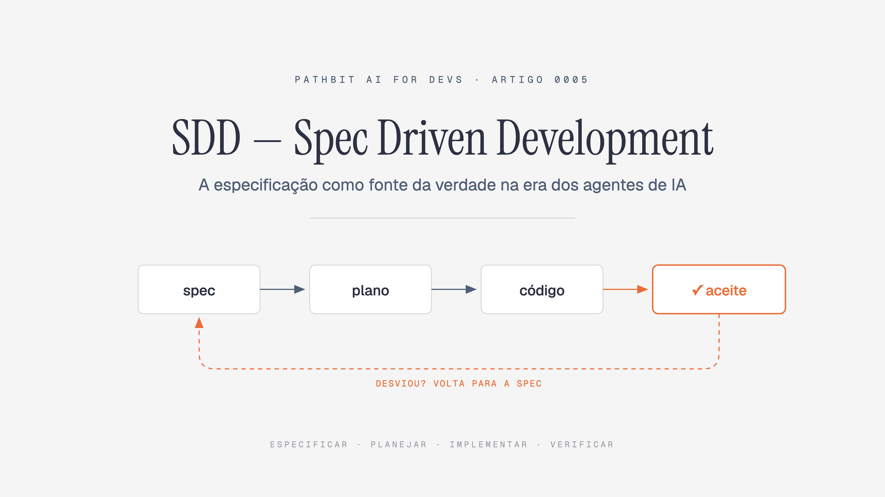
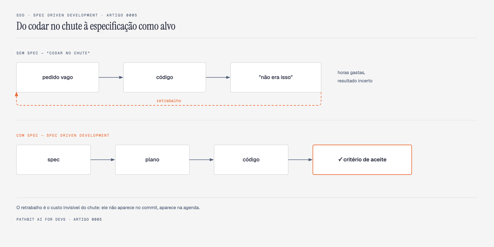
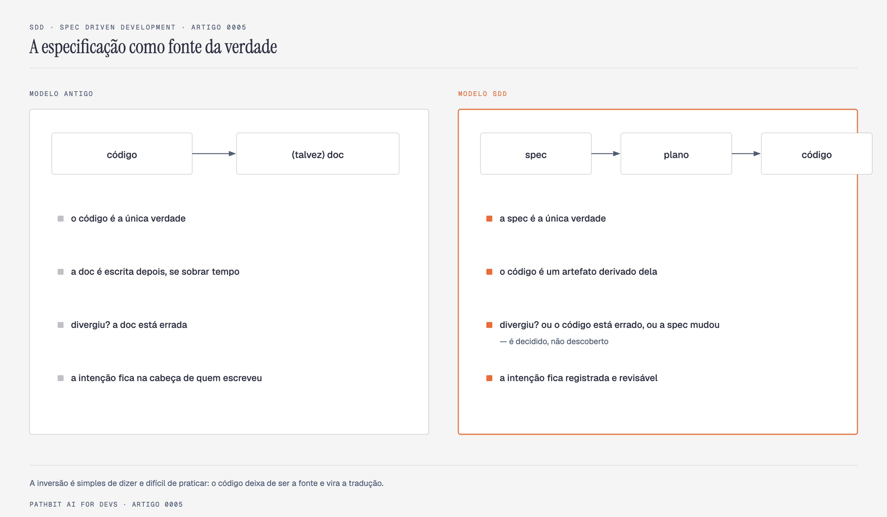
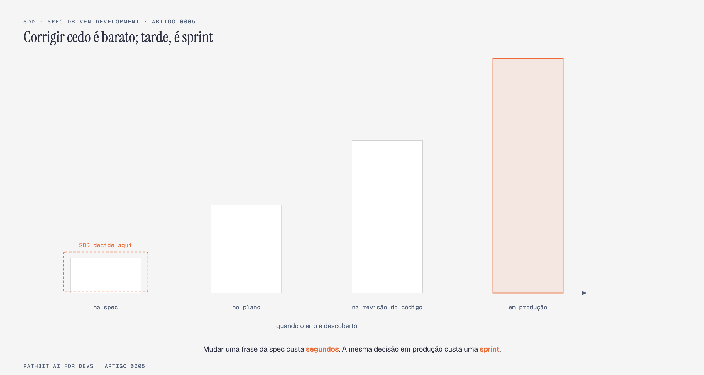
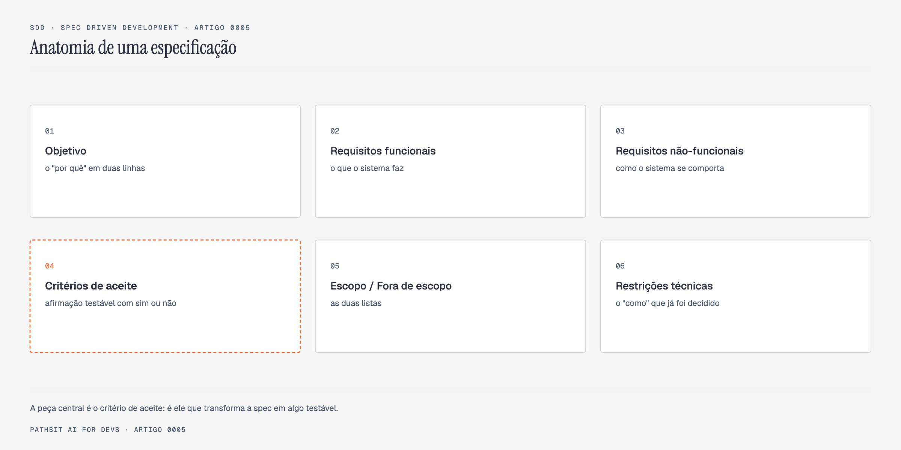
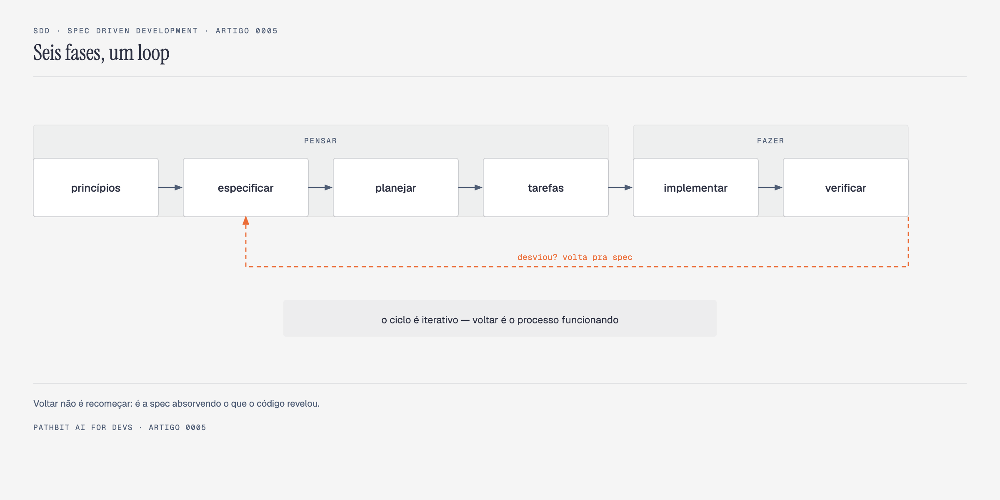
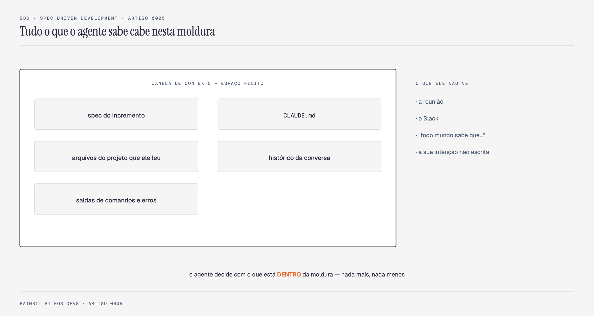
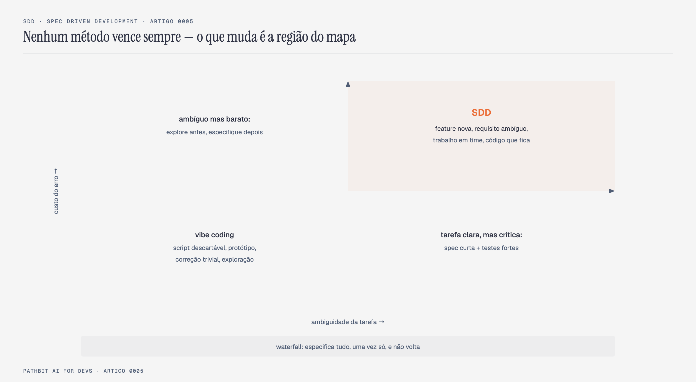
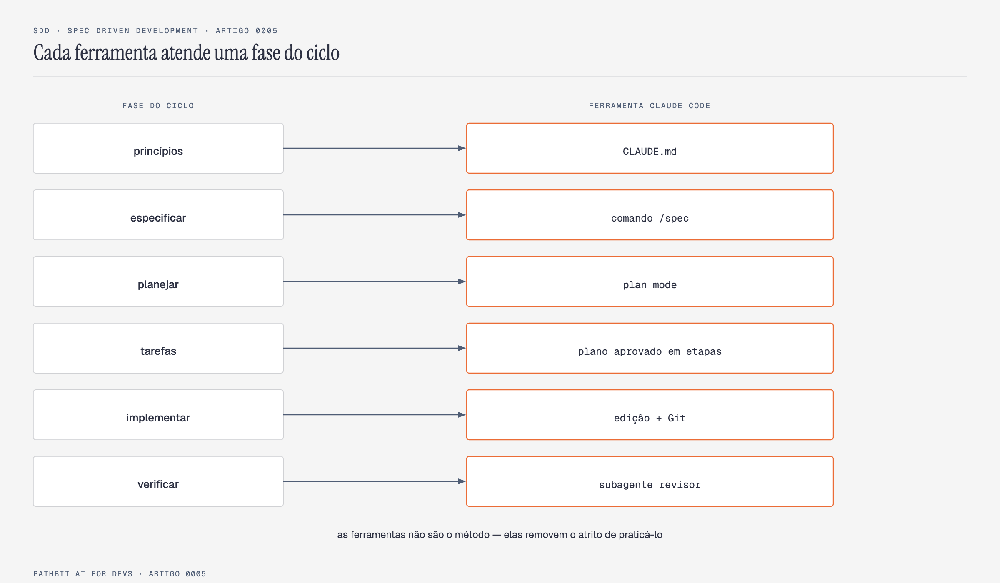

# Spec Driven Development no Claude Code: Como Eliminar o Vibe Coding com Especificações Executáveis



Nos quatro primeiros artigos desta série, resolvemos toda a infraestrutura computacional e operacional para programar com inteligência artificial no terminal. No [Artigo 0001](../../0001_antigravity_acesso_total_irrestrito/article/ARTICLE.md) destravamos a autonomia irrestrita do motor Agent 2.0 no Google Antigravity. No [Artigo 0002](../../0002_claude_gravity_utilizando_9router/article/ARTICLE.md) construímos o ClaudeGravity, conectando o Claude Code CLI aos modelos Gemini via 9Router sem custos de API. No [Artigo 0003](../../0003_fallback_modelos_gratuitos_9router/article/ARTICLE.md) estabelecemos uma malha de resiliência multi-provedores com combos de fallback automático. E no [Artigo 0004](../../0004_deep_claude_alternativa_claudegravity/article/ARTICLE.md) expandimos essa arquitetura para os modelos DeepSeek através da plataforma oficial e do OrcaRouter.

Com o ambiente devidamente configurado, o desenvolvedor dispõe de uma das ferramentas mais potentes da engenharia moderna: um agente autônomo conectado diretamente ao terminal, munido de ferramentas de leitura de repositório, execução de testes, manipulação de arquivos e uma janela massiva de contexto de até um milhão de tokens a custo praticamente nulo.

É exatamente nesse ponto de maturidade de infraestrutura que surge a pergunta central de engenharia de software: **o que você entrega para esse agente construir?**

A resposta predominante no mercado tem sido o improviso do chamado *vibe coding*. O desenvolvedor abre o chat da CLI, digita um comando de uma frase em linguagem natural, como "crie um endpoint que liste as transações do mês", e espera que o modelo adivinhe a arquitetura ideal. Em segundos, o agente emite trezentas linhas de código funcional, os testes básicos passam e o código sobe para produção. Semanas depois, a equipe descobre que "do mês" foi interpretado pelo modelo como os últimos trinta dias corridos, quando o setor financeiro exigia o mês contábil com fechamento no dia 25. Ninguém decidiu isso explicitamente. A lacuna do pedido vago foi silenciosamente preenchida pela continuação probabilística mais frequente da rede neural.

Este artigo apresenta o **Spec Driven Development (SDD)**, a disciplina de engenharia que substitui a loteria do *vibe coding* por especificações executáveis e verificáveis. Demonstramos como inverter a relação tradicional entre documentação e código, estabelecendo a especificação escrita como a fonte primária da verdade. Exploramos a anatomia completa de uma boa especificação, o ciclo iterativo em seis fases, o funcionamento cognitivo da janela de contexto de um agente e como os recursos nativos do Claude Code (como `CLAUDE.md`, plan mode, slash commands e subagentes com contexto isolado) removem o atrito de praticar esse método em esteiras reais de desenvolvimento.

---

## A economia invertida do software na era dos agentes

A chegada de agentes autônomos de desenvolvimento alterou radicalmente o custo de digitação de código, mas não alterou em nada a economia das decisões de arquitetura e produto.



> **Figura 1.** Comparativo entre o fluxo sem especificação, onde pedidos vagos geram ciclos infinitos de retrabalho, e o fluxo com SDD, onde o incremento possui alvo claro e critérios verificáveis.

Quando um desenvolvedor trabalha no improviso, o custo de gerar a primeira versão do software caiu para quase zero. No entanto, o custo de gerar a versão errada continua exatamente o mesmo de sempre. Na realidade, ele ficou ainda mais perigoso, porque agora o código errado chega em poucos segundos, com aparência impecável, tipagem elegante e testes sintéticos que mascaram a falha de requisito.

O padrão do improviso é recorrente em equipes que adotam ferramentas como Claude Code ou Cursor sem rigor metodológico:

1. O desenvolvedor digita um comando genérico no terminal.
2. O agente assume dezenas de premissas não declaradas sobre persistência, tratamento de erros, idempotência e regras de negócio.
3. O código gerado é internamente consistente, mas diverge do objetivo real do produto.
4. O desenvolvedor percebe a divergência e digita um novo prompt corretivo: "não era bem isso, faça de outro jeito".
5. O agente tenta corrigir o código anterior adicionando remendos que incham o contexto e introduzem regressões.
6. Horas são consumidas em um ciclo de depuração arqueológica, tentando descobrir por que o agente tomou determinadas decisões.

Por que o SDD faz sentido hoje, quando metodologias formais do passado eram consideradas burocráticas? Antes dos modelos de linguagem, o mesmo engenheiro humano precisava escrever a especificação detalhada e depois digitar manualmente cada linha de código. Escrever a especificação parecia fazer o trabalho duas vezes.

Com agentes autônomos, essa equação econômica inverteu-se por completo. Um engenheiro investe dez minutos para redigir trinta linhas de especificação precisa com critérios de aceite objetivos. Em seguida, o agente consome essa especificação e constrói quinhentas linhas de código, migrations e testes unitários em menos de um minuto. A alavancagem de especificar é ordens de grandeza superior à alavancagem de digitar código.

---

## A spec como fonte da verdade

No desenvolvimento tradicional, o código é tratado como a única verdade do sistema. A documentação técnica corre atrás do repositório, quase sempre desatualizada e incompleta. Se o código diverge do documento, assume-se que o documento está errado.

O Spec Driven Development inverte intencionalmente essa hierarquia.



> **Figura 2.** A inversão de hierarquia do SDD, estabelecendo a especificação como o artefato primário e o código como um derivado verificável.

No SDD, a especificação escrita é a fonte primária da verdade, e o código-fonte é apenas uma representação compilada e derivada dela. Quando surge uma divergência entre a especificação e a implementação, essa discrepância não é tratada como um mero desvio acidental, mas como um evento consciente que exige uma decisão explícita de engenharia: ou a implementação está errada e deve ser corrigida pelo agente, ou a realidade do produto mudou e a especificação deve ser atualizada e commitada antes do código.

Essa inversão traz três benefícios diretos para a engenharia de software:

A especificação passa a ser, simultaneamente, documentação para humanos e contexto de altíssima densidade para o modelo de linguagem. O mesmo arquivo em Markdown que alinha expectativas com o time de produto é o arquivo que ancora a atenção do Claude Code no terminal.

Além disso, a intenção do sistema deixa de morar na cabeça de quem digitou o prompt no calor do momento e passa a residir em um artefato versionado no Git, revisável em Pull Requests e compartilhado com toda a organização.

Por fim, o argumento econômico é definitivo. O custo de corrigir uma decisão errada escala exponencialmente conforme ela avança no ciclo de vida do software.



> **Figura 3.** A curva exponencial do custo do erro. Alterar uma frase na especificação custa segundos, enquanto corrigir o mesmo erro em produção custa sprints inteiras.

Corrigir uma premissa incorreta enquanto ela é apenas uma linha de texto na fase de especificação custa trinta segundos. Corrigir essa mesma premissa depois que ela virou tabelas no banco de dados, regras de negócio distribuídas, integrações externas e comportamento assumido por usuários consome dias de retrabalho e gera incidentes em produção. O SDD desloca a detecção do erro para o momento mais barato possível: antes de existir código.

---

## Anatomia de uma especificação executável

Uma boa especificação para agentes de inteligência artificial não é um documento longo, prolixo ou acadêmico. É um documento conciso, estruturado e rigorosamente verificável.



> **Figura 4.** As seis seções fundamentais de uma especificação de SDD, com os critérios de aceite posicionados no centro da verificação.

Para garantir que o agente implemente exatamente o que o produto necessita, uma especificação funcional divide-se em seis blocos fundamentais:

### 1. Objetivo
O propósito do incremento e o público beneficiado resumidos em duas ou três linhas diretas. Se o objetivo não puder ser explicado com clareza em poucas sentenças, o incremento provavelmente está excessivamente amplo e deve ser fatiado em ciclos menores.

Exemplo correto: "Permitir que o usuário filtre transações por intervalo de datas para calcular seus gastos mensais."
Exemplo incorreto: "Criar o módulo de relatórios e refatorar o banco de dados."

### 2. Requisitos funcionais
Comportamentos observáveis descritos em frases diretas no formato de ação e resultado. Devem descrever o que o sistema faz a partir do ponto de vista de quem consome a interface ou API.

### 3. Requisitos não-funcionais
Restrições de performance, segurança, persistência e durabilidade expressas numericamente sempre que possível. Inclui exigências como índices em colunas de busca frequente, persistência que sobrevive ao reinício da aplicação e obrigatoriedade de variáveis de ambiente para credenciais.

### 4. Critérios de aceite
A seção mais crítica de toda a especificação. São afirmações binárias que só admitem duas respostas: sim ou não. É a partir dos critérios de aceite que nascem os testes automatizados e as checagens do subagente revisor.

A diferença entre um requisito subjetivo e um critério de aceite objetivo é a linha divisória entre estabilidade e retrabalho. Dizer que "o feed não deve conter duplicatas" é ambíguo. Já especificar que "importar a mesma URL de feed duas vezes consecutivas não duplica registros na tabela de artigos, e a contagem de novos itens importados retorna zero na segunda chamada, utilizando a coluna link como chave única" elimina qualquer margem para o agente improvisar.

### 5. Escopo e fora de escopo
Duas listas explícitas delimitando as fronteiras do incremento. A lista de fora de escopo é frequentemente mais valiosa do que a de escopo, pois impede que o agente invente funcionalidades não solicitadas (como implementar paginação avançada ou autenticação JWT quando o objetivo era apenas listar artigos em memória).

### 6. Restrições técnicas
Decisões de implementação que já estão tomadas por razões arquiteturais e que não devem ser alteradas pelo modelo. Inclui a versão da linguagem, o banco de dados específico, bibliotecas obrigatórias e convenções de rotas.

A regra de ouro que separa uma especificação de uma implementação precoce reside na fronteira entre o "o quê/por quê" e o "como":

A especificação deve detalhar o comportamento observável, as regras de negócio e os limites que não podem ser violados. Detalhes internos como nomes de variáveis locais, laços de repetição ou estruturas efêmeras de dados pertencem à implementação e devem ser decididos pelo agente. A única exceção ocorre quando o "como" é um requisito de infraestrutura com justificativa técnica sólida, como exigir o driver `better-sqlite3` em vez de outro pacote por restrição de ambiente.

---

## O ciclo iterativo em seis fases

O Spec Driven Development não é um evento único que acontece no início do projeto, mas um processo cíclico que se repete a cada novo incremento de software.



> **Figura 5.** O ciclo iterativo do SDD em seis fases coordenadas, destacando o loopback de retorno à especificação sempre que divergências são identificadas.

O ciclo estrutura-se em seis fases encadeadas:

### Fase 0. Princípios
Definição dos padrões duradouros do projeto que valem para todos os ciclos. Inclui a stack tecnológica, convenções de código, comandos de teste e armadilhas conhecidas. No Claude Code, essa fase é materializada de forma permanente no arquivo `CLAUDE.md`.

### Fase 1. Especificar
Redação da especificação correspondente a um único incremento de funcionalidade, salva em um arquivo versionado dentro da pasta `specs/`. O desenvolvedor especifica apenas o que será construído a seguir, nunca o sistema inteiro de uma vez.

### Fase 2. Planejar
O agente inspeciona o repositório existente, lê a especificação do incremento e gera um plano técnico detalhado em modo somente leitura (plan mode). O desenvolvedor analisa a rota proposta antes que qualquer linha de código seja modificada no disco.

### Fase 3. Tarefas
O plano técnico aprovado é decomposto em uma sequência ordenada de tarefas atômicas e verificáveis, servindo como checklist de execução.

### Fase 4. Implementar
Com a rota e o objetivo rigidamente definidos, o agente escreve o código-fonte, atualiza migrações e implementa a lógica necessária.

### Fase 5. Verificar
A implementação é auditada de forma estrita contra cada um dos critérios de aceite da especificação, disparando suítes de testes unitários e revisões de conformidade.

A característica que diferencia o SDD do modelo tradicional em cascata (waterfall) é a seta de retorno evidenciada no diagrama. Voltar atrás no SDD não representa uma falha de planejamento, mas o processo operando normalmente. Se durante a implementação o agente ou o desenvolvedor constatam que uma premissa técnica é inviável, o trabalho é pausado, a especificação é atualizada com a nova decisão acordada e o ciclo recomeça a partir de uma base transparente.

---

## Sob o capô: como um agente interpreta uma especificação

Para extrair resultados previsíveis de ferramentas como Claude Code, Cursor ou GitHub Copilot Workspace, o desenvolvedor precisa compreender como os modelos de linguagem processam instruções no nível de tensores e contexto.

Um agente de inteligência artificial não possui consciência do seu repositório, não participou das reuniões da sua equipe e não acessa intuitivamente o que você quis dizer. A cada interação, a totalidade do raciocínio do modelo depende exclusivamente do pacote de texto presente na sua janela de contexto.



> **Figura 6.** A janela de contexto como fronteira finita do agente, ilustrando o sinal visível contra o conhecimento implícito que fica de fora.

Entram na janela de contexto: a mensagem enviada pelo usuário, os arquivos abertos e lidos pelo modelo, o arquivo `CLAUDE.md` carregado na raiz do projeto, as saídas de comandos bash e o histórico da conversa recente.

Ficam irremediavelmente de fora: as mensagens trocadas no Slack da empresa, decisões implícitas que "todo mundo no time já sabe" e qualquer intenção que não tenha sido formalmente escrita em texto.

Quando o modelo encontra uma lacuna ou ambiguidade em um pedido, o comportamento da rede neural é determinístico em sua natureza probabilística: o modelo não trava e raramente interrompe o fluxo para fazer perguntas. Ele faz exatamente aquilo para o qual foi treinado por meio de bilhões de parâmetros, completando o texto com a continuação estatisticamente mais plausível com base em corpora públicos da internet.

Plausível, contudo, não significa correto para o seu domínio de negócio. O agente toma decisões de arquitetura e regras de negócio em silêncio, sem deixar avisos no código. Pior ainda, todas as classes, métodos e testes gerados subsequentemente são construídos em perfeita harmonia interna com a premissa errada inicial. O código resultante é internamente coerente e globalmente inadequado.

A engenharia de contexto no SDD não consiste em colar milhares de linhas de código ou prompts gigantescos na tela. Pelo contrário: encher a janela de contexto de forma indiscriminada dilui a atenção do modelo e aumenta o risco de alucinação. A verdadeira engenharia de contexto reside na curadoria enxuta: fornecer uma especificação atômica de trinta linhas precisas, garantir que as convenções globais estejam no `CLAUDE.md` e iniciar uma sessão limpa a cada novo ciclo de trabalho.

---

## Mapa de métodos: SDD, TDD, Vibe Coding e Waterfall

Nenhuma metodologia é universalmente superior para todos os problemas de engenharia. A maturidade técnica consiste em reconhecer em qual região de risco e incerteza o seu projeto se encontra.



> **Figura 7.** Posicionamento metodológico avaliando o grau de ambiguidade da tarefa versus o custo de eventuais erros em produção.

O *vibe coding* possui um espaço legítimo na engenharia: scripts descartáveis de automação pessoal, protótipos exploratórios de fim de semana ou tarefas mecânicas simples onde o custo do erro é insignificante. Tentar aplicar especificações formais para corrigir um erro de digitação é puro desperdício de tempo.

O modelo em cascata (waterfall) clássico falha porque tenta especificar o sistema inteiro meses antes da primeira entrega, tratando qualquer mudança posterior como um desvio inaceitável em um ambiente onde o mercado e os requisitos mudam semanalmente.

O Spec Driven Development brilha exatamente no quadrante onde vive o software corporativo profissional: tarefas onde há ambiguidade de requisitos, trabalho colaborativo entre múltiplos desenvolvedores, regras de negócio sensíveis e código que precisará ser mantido e evoluído por meses ou anos.

### A sinergia entre SDD e TDD

Uma dúvida comum entre engenheiros é se o SDD compete com o Test-Driven Development (TDD). A resposta técnica é que eles operam em camadas perfeitamente complementares.

| Dimensão de Comparação | Spec Driven Development (SDD) | Test-Driven Development (TDD) |
| :--- | :--- | :--- |
| Pergunta Fundamental | O que devemos construir e com quais limites? | O código implementado atende às expectativas técnicas? |
| Camada de Abstração | Comportamento do produto e regras de negócio | Unidades de código, funções e integração de módulos |
| Artefato Primário | Especificação em Markdown com critérios de aceite | Suíte automatizada de testes (Jest, PyTest, Mocha) |
| Destinatários | Engenheiros, time de produto e agentes de IA | Compiladores, esteiras de CI/CD e desenvolvedores |

O critério de aceite da especificação é a ponte natural que dá origem aos testes do TDD. Um critério de aceite bem formulado é literalmente a descrição do caso de teste que será codificado. Uma suíte de testes unitários inteiramente verde prova que a aplicação funciona conforme os testes foram escritos, mas não prova se o software resolve o problema correto de negócio. A especificação garante a direção do produto, enquanto o TDD assegura a robustez da implementação.

---

## Ferramentas do Claude Code configuradas para SDD

A disciplina de especificação pode ser praticada com qualquer ferramenta de texto, mas sua adoção sustentável em equipes depende da eliminação do atrito operacional. O Claude Code CLI oferece um ecossistema nativo de recursos que se encaixam com precisão matemática em cada uma das fases do ciclo de SDD.



> **Figura 8.** O mapeamento dos recursos do Claude Code sobre cada uma das fases do ciclo de Spec Driven Development.

### 1. `CLAUDE.md`: a memória permanente do projeto
Localizado na raiz do repositório, o arquivo `CLAUDE.md` é ingerido automaticamente pelo Claude Code na inicialização de cada sessão de trabalho. Ele deve conter apenas informações permanentes que valem para todos os ciclos de desenvolvimento: comandos de build e teste, convenções de estilo, regras de manipulação de banco de dados e políticas de segurança. Informações específicas de uma única feature pertencem à especificação daquela feature, e nunca ao `CLAUDE.md`.

### 2. Slash command `/spec`: o ritual automatizado
Por meio da criação do arquivo `.claude/commands/spec.md`, o desenvolvedor instancia um comando customizado invocável diretamente no terminal com a sintaxe `/spec <descrição do incremento>`. O template orienta o agente a estruturar o documento nas seis seções obrigatórias e inclui uma diretiva essencial: antes de gerar a especificação, o agente é forçado a listar todas as ambiguidades encontradas no pedido do usuário e aguardar as respostas. Isso impede que lacunas sejam preenchidas por adivinhação.

### 3. Plan mode: pensar antes de modificar o disco
Acionado pelo atalho `Shift+Tab` no terminal do Claude Code, o plan mode coloca o agente em modo de investigação pura e proposição arquitetural. O modelo lê os arquivos relevantes, analisa a árvore de dependências e apresenta um plano passo a passo com a rota de implementação. O desenvolvedor revisa o plano e discute escolhas antes que qualquer arquivo seja alterado. Discordar de um plano em texto leva trinta segundos; reverter cinquenta arquivos modificados incorretamente exige tempo e paciência.

### 4. Subagentes com contexto isolado: o revisor independente
Uma das maiores armadilhas de desenvolvimento assistido por IA é pedir para o mesmo agente que implementou o código auditar seu próprio trabalho. O agente principal está condicionado pelo histórico da sessão e pelas tentativas e erros anteriores.

No Claude Code, definimos subagentes especializados na pasta `.claude/agents/`. Criamos o subagente `revisor-de-spec.md`, que é invocado com uma janela de contexto totalmente limpa. Ele recebe apenas dois insumos: a especificação do incremento e o diff de código gerado pelo Git. O revisor percorre cada critério de aceite e classifica o status como atendido, não atendido ou duvidoso, apontando inclusive código extra que foi implementado sem constar na especificação.

### 5. Git com commits atômicos de especificação
A disciplina de controle de versão do SDD adota o padrão de dois commits por incremento:

```bash
git add specs/01-feed-artigos.md
git commit -m "spec: definir leitura de feed rss e listagem de artigos"

# Planejamento, implementação e verificação

git add src/ tests/
git commit -m "feat: implementar ingestao de feed rss (spec 01)"
```

Commitar a especificação antes do código garante que a intenção foi registrada previamente na linha do tempo do Git, permitindo que revisores humanos avaliem a spec no Pull Request de forma desacoplada da implementação técnica.

---

## Estudo de caso: API de agregador de notícias em seis ciclos

Para demonstrar a eficácia prática do método, o repositório disponibiliza na pasta `examples/` uma API completa de um agregador de notícias com resumo por inteligência artificial, construída em Node.js, Express, SQLite e SDK da Anthropic.

O projeto foi decomposto em seis ciclos estritos de SDD. A tabela a seguir documenta as decisões críticas de negócio que cada especificação precisou congelar para evitar que o agente tomasse decisões inadequadas:

| Ciclo | Incremento | Decisão Crítica de Negócio Travada pela Spec |
| :--- | :--- | :--- |
| Ciclo 01 | Leitura de Feed RSS e Listagem de Artigos | Chave primária de desduplicação fixada na coluna `link` e ordenação decrescente por data |
| Ciclo 02 | Gerenciamento e Sincronização de Fontes | Validação prévia de URL XML e garantia de que uma fonte fora do ar não derruba a sincronização das demais |
| Ciclo 03 | Resumo de Artigos com Claude 3.5 Haiku | Política estrita de cache em banco local para evitar cobrança duplicada de tokens na API |
| Ciclo 04 | Categorização Automática e Filtros | Classificação por vocabulário com fallback seguro e validação de período com código HTTP 422 |
| Ciclo 05 | Digest Diário e Testes de Regressão | Tratamento determinístico para dias sem notícias e mock obrigatório da API de IA nos testes unitários |
| Ciclo 06 | Gestão de Favoritos, Métricas e Deploy | Portas de rede e credenciais lidas estritamente de variáveis de ambiente sem dados sensíveis no código |

Cada uma das decisões da coluna direita representa uma armadilha em potencial. Se o desenvolvedor tivesse pedido apenas "resuma as notícias com IA", o agente não saberia se deveria armazenar o resumo em cache, qual modelo chamar, qual timeout aplicar ou o que devolver caso a API estivesse indisponível. A especificação converteu essas incertezas em regras claras antes da geração da primeira linha de código.

---

## Configuração mínima para iniciar hoje

Para adotar o Spec Driven Development imediatamente no seu projeto com Claude Code, basta estruturar cinco elementos na raiz do seu repositório:

1. Um arquivo `CLAUDE.md` objetivo contendo os comandos de build, suítes de teste e convenções fundamentais da aplicação.
2. Um diretório `specs/` versionado no Git para armazenar os arquivos de especificação numerados sequencialmente.
3. O comando customizado `.claude/commands/spec.md` para automatizar a geração de novas especificações estruturadas.
4. O subagente `.claude/agents/revisor-de-spec.md` configurado para auditar diffs finais contra critérios de aceite.
5. O compromisso prático de sempre revisar a rota no plan mode antes de autorizar a escrita de código no disco.

Todos os templates, prompts e códigos de exemplo estão disponíveis para clonagem direta na pasta `examples/` do repositório oficial da Pathbit.

---

## Conclusão

Os primeiros quatro artigos desta série entregaram a infraestrutura necessária para operar modelos de inteligência artificial de ponta no terminal com custo controlado e sem barreiras de permissão. Este quinto módulo entrega o método que transforma essa capacidade de computação em software previsível, auditável e de alta qualidade.

O Spec Driven Development não é um retorno à burocracia do passado, mas a adaptação necessária da engenharia de software para uma era onde o código é gerado por máquinas em segundos. Ao ancorar o agente em especificações atômicas, critérios de aceite verificáveis e verificações com contexto isolado, eliminamos a loteria do *vibe coding* e colocamos o desenvolvedor no papel de arquiteto e garantidor da qualidade do sistema.

---

## Referências

- [Beck, Kent: Test-Driven Development by Example (Addison-Wesley)](https://www.oreilly.com/library/view/test-driven-development/0321146530/)
- [Anthropic: Claude Code Official CLI Documentation and Best Practices](https://docs.anthropic.com/en/docs/agents-and-tools/claude-code/overview)
- [Fowler, Martin: Specification by Example and Executable Specifications](https://martinfowler.com/bliki/SpecificationByExample.html)
- [Karpathy, Andrej: Software 2.0 and the Evolution of Programming with Neural Networks](https://karpathy.medium.com/software-2-0-2e22f080b06b)
- [North, Dan: Introducing Behaviour-Driven Development (BDD)](https://dannorth.net/introducing-bdd/)

---

Repositório oficial no GitHub no endereço https://github.com/pathbit/pathbit-ai-for-devs no módulo 0005_sdd_spec_driven_development.

#InteligenciaArtificial #SpecDrivenDevelopment #SDD #ClaudeCode #EngenhariaDeSoftware #VibeCoding #SoftwareArchitecture #Pathbit
